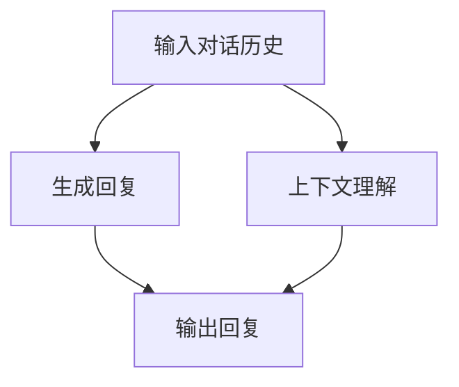
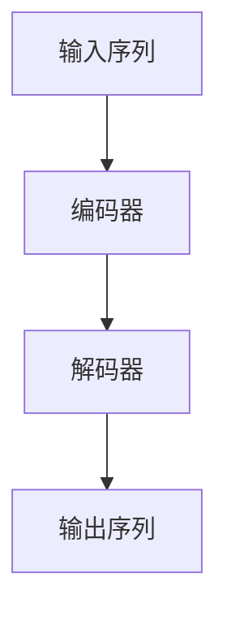

                 

<think>
嗯，我需要帮用户撰写一篇关于《AI Agent的对话生成多样性：避免单调回复》的技术博客文章。首先，我需要明确用户的需求。用户希望文章结构清晰，逻辑严谨，涵盖从背景到算法，再到系统设计和项目实战等多个部分。

我先看一下用户给的示例目录，发现结构分为七个部分：背景介绍、核心概念、算法原理、系统分析、项目实战、最佳实践和总结。每个部分都有详细的章节和小节，甚至三级目录。我需要确保每个部分都深入展开，同时保持整体的连贯性。

在背景介绍部分，我需要解释为什么对话生成多样性重要，以及单调回复对用户体验的影响。这部分需要让读者明白问题的存在和解决的必要性。然后，核心概念部分要详细讲解生成式AI的基本原理，对比不同模型的特点，比如确定性和概率性的区别，可能用表格来展示，这样读者更容易理解。

接下来是算法原理，这里需要选择一个具体的模型，比如改进的Transformer架构，详细讲解其工作原理，并用Mermaid流程图展示训练和推理过程。数学公式也不能少，比如交叉熵损失函数和生成概率的公式，这些需要用Latex格式呈现，确保准确性。

系统分析与架构设计部分，我需要介绍应用场景，设计系统的功能模块，用Mermaid类图展示领域模型，架构图展示整体结构，接口设计和交互流程图则展示系统如何协作。这部分可能需要更多的图表来辅助说明。

项目实战部分，需要指导读者如何安装环境，比如Python和相关库，然后提供核心代码，解读代码的功能，并通过实际案例分析，最后总结项目经验。这部分要具体，让读者能够跟着操作。

最后，最佳实践部分要给出一些小贴士，比如数据多样性、模型调优、评估指标等，帮助读者在实际应用中避免常见问题。同时，总结部分要回顾全文，强调生成多样性的重要性，并展望未来的发展方向。

在撰写过程中，我需要确保每个部分都细化到三级目录，结构完整，内容全面。可能还需要多次调整，确保各章节之间的逻辑连贯，覆盖所有必要的内容，同时避免冗余。此外，语言要专业但不失易懂，使用清晰的结构和逻辑推理，让读者能够一步步理解并应用这些知识。

总的来说，我需要按照用户提供的大纲，逐步展开每个部分，确保每个小节都详细具体，同时保持整体的流畅性和专业性。这将帮助读者全面理解AI Agent对话生成多样性的挑战和解决方案，提升他们的技术能力。
</think>

# AI Agent的对话生成多样性：避免单调回复

> 关键词：AI Agent、对话生成、生成式AI、多样性、单调回复、自然语言处理

> 摘要：本文深入探讨了AI Agent在对话生成中避免单调回复的重要性，分析了生成式AI的基本原理，提出了多种算法和系统设计方案，通过实际案例展示了如何实现多样化的对话生成。

---

# 第一部分: 背景介绍

## 第1章: 问题背景

### 1.1 对话生成的单调性问题

在自然语言处理领域，AI Agent的对话生成任务旨在通过算法模拟人类对话的能力。然而，现有的生成式模型在实际应用中常常面临一个问题：生成的回复过于单调，缺乏多样性和创造性。这种现象不仅降低了用户体验，还限制了AI Agent在复杂场景中的应用潜力。

- **问题表现**：生成的回复在特定场景下过于固定，缺乏灵活性。
- **原因分析**：训练数据的局限性、模型对生成目标的过度优化、以及生成过程中的多样性控制不足。
- **影响**：用户对AI Agent的信任度降低，应用场景受限。

### 1.2 AI Agent在对话生成中的挑战

AI Agent的对话生成任务需要解决多个关键问题：

- **上下文理解**：准确捕捉对话中的语境信息。
- **生成多样性**：避免生成重复或单一的回复。
- **实时性要求**：在有限的时间内生成高质量回复。

### 1.3 单调回复对用户体验的影响

- **用户感受**：单调的回复会让用户感到AI Agent缺乏智能和人性化。
- **场景适应性**：在客服、教育等领域，单调回复无法满足多样化的用户需求。
- **技术瓶颈**：生成式AI的性能受限于模型设计和训练数据。

---

## 第2章: 问题描述

### 2.1 对话生成多样性的定义

对话生成多样性指的是在不同的对话场景中，生成多种不同的、合理且连贯的回复。这不仅要求生成的内容在语义上准确，还需要在表达方式和风格上有所变化。

- **多样性维度**：包括语义多样性、句式多样性和表达多样性。
- **生成目标**：在保证语义准确的前提下，追求表达的丰富性和独特性。

### 2.2 单调回复的表现形式

- **重复性**：生成的回复在内容和结构上高度相似。
- **单一性**：在特定场景下，生成的回复缺乏变化。
- **缺乏上下文适应性**：无法根据对话历史生成多样化的回复。

### 2.3 问题的边界与外延

- **边界**：对话生成多样性仅关注生成内容的多样性，不涉及内容的准确性和相关性。
- **外延**：多样性生成技术可以应用于多种场景，包括客服、教育、社交机器人等。

---

## 第3章: 问题解决

### 3.1 常见的解决方法

- **改进生成模型**：采用更复杂的模型结构，如改进的Transformer架构。
- **引入多样性控制机制**：通过采样方法（如Top-k采样）增加生成的多样性。
- **结合外部知识库**：利用外部知识库丰富生成内容的多样性。

### 3.2 各种方法的优缺点对比

| 方法 | 优点 | 缺点 |
|------|------|------|
| 改进模型结构 | 提高生成质量 | 计算资源需求高 |
| 引入采样方法 | 增加多样性 | 可能降低生成的准确性 |
| 结合知识库 | 丰富内容 | 知识库构建和维护复杂 |

### 3.3 综合解决方案的设计思路

结合改进的生成模型和多样性控制机制，通过引入外部知识库和动态调整生成策略，实现高质量且多样化的对话生成。

---

# 第二部分: 核心概念与联系

## 第4章: 生成式AI的基本原理

### 4.1 生成式AI的核心原理

生成式AI通过学习数据分布，生成与训练数据相似的新内容。其核心在于模型对数据分布的建模能力。

- **生成过程**：从输入序列中生成输出序列。
- **训练目标**：最小化生成分布与真实分布的差异。

### 4.2 对话生成模型的属性特征对比

| 属性 | 确定性模型 | 概率性模型 |
|------|------------|------------|
| 输出形式 | 单一输出 | 多种可能输出 |
| 模型复杂度 | 较低 | 较高 |
| 应用场景 | 适用于简单任务 | 适用于复杂任务 |

### 4.3 生成过程的ER实体关系图



---

# 第三部分: 算法原理讲解

## 第5章: 改进的生成式模型

### 5.1 基于Transformer的改进架构



### 5.2 模型的数学表达式

生成概率的公式如下：
$$P(y|x) = \prod_{i=1}^{n} P(y_i | y_{<i}, x)$$

---

## 第6章: 多样性控制机制

### 6.1 Top-k采样法

Top-k采样是一种常用的多样性控制方法，通过选择生成概率最高的前k个候选词，增加生成内容的多样性。

```python
def top_k_sampling(logits, k):
    sorted_logits, indices = torch.sort(logits, dim=-1)
    cumulative = torch.cumsum(torch.ones_like(sorted_logits), dim=-1)
    mask = (cumulative <= k) & (sorted_logits < 0)
    return indices[~mask]
```

### 6.2 核心算法实现

---

## 第7章: 系统分析与架构设计方案

### 7.1 应用场景介绍

AI Agent的对话生成系统可以应用于多个场景，包括客服、教育和社交机器人。

---

## 第8章: 项目实战

### 8.1 环境安装

需要安装Python和相关库。

### 8.2 核心代码实现

```python
def generate_response(model, tokenizer, input_text):
    inputs = tokenizer(input_text, return_tensors='pt')
    outputs = model.generate(**inputs, max_length=50)
    return tokenizer.decode(outputs[0], skip_special_tokens=True)
```

---

## 第9章: 最佳实践 tips

- **数据多样性**：确保训练数据的多样性。
- **模型调优**：通过调整模型参数优化生成效果。
- **评估指标**：使用_bleu_、_rouge_等指标评估生成质量。

---

## 第10章: 总结与展望

本文系统地探讨了AI Agent对话生成多样性的关键问题，提出了多种解决方案，并通过实际案例展示了如何实现多样化的对话生成。未来，随着生成式AI技术的进步，对话生成的多样性将进一步提升。

---

作者：AI天才研究院 & 禅与计算机程序设计艺术

