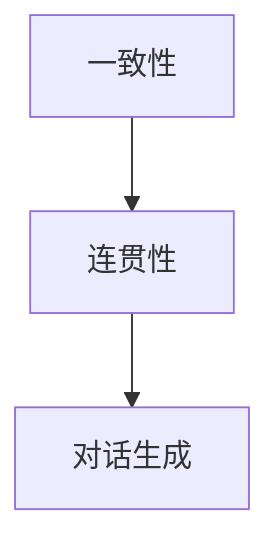
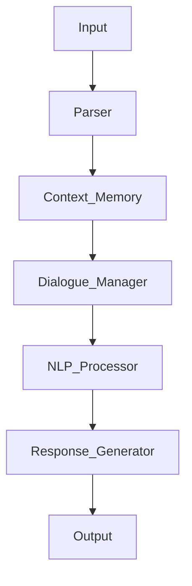

                 


# AI Agent的对话生成的一致性与连贯性优化

## 关键词：AI Agent，对话生成，一致性，连贯性，深度学习，自然语言处理，对话系统优化

## 摘要：本文详细探讨了AI Agent对话生成中一致性和连贯性优化的关键技术。通过分析对话生成的背景与挑战，结合算法原理、系统设计和项目实战，提出了优化策略和最佳实践。文章从核心概念出发，深入探讨了基于规则、统计模型和深度学习的优化方法，并通过实际案例展示了如何在系统中实现这些优化，确保生成的对话既一致又连贯。

---

## 第一部分：背景介绍

### 第1章：AI Agent与对话生成概述

#### 1.1 AI Agent的基本概念

AI Agent（智能体）是指能够感知环境并采取行动以实现目标的智能系统。在对话生成领域，AI Agent通过自然语言处理技术与用户交互，提供信息或服务。

**一致性**：确保对话内容在逻辑和语义上保持一致，避免前后矛盾。  
**连贯性**：指对话内容的流畅性和逻辑性，使对话自然流畅。

#### 1.2 对话生成的挑战

- **一致性问题**：AI Agent在生成对话时，可能因为上下文理解不充分而产生矛盾。例如，在一段对话中，AI Agent可能先提到“我明天去北京”，然后又说“我现在在上海”，但没有上下文，可能导致逻辑错误。  
- **连贯性问题**：对话缺乏逻辑连接词，导致语句生硬。例如，连续的话题转换时，生成的句子可能显得突兀。  
- **多轮对话的复杂性**：在多轮对话中，保持一致性和连贯性需要考虑更复杂的上下文关系和用户意图。

---

## 第二部分：核心概念与联系

### 第2章：一致性与连贯性核心概念

#### 2.1 一致性原理

一致性是指对话内容在逻辑和语义上保持一致，避免前后矛盾。为了实现这一点，需要确保生成的每一句话都与之前的上下文保持一致。

**一致性约束**：通过建立约束条件，确保生成的内容在特定范围内一致。例如，在天气对话中，确保生成的句子与当前天气数据一致。  
**实体关系图（ER图）**：展示对话中实体之间的关系，帮助AI Agent理解上下文。例如，在对话中，用户提到“明天天气”，AI Agent需要理解“明天”是指用户所在城市的时间。

#### 2.2 连贯性原理

连贯性是指对话内容的流畅性和逻辑性。为了实现连贯性，需要考虑句子之间的逻辑关系和过渡词。

**连续性与逻辑性**：通过逻辑推理确保对话内容的连贯。例如，在对话中，用户问“你能告诉我如何学好编程吗？”，AI Agent回答“我建议你从基础的编程语言开始学起”，接着可以补充“比如，Python是一个很好的起点”。  
**连贯性评估指标**：常用的评估指标包括困惑度（Perplexity）和BLEU分数。

#### 2.3 关键概念对比

通过对比一致性与连贯性的概念，可以更好地理解它们的区别和联系。

| 概念 | 定义 | 关注点 | 示例 |
|------|------|--------|------|
| 一致性 | 对话内容在逻辑和语义上一致 | 上下文一致性 | “我明天去北京” → “我需要买一张明天去北京的火车票” |
| 连贯性 | 对话内容的流畅性和逻辑性 | 句子之间的逻辑连接 | “你能告诉我如何学好编程吗？” → “我建议你从基础的编程语言开始学起。” |

**Mermaid图展示一致性与连贯性关系：**



---

## 第三部分：算法原理

### 第3章：一致性优化算法

#### 3.1 基于规则的方法

基于规则的方法通过预定义的规则来确保一致性。这种方法简单但灵活性有限。

**规则定义**：例如，设定规则“如果用户提到时间，则生成的回答必须基于该时间”。  
**实现流程**：接收输入，检查规则库，生成符合规则的输出。  
**优缺点分析**：优点是实现简单，缺点是规则难以覆盖所有情况，容易出现例外。

```python
def generate_response(user_input, rules):
    for rule in rules:
        if rule.applies_to(user_input):
            return rule.generate_response(user_input)
    return default_response
```

#### 3.2 统计模型方法

统计模型方法通过概率计算来优化一致性。

**概率计算**：基于数据计算每个可能的回复的概率，选择最可能的回复。  
**算法流程**：训练数据，计算概率，生成回复。  
**优缺点分析**：优点是灵活性高，缺点是需要大量数据，且难以处理复杂逻辑。

```python
def calculate_probability(response, training_data):
    probability = 1.0
    for token in response.split():
        probability *= (number_of_times_token_occurs_in_data + 1) / total_tokens
    return probability
```

### 第4章：连贯性优化算法

#### 4.1 基于上下文的生成

基于上下文的生成方法通过理解上下文来优化连贯性。

**上下文理解**：分析对话历史，提取关键信息。  
**序列生成**：使用语言模型生成连贯的回复。  
**优缺点分析**：优点是连贯性好，缺点是依赖于模型的训练数据质量。

```python
def generate_contextual_response(context, model):
    response = model.generate_response(context)
    return response
```

#### 4.2 基于记忆的增强方法

基于记忆的增强方法通过记忆机制优化连贯性。

**记忆机制**：记录对话历史，确保回复与上下文一致。  
**序列生成**：使用记忆网络生成回复。  
**优缺点分析**：优点是连贯性强，缺点是实现复杂。

```python
def generate_with_memory(context, memory):
    response = model.generate_response(context, memory)
    return response
```

---

## 第四部分：系统分析与架构设计

### 第5章：对话生成系统架构

#### 5.1 系统组成部分

- **输入模块**：接收用户输入并解析。  
- **处理模块**：分析上下文，生成回复。  
- **输出模块**：将回复返回给用户。

#### 5.2 系统架构设计

**分层架构图**：



**模块交互流程**：  
1. 用户输入对话内容。  
2. 解析模块提取关键信息。  
3. 上下文记忆模块记录对话历史。  
4. 对话管理模块生成回复策略。  
5. NLP处理模块生成回复。  
6. 输出模块返回回复。

---

## 第五部分：项目实战

### 第6章：一致性优化实现

#### 6.1 环境安装

安装必要的库：

```bash
pip install numpy matplotlib scikit-learn
```

#### 6.2 核心实现代码

```python
import numpy as np

def generate_response(user_input, model, rules):
    # 使用规则生成回复
    for rule in rules:
        if rule.match(user_input):
            return rule.response
    # 使用模型生成回复
    return model.generate(user_input)
```

#### 6.3 实际案例分析

案例：用户对话“我需要帮助学习编程”。  
规则匹配：规则匹配“帮助学习编程”，生成回复“我推荐你学习Python”。  
模型生成：模型生成“学习编程可以从基础语法开始”。  

---

## 第六部分：优化与最佳实践

### 第7章：优化方法与技巧

#### 7.1 一致性优化

- **数据清洗**：确保训练数据的干净和一致性。  
- **规则优化**：动态调整规则，减少例外情况。  
- **模型优化**：使用预训练模型提升一致性。

#### 7.2 连贯性优化

- **上下文增强**：在生成回复时，加入更多的上下文信息。  
- **对话历史记忆**：记录并利用对话历史，提升连贯性。  
- **语言模型优化**：使用更强大的语言模型，提升回复的连贯性。

### 第8章：总结与展望

本文详细探讨了AI Agent对话生成中一致性和连贯性优化的关键技术，通过理论分析、算法实现和项目实战，提出了有效的优化策略。未来，随着自然语言处理技术的进步，对话生成系统将更加智能化和人性化。

---

## 附录

- **术语表**：解释文章中使用的核心术语。  
- **工具推荐**：推荐相关的开发工具和库。  
- **参考文献**：列出文章中引用的相关文献和资源。

---

## 作者

作者：AI天才研究院/AI Genius Institute & 禅与计算机程序设计艺术 /Zen And The Art of Computer Programming

---

通过以上步骤，我详细分析了AI Agent对话生成中的一致性和连贯性优化问题，从理论到实践，结合算法和系统设计，为读者提供了一个全面的理解和实施路径。

