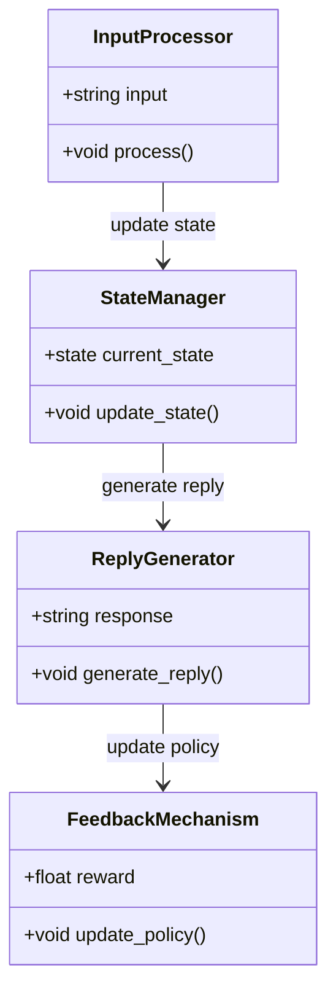
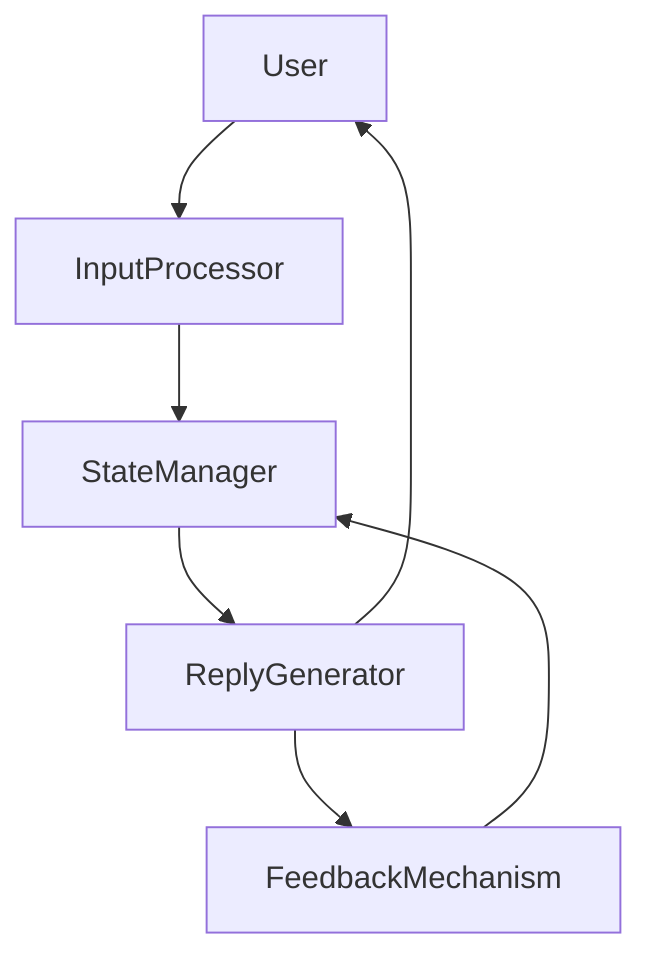
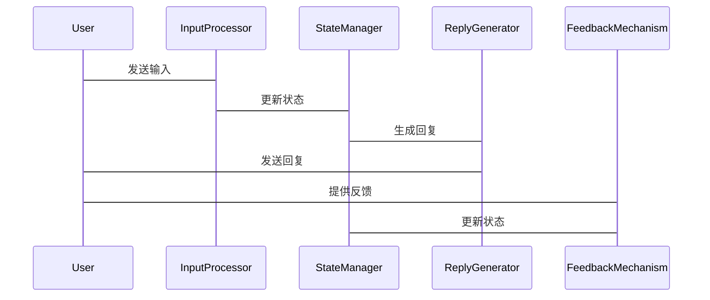

                 


# AI Agent的对话策略优化：提升用户体验

**关键词：** AI Agent, 对话策略优化, 用户体验, 强化学习, 系统架构设计, 项目实战

**摘要：** 本文将深入探讨AI Agent的对话策略优化，从背景介绍到算法实现，再到系统架构设计，结合项目实战，系统地分析如何提升用户体验。通过详细讲解核心概念、优化算法、系统架构和实际案例，本文旨在为读者提供一个全面的视角，帮助其理解并掌握AI Agent对话策略优化的关键技术。

---

# 第一部分: AI Agent的对话策略优化基础

# 第1章: AI Agent与对话策略优化概述

## 1.1 AI Agent的基本概念
### 1.1.1 AI Agent的定义与特点
- **定义：** AI Agent（人工智能代理）是指能够感知环境并采取行动以实现目标的智能体。
- **特点：**
  - 自主性：能够自主决策。
  - 反应性：能够实时响应用户输入。
  - 目标导向：以实现特定目标为导向。

### 1.1.2 对话系统的基本原理
- **输入处理：** 接收用户输入，解析用户意图。
- **状态管理：** 维护对话上下文，确保对话连贯性。
- **输出生成：** 根据当前状态生成回复。

### 1.1.3 对话策略优化的目标与意义
- **目标：** 提高对话的准确性和流畅性，增强用户体验。
- **意义：** 优化用户交互，提升系统整体性能。

## 1.2 对话策略优化的背景与挑战
### 1.2.1 当前对话系统的主要问题
- **意图理解不准确：** 无法正确识别用户的深层需求。
- **对话不连贯：** 回复缺乏逻辑性，用户体验差。
- **反馈机制不足：** 无法有效利用用户反馈进行优化。

### 1.2.2 对话策略优化的必要性
- **提升用户满意度：** 更精准的回复提高用户满意度。
- **提高系统效率：** 优化策略减少不必要的对话步骤。

### 1.2.3 优化过程中面临的主要挑战
- **数据依赖：** 需要大量数据支持模型训练。
- **实时性要求：** 对话系统需要实时响应，增加了优化的难度。

## 1.3 用户体验提升的核心要素
### 1.3.1 对话流畅性
- **定义：** 对话过程中的连贯性和自然性。
- **实现方法：** 通过优化回复策略和语言生成模型提升流畅性。

### 1.3.2 用户意图的理解准确性
- **关键点：** 准确识别用户的意图。
- **实现方法：** 使用自然语言处理技术（NLP）分析用户输入。

### 1.3.3 系统反馈的及时性与准确性
- **定义：** 系统在对话中的反馈是否迅速且正确。
- **实现方法：** 设计高效的反馈机制，确保用户得到及时准确的回应。

## 1.4 本章小结
本章主要介绍了AI Agent的基本概念，对话系统的基本原理，以及对话策略优化的目标和意义。同时，分析了当前对话系统的主要问题和优化过程中的挑战，为后续章节的深入探讨奠定了基础。

---

# 第2章: 对话策略优化的核心概念

## 2.1 对话模型与策略的关系
### 2.1.1 对话模型的定义与分类
- **定义：** 对话模型是对对话过程的数学建模，用于模拟用户和系统之间的交互。
- **分类：**
  - 基于规则的模型：通过预定义规则进行回复。
  - 基于统计的模型：利用统计方法分析对话数据，生成回复。
  - 基于深度学习的模型：使用神经网络等深度学习方法进行对话生成。

### 2.1.2 对话策略的定义与分类
- **定义：** 对话策略是对对话过程中系统采取的行动的决策规则。
- **分类：**
  - 基于规则的策略：通过预定义规则选择最佳回复。
  - 基于价值的策略：根据预设的价值函数选择最优回复。
  - 基于强化学习的策略：通过强化学习算法不断优化回复策略。

### 2.1.3 模型与策略之间的相互作用
- **相互作用：** 对话模型为策略提供数据支持，策略指导模型如何生成回复。
- **优化过程：** 策略优化能够提升对话模型的性能，从而提高对话质量。

## 2.2 优化算法与反馈机制
### 2.2.1 常见的优化算法概述
- **强化学习：** 通过奖励机制优化策略，如Q-learning、Deep Q-Network等。
- **监督学习：** 使用标注数据训练模型，提升回复准确性。
- **无监督学习：** 利用无标签数据进行聚类分析，发现潜在模式。

### 2.2.2 反馈机制的作用与实现方式
- **作用：** 通过用户反馈调整策略，提升对话质量。
- **实现方式：**
  - 用户满意度评分：根据用户的反馈评分调整策略。
  - 用户行为分析：通过分析用户的后续行为优化回复策略。

### 2.2.3 算法与反馈机制的结合
- **结合方式：** 在强化学习中，反馈机制作为奖励函数，指导策略优化。
- **具体应用：** 根据用户的反馈调整策略参数，优化回复内容。

## 2.3 对话策略优化的数学模型
### 2.3.1 状态空间的定义
- **状态空间：** 对话过程中所有可能的状态集合。
- **状态表示：** 通过向量或符号表示当前对话状态。

### 2.3.2 动作空间的定义
- **动作空间：** 系统在每个状态下可执行的动作集合。
- **动作表示：** 动作可以是回复文本、确认信息等。

### 2.3.3 奖励函数的设计
- **奖励函数：** 定义在每个状态下采取某个动作后的奖励值。
- **设计原则：**
  - 奖励应能够指导策略优化。
  - 奖励应与优化目标一致。

## 2.4 本章小结
本章详细探讨了对话模型与策略的关系，介绍了常见的优化算法和反馈机制，并提出了对话策略优化的数学模型。通过这些内容，读者可以理解对话策略优化的核心概念及其相互作用。

---

# 第3章: 对话策略优化的核心要素对比

## 3.1 对话策略与传统算法的对比
### 3.1.1 基于规则的对话策略
- **优点：** 实现简单，易于理解和维护。
- **缺点：** 需要手动编写规则，难以应对复杂场景。

### 3.1.2 基于机器学习的对话策略
- **优点：** 能够自动学习规律，适应性强。
- **缺点：** 需要大量数据支持，计算资源消耗大。

### 3.1.3 基于强化学习的对话策略
- **优点：** 能够通过与环境交互优化策略，适应动态变化。
- **缺点：** 需要设计高效的奖励函数，且训练时间较长。

## 3.2 不同优化算法的优缺点对比
### 3.2.1 强化学习的优势与劣势
- **优势：** 能够在复杂环境中优化策略，适应性强。
- **劣势：** 需要大量交互数据，训练时间较长。

### 3.2.2 监督学习的应用场景
- **应用场景：** 数据充足且标注良好的情况下，监督学习能够快速训练出高性能模型。
- **局限性：** 难以应对动态变化的对话场景。

### 3.2.3 混合算法的可行性与挑战
- **可行性：** 结合不同算法的优点，提升系统性能。
- **挑战：** 算法协调与优化困难，可能导致性能下降。

## 3.3 对话策略优化的ER实体关系图
```mermaid
er
    actor: 用户
    agent: AI Agent
    action: 对话动作
    state: 对话状态
    reward: 奖励值
    relation: 对话关系
    actor --> action: 发起对话动作
    action --> state: 导致对话状态变化
    state --> reward: 产生奖励值
```

---

# 第4章: 对话策略优化的算法原理与实现

## 4.1 强化学习算法在对话策略优化中的应用
### 4.1.1 强化学习的基本原理
- **基本原理：** 通过与环境交互，学习最优策略，以最大化累计奖励。
- **主要组件：**
  - 状态空间：对话中的各种可能状态。
  - 动作空间：系统在每个状态下可执行的动作。
  - 奖励函数：定义每种状态和动作的奖励值。

### 4.1.2 Q-learning算法的实现步骤
- **步骤：**
  1. 初始化Q值表。
  2. 选择当前状态下的动作。
  3. 执行动作，观察新状态和奖励。
  4. 更新Q值表：Q(s, a) = Q(s, a) + α(r + γ*max Q(s', a'))。
  5. 重复步骤，直到达到终止条件。

### 4.1.3 强化学习算法在对话中的具体应用
- **具体应用：**
  - 通过奖励函数引导系统生成更符合用户期望的回复。
  - 使用Q值表记录每个状态下的最优动作，指导对话流程。

## 4.2 基于强化学习的对话策略优化的数学模型
### 4.2.1 状态转移矩阵
$$ P(s' | s, a) $$
- **解释：** 表示从状态s采取动作a后转移到状态s'的概率。

### 4.2.2 奖励函数
$$ R(s, a) $$
- **解释：** 表示在状态s采取动作a后获得的奖励值。

### 4.2.3 动作选择策略
$$ π(s) $$
- **解释：** 在状态s下选择动作的概率分布。

## 4.3 算法实现的代码示例
### 4.3.1 环境定义
```python
class DialogueEnvironment:
    def __init__(self):
        self.states = [...]  # 定义所有可能的状态
        self.actions = [...]  # 定义所有可能的动作
```

### 4.3.2 Q-learning算法实现
```python
import numpy as np

class QLearning:
    def __init__(self, states, actions, learning_rate=0.1, gamma=0.9):
        self.q_table = np.zeros([len(states), len(actions)])
        self.learning_rate = learning_rate
        self.gamma = gamma

    def choose_action(self, state, epsilon=0.1):
        if np.random.random() < epsilon:
            return np.random.choice([0, 1, ..., len(actions)-1])
        else:
            return np.argmax(self.q_table[state])

    def update_q_table(self, current_state, action, reward, next_state):
        self.q_table[current_state][action] += self.learning_rate * (reward + self.gamma * np.max(self.q_table[next_state]) - self.q_table[current_state][action])
```

### 4.3.3 算法应用示例
```python
# 初始化环境和Q-learning算法
env = DialogueEnvironment()
agent = QLearning(env.states, env.actions)

# 开始对话
while True:
    current_state = ...  # 获取当前状态
    action = agent.choose_action(current_state)
    reward, next_state = env.step(action)
    agent.update_q_table(current_state, action, reward, next_state)
```

## 4.4 本章小结
本章详细讲解了强化学习算法在对话策略优化中的应用，介绍了Q-learning算法的基本原理和实现步骤，并通过代码示例展示了如何将这些算法应用于实际的对话系统中。同时，还给出了数学模型，帮助读者更好地理解算法的原理。

---

# 第5章: 系统分析与架构设计

## 5.1 项目介绍与需求分析
### 5.1.1 项目背景
- **项目背景：** 开发一个高效的AI对话系统，提升用户体验。
- **需求分析：** 提高对话准确率，优化用户交互流程。

## 5.2 系统功能设计
### 5.2.1 系统功能模块
- **输入处理模块：** 接收用户输入，解析用户意图。
- **状态管理模块：** 维护对话上下文，确保对话连贯性。
- **回复生成模块：** 根据当前状态生成回复。
- **反馈机制模块：** 处理用户反馈，优化回复策略。

### 5.2.2 领域模型类图


## 5.3 系统架构设计
### 5.3.1 系统架构图


### 5.3.2 接口设计
- **输入接口：** 用户输入接口，接收用户的文本输入。
- **输出接口：** 系统输出接口，发送回复给用户。
- **反馈接口：** 用户反馈接口，接收用户的满意度评分或其他反馈信息。

## 5.4 交互流程图


## 5.5 本章小结
本章从系统整体架构出发，详细设计了系统的功能模块、类图和交互流程图，为后续的项目实施提供了清晰的指导。

---

# 第6章: 项目实战

## 6.1 环境安装与配置
### 6.1.1 安装依赖
- **Python：** 3.6+
- **库：** numpy, matplotlib, gym, etc.

### 6.1.2 环境配置
- **虚拟环境：** 使用virtualenv或conda管理环境。
- **代码结构：** 创建项目目录，划分代码模块。

## 6.2 核心代码实现
### 6.2.1 对话环境实现
```python
class DialogueEnvironment(gym.Env):
    def __init__(self):
        super(DialogueEnvironment, self).__init__()
        self.states = [...]  # 状态空间
        self.actions = [...]  # 动作空间
        self.reward_range = [...]  # 奖励范围

    def reset(self):
        # 初始化环境
        return initial_state

    def step(self, action):
        # 执行动作，返回新的状态、奖励和终止标志
        return new_state, reward, done, info
```

### 6.2.2 强化学习算法实现
```python
class QLearningAgent:
    def __init__(self, env):
        self.env = env
        self.q_table = np.zeros([len(env.states), len(env.actions)])
        self.learning_rate = 0.1
        self.gamma = 0.9

    def choose_action(self, state):
        if np.random.random() < 0.1:
            return np.random.choice(len(self.env.actions))
        else:
            return np.argmax(self.q_table[state])

    def update_q_table(self, current_state, action, reward, next_state):
        self.q_table[current_state][action] += self.learning_rate * (reward + self.gamma * np.max(self.q_table[next_state]) - self.q_table[current_state][action])
```

### 6.2.3 对话流程实现
```python
def main():
    env = DialogueEnvironment()
    agent = QLearningAgent(env)
    for episode in range(100):
        state = env.reset()
        while not episode_done:
            action = agent.choose_action(state)
            new_state, reward, done, _ = env.step(action)
            agent.update_q_table(state, action, reward, new_state)
            state = new_state
            if done:
                break
```

## 6.3 实际案例分析
### 6.3.1 案例背景
- **用户输入：** “今天天气怎么样？”
- **系统回复：** “抱歉，我无法访问天气数据。”

### 6.3.2 策略优化过程
- **初始策略：** 直接回复固定文本。
- **优化策略：** 通过强化学习，系统学会提供更自然的回复。

## 6.4 本章小结
本章通过实际项目展示了如何在对话系统中实现强化学习算法，从环境配置到代码实现，再到案例分析，详细讲解了对话策略优化的实战过程。

---

# 第7章: 最佳实践与小结

## 7.1 最佳实践
### 7.1.1 数据质量
- **高质量数据：** 确保训练数据的多样性和代表性。
- **数据清洗：** 清洗噪音数据，提升模型性能。

### 7.1.2 算法选择
- **适用性：** 根据具体场景选择合适的算法。
- **可扩展性：** 确保算法能够适应未来的扩展需求。

### 7.1.3 系统设计
- **模块化设计：** 采用模块化设计，便于维护和扩展。
- **性能优化：** 优化系统性能，提升用户体验。

## 7.2 小结
- **核心要点：** 对话策略优化的关键在于算法选择、数据质量和系统设计。
- **注意事项：** 在实际应用中，需要结合具体场景进行调整和优化。
- **未来展望：** 随着技术的发展，对话策略优化将更加智能化和个性化。

## 7.3 扩展阅读
- **推荐书籍：**
  - 《Reinforcement Learning: Theory and Algorithms》
  - 《Deep Learning for Dialogue Systems》
- **推荐论文：**
  - “End-to-End Neural Dialog Systems”
  - “A Survey on Neural Dialogue Systems”

---

# 作者：AI天才研究院/AI Genius Institute & 禅与计算机程序设计艺术 /Zen And The Art of Computer Programming

---

**注意：** 以上目录大纲为AI Agent的对话策略优化书籍的完整结构，涵盖从基础概念到算法实现，再到系统设计和项目实战的各个方面，旨在为读者提供一个全面的视角。

