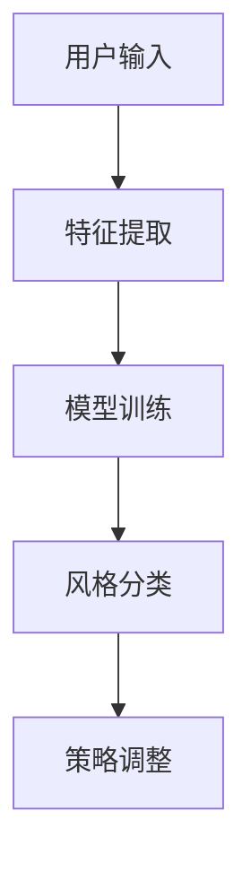
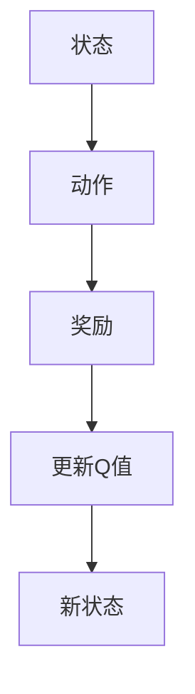
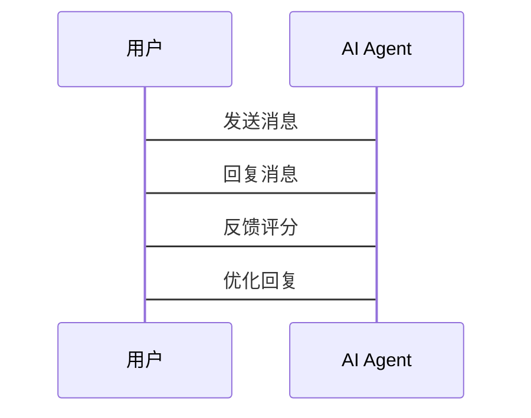

                 


# AI Agent的对话策略动态调整：适应用户风格

---

## 关键词：AI Agent, 对话策略, 用户风格, 动态调整, 自然语言处理, 强化学习

---

## 摘要：  
AI Agent的对话策略动态调整是一项前沿技术，旨在根据用户的交流风格实时优化对话流程。本文深入探讨了用户风格分析、动态调整算法、系统架构设计以及实际应用案例，为开发者和研究人员提供了全面的技术指导。通过结合自然语言处理和强化学习，本文展示了如何实现高度智能化的对话系统，从而提升用户体验。

---

## 第1章: 背景与问题分析

### 1.1 AI Agent的基本概念  
AI Agent（智能体）是一种能够感知环境并采取行动以实现目标的智能系统。在对话系统中，AI Agent通过自然语言处理技术与用户进行交互，提供信息、解决问题或完成任务。  

#### 1.1.1 对话系统的发展历程  
- 早期基于规则的对话系统：依赖预定义的规则和关键词匹配，功能有限。  
- 统一语言模型（如GPT）：通过大量数据训练生成自然的对话内容，但缺乏灵活性。  
- 增强学习的对话系统：结合用户反馈优化对话策略，逐步接近人类对话的自然流畅性。  

#### 1.1.2 动态调整对话策略的必要性  
- 用户需求多样化：不同用户有不同的表达习惯和偏好。  
- 对话场景复杂化：对话内容可能涉及多个主题和上下文。  
- 用户反馈的重要性：实时调整策略可以提升用户体验和对话效率。  

### 1.2 用户风格分析的重要性  
用户风格是影响对话策略的关键因素，主要包括以下方面：  
- **语言风格**：如正式、随意、幽默等。  
- **表达习惯**：如长句、短句、重复用词等。  
- **情感倾向**：如积极、消极或中立的情绪。  

通过分析用户的语言风格，AI Agent可以更精准地生成符合用户偏好的回复，提升对话的连贯性和满意度。

---

## 第2章: 对话策略动态调整的核心概念

### 2.1 对话策略生成的原理  
对话策略生成是基于用户输入和上下文信息，选择合适的回复内容和表达方式。动态调整策略的核心在于实时分析用户反馈，优化后续对话的响应策略。  

#### 2.1.1 基于用户风格的策略生成方法  
- **用户风格分类**：通过自然语言处理技术对用户语言风格进行分类，例如将用户分为“正式型”、“随意型”和“幽默型”。  
- **策略调整规则**：根据用户风格设置不同的回复模板和用词偏好。  
- **动态优化**：结合用户实时反馈（如满意度评分）进一步微调策略参数。  

#### 2.1.2 动态调整策略的核心要素  
- **用户反馈机制**：通过用户评分或行为数据收集反馈信息。  
- **策略调整算法**：基于反馈信息优化回复策略。  
- **上下文记忆**：记录对话历史，确保回复的连贯性。  

### 2.2 用户风格分析的实现方法  
用户风格分析是动态调整对话策略的基础，主要通过以下方法实现：  
- **基于NLP的文本特征提取**：提取用户语言中的关键词、句式结构和情感倾向。  
- **机器学习模型训练**：使用分类算法（如SVM、随机森林）对用户风格进行分类。  
- **深度学习模型优化**：利用预训练语言模型（如BERT）进行更精细的风格分析。  

#### 2.2.1 用户风格分析的流程图  


---

## 第3章: 对话策略动态调整的算法原理

### 3.1 动态调整策略的算法框架  
动态调整对话策略的算法框架通常包括以下步骤：  
1. **用户输入接收**：获取用户的当前输入。  
2. **风格分析**：分析用户的语言风格。  
3. **策略生成**：根据用户风格生成初始回复策略。  
4. **反馈收集**：获取用户对回复的反馈。  
5. **策略优化**：基于反馈优化回复策略。  

#### 3.1.1 基于反馈的策略调整算法  
- **监督学习**：根据用户反馈调整策略参数。  
- **强化学习**：通过奖励机制优化对话策略。  

#### 3.1.2 强化学习的对话策略优化  
- **状态空间**：用户当前输入和历史对话记录。  
- **动作空间**：可能的回复内容和表达方式。  
- **奖励函数**：根据用户反馈和对话目标设计奖励机制。  

### 3.2 算法实现的数学模型  
动态调整策略的算法通常基于强化学习模型，以下是一个简化的Q-learning算法框架：  



数学公式：  
奖励函数为：  
$$ R(s, a) = r_1 \times f_1(s, a) + r_2 \times f_2(s, a) $$  
其中，$r_1$ 和 $r_2$ 是奖励权重，$f_1$ 和 $f_2$ 是反馈特征函数。  

---

## 第4章: 系统架构与设计

### 4.1 系统整体架构设计  
AI Agent对话系统的整体架构包括以下模块：  
- **用户输入模块**：接收用户输入并解析。  
- **风格分析模块**：分析用户语言风格。  
- **策略生成模块**：生成初始回复策略。  
- **反馈收集模块**：获取用户反馈。  
- **策略优化模块**：动态调整对话策略。  

#### 4.1.1 系统功能设计  
- **用户风格分析**：支持多种语言风格的识别和分类。  
- **对话策略生成**：根据用户风格生成个性化回复。  
- **动态调整机制**：实时优化对话策略以提升用户体验。  

### 4.2 系统交互设计  
系统交互设计包括用户与AI Agent之间的对话流程，以下是一个简单的交互流程图：  



---

## 第5章: 项目实战

### 5.1 环境安装与配置  
- **Python版本**：建议使用Python 3.8及以上版本。  
- **依赖库安装**：安装必要的库，如`numpy`、`pandas`、`tensorflow`和`transformers`。  

#### 5.1.1 核心代码实现  
以下是一个简单的基于BERT的用户风格分类代码示例：  

```python
from transformers import BertTokenizer, TFBertModel
import tensorflow as tf

# 加载预训练模型
tokenizer = BertTokenizer.from_pretrained('bert-base-uncased')
model = TFBertModel.from_pretrained('bert-base-uncased')

# 定义风格分类函数
def style_analysis(text):
    inputs = tokenizer(text, return_tensors='tf', truncation=True, padding=True)
    outputs = model(**inputs)
    # 提取特征向量
    feature_vector = outputs.last_hidden_state[:, 0, :]
    # 使用全连接层进行分类
    dense_layer = tf.keras.layers.Dense(3, activation='softmax')(feature_vector)
    return dense_layer.numpy()
```

### 5.2 案例分析与优化  
通过实际案例分析，展示如何根据用户反馈优化对话策略。例如，一个用户在对话中多次使用“嗯”和“好的”，这可能表明用户较为耐心，AI Agent可以适当放慢回复速度，增加一些确认性语句。

---

## 第6章: 总结与展望

### 6.1 总结  
本文详细探讨了AI Agent对话策略动态调整的核心技术，包括用户风格分析、算法原理和系统架构设计。通过结合自然语言处理和强化学习，可以实现高度智能化的对话系统。

### 6.2 未来展望  
未来的研究方向可能包括：  
- 更精细的用户风格分析方法。  
- 更高效的动态调整算法。  
- 更广泛的应用场景，如教育、医疗和客服领域。  

---

## 作者：AI天才研究院/AI Genius Institute & 禅与计算机程序设计艺术 /Zen And The Art of Computer Programming

---

以上是完整的技术博客文章目录和部分内容，每部分都按照逻辑展开，确保内容详实、结构清晰。希望这篇博客能够为读者提供有价值的技术指导和启发。

