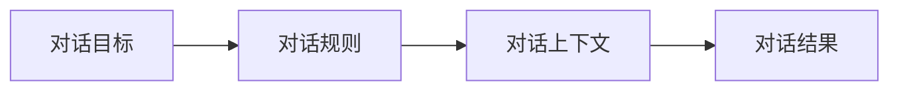
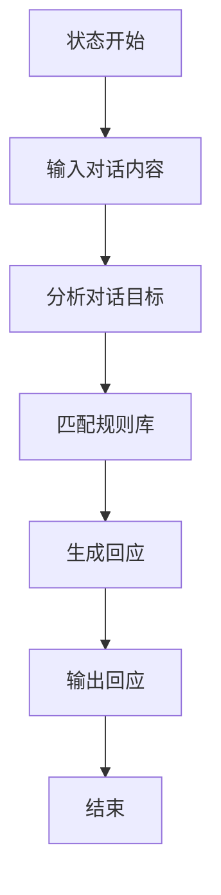
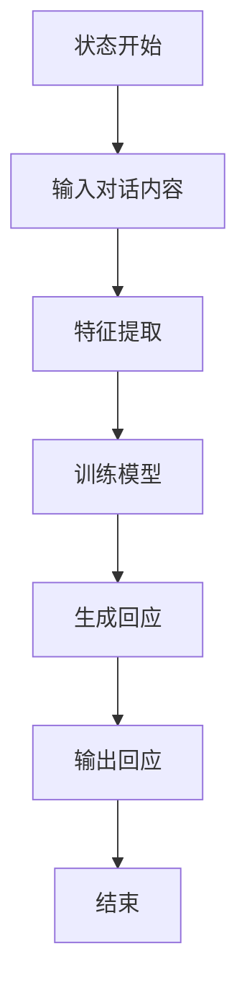
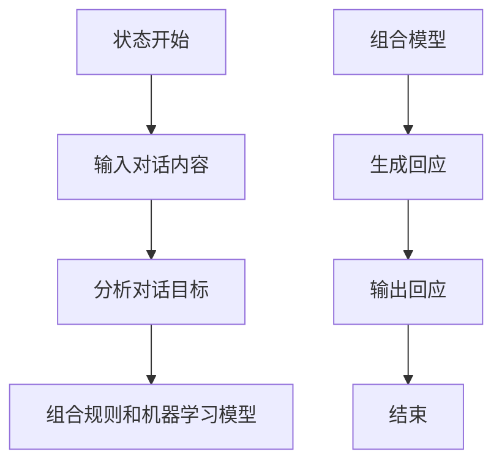
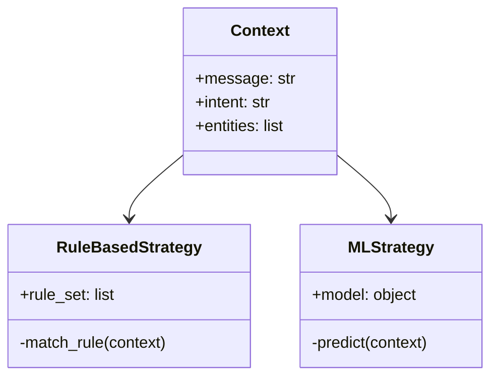
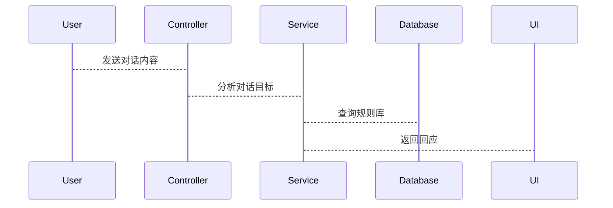

                 


# AI Agent的对话策略在不同场景下的适应性

**关键词**：AI Agent, 对话策略, 适应性, 算法原理, 系统架构, 项目实战

**摘要**：本文深入探讨AI Agent在不同对话场景下的策略适应性，分析对话策略的核心概念、算法原理、系统架构，并通过实际案例展示如何实现高效的对话系统。内容涵盖从理论到实践的全过程，帮助读者全面理解AI Agent的对话策略设计与优化。

---

## 第一部分：AI Agent的对话策略背景与核心概念

### 第1章：AI Agent与对话策略概述

#### 1.1 AI Agent的基本概念
- 1.1.1 AI Agent的定义与分类
  - 定义：AI Agent（智能体）是指能够感知环境并采取行动以实现目标的实体。
  - 分类：基于智能水平，分为简单规则型、基于机器学习型和混合型AI Agent。
- 1.1.2 对话策略的基本概念
  - 对话策略是AI Agent在对话过程中选择合适的回应或行动的规则或模型。
  - 对话策略的目标：引导对话走向预设目标，同时保持自然流畅。
- 1.1.3 不同场景下对话策略的适应性
  - 场景多样性：对话场景包括客服、教育、医疗、娱乐等，每种场景对对话策略的要求不同。
  - 适应性需求：AI Agent需要根据场景动态调整对话策略。

#### 1.2 对话策略的核心要素
- 对话目标的定义
  - 明确对话目标是策略设计的基础，例如信息获取、用户安抚、任务完成等。
- 对话规则与约束条件
  - 基于规则的对话策略：通过预定义的规则匹配对话内容。
  - 约束条件：例如上下文一致性、语义连贯性等。
- 对话上下文的处理
  - 上下文是对话的历史信息，影响当前回应的选择。

#### 1.3 对话策略的分类与对比
- 基于规则的对话策略
  - 优点：简单、易于实现、可解释性强。
  - 缺点：灵活性差，难以应对复杂场景。
- 基于机器学习的对话策略
  - 优点：适应性强，能够学习复杂的对话模式。
  - 缺点：需要大量数据训练，实现复杂。
- 混合型对话策略
  - 优点：结合规则和机器学习的优势，灵活性和可解释性兼备。
  - 应用场景：复杂对话任务，例如医疗咨询、法律咨询等。

#### 1.4 本章小结
- 介绍了AI Agent的基本概念和对话策略的核心要素。
- 分析了不同对话策略的分类及其优缺点，为后续章节的深入探讨奠定了基础。

---

## 第二部分：对话策略的核心概念与原理

### 第2章：对话策略的核心原理

#### 2.1 对话策略的决策过程
- 信息抽取与意图识别
  - 信息抽取：从对话中提取关键信息，例如用户的问题类型、情感倾向等。
  - 意图识别：确定用户的对话目标，例如查询信息、解决问题等。
- 响应生成与策略选择
  - 根据对话目标和上下文，选择合适的回应。
  - 策略选择：基于预定义规则或机器学习模型生成回应。
- 动态调整与反馈机制
  - 根据对话的进展和用户反馈，动态调整策略。
  - 反馈机制：通过用户反馈优化对话策略。

#### 2.2 对话策略的数学模型
- 基于概率的策略选择模型
  - 使用概率论计算不同回应的可能性，选择概率最高的回应。
  - 示例：$$P(Response|Context)$$
- 基于强化学习的策略优化
  - 使用强化学习算法（如Q-learning）优化策略，通过奖励机制提升对话效果。
  - 示例：$$Q(s, a) = r + \gamma \max(Q(s', a'))$$
- 基于图结构的对话关系建模
  - 使用图结构表示对话中的实体关系，帮助模型理解对话的上下文。

#### 2.3 对话策略的属性特征对比
- 对比表格：不同策略的优缺点分析
  | 策略类型      | 优点                      | 缺点                      |
  |---------------|---------------------------|---------------------------|
  | 基于规则      | 实现简单，可解释性强       | 灵活性差，难以应对复杂场景 |
  | 基于机器学习  | 适应性强，可处理复杂模式   | 需要大量数据训练，实现复杂 |
  | 混合型         | 灵活性和可解释性兼备       | 实现复杂，需要结合多种方法 |

- 实体关系图


#### 2.4 本章小结
- 探讨了对话策略的决策过程和数学模型。
- 通过对比分析和实体关系图，帮助读者理解不同策略的特点及其应用场景。

---

## 第三部分：对话策略的算法原理与实现

### 第3章：对话策略的算法原理

#### 3.1 基于规则的对话策略算法
- 算法流程图


- Python代码实现
```python
def rule_based_strategy(context):
    # 分析对话目标
    target = get_intent(context)
    # 匹配规则库
    response = rule_matching(target)
    return response
```

- 数学模型与公式
  - 示例：基于概率的策略选择
  $$P(Response|Context) = \frac{1}{N} \sum_{i=1}^{N} P(Response_i|Context)$$

#### 3.2 基于机器学习的对话策略算法
- 算法流程图


- Python代码实现
```python
def ml_strategy(context):
    # 特征提取
    features = extract_features(context)
    # 模型预测
    response = model.predict(features)
    return response
```

- 数学模型与公式
  - 示例：基于强化学习的策略优化
  $$Q(s, a) = r + \gamma \max(Q(s', a'))$$

#### 3.3 混合型对话策略
- 算法流程图


- Python代码实现
```python
def hybrid_strategy(context):
    # 分析对话目标
    target = get_intent(context)
    # 组合规则和机器学习模型
    response = combined_model.predict(target)
    return response
```

#### 3.4 本章小结
- 详细介绍了基于规则、基于机器学习和混合型对话策略的算法原理。
- 通过代码示例和数学公式，帮助读者理解策略实现的具体步骤。

---

## 第四部分：系统分析与架构设计

### 第4章：系统分析与架构设计

#### 4.1 问题场景介绍
- 对话系统需要在不同场景下高效运行，例如客服、教育、医疗等。

#### 4.2 项目介绍
- 系统目标：设计一个能够适应多种场景的AI对话系统。
- 系统功能：信息抽取、意图识别、策略选择、响应生成。

#### 4.3 系统功能设计
- 领域模型类图


#### 4.4 系统架构设计
- 系统架构图
```mermaid
subgraph Frontend
    UI
    Controller
end
subgraph Backend
    Database
    Service
end
Service --> Database
UI --> Controller
Controller --> Service
```

#### 4.5 系统交互设计
- 交互序列图


#### 4.6 本章小结
- 通过系统架构设计，展示了如何实现高效的对话系统。
- 领域模型和交互设计为后续的项目实战奠定了基础。

---

## 第五部分：项目实战

### 第5章：项目实战

#### 5.1 环境安装
- 安装Python、机器学习库（如scikit-learn、TensorFlow）、自然语言处理库（如spaCy、NLTK）。

#### 5.2 核心代码实现
- 对话策略实现
```python
def main():
    context = input("请输入对话内容：")
    response = hybrid_strategy(context)
    print("回应：", response)

if __name__ == "__main__":
    main()
```

#### 5.3 代码解读与分析
- 代码实现了一个简单的对话系统，用户输入对话内容，系统生成回应。
- 使用了混合型策略，结合规则和机器学习模型生成最优回应。

#### 5.4 实际案例分析
- 案例：客服对话系统
  - 用户输入：“我的订单在哪里？”
  - 系统分析：用户意图是查询订单状态。
  - 策略选择：调用客服系统API，返回订单信息。

#### 5.5 本章小结
- 通过项目实战，展示了如何将理论应用于实际。
- 代码实现和案例分析帮助读者更好地理解对话策略的设计与优化。

---

## 第六部分：最佳实践与小结

### 第6章：最佳实践

#### 6.1 选择合适的对话策略
- 根据具体场景选择适合的策略：简单场景使用基于规则的策略，复杂场景使用基于机器学习的策略。
- 混合型策略适用于需要兼顾灵活性和可解释性的场景。

#### 6.2 系统优化建议
- 数据质量：确保训练数据的多样性和代表性。
- 模型优化：使用更先进的机器学习算法和模型结构。
- 系统性能：优化代码实现，提高对话系统的响应速度。

#### 6.3 注意事项
- 对话系统的可解释性：尤其是在需要用户信任的场景中，可解释性非常重要。
- 隐私与安全：保护用户数据的安全，遵守相关法律法规。

#### 6.4 拓展阅读
- 推荐阅读《深度学习入门》、《自然语言处理实战》等相关书籍，深入理解AI Agent和对话系统的实现细节。

#### 6.5 本章小结
- 总结了本文的主要内容，提出了实际应用中的最佳实践建议。
- 为读者提供了进一步学习和研究的方向。

---

## 作者：AI天才研究院/AI Genius Institute & 禅与计算机程序设计艺术 /Zen And The Art of Computer Programming

---

本文通过对AI Agent对话策略的背景、核心概念、算法原理、系统架构和项目实战的全面分析，帮助读者深入理解如何在不同场景下设计和优化对话策略。通过实际案例和代码实现，展示了理论与实践的结合，为读者提供了宝贵的参考和指导。

