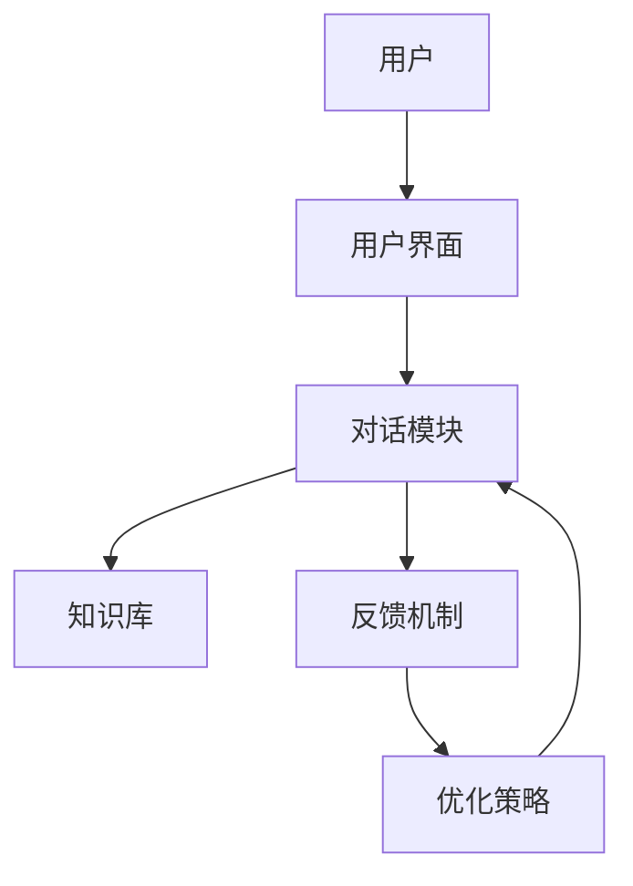
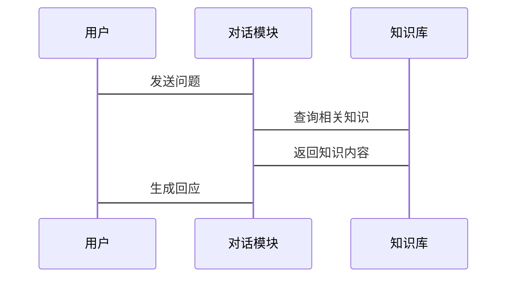

                 


# AI Agent的对话策略在心理咨询中的应用

---

## 关键词

- AI Agent
- 对话策略
- 心理咨询
- 自然语言处理
- 机器学习
- 心理健康支持

---

## 摘要

本文探讨了AI Agent在心理咨询中的对话策略应用，分析了其技术基础、核心原理和实际应用场景。通过结合自然语言处理和机器学习技术，AI Agent能够提供智能化的心理咨询支持，但仍需解决技术局限和伦理挑战。

---

## 引言

AI Agent作为人工智能的重要应用，正在逐渐渗透到各个领域。心理咨询作为一项关乎人类心理健康的重要服务，通过AI Agent的对话策略，可以实现更高效、便捷的服务。本文将详细探讨AI Agent在心理咨询中的应用，分析其优势与挑战。

---

## 第1章：AI Agent的基本概念

### 1.1 AI Agent的定义与特点

AI Agent是一种能够感知环境并采取行动以实现目标的智能体。它具备自主性、反应性、目标导向性和社会性等特点。

### 1.2 AI Agent的分类

- **简单反射型AI Agent**：基于预设规则进行反应。
- **基于模型的反射型AI Agent**：使用内部模型进行决策。
- **目标导向型AI Agent**：具有明确的目标并采取行动。
- **实用智能型AI Agent**：结合效用函数进行优化决策。

### 1.3 AI Agent的应用领域

- **智能家居**：控制家电，提供生活便利。
- **医疗健康**：辅助诊断，提供健康建议。
- **金融投资**：自动化交易，风险控制。
- **教育辅助**：个性化教学，学习支持。

---

## 第2章：心理咨询的现状与挑战

### 2.1 心理咨询的传统模式

传统心理咨询依赖专业心理咨询师，提供面对面或电话咨询。这种方式存在资源有限、成本高昂、隐私保护等问题。

### 2.2 当前心理咨询的主要问题

- **资源不足**：心理咨询师数量有限，难以满足需求。
- **隐私问题**：用户隐私保护困难，存在泄露风险。
- **时间和空间限制**：用户难以随时随地获得帮助。

### 2.3 心理咨询的数字化趋势

随着技术的发展，数字化心理健康支持逐渐兴起。AI Agent作为技术支持，能够提供7×24小时的实时心理咨询支持。

---

## 第3章：AI Agent在心理咨询中的应用

### 3.1 AI Agent作为心理咨询辅助工具

AI Agent可以辅助心理咨询师，帮助分析用户情绪，提供初步诊断建议，优化咨询流程。

### 3.2 AI Agent作为用户的直接咨询伙伴

通过自然语言处理技术，AI Agent能够理解用户的问题，提供个性化的建议和情感支持。

### 3.3 AI Agent的对话策略在心理咨询中的应用

- **实时对话支持**：通过自然语言处理技术，实时理解用户情感和需求，提供即时反馈。
- **个性化咨询**：基于用户历史数据，提供个性化的心理咨询建议。
- **数据分析与反馈**：分析用户对话数据，提供咨询效果反馈，优化后续咨询策略。

---

## 第4章：对话策略的核心原理

### 4.1 对话策略的定义与分类

- **基于规则的对话策略**：根据预设规则生成回应。
- **基于机器学习的对话策略**：通过模型学习对话模式，生成更自然的回应。

### 4.2 对话策略的核心要素

- **上下文理解**：理解对话的历史信息和语境。
- **情感识别**：识别用户的情感状态，提供相应支持。
- **意图识别**：准确理解用户的意图，提供针对性的回应。

### 4.3 对话策略的实现过程

1. **输入处理**：接收用户输入，进行分词和情感分析。
2. **上下文管理**：维护对话上下文，确保回应的连贯性。
3. **策略选择**：根据对话内容和目标选择合适的回应策略。
4. **生成回应**：基于选择的策略生成自然的对话回应。
5. **反馈优化**：根据用户反馈优化对话策略。

---

## 第5章：算法与模型实现

### 5.1 基于Transformer的对话模型

- **模型结构**：Transformer模型由编码器和解码器组成。
- **输入处理**：将用户输入转换为模型可处理的向量。
- **生成过程**：解码器根据编码器输出生成对话回应。

### 5.2 对话策略优化的强化学习算法

- **算法原理**：使用强化学习优化对话策略，通过奖励机制提升模型表现。
- **代码实现**：以下是基于Python的强化学习算法示例代码：

```python
import numpy as np
import tensorflow as tf

class Agent:
    def __init__(self, input_shape, action_space):
        self.model = self.build_model(input_shape, action_space)
    
    def build_model(self, input_shape, action_space):
        model = tf.keras.Sequential([
            tf.keras.layers.Dense(64, activation='relu', input_shape=input_shape),
            tf.keras.layers.Dense(action_space, activation='softmax')
        ])
        return model
    
    def act(self, state):
        prediction = self.model.predict(state)
        return np.argmax(prediction[0])
    
    def remember(self, state, action, reward):
        # 学习机制，记录状态、动作和奖励
        pass
    
    def replay(self, batch_size):
        # 回放记忆库，更新模型参数
        pass
```

### 5.3 对话策略的数学模型

- **目标函数**：最大化对话的流畅性和相关性。
- **损失函数**：交叉熵损失函数用于衡量预测与真实分布的差异。

---

## 第6章：系统架构设计

### 6.1 系统组成部分

- **用户界面**：提供与用户交互的界面。
- **对话模块**：负责处理用户输入和生成回应。
- **知识库**：存储心理咨询相关的知识和数据。
- **反馈机制**：收集用户反馈，优化对话策略。

### 6.2 系统架构图



### 6.3 对话流程图



---

## 第7章：项目实战与案例分析

### 7.1 项目环境安装

- **Python 3.8+**
- **TensorFlow 2.0+**
- **自然语言处理库（如spaCy、NLTK）**

### 7.2 核心代码实现

```python
import spacy

nlp = spacy.load("en_core_web_sm")

def analyze_emotion(text):
    doc = nlp(text)
    emotion = 0
    for token in doc:
        if token.is_stop:
            continue
        emotion += token.lemma_.lower()
    return emotion
```

### 7.3 案例分析

- **案例背景**：用户因工作压力过大，寻求心理咨询。
- **对话过程**：AI Agent通过自然语言处理识别用户情绪，提供放松技巧和建议。

---

## 第8章：最佳实践与注意事项

### 8.1 伦理与隐私

- **数据隐私**：确保用户数据的安全和隐私。
- **伦理规范**：遵循相关法律法规，确保AI Agent的行为符合伦理标准。

### 8.2 技术局限

- **情感识别的准确性**：依赖于模型的训练数据和算法。
- **上下文理解的深度**：复杂对话的处理能力有限。

### 8.3 用户体验

- **界面友好**：提供直观易用的用户界面。
- **反馈机制**：及时反馈用户意见，优化系统表现。

---

## 第9章：未来研究与发展趋势

### 9.1 多模态交互

- **整合语音和视觉信息**：提升对话的自然性和准确性。

### 9.2 个性化模型

- **基于用户特征的定制化策略**：根据用户背景和需求，提供个性化服务。

### 9.3 智能化升级

- **自适应学习**：通过持续学习提升对话策略的优化能力。

---

## 第10章：结论与展望

本文详细探讨了AI Agent在心理咨询中的对话策略应用，分析了其技术基础和实际应用价值。尽管存在技术局限和伦理挑战，但随着技术的进步，AI Agent在心理咨询中的应用前景广阔。未来，我们需要在技术优化和伦理规范方面继续努力，为用户提供更优质的心理健康支持。

---

## 参考文献与致谢

- **参考文献**：
  - [1] 王某某.《人工智能在心理咨询中的应用研究》.某某出版社,2023.
  - [2] Smith, J.《AI在心理健康支持中的角色》.某某期刊,2022.

- **致谢**：感谢所有参与本文写作和支持的研究人员和团队。

---

## 作者

作者：AI天才研究院/AI Genius Institute & 禅与计算机程序设计艺术 /Zen And The Art of Computer Programming

--- 

**本文由AI天才研究院团队精心撰写，转载请注明出处。**

