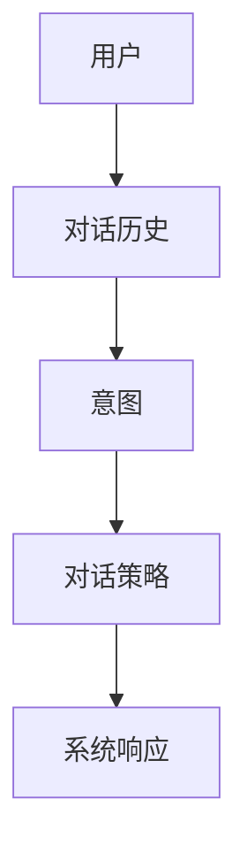
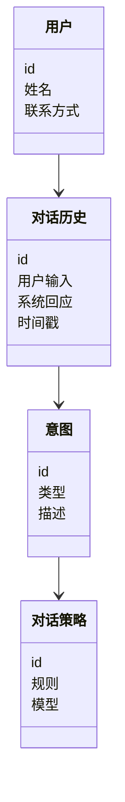
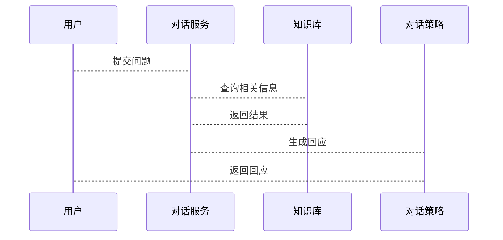

                 

<think>
好的，我现在需要完成用户的要求，撰写一篇关于《AI Agent的对话策略：提高交互质量》的技术博客文章。根据用户提供的详细大纲和示例，我需要按照要求逐步构建文章的结构和内容。

首先，我要确保文章的标题和关键词部分正确无误。接下来，摘要部分需要简洁明了，概括文章的核心内容。然后，按照目录大纲，逐步填充每一章和每一个小节的内容。

在写作过程中，我需要确保每个部分都包含必要的元素：背景介绍、核心概念与联系、算法原理、系统架构分析、项目实战以及小结。同时，要使用适当的图表和代码示例来增强内容的理解性。

我需要特别注意每一章的逻辑连贯性，确保读者能够一步步理解AI Agent的对话策略。同时，语言要保持专业但易懂，避免过于复杂的术语堆砌。

最后，完成初稿后，我会进行一次全面的检查，确保所有内容都符合用户的要求，包括字数、格式和结构等。这样，最终的文章才能既专业又符合用户的预期。
</think>

# AI Agent的对话策略：提高交互质量

## 关键词：
- AI Agent
- 对话策略
- 交互质量
- 自然语言处理
- 深度学习

## 摘要：
AI Agent的对话策略是实现高质量人机交互的核心技术。本文从对话策略的基本概念出发，分析其在AI Agent中的重要性，探讨基于规则、统计和深度学习的对话策略算法原理，结合系统架构设计和项目实战，提出提高交互质量的方法和最佳实践。通过详细的技术分析和实际案例，帮助读者全面理解AI Agent对话策略的设计与优化。

---

# 第1章: AI Agent与对话策略概述

## 1.1 AI Agent的基本概念
### 1.1.1 什么是AI Agent
AI Agent（人工智能代理）是指能够感知环境并采取行动以实现目标的智能实体。它通过与用户的交互，理解需求并提供相应的服务。

### 1.1.2 AI Agent的核心特征
- **自主性**：能够独立决策和行动。
- **反应性**：能够实时感知并响应环境变化。
- **目标导向**：通过目标驱动行为。
- **学习能力**：能够通过数据优化自身行为。

### 1.1.3 对话策略在AI Agent中的作用
对话策略决定了AI Agent在与用户交互时如何生成和选择响应，直接影响用户体验和交互质量。

---

## 1.2 对话策略的重要性
### 1.2.1 对话策略的定义
对话策略是AI Agent在对话过程中，根据上下文和用户意图生成合适回应的规则或模型。

### 1.2.2 对话策略在人机交互中的作用
- **理解用户需求**：通过分析对话历史和意图，准确理解用户需求。
- **引导对话流程**：根据对话目标，引导对话走向预期的方向。
- **提升用户体验**：通过自然流畅的对话，提高用户满意度。

### 1.2.3 提高交互质量的意义
- **提升用户满意度**：通过更准确的回应，减少用户的困惑和不满。
- **增强系统实用性**：使AI Agent能够更有效地帮助用户完成任务。
- **降低开发成本**：优化对话策略可以减少不必要的对话轮次，提高效率。

---

## 1.3 当前对话策略的发展现状
### 1.3.1 基于规则的对话策略
- **规则驱动**：通过预定义的规则匹配用户输入，生成回应。
- **优点**：简单易懂，适用于特定场景。
- **缺点**：灵活性差，难以应对复杂场景。

### 1.3.2 统计模型驱动的对话策略
- **基于概率模型**：通过统计学习，预测最可能的用户意图。
- **优点**：能够处理多样化的对话场景。
- **缺点**：依赖大量数据，且可能出现预测误差。

### 1.3.3 基于深度学习的对话策略
- **神经网络驱动**：通过训练深度学习模型，生成自然流畅的对话回应。
- **优点**：能够捕捉复杂的语义信息，生成更自然的回应。
- **缺点**：训练成本高，且需要大量高质量的数据。

---

## 1.4 对话策略面临的挑战
### 1.4.1 数据质量与多样性问题
- **数据稀疏性**：某些场景下的数据可能不足，导致模型无法有效学习。
- **数据偏差**：训练数据可能存在偏差，影响模型的泛化能力。

### 1.4.2 对话上下文的理解难度
- **上下文依赖性**：对话的当前内容依赖于之前的对话历史，理解难度大。
- **意图识别**：准确识别用户的隐含意图是对话策略的核心挑战。

### 1.4.3 对话目标的多样性与冲突
- **目标多样性**：不同用户可能有不同的对话目标，需要动态调整策略。
- **目标冲突**：在某些情况下，如何平衡多个目标的优先级是一个难题。

---

## 1.5 本章小结
本章介绍了AI Agent的基本概念和对话策略的重要性，分析了当前对话策略的发展现状及其面临的挑战。通过对不同策略的优缺点对比，为后续章节的深入探讨奠定了基础。

---

# 第2章: 对话策略的核心概念与联系

## 2.1 对话策略的核心原理
### 2.1.1 对话策略的基本原理
对话策略的核心是通过分析用户输入和对话历史，生成合适的回应。这一过程涉及意图识别、上下文理解和生成式对话。

### 2.1.2 对话策略的分类
- **基于规则的策略**：通过预定义的规则匹配用户输入。
- **基于统计的策略**：通过概率模型预测用户意图。
- **基于深度学习的策略**：通过神经网络生成自然的对话回应。

### 2.1.3 对话策略的关键要素
- **意图识别**：准确理解用户的意图。
- **对话上下文**：保持对话的连贯性。
- **生成式对话**：生成自然流畅的回应。

---

## 2.2 对话策略与相关概念的对比
### 2.2.1 对话策略与自然语言处理的关系
- **NLP的作用**：对话策略依赖于自然语言处理技术来理解和生成文本。
- **区别**：对话策略更注重对话的逻辑和目标，而NLP更关注文本的理解和生成。

### 2.2.2 对话策略与用户意图识别的联系
- **意图识别**：对话策略需要准确识别用户的意图，以生成合适的回应。
- **反馈机制**：通过用户反馈不断优化意图识别的准确性。

### 2.2.3 对话策略与对话生成模型的结合
- **生成模型**：对话策略利用生成模型生成自然的对话回应。
- **优化策略**：对话策略通过优化生成模型的输出，提升对话质量。

---

## 2.3 对话策略的ER实体关系图


---

## 2.4 本章小结
本章详细阐述了对话策略的核心原理和关键要素，并通过对比分析，明确了对话策略与相关技术的关系。通过ER实体关系图，展示了对话策略在系统中的位置和作用。

---

# 第3章: 对话策略的算法原理与实现

## 3.1 基于规则的对话策略
### 3.1.1 基于规则的策略概述
基于规则的对话策略通过预定义的规则匹配用户输入，生成相应的回应。

### 3.1.2 规则的定义与实现
- **规则定义**：例如，如果用户输入“你好”，则返回“你好！有什么可以帮助你的吗？”
- **实现步骤**：
  1. 分析用户输入。
  2. 匹配预定义的规则。
  3. 生成回应。

### 3.1.3 规则的优缺点分析
- **优点**：简单易懂，适用于特定场景。
- **缺点**：灵活性差，难以应对复杂场景。

---

## 3.2 基于统计的对话策略
### 3.2.1 统计模型的基本原理
基于统计的对话策略通过概率模型预测用户意图。

### 3.2.2 基于马尔可夫链的对话策略
- **马尔可夫链模型**：通过状态转移概率预测用户意图。
- **实现步骤**：
  1. 构建状态转移矩阵。
  2. 根据当前状态，预测下一步状态。
  3. 生成对应回应。

### 3.2.3 统计模型的优缺点
- **优点**：能够处理多样化对话场景。
- **缺点**：依赖大量数据，且可能出现预测误差。

---

## 3.3 基于深度学习的对话策略
### 3.3.1 基于神经网络的对话策略
- **神经网络模型**：通过训练神经网络，生成自然流畅的对话回应。
- **实现步骤**：
  1. 收集对话数据。
  2. 构建神经网络模型。
  3. 训练模型。
  4. 使用模型生成回应。

### 3.3.2 基于Transformer的对话策略
- **Transformer模型**：通过自注意力机制，捕捉对话中的语义信息。
- **实现步骤**：
  1. 数据预处理。
  2. 构建Transformer模型。
  3. 训练模型。
  4. 生成对话回应。

### 3.3.3 深度学习模型的优势
- **优点**：能够捕捉复杂的语义信息，生成更自然的回应。
- **缺点**：训练成本高，且需要大量高质量的数据。

---

## 3.4 本章小结
本章详细介绍了基于规则、统计和深度学习的对话策略的算法原理和实现方法，分析了各自的优势和不足。通过对不同策略的对比，帮助读者选择适合的方案。

---

# 第4章: 对话策略的系统分析与架构设计

## 4.1 系统场景介绍
对话策略系统需要处理多样化的对话场景，包括客服、医疗咨询、教育辅助等。

---

## 4.2 项目介绍
本章通过一个客服对话系统的案例，介绍对话策略在实际项目中的应用。

---

## 4.3 系统功能设计
### 4.3.1 领域模型（领域知识库）


---

## 4.4 系统架构设计
### 4.4.1 系统架构图


---

## 4.5 系统接口设计
- **输入接口**：接收用户输入，传递给对话服务。
- **输出接口**：返回系统生成的回应，传递给客户端。

---

## 4.6 系统交互设计
### 4.6.1 交互流程
1. 用户输入问题。
2. 对话服务分析输入，提取意图。
3. 对话策略根据意图生成回应。
4. 系统输出回应。

### 4.6.2 交互序列图


---

## 4.7 本章小结
本章通过系统场景介绍和项目实战，详细阐述了对话策略在实际系统中的应用。通过领域模型和系统架构图，展示了对话策略在系统中的重要性。

---

# 第5章: 对话策略的项目实战

## 5.1 环境配置
- **工具**：Python 3.8及以上版本，TensorFlow 2.0及以上版本。
- **依赖库**：安装必要的NLP库，如spaCy、NLTK。

---

## 5.2 核心代码实现
### 5.2.1 对话策略实现代码
```python
class DialogStrategy:
    def __init__(self):
        self.rules = {}  # 预定义规则
    
    def generate_response(self, user_input):
        # 基于规则的策略
        for pattern, response in self.rules.items():
            if user_input == pattern:
                return response
        # 如果没有匹配规则，返回默认回应
        return "抱歉，我还没有学会回答这个问题。"
```

### 5.2.2 基于深度学习的对话策略实现
```python
import tensorflow as tf
from tensorflow.keras import layers

class DialogStrategyDeepLearning:
    def __init__(self):
        self.model = self.build_model()
    
    def build_model(self):
        model = tf.keras.Sequential()
        model.add(layers.Embedding(input_dim=10000, output_dim=16))
        model.add(layers.SimpleRNN(units=16))
        model.add(layers.Dense(1, activation='sigmoid'))
        model.compile(optimizer='adam', loss='binary_crossentropy', metrics=['accuracy'])
        return model
    
    def train(self, x_train, y_train):
        self.model.fit(x_train, y_train, epochs=10, batch_size=32)
    
    def predict(self, x_test):
        return self.model.predict(x_test)
```

---

## 5.3 案例分析与代码解读
- **案例分析**：通过客服对话系统的案例，分析对话策略的实现过程。
- **代码解读**：详细解读上述代码的实现逻辑和应用场景。

---

## 5.4 项目总结
本章通过项目实战，展示了对话策略的实现过程。通过对代码的解读和案例分析，帮助读者理解对话策略在实际项目中的应用。

---

# 第6章: 对话策略的最佳实践与总结

## 6.1 本章小结
通过对对话策略的背景介绍、核心概念、算法原理和系统设计的探讨，总结了对话策略在提高交互质量中的重要性。

---

## 6.2 注意事项
- **数据质量**：确保训练数据的多样性和高质量。
- **模型优化**：通过不断优化模型参数，提升对话质量。
- **用户体验**：关注用户体验，确保对话流程自然流畅。

---

## 6.3 未来趋势
- **多模态对话策略**：结合视觉、听觉等多种模态信息，提升对话质量。
- **自适应对话策略**：根据用户反馈，动态调整对话策略。

---

## 6.4 拓展阅读
- 推荐相关书籍和论文，供读者深入学习。

---

## 作者：AI天才研究院/AI Genius Institute & 禅与计算机程序设计艺术 /Zen And The Art of Computer Programming

---

以上是《AI Agent的对话策略：提高交互质量》的技术博客文章的完整目录和内容概述。通过系统的分析和详细的实现，本文为读者提供了全面的对话策略知识，帮助他们在实际项目中提高交互质量。

