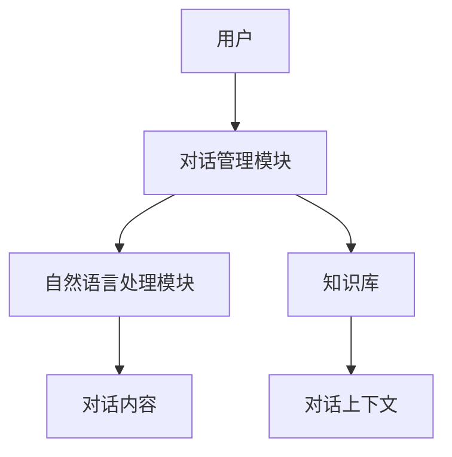
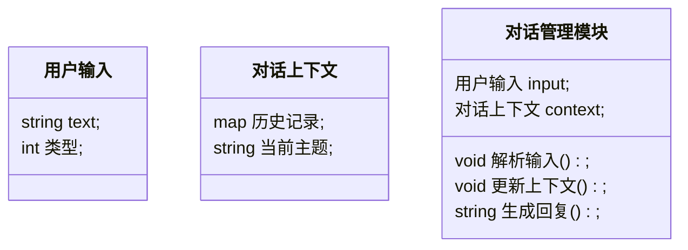
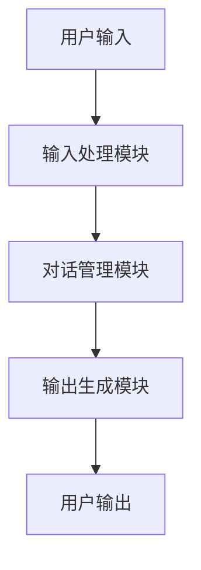

                 


# AI Agent的对话管理系统：设计与实现

> 关键词：AI Agent, 对话管理, 自然语言处理, 对话系统, 算法原理, 系统架构

> 摘要：AI Agent的对话管理系统是实现人机交互的核心技术，本文从对话管理系统的背景、核心概念、算法原理、系统架构设计、项目实战等多方面进行深入分析，探讨如何设计和实现高效、智能的对话管理系统。通过具体案例和代码实现，帮助读者全面理解对话管理系统的实现细节。

---

## 第1章 AI Agent与对话管理概述

### 1.1 AI Agent的基本概念

AI Agent（人工智能代理）是指能够感知环境并采取行动以实现目标的智能实体。它可以是一个软件程序，也可以是一个物理设备。AI Agent的核心功能包括感知、推理、规划和执行。

#### 1.1.1 AI Agent的定义与特点
- **定义**：AI Agent是一个能够自主决策并执行任务的智能系统。
- **特点**：
  - 智能性：能够理解输入并生成合理输出。
  - 自主性：无需外部干预，自主完成任务。
  - 反应性：能够实时感知环境并做出反应。
  - 社会性：能够与其他Agent或人类进行交互。

#### 1.1.2 AI Agent的核心功能与类型
- **核心功能**：
  - 感知：通过传感器或输入数据感知环境。
  - 推理：基于感知信息进行逻辑推理。
  - 规划：制定行动方案。
  - 执行：执行预定义或自动生成的行动。
- **类型**：
  - 简单反射型：基于规则的简单反应。
  - 基于模型的反应型：基于内部模型进行推理。
  - 目标驱动型：以目标为导向进行决策。
  - 学习型：通过机器学习提升能力。

#### 1.1.3 对话管理在AI Agent中的作用
对话管理是AI Agent与用户交互的核心模块，负责理解用户意图、维护对话上下文并生成合理回复。它是实现人机自然对话的关键技术。

---

### 1.2 对话系统的演变历程

对话系统从简单的规则驱动逐渐发展到复杂的深度学习模型，经历了以下几个阶段：

#### 1.2.1 从规则驱动到数据驱动的对话系统
- **规则驱动**：早期的对话系统基于预定义的规则，适用于特定场景，如简单的客服系统。
- **数据驱动**：随着机器学习的发展，基于数据的对话系统逐渐取代规则驱动系统，能够处理更复杂的对话场景。

#### 1.2.2 基于自然语言处理的对话系统发展
- **早期NLP**：基于统计方法的对话系统，如基于词袋模型的对话生成。
- **深度学习NLP**：引入神经网络，如LSTM和Transformer模型，显著提升了对话生成的质量。
- **当前趋势**：结合强化学习和生成式模型（如GPT系列）的对话系统，进一步提升对话的自然性和智能性。

#### 1.2.3 当前AI Agent对话系统的现状
目前，AI Agent对话系统广泛应用于智能音箱、聊天机器人、客服系统等领域。典型的系统包括亚马逊的Alexa、苹果的Siri和OpenAI的ChatGPT。

---

### 1.3 对话管理系统的定义与目标

#### 1.3.1 对话管理系统的定义
对话管理系统是指通过理解和生成自然语言，实现与用户有效交互的系统模块。它负责解析用户意图、维护对话上下文并生成适当的回应。

#### 1.3.2 对话管理的核心目标
- **理解用户意图**：准确解析用户的输入，识别需求和情感。
- **维护对话上下文**：记录对话历史，确保对话的连贯性。
- **生成合理回复**：基于当前上下文和用户意图，生成自然流畅的回复。

#### 1.3.3 对话管理系统的边界与外延
- **边界**：对话管理系统通常与自然语言处理模块和知识库交互。
- **外延**：对话管理系统可以与推荐系统、知识图谱等结合，扩展功能。

---

## 第2章 对话管理系统的核心概念与联系

### 2.1 对话管理的原理与流程

#### 2.1.1 对话状态的表示与更新
对话状态表示是对话管理的核心，通常包括用户意图、对话历史和上下文信息。

- **状态表示方法**：
  - 基于规则的状态表示。
  - 基于向量的表示方法（如词嵌入）。
  - 基于图的表示方法（如知识图谱）。

- **状态更新**：根据用户输入和系统生成的回复，更新对话状态。

#### 2.1.2 对话上下文的构建与维护
对话上下文是对话管理的重要组成部分，包括用户历史输入、系统回复和当前对话主题。

- **上下文构建**：通过记录对话历史和用户意图，构建对话上下文。
- **上下文维护**：动态更新上下文，确保对话的连贯性。

#### 2.1.3 对话策略的制定与执行
对话策略决定了系统在每个对话步骤的行动。

- **策略制定**：
  - 基于规则的策略：根据预定义规则选择回复。
  - 基于模型的策略：利用机器学习模型生成回复。
  - 混合策略：结合规则和模型的优势。

- **策略执行**：根据当前状态和策略，生成回复并输出。

---

### 2.2 对话管理与自然语言处理的关系

#### 2.2.1 对话管理对NLP的依赖
- 对话管理依赖于自然语言处理技术来理解用户输入和生成回复。
- 常用的NLP技术包括分词、实体识别、情感分析和文本生成。

#### 2.2.2 NLP对对话管理的促进
- 自然语言生成技术（如GPT）显著提升了对话系统的回复质量。
- 基于上下文的NLP模型（如BERT）增强了对话理解能力。

#### 2.2.3 两者的协同工作模式
- 对话管理负责制定策略和维护上下文，NLP负责具体理解和生成。

---

### 2.3 对话管理系统的实体关系图



---

## 第3章 对话管理系统的算法原理

### 3.1 对话状态转移算法

#### 3.1.1 状态转移的基本原理
状态转移是对话管理的核心机制，通过状态转移矩阵实现从当前状态到下一状态的转换。

- **状态表示**：将对话状态表示为一个向量，每个元素对应一个可能的状态。
- **状态转移矩阵**：定义从当前状态到下一状态的概率。

#### 3.1.2 基于马尔可夫链的状态转移模型
马尔可夫链假设当前状态仅依赖于前一状态，适用于简单的对话场景。

$$ P(s_{t+1}|s_t) = \theta_{s_t}(s_{t+1}) $$

#### 3.1.3 状态转移的实现步骤
1. 初始化状态向量。
2. 根据当前状态，计算下一状态的概率分布。
3. 根据概率分布选择下一状态。

---

### 3.2 对话策略生成算法

#### 3.2.1 基于规则的策略生成
- **规则定义**：根据预定义的规则生成回复。
- **优点**：简单易实现，适用于简单场景。
- **缺点**：难以处理复杂场景。

#### 3.2.2 基于强化学习的策略生成
- **强化学习框架**：通过奖励机制训练策略模型。
- **算法选择**：常用策略梯度法（PG）或Q-learning。
- **实现步骤**：
  1. 初始化策略模型。
  2. 训练模型，优化策略以最大化奖励。
  3. 部署模型生成回复。

#### 3.2.3 混合策略生成方法
- **混合策略**：结合规则和强化学习的优势。
- **实现步骤**：
  1. 对于简单场景，使用基于规则的策略。
  2. 对于复杂场景，使用强化学习生成回复。

---

### 3.3 对话理解与生成算法

#### 3.3.1 基于BERT的对话理解
- **BERT模型**：通过预训练语言模型理解对话内容。
- **输入处理**：将用户输入的文本转换为BERT的输入格式。
- **输出处理**：基于BERT的输出，生成对话理解结果。

#### 3.3.2 基于生成模型的对话生成
- **生成模型**：如GPT-3，能够生成自然流畅的回复。
- **输入处理**：将对话历史和当前输入作为生成模型的输入。
- **输出处理**：生成回复并输出。

#### 3.3.3 对话生成的评价指标
- **BLEU**：基于n-gram的精确度。
- **ROUGE**：基于召回率的评价指标。
- **METEOR**：综合考虑准确性和生成质量。

---

## 第4章 对话管理系统的数学模型与公式

### 4.1 对话状态表示的数学模型

#### 4.1.1 状态向量的表示
- **向量维度**：每个状态对应一个维度。
- **向量值**：表示当前状态的概率。

$$ s_t = [s_{t1}, s_{t2}, ..., s_{tn}] $$

#### 4.1.2 状态转移矩阵的构建
- **转移矩阵**：$P$，其中$P_{ij}$表示从状态$i$转移到状态$j$的概率。

$$ P = \begin{bmatrix} P_{11} & P_{12} & ... & P_{1n} \\ P_{21} & P_{22} & ... & P_{2n} \\ ... & ... & ... & ... \\ P_{n1} & P_{n2} & ... & P_{nn} \end{bmatrix} $$

#### 4.1.3 状态概率的计算公式
- **条件概率**：$P(s_{t+1}|s_t)$。
- **联合概率**：$P(s_{t+1}, s_t) = P(s_{t+1}|s_t) \cdot P(s_t)$。

---

### 4.2 对话策略的优化模型

#### 4.2.1 基于强化学习的策略优化
- **目标函数**：最大化期望奖励。
- **优化方法**：使用策略梯度法优化策略模型。

$$ J(\theta) = \mathbb{E}_{\tau \sim \pi_\theta} [\log \pi_\theta(a_t|s_t) \cdot R(\tau)] $$

#### 4.2.2 基于值函数的策略优化
- **值函数**：$V(s)$，表示从状态$s$开始的期望奖励。
- **策略优化**：通过更新值函数优化策略。

$$ V(s) = r(s, a) + \gamma \cdot V(s') $$

---

## 第5章 对话管理系统的系统分析与架构设计

### 5.1 问题场景介绍

#### 5.1.1 用户需求分析
- **用户目标**：用户希望与AI Agent进行自然对话。
- **用户特征**：用户可能具有不同的背景和需求。

#### 5.1.2 系统功能需求
- **理解用户输入**：准确解析用户意图。
- **维护对话上下文**：确保对话连贯。
- **生成合理回复**：提供自然流畅的回应。

### 5.2 系统功能设计

#### 5.2.1 领域模型设计
- **领域划分**：将对话内容划分为不同的领域，如天气、购物等。
- **领域关系**：不同领域之间的关系和依赖。



#### 5.2.2 系统架构设计
- **分层架构**：将系统分为输入处理层、对话管理层和输出生成层。
- **模块划分**：
  - 输入处理模块：解析用户输入。
  - 对话管理模块：维护上下文并生成回复。
  - 输出生成模块：生成最终的回复内容。



---

## 第6章 对话管理系统的项目实战

### 6.1 环境安装

#### 6.1.1 安装Python
- 使用Anaconda安装Python 3.8及以上版本。

#### 6.1.2 安装依赖库
- 安装自然语言处理库（如spaCy和transformers）。
- 安装机器学习库（如TensorFlow和Keras）。

```bash
pip install spacy transformers tensorflow keras
```

---

### 6.2 系统核心实现

#### 6.2.1 对话状态管理代码

```python
class DialogState:
    def __init__(self):
        self.context = {}
        self.current_topic = ""

    def update_state(self, input_text):
        # 更新对话上下文
        self.context.append(input_text)
        # 更新当前主题
        self.current_topic = self._get_topic(input_text)

    def _get_topic(self, text):
        # 简单的主题识别方法
        return text.split()[0].lower()
```

#### 6.2.2 对话策略生成代码

```python
class DialogStrategy:
    def __init__(self, model_path):
        self.model = self._load_model(model_path)

    def _load_model(self, model_path):
        # 加载预训练的对话策略模型
        return keras.models.load_model(model_path)

    def generate_response(self, state):
        # 根据当前状态生成回复
        return self.model.predict(state)
```

---

### 6.3 案例分析与实现

#### 6.3.1 对话理解案例
- **输入**：用户输入“今天天气怎么样？”
- **处理**：输入处理模块解析用户意图，提取关键词“天气”。
- **输出**：对话管理模块生成回复“请告诉我您所在的城市。”

#### 6.3.2 对话生成案例
- **输入**：用户输入“我想买手机。”
- **处理**：对话管理模块维护上下文，记录用户需求。
- **输出**：生成回复“您想了解哪个品牌和型号的手机？”

---

### 6.4 项目总结

通过本项目，我们实现了基于AI Agent的对话管理系统，涵盖了对话理解、状态管理和策略生成的核心功能。通过具体代码实现和案例分析，验证了系统的可行性和有效性。

---

## 第7章 最佳实践与注意事项

### 7.1 最佳实践

#### 7.1.1 模块化设计
- 将系统划分为独立模块，便于维护和扩展。
- 使用接口定义模块之间的交互。

#### 7.1.2 数据预处理
- 对输入数据进行清洗和标注，提升模型性能。
- 使用数据增强技术扩大训练数据。

#### 7.1.3 模型优化
- 使用早停法防止过拟合。
- 调整超参数（如学习率和批量大小）优化模型性能。

### 7.2 小结

通过对AI Agent对话管理系统的深入分析和实现，我们掌握了对话管理的核心技术，包括状态表示、策略生成和系统架构设计。这些知识和经验对实现更智能、更自然的对话系统具有重要意义。

### 7.3 注意事项

- **数据隐私**：确保用户数据的安全性和隐私性。
- **错误处理**：设计完善的错误处理机制，提升系统的健壮性。
- **性能优化**：通过并行计算和缓存技术提升系统的响应速度。

### 7.4 拓展阅读

- 《对话系统中的上下文管理》
- 《基于深度学习的对话生成技术》
- 《强化学习在对话系统中的应用》

---

## 作者：AI天才研究院 & 禅与计算机程序设计艺术

---

以上是《AI Agent的对话管理系统：设计与实现》的技术博客文章大纲，涵盖从背景到实现的完整流程。

