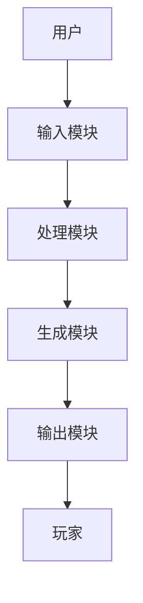

                 


# AI Agent的对话系统在多人游戏中的应用

> 关键词：AI Agent，对话系统，多人游戏，自然语言处理，强化学习，游戏AI，对话模型

> 摘要：本文深入探讨了AI Agent对话系统在多人游戏中的应用，从基础概念到算法原理，再到系统设计与实战案例，全面分析了对话系统在游戏中的价值与实现方案。文章结合理论与实践，通过具体的技术细节和代码实现，展示了如何利用AI Agent提升多人游戏的交互体验与智能性。

---

## 第一部分: AI Agent的对话系统概述

### 第1章: AI Agent与对话系统基础

#### 1.1 AI Agent的基本概念

##### 1.1.1 AI Agent的定义与特点

AI Agent（人工智能代理）是一种能够感知环境、自主决策并执行任务的智能实体。它具备以下特点：

- **自主性**：能够自主决策，无需外部干预。
- **反应性**：能够实时感知环境并做出反应。
- **社会性**：能够与其他Agent或人类进行交互与协作。
- **学习性**：能够通过经验或数据不断优化自身行为。

##### 1.1.2 对话系统的定义与分类

对话系统是一种能够让AI Agent与人类或其它Agent进行自然语言交互的系统。根据应用场景和功能的不同，对话系统可以分为以下几类：

- **任务导向型对话系统**：专注于完成特定任务（如问答、信息检索）。
- **社交型对话系统**：用于模拟人类社交对话，注重情感表达与交互体验。
- **混合型对话系统**：结合任务导向与社交功能，适用于复杂的对话场景。

##### 1.1.3 AI Agent在对话系统中的作用

AI Agent在对话系统中扮演着核心角色，它通过自然语言处理技术，实现对用户输入的解析、理解和生成合适的回应。AI Agent的能力直接影响对话系统的智能性与用户体验。

#### 1.2 多人游戏中的对话场景

##### 1.2.1 多人游戏的定义与特点

多人游戏是指允许多个玩家同时参与的游戏，具有以下特点：

- **多玩家互动**：玩家之间可以通过语音、文字或动作进行交流。
- **实时性**：游戏中的互动往往是实时进行的。
- **复杂性**：多人游戏的场景、规则和任务往往较为复杂。

##### 1.2.2 游戏中的对话场景分析

在多人游戏中，对话系统可以应用于以下场景：

- **任务分配**：AI Agent向玩家分配任务或提供任务指导。
- **社交互动**：玩家之间通过对话进行交流、合作或竞争。
- **情感表达**：AI Agent通过对话表达情感，增强玩家的沉浸感。

##### 1.2.3 对话系统在游戏中的应用价值

对话系统在多人游戏中的应用价值主要体现在以下几个方面：

- **提升用户体验**：通过智能对话，增强玩家的游戏体验。
- **降低开发成本**：通过自动化对话生成，减少人工干预。
- **增强游戏智能**：通过对话系统，提升游戏AI的智能性与互动性。

#### 1.3 本章小结

本章主要介绍了AI Agent与对话系统的基本概念，并分析了对话系统在多人游戏中的应用场景与价值。通过本章内容，读者可以初步理解AI Agent对话系统在游戏中的重要性。

---

## 第二部分: AI Agent对话系统的原理与技术

### 第2章: 对话系统的核心算法

#### 2.1 基于自然语言处理的对话模型

##### 2.1.1 传统对话模型概述

传统对话模型主要包括基于规则的对话系统和统计模型。基于规则的对话系统通过预定义的规则生成回复，适用于简单的对话场景。统计模型通过学习海量对话数据，生成概率化的回复。

##### 2.1.2 基于深度学习的对话模型

基于深度学习的对话模型主要包括循环神经网络（RNN）和Transformer架构。Transformer模型通过自注意力机制，能够更好地捕捉对话中的上下文信息，成为当前对话系统的研究热点。

##### 2.1.3 当前主流对话模型对比

以下是对主流对话模型的对比分析：

| 模型类型       | 优缺点分析                                                                 |
|----------------|---------------------------------------------------------------------------|
| 基于规则的模型 | 优点：简单易实现，适用于特定场景；缺点：灵活性差，难以应对复杂对话场景。 |
| RNN模型        | 优点：能够处理序列数据；缺点：训练效率低，难以捕捉长距离依赖。           |
| Transformer模型 | 优点：性能优越，能够捕捉全局信息；缺点：计算资源消耗较高。              |

##### 2.1.4 实战案例: 基于Transformer的对话模型实现

以下是一个基于Transformer的对话模型实现示例：

```python
import tensorflow as tf
from tensorflow.keras.layers import Input, Dense, MultiHeadAttention, Dropout
from tensorflow.keras.models import Model

def create_model(max_length, embed_dim=512, num_heads=8):
    inputs = Input(shape=(max_length, embed_dim))
    attention_layer = MultiHeadAttention(num_heads=num_heads, key_dim=embed_dim//num_heads)
    attention_output = attention_layer(inputs, inputs)
    dropout_layer = Dropout(0.1)
    output = dropout_layer(attention_output)
    return Model(inputs=inputs, outputs=output)
```

##### 2.1.5 对话系统的数学模型与公式

对话系统的数学模型主要基于自注意力机制，其公式如下：

$$
\text{Attention}(Q, K, V) = \text{softmax}\left(\frac{QK^T}{\sqrt{d_k}}\right)V
$$

其中：
- $Q$、$K$、$V$分别为查询、键、值矩阵。
- $d_k$为键的维度。

#### 2.2 基于强化学习的对话优化

##### 2.2.1 强化学习的基本原理

强化学习是一种通过试错机制优化决策的算法，主要由以下三个要素组成：

- **状态（State）**：系统所处的环境状态。
- **动作（Action）**：系统在给定状态下采取的行动。
- **奖励（Reward）**：系统采取行动后所获得的反馈。

##### 2.2.2 对话系统的强化学习框架

对话系统的强化学习框架通常包括以下几个步骤：

1. **状态表示**：将对话历史、当前输入等信息转化为状态表示。
2. **动作选择**：基于状态表示，选择合适的回复动作。
3. **奖励机制**：根据对话效果，给予相应的奖励或惩罚。

##### 2.2.3 实战案例: 基于强化学习的对话优化

以下是一个简单的强化学习对话优化框架：

```python
import numpy as np

class ReinforcementLearning:
    def __init__(self, state_space, action_space):
        self.state_space = state_space
        self.action_space = action_space
        self.q_values = np.zeros((state_space, action_space))
    
    def choose_action(self, state, epsilon=0.1):
        if np.random.random() < epsilon:
            return np.random.randint(self.action_space)
        return np.argmax(self.q_values[state])
    
    def update_q_values(self, state, action, reward, alpha=0.1):
        self.q_values[state, action] = (1 - alpha) * self.q_values[state, action] + alpha * reward
```

##### 2.2.4 对话系统的优化策略

常用的对话优化策略包括：

- **贪心策略**：选择当前最优的动作。
- **ε-贪心策略**：在探索与利用之间寻找平衡。
- **策略梯度方法**：通过梯度下降优化策略。

#### 2.3 对话系统的评价指标与优化方法

##### 2.3.1 对话质量的评价指标

对话质量的评价指标主要包括：

- **准确性**：回复内容是否准确。
- **流畅性**：回复是否自然流畅。
- **相关性**：回复内容是否与对话上下文相关。

##### 2.3.2 对话系统的优化策略

优化策略包括：

- **数据增强**：通过数据增强技术，提升模型的泛化能力。
- **模型融合**：结合多种模型的优势，提升对话效果。
- **在线优化**：根据实时反馈，动态优化对话系统。

##### 2.3.3 实战案例: 对话系统优化实践

以下是一个对话系统优化的案例分析：

1. **问题分析**：对话系统在某些场景下回复不够准确。
2. **解决方案**：引入数据增强技术，增加训练数据的多样性。
3. **实施步骤**：
   - 数据清洗与预处理。
   - 数据增强（如同义词替换）。
   - 模型重新训练与优化。
4. **效果评估**：通过准确率、流畅性等指标评估优化效果。

#### 2.4 本章小结

本章详细介绍了对话系统的核心算法，包括基于自然语言处理的对话模型与基于强化学习的对话优化策略。通过具体的技术细节与代码示例，读者可以深入了解对话系统的实现原理与优化方法。

---

## 第三部分: 多人游戏中的对话系统应用

### 第3章: 多人游戏中的对话场景分析

#### 3.1 多人游戏中的社交对话

##### 3.1.1 社交对话的定义与特点

社交对话是指玩家之间为了社交目的而进行的对话，其特点包括：

- **情感性**：对话中通常包含情感信息。
- **多样性**：对话内容多样化，可能涉及聊天、调侃等。

##### 3.1.2 社交对话在游戏中的作用

社交对话在多人游戏中具有以下作用：

- **增强玩家互动**：通过社交对话，玩家之间可以更好地合作与竞争。
- **提升沉浸感**：通过真实的社交对话，玩家可以更好地沉浸在游戏世界中。

##### 3.1.3 社交对话的挑战与解决方案

社交对话的挑战主要体现在：

- **情感理解**：如何准确理解玩家的情感需求。
- **上下文理解**：如何捕捉复杂的对话上下文。

解决方案包括：

- **情感分析技术**：通过情感分析技术，准确识别玩家的情感倾向。
- **上下文建模**：通过深度学习模型，捕捉对话的上下文信息。

#### 3.2 多人游戏中的任务对话

##### 3.2.1 任务对话的定义与特点

任务对话是指玩家在完成游戏任务过程中与AI Agent进行的对话，其特点包括：

- **目标导向性**：对话内容以完成任务为目标。
- **简洁性**：任务对话通常较为简短。

##### 3.2.2 任务对话在游戏中的作用

任务对话在多人游戏中具有以下作用：

- **任务分配**：通过任务对话，AI Agent可以向玩家分配任务。
- **任务指导**：通过任务对话，AI Agent可以为玩家提供任务指导。

##### 3.2.3 任务对话的挑战与解决方案

任务对话的挑战主要体现在：

- **任务理解**：如何准确理解玩家的任务需求。
- **任务规划**：如何为玩家制定合理的任务计划。

解决方案包括：

- **任务分解技术**：将复杂任务分解为多个子任务。
- **任务规划算法**：利用任务规划算法，制定合理的任务计划。

#### 3.3 多人游戏中的情感对话

##### 3.3.1 情感对话的定义与特点

情感对话是指玩家与AI Agent之间进行的情感交流，其特点包括：

- **情感表达**：对话中包含丰富的情感信息。
- **情感反馈**：玩家可以通过对话向AI Agent表达情感。

##### 3.3.2 情感对话在游戏中的作用

情感对话在多人游戏中具有以下作用：

- **增强玩家情感体验**：通过情感对话，玩家可以更好地体验游戏情感。
- **提升游戏智能**：通过情感对话，AI Agent可以更好地理解玩家的情感需求。

##### 3.3.3 情感对话的挑战与解决方案

情感对话的挑战主要体现在：

- **情感识别**：如何准确识别玩家的情感倾向。
- **情感生成**：如何生成符合情感需求的对话回复。

解决方案包括：

- **情感分析技术**：通过情感分析技术，准确识别玩家的情感倾向。
- **情感生成模型**：利用深度学习模型，生成符合情感需求的对话回复。

#### 3.4 本章小结

本章详细分析了多人游戏中的对话场景，包括社交对话、任务对话与情感对话。通过对不同对话场景的分析，读者可以更好地理解对话系统在游戏中的应用价值与挑战。

---

## 第四部分: AI Agent对话系统的实现与优化

### 第4章: 对话系统的实现框架

#### 4.1 对话系统的整体架构

##### 4.1.1 对话系统的模块划分

对话系统的整体架构通常包括以下几个模块：

- **输入模块**：接收用户的对话输入。
- **处理模块**：对输入进行解析与处理。
- **生成模块**：生成对话回复。
- **输出模块**：将回复输出给用户。

##### 4.1.2 各模块的功能与交互

以下是对各模块功能的详细描述：

| 模块名称   | 功能描述                                                                 |
|------------|-----------------------------------------------------------------------|
| 输入模块   | 接收用户的对话输入，包括文本、语音等。                             |
| 处理模块   | 对输入进行解析与处理，提取对话意图与实体信息。                     |
| 生成模块   | 根据处理结果，生成合适的对话回复。                                 |
| 输出模块   | 将生成的回复输出给用户，包括文本、语音等。                       |

##### 4.1.3 框架设计的优缺点分析

以下是对对话系统框架设计的优缺点分析：

| 设计特点   | 优缺点分析                                                                 |
|------------|-----------------------------------------------------------------------|
| 模块化设计 | 优点：便于维护与扩展；缺点：模块之间的耦合度较高。               |
| 分布式架构 | 优点：能够处理大规模数据；缺点：实现复杂，开发成本较高。         |

#### 4.2 对话系统的数据处理

##### 4.2.1 数据预处理方法

数据预处理是对话系统实现的基础，主要包括以下几个步骤：

1. **数据清洗**：去除噪音数据，如特殊字符、空格等。
2. **分词处理**：将文本进行分词，提取关键词与短语。
3. **向量化**：将文本转化为向量形式，便于模型处理。

##### 4.2.2 数据增强技术

数据增强技术可以有效提升对话系统的泛化能力，常用技术包括：

- **同义词替换**：通过替换同义词，增加数据多样性。
- **数据扰动**：通过添加少量噪声，提升模型的鲁棒性。
- **数据扩展**：通过生成新数据，扩展训练数据集。

##### 4.2.3 数据隐私与安全问题

在处理对话数据时，需要特别注意数据隐私与安全问题，具体包括：

- **数据匿名化**：对敏感数据进行匿名化处理。
- **数据加密**：对数据进行加密处理，防止数据泄露。
- **访问控制**：严格控制数据访问权限，防止未经授权的访问。

#### 4.3 对话系统的训练与优化

##### 4.3.1 模型训练策略

模型训练策略是对话系统实现的关键，主要包括以下几个步骤：

1. **数据划分**：将数据集划分为训练集、验证集与测试集。
2. **模型训练**：利用训练数据，训练对话模型。
3. **模型调优**：通过验证集，调整模型参数，优化模型性能。
4. **模型评估**：利用测试集，评估模型的性能指标。

##### 4.3.2 模型调优方法

模型调优方法主要包括：

- **超参数优化**：通过网格搜索或随机搜索，优化模型的超参数。
- **早停法**：通过早停法，防止模型过拟合。
- **集成学习**：通过集成学习，提升模型的泛化能力。

##### 4.3.3 模型评估与迭代

模型评估是对话系统优化的重要环节，常用的评估指标包括：

- **准确率**：模型预测的准确程度。
- **召回率**：模型识别的正例比例。
- **F1分数**：综合准确率与召回率的调和平均数。

#### 4.4 本章小结

本章详细介绍了对话系统的实现框架，包括数据处理、模型训练与优化等关键技术。通过对实现框架的分析，读者可以更好地理解对话系统的整体架构与实现流程。

---

## 第五部分: 项目实战与案例分析

### 第5章: 项目实战: AI Agent对话系统在多人游戏中的实现

#### 5.1 项目背景与目标

##### 5.1.1 项目背景介绍

随着游戏行业的快速发展，玩家对游戏体验的要求越来越高。如何通过AI技术提升游戏的智能性与互动性，成为游戏开发者关注的焦点。

##### 5.1.2 项目目标与范围

本项目的目标是开发一个基于AI Agent的对话系统，应用于多人游戏场景，提升玩家的游戏体验与互动性。项目范围包括：

- **需求分析**：明确对话系统在游戏中的应用场景。
- **系统设计**：设计对话系统的功能模块与交互流程。
- **系统实现**：实现对话系统的具体功能。
- **系统测试**：测试对话系统的性能与用户体验。

#### 5.2 系统设计与实现

##### 5.2.1 系统功能设计

根据项目需求，对话系统的主要功能包括：

- **对话输入**：支持文本与语音输入方式。
- **对话处理**：解析对话内容，生成合适回复。
- **对话输出**：将回复输出给玩家，支持多种输出形式。

##### 5.2.2 系统架构设计

以下是一个基于微服务架构的对话系统架构图：



##### 5.2.3 系统接口设计

系统接口设计主要涉及以下几个接口：

1. **对话输入接口**：接收用户的对话输入。
2. **对话处理接口**：对输入进行解析与处理。
3. **对话生成接口**：生成对话回复。
4. **对话输出接口**：将回复输出给用户。

##### 5.2.4 系统交互流程

系统交互流程主要包括以下几个步骤：

1. **用户输入**：用户通过输入模块发送对话请求。
2. **输入处理**：输入模块将对话请求转发给处理模块。
3. **对话解析**：处理模块解析对话内容，提取意图与实体信息。
4. **对话生成**：生成模块根据解析结果，生成对话回复。
5. **对话输出**：输出模块将对话回复发送给用户。

#### 5.3 项目实战: 对话系统的核心实现

##### 5.3.1 系统核心代码实现

以下是一个基于Python的对话系统核心代码实现示例：

```python
class DialogueSystem:
    def __init__(self):
        self.input_module = InputModule()
        self.process_module = ProcessModule()
        self.generate_module = GenerateModule()
        self.output_module = OutputModule()
    
    def process_dialogue(self, input_text):
        # 输入处理
        processed_input = self.input_module.process(input_text)
        # 对话解析
        intent, entities = self.process_module.parse(processed_input)
        # 对话生成
        response = self.generate_module.generate_response(intent, entities)
        # 对话输出
        self.output_module.output(response)
        return response
```

##### 5.3.2 代码应用解读与分析

对话系统的核心代码实现主要包括以下几个部分：

1. **输入模块**：负责接收用户的对话输入。
2. **处理模块**：负责解析对话内容，提取意图与实体信息。
3. **生成模块**：负责生成对话回复。
4. **输出模块**：负责将对话回复输出给用户。

##### 5.3.3 实际案例分析与详细讲解剖析

以下是一个实际案例分析：

1. **问题描述**：玩家在游戏中请求任务指导。
2. **系统处理**：
   - **输入处理**：接收玩家的对话请求。
   - **对话解析**：解析对话内容，提取任务需求。
   - **对话生成**：生成任务指导回复。
   - **对话输出**：将回复输出给玩家。
3. **案例总结**：通过案例分析，验证对话系统的实现效果。

#### 5.4 项目小结

本章通过项目实战，详细介绍了对话系统在多人游戏中的实现过程。通过具体的技术细节与代码示例，读者可以更好地理解对话系统的实现方法与应用价值。

---

## 第六部分: 总结与展望

### 第6章: 总结与展望

#### 6.1 本项目总结

通过对AI Agent对话系统在多人游戏中的应用研究，我们得出以下结论：

- **技术实现**：对话系统的核心算法与实现框架已经较为成熟。
- **应用价值**：对话系统在多人游戏中具有重要的应用价值，能够显著提升玩家的游戏体验与互动性。

#### 6.2 未来展望

尽管对话系统在多人游戏中的应用已经取得了一定的成果，但仍然存在一些挑战与改进空间：

- **技术挑战**：如何进一步提升对话系统的智能性与情感理解能力。
- **应用扩展**：如何将对话系统应用于更多游戏场景，如虚拟现实游戏等。
- **伦理与安全**：如何确保对话系统的数据隐私与使用安全。

---

## 作者：AI天才研究院/AI Genius Institute & 禅与计算机程序设计艺术 /Zen And The Art of Computer Programming

---

**附录：**

- **代码示例**：本文中涉及的代码示例汇总。
- **参考文献**：本文中引用的主要文献与资料。
- **术语表**：本文中涉及的主要术语解释。

---

**注：以上文章内容仅为大纲部分，具体文章内容需要根据上述大纲进行详细扩展，涵盖每个部分的具体技术细节与代码实现。**

