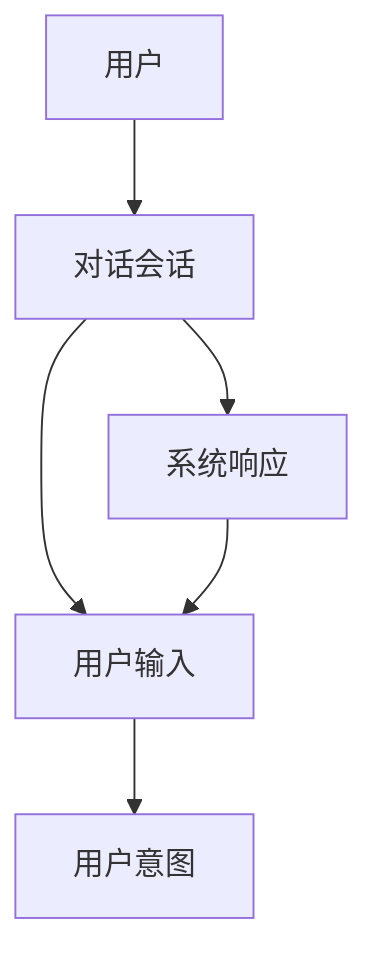
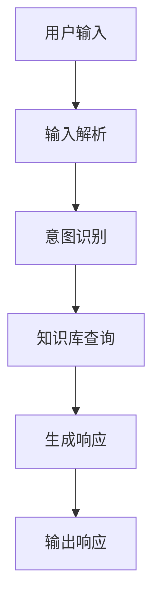
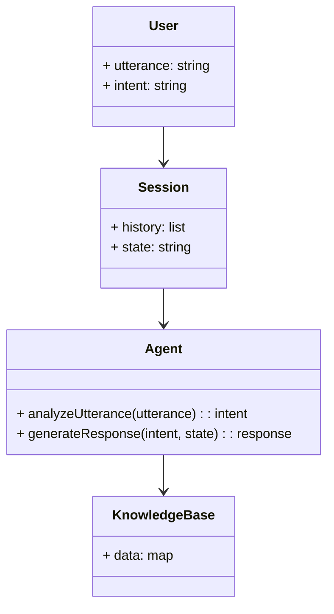
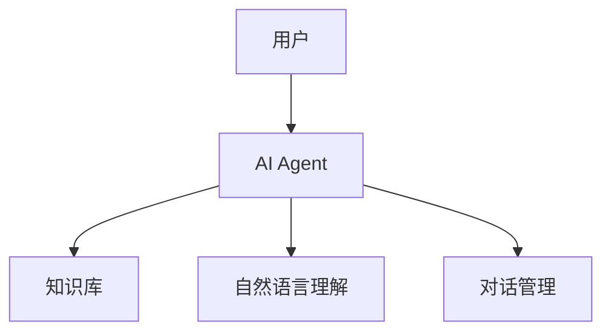
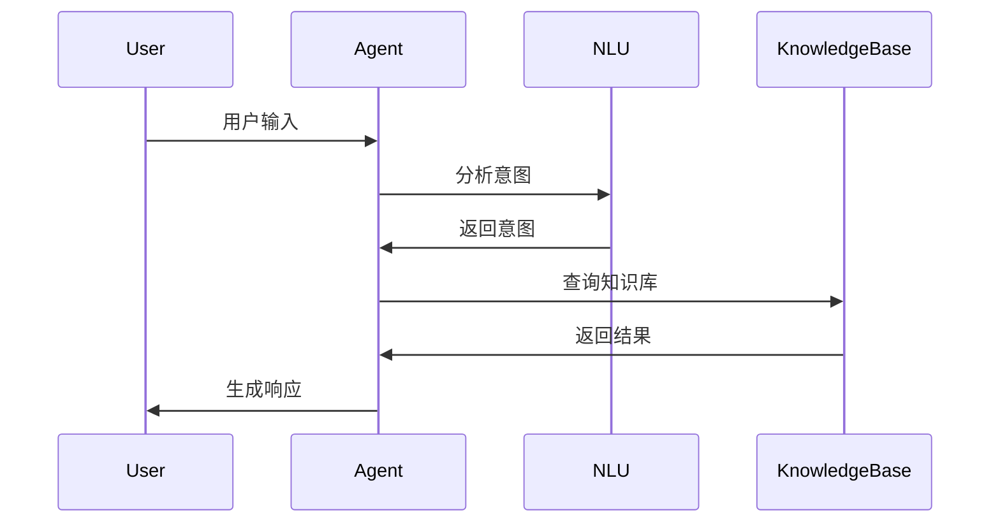

                 


# AI Agent的对话系统在智能客服中的进阶应用

> 关键词：AI Agent，对话系统，智能客服，自然语言处理，深度学习，算法原理

> 摘要：本文详细探讨了AI Agent对话系统在智能客服中的进阶应用，从背景介绍、核心概念、算法原理、数学模型、系统架构设计、项目实战到总结与展望，全面解析了AI Agent在智能客服中的技术实现与应用场景。通过本文，读者将深入了解AI Agent对话系统的原理、算法流程、数学模型以及实际应用中的最佳实践。

---

## 第一部分: 背景介绍

### 第1章: 背景介绍

#### 1.1 问题背景与描述

##### 1.1.1 传统客服系统的局限性
传统的客服系统主要依赖人工坐席，存在以下问题：
- **效率低下**：人工坐席无法同时处理多个请求，尤其是在高峰期，用户等待时间长。
- **一致性差**：不同坐席的知识掌握程度不同，导致服务不一致。
- **成本高昂**：需要大量人工坐席，人力成本高昂。

##### 1.1.2 AI Agent的出现与意义
AI Agent（人工智能代理）的出现，为智能客服带来了革命性的变化：
- **7×24小时服务**：AI Agent可以全天候为用户提供服务，无需休息。
- **高效处理**：通过自然语言处理技术，AI Agent可以快速理解用户需求，并提供准确的解决方案。
- **一致性服务**：AI Agent基于统一的知识库提供服务，确保所有用户都能得到一致的服务体验。

##### 1.1.3 智能客服的定义与目标
智能客服是指利用AI技术实现自动化服务的系统，其目标是通过智能化手段提高服务效率、降低成本，并提供更优质的服务体验。

#### 1.2 问题解决与边界

##### 1.2.1 AI Agent对话系统的解决方案
AI Agent对话系统通过以下方式解决智能客服问题：
- **自然语言理解（NLU）**：准确理解用户意图。
- **对话管理（DM）**：根据上下文生成合理的对话流程。
- **知识库查询**：基于用户需求快速检索相关信息。

##### 1.2.2 系统的边界与外延
AI Agent对话系统的边界包括：
- **输入**：用户输入的文本或语音。
- **输出**：系统生成的响应文本或语音。
- **知识库**：系统依赖的知识库，包括产品信息、FAQ等。

##### 1.2.3 核心概念与组成要素
AI Agent对话系统的核心概念包括：
- **用户意图**：用户希望通过对话实现的目标。
- **上下文**：对话的历史记录，用于理解当前对话的背景。
- **知识库**：系统用来回答问题的知识存储。

---

## 第二部分: 核心概念与联系

### 第2章: 核心概念与联系

#### 2.1 对话系统与AI Agent的原理

##### 2.1.1 对话系统的定义与特点
对话系统是一种能够与用户进行自然语言交互的系统，其特点包括：
- **自然性**：能够理解并生成自然语言。
- **交互性**：支持多轮对话。
- **适应性**：能够根据对话上下文调整响应。

##### 2.1.2 AI Agent的核心原理
AI Agent的核心原理包括：
- **感知**：通过传感器或输入接口获取信息。
- **决策**：基于知识库和推理引擎做出决策。
- **行动**：通过输出接口执行动作。

##### 2.1.3 对话系统与AI Agent的关系
对话系统是AI Agent的重要组成部分，AI Agent通过对话系统与用户进行交互。

#### 2.2 核心概念对比表

##### 2.2.1 对话系统与传统客服的对比
| 对比维度 | 对话系统 | 传统客服 |
|----------|----------|----------|
| 处理能力 | 支持多轮对话，自动理解意图 | 单一请求处理，依赖人工 |
| 可用性 | 7×24小时可用 | 有限的工作时间 |
| 成本 | 低 | 高 |

##### 2.2.2 AI Agent与规则引擎的对比
| 对比维度 | AI Agent | 规则引擎 |
|----------|----------|----------|
| 决策方式 | 基于机器学习模型 | 基于预定义规则 |
| 复杂性 | 高 | 低 |
| 灵活性 | 高 | 中 |

##### 2.2.3 对话树与知识图谱的对比
| 对比维度 | 对话树 | 知识图谱 |
|----------|--------|----------|
| 表达方式 | 树状结构 | 图结构 |
| 应用场景 | 简单对话流程 | 复杂知识关联 |
| 可扩展性 | 低 | 高 |

#### 2.3 ER实体关系图



---

## 第三部分: 算法原理讲解

### 第3章: 算法原理讲解

#### 3.1 对话系统的算法原理

##### 3.1.1 基于规则的对话系统
基于规则的对话系统通过预定义的规则来生成响应，适用于简单场景。

##### 3.1.2 基于统计的对话系统
基于统计的对话系统通过统计学习生成概率模型，适用于复杂场景。

##### 3.1.3 基于深度学习的对话系统
基于深度学习的对话系统通过神经网络模型（如Transformer）生成响应，效果更自然。

#### 3.2 AI Agent的算法流程

##### 3.2.1 输入处理与解析
- **输入解析**：将用户输入转化为结构化的数据。
- **意图识别**：识别用户的意图。

##### 3.2.2 状态管理与上下文跟踪
- **上下文管理**：记录对话历史。
- **状态更新**：根据对话进展更新状态。

##### 3.2.3 响应生成与输出
- **知识库查询**：基于意图查询知识库。
- **响应生成**：生成自然语言响应。

#### 3.3 算法流程图



---

## 第四部分: 数学模型与公式

### 第4章: 数学模型与公式

#### 4.1 对话系统的概率模型

##### 4.1.1 贝叶斯定理
贝叶斯定理用于计算条件概率：
$$ P(A|B) = \frac{P(B|A)P(A)}{P(B)} $$

##### 4.1.2 马尔可夫链
马尔可夫链用于建模状态转移：
$$ P(x_t | x_{t-1}) $$

#### 4.2 AI Agent的优化算法

##### 4.2.1 随机梯度下降
随机梯度下降用于优化模型参数：
$$ \theta = \theta - \eta \nabla L(\theta) $$

---

## 第五部分: 系统分析与架构设计

### 第5章: 系统分析与架构设计

#### 5.1 问题场景介绍

##### 5.1.1 用户需求分析
- 用户希望通过对话系统解决常见问题。
- 用户希望获得快速、准确的服务。

##### 5.1.2 系统目标
- 提供高效的对话服务。
- 提供一致的服务体验。

#### 5.2 项目介绍

##### 5.2.1 项目目标
- 实现一个基于AI Agent的智能客服系统。

##### 5.2.2 项目范围
- 支持文本和语音输入。
- 支持多轮对话。

#### 5.3 系统功能设计

##### 5.3.1 领域模型


##### 5.3.2 系统架构设计


##### 5.3.3 系统接口设计
- **输入接口**：接收用户输入。
- **输出接口**：生成系统响应。

##### 5.3.4 系统交互流程


---

## 第六部分: 项目实战

### 第6章: 项目实战

#### 6.1 环境安装

##### 6.1.1 安装Python
```bash
python --version
pip install --upgrade pip
```

##### 6.1.2 安装依赖
```bash
pip install numpy
pip install scikit-learn
pip install transformers
```

#### 6.2 系统核心实现

##### 6.2.1 对话系统实现
```python
class DialogSystem:
    def __init__(self, knowledge_base):
        self.knowledge_base = knowledge_base
        self.state = "idle"

    def process_input(self, utterance):
        intent = self._analyzeUtterance(utterance)
        response = self._generateResponse(intent)
        return response

    def _analyzeUtterance(self, utterance):
        # 实现意图识别逻辑
        pass

    def _generateResponse(self, intent):
        # 实现响应生成逻辑
        pass
```

##### 6.2.2 AI Agent实现
```python
class AI_Agent:
    def __init__(self, knowledge_base):
        self.knowledge_base = knowledge_base
        self.session_state = {}

    def handle_dialog(self, user_id, utterance):
        session = self.session_state.get(user_id, {})
        intent = self._analyzeUtterance(utterance)
        response = self._generateResponse(intent, session)
        self.session_state[user_id] = session
        return response

    def _analyzeUtterance(self, utterance):
        # 实现意图识别逻辑
        pass

    def _generateResponse(self, intent, session):
        # 实现响应生成逻辑
        pass
```

#### 6.3 实际案例分析

##### 6.3.1 案例描述
用户输入：“我忘记了我的密码。”

##### 6.3.2 系统响应
系统查询知识库并生成响应：“请提供您的注册邮箱，我们将为您重置密码。”

---

## 第七部分: 总结与展望

### 第7章: 总结与展望

#### 7.1 内容总结
本文详细介绍了AI Agent对话系统在智能客服中的应用，涵盖了背景、核心概念、算法原理、系统架构设计以及项目实战等内容。

#### 7.2 未来展望
未来，AI Agent对话系统将在智能客服中发挥更大的作用，包括：
- **多模态交互**：支持文本、语音、图像等多种交互方式。
- **自适应学习**：通过反馈机制不断优化对话系统。
- **跨领域应用**：在金融、医疗等领域实现更复杂的对话流程。

---

## 作者：AI天才研究院/AI Genius Institute & 禅与计算机程序设计艺术 /Zen And The Art of Computer Programming

