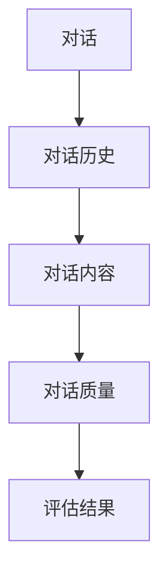
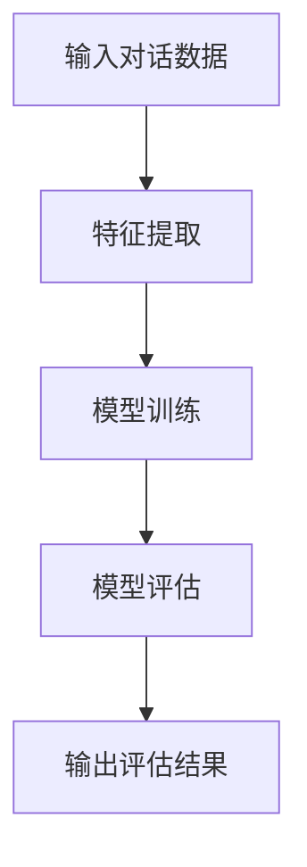
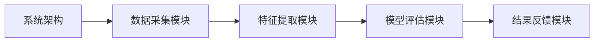

                 


# AI Agent的对话质量评估体系设计

## 关键词：AI Agent, 对话质量评估, 自然语言处理, 评估体系, 技术设计

## 摘要：本文系统地探讨了AI Agent对话质量评估体系的设计，从背景、核心概念、算法原理到系统架构，再到项目实战，全面解析了对话质量评估的重要性及其实现方法。文章通过详细的理论分析和实际案例，展示了如何构建高效、准确的对话质量评估体系，为AI Agent的优化和应用提供了重要参考。

---

# 第一部分: AI Agent对话质量评估体系的背景与核心概念

## 第1章: 对话质量评估体系的背景与问题描述

### 1.1 对话质量评估的定义与重要性

对话质量评估是对AI Agent生成的对话内容进行分析，以衡量其在相关性、流畅性、准确性和情感一致性等方面的优劣。其重要性体现在提升用户体验、优化对话系统性能以及增强AI Agent的智能性上。

- **相关性**：对话内容是否与用户需求高度相关。
- **流畅性**：对话是否自然连贯。
- **准确性**：回答是否正确无误。
- **情感一致性**：对话是否符合情感预期。

### 1.2 AI Agent的定义与特点

AI Agent是一种智能体，能够感知环境并采取行动以实现目标。其特点包括自主性、反应性、目标导向和社会能力。

- **自主性**：无需外部干预，自主决策。
- **反应性**：能实时响应用户输入。
- **目标导向**：根据目标调整行为。
- **社会能力**：能与人类或其他智能体有效交互。

### 1.3 对话质量评估的必要性与应用场景

对话质量评估的必要性在于提升用户体验，优化系统性能。应用场景包括客服、教育、医疗等领域。

- **客服领域**：提升客户满意度。
- **教育领域**：提高教学效果。
- **医疗领域**：确保医疗建议的准确性。

---

## 第2章: 对话质量评估的核心概念与联系

### 2.1 对话质量评估的关键指标

| 指标 | 定义 | 重要性 | 示例 |
|------|------|--------|------|
| 相关性 | 对话内容与用户需求的匹配程度 | 高 | 用户询问天气，回答相关天气信息。 |
| 流畅性 | 对话的连贯性和自然性 | 高 | 对话过程中的逻辑衔接。 |
| 准确性 | 对话内容的正确性 | 高 | 医疗建议的准确性。 |
| 情感一致性 | 对话情感与用户情感的匹配程度 | 中 | 情感支持对话中的情感一致。 |

### 2.2 对话质量评估模型的构建要素

- **数据采集与处理**：收集对话数据，清洗和预处理。
- **特征提取与表示**：提取语义、语法等特征，转换为向量表示。
- **模型训练与优化**：使用机器学习或深度学习模型进行训练，优化模型参数。
- **模型评估与调优**：通过验证集评估模型性能，调整超参数。

### 2.3 对话质量评估的实体关系图



---

# 第二部分: 对话质量评估的算法原理

## 第3章: 对话质量评估的算法原理

### 3.1 对话质量评估算法的流程图



### 3.2 对话质量评估的数学模型

#### 线性加权模型

$$
\text{评估分数} = w_1 \times \text{相关性} + w_2 \times \text{流畅性} + w_3 \times \text{准确性} + w_4 \times \text{情感一致性}
$$

其中，$w_i$ 是各指标的权重，需通过训练数据优化得出。

#### 对数几率回归模型

$$
P(\text{高分}) = \frac{1}{1 + e^{-\beta x}}
$$

其中，$\beta$ 是模型参数，$x$ 是特征向量。

---

# 第三部分: 对话质量评估的系统架构设计

## 第4章: 对话质量评估系统分析与架构设计

### 4.1 问题场景介绍

对话质量评估系统需处理大规模对话数据，支持多种评估指标，并提供实时反馈。

### 4.2 系统功能设计

- **数据采集模块**：收集对话数据。
- **特征提取模块**：提取对话特征。
- **模型评估模块**：评估对话质量。
- **结果反馈模块**：输出评估结果。

### 4.3 系统架构设计



### 4.4 系统接口设计

- **输入接口**：接收对话数据。
- **输出接口**：输出评估结果。
- **API接口**：提供远程调用功能。

---

## 第5章: 对话质量评估体系的项目实战

### 5.1 环境安装与配置

- **Python**：安装最新版本。
- **Numpy和Scikit-learn**：用于数据处理和机器学习。
- **Transformers库**：用于自然语言处理。

### 5.2 系统核心代码实现

```python
import numpy as np
from sklearn.metrics import accuracy_score

# 特征提取
def extract_features(dialogue):
    # 示例：提取关键词特征
    features = []
    for d in dialogue:
        features.append([len(d['tokens']), d['sentiment']])
    return np.array(features)

# 模型训练
def train_model(features, labels):
    from sklearn.linear_model import LogisticRegression
    model = LogisticRegression()
    model.fit(features, labels)
    return model

# 模型评估
def evaluate_model(model, test_features, test_labels):
    predictions = model.predict(test_features)
    accuracy = accuracy_score(test_labels, predictions)
    print(f"评估准确率：{accuracy}")
```

### 5.3 实际案例分析

以客服对话为例，评估系统能准确识别对话的相关性和流畅性，提升客户满意度。

---

## 第6章: 对话质量评估体系的最佳实践

### 6.1 小结

对话质量评估体系的构建需综合考虑数据、算法和系统架构，确保评估结果的准确性和实用性。

### 6.2 注意事项

- 数据质量：确保数据的多样性和代表性。
- 模型调优：优化模型参数，提升性能。
- 实际应用：结合具体场景，调整评估指标。

### 6.3 拓展阅读

- 《机器学习实战》
- 《深度学习入门》
- 《自然语言处理入门》

---

# 作者：AI天才研究院/AI Genius Institute & 禅与计算机程序设计艺术 /Zen And The Art of Computer Programming

---

本文系统地探讨了AI Agent对话质量评估体系的设计，从背景、核心概念、算法原理到系统架构，再到项目实战，全面解析了对话质量评估的重要性及其实现方法。通过详细的理论分析和实际案例，展示了如何构建高效、准确的对话质量评估体系，为AI Agent的优化和应用提供了重要参考。

