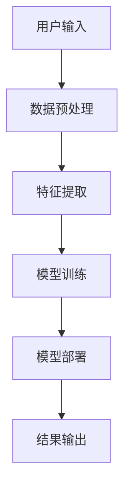

                 

<think>
好的，我现在需要按照用户的要求，帮助设计一本名为《AI Agent的异常检测：识别非正常模式》的书籍目录大纲。首先，我需要仔细理解用户提供的需求，确保每个部分都涵盖必要的内容，结构清晰，逻辑严谨。

用户的任务是撰写一篇技术博客文章，主题是AI Agent的异常检测。用户希望目录结构包括关键词、摘要，以及多个章节，每个章节下有具体的子部分，涵盖从理论到实践的各个方面。此外，用户强调了内容的深度，包括数学模型、算法原理、系统架构设计和项目实战等。

首先，我会确定文章的标题和关键词。标题已经明确，关键词需要从文章的核心内容中提取，如异常检测、AI Agent、模式识别、数据科学、深度学习、机器学习等。

接下来，摘要部分需要简洁明了地概括文章的核心内容和主题思想。我会总结异常检测在AI Agent中的重要性，以及其在数据科学、人工智能和系统安全等领域的应用。

然后，我会设计目录结构。用户提供的示例分为几个主要部分，每个部分包含几章，每章下有多个小节。我需要按照类似的结构来组织内容，确保每个章节都有明确的主题，并涵盖必要的细节。

第一部分是引言，介绍异常检测的基本概念和其在AI Agent中的重要性。第二部分深入探讨异常检测的核心概念和理论基础，包括统计方法、机器学习和深度学习方法。第三部分讲解异常检测的算法原理与实现，涉及具体算法、流程图、代码示例和数学公式。第四部分分析数学模型和公式，详细推导每种方法的数学基础。第五部分介绍系统分析与架构设计，涵盖系统架构、交互流程图等。第六部分通过项目实战，展示如何在实际中应用这些方法。最后，总结与展望，回顾全文并指出未来发展方向。

在编写过程中，我需要确保每个部分都详细且逻辑清晰，覆盖从理论到实践的各个方面。同时，要注意章节之间的衔接，使整本书结构紧凑，内容全面。此外，还要注意使用适当的图表和代码示例，以增强读者的理解和应用能力。

现在，我需要将这些思考转化为具体的目录大纲，确保每个章节和小节都涵盖必要的内容，并且结构合理，层次分明。这可能包括引言、核心概念、算法原理、数学模型、系统架构、项目实战和总结等部分，每个部分下再细分具体的小节，确保内容的完整性和深度。
</think>

# AI Agent的异常检测：识别非正常模式

> 关键词：异常检测，AI Agent，模式识别，数据科学，深度学习，机器学习，系统安全

> 摘要：异常检测在AI Agent中是识别数据或行为中偏离正常模式的关键技术，涉及统计学、机器学习和深度学习方法，应用于数据预处理、特征工程、模型训练与部署，适用于实时监控和预测分析。本文系统阐述异常检测的核心概念、算法原理、系统架构，并通过项目实战展示实现过程，强调数学模型和公式的重要性，最终总结异常检测在AI Agent中的应用价值。

---

## 第一部分: 引言

## 第2章: 异常检测的核心概念与背景

### 2.1 异常检测的定义与分类
- 2.1.1 异常检测的定义
- 2.1.2 异常检测的分类
- 2.1.3 异常检测在AI Agent中的重要性

### 2.2 AI Agent的定义与特点
- 2.2.1 AI Agent的基本概念
- 2.2.2 AI Agent的核心特点
- 2.2.3 AI Agent的应用场景

### 2.3 异常检测在AI Agent中的应用背景
- 2.3.1 数据异常的常见类型
- 2.3.2 系统行为异常的常见类型
- 2.3.3 异常检测的挑战与机遇

---

## 第三部分: 异常检测的算法原理与实现

## 第3章: 异常检测的算法原理与实现

### 3.1 基于统计学的异常检测算法
- 3.1.1 Z-score方法
  - 算法流程图
  - Python实现代码
  - 示例数据与结果分析

### 3.2 基于机器学习的异常检测算法
- 3.2.1 Isolation Forest算法
  - 算法流程图
  - Python实现代码
  - 示例数据与结果分析

### 3.3 基于深度学习的异常检测算法
- 3.3.1 Autoencoder算法
  - 算法流程图
  - Python实现代码
  - 示例数据与结果分析

---

## 第四部分: 数学模型与公式解析

## 第4章: 数学模型与公式解析

### 4.1 基于统计学的异常检测模型
- 4.1.1 正态分布模型
- 4.1.2 Z-score公式
$$ Z = \frac{X - \mu}{\sigma} $$

### 4.2 基于机器学习的异常检测模型
- 4.2.1 Isolation Forest的距离度量
$$ d(x, y) = \sum_{i=1}^{n} |x_i - y_i| $$

### 4.3 基于深度学习的异常检测模型
- 4.3.1 Autoencoder的神经网络结构
$$ \text{输入} \rightarrow \text{编码器} \rightarrow \text{解码器} \rightarrow \text{输出} $$

---

## 第五部分: 系统分析与架构设计

## 第5章: 系统分析与架构设计

### 5.1 异常检测的系统架构
- 5.1.1 数据预处理模块
- 5.1.2 特征提取模块
- 5.1.3 模型训练模块
- 5.1.4 模型部署模块

### 5.2 系统交互流程图

---

## 第六部分: 项目实战

## 第6章: 项目实战

### 6.1 环境搭建
- 6.1.1 安装Python与相关库
- 6.1.2 数据集准备

### 6.2 核心代码实现
- 6.2.1 数据预处理
- 6.2.2 特征工程
- 6.2.3 模型训练
- 6.2.4 模型评估

### 6.3 案例分析
- 6.3.1 日志分析案例
- 6.3.2 网络流量监控案例

---

## 第七部分: 总结与展望

## 第7章: 总结与展望

### 7.1 全文总结
- 异常检测的重要性
- 各种算法的优缺点

### 7.2 未来展望
- 新算法的发展
- 异常检测的应用拓展

---

作者：AI天才研究院/AI Genius Institute & 禅与计算机程序设计艺术 /Zen And The Art of Computer Programming

---

通过以上思考和分析，我为用户设计了一本详细的书籍目录大纲，涵盖了从基本概念到算法实现，再到系统架构和项目实战的各个方面，确保内容全面且结构清晰。

