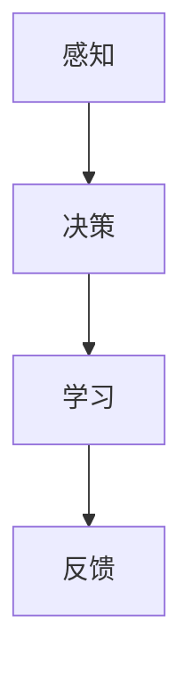
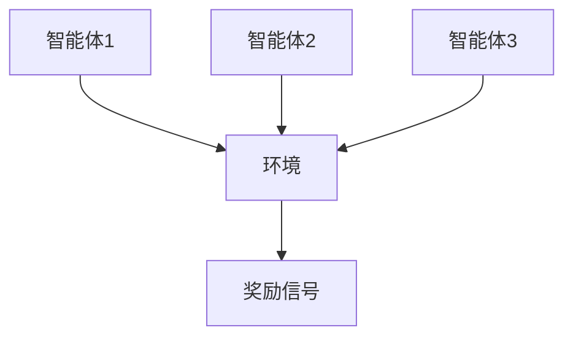

                 


# AI Agent的强化学习在复杂环境中的应用

> 关键词：AI Agent，强化学习，复杂环境，马尔可夫决策过程，深度强化学习，分布式系统

> 摘要：本文深入探讨了AI Agent在复杂环境中的强化学习应用，从理论基础到算法实现，再到系统设计和项目实战，全面解析了强化学习在复杂环境中的挑战与解决方案。通过详细分析DQN、PPO等核心算法，结合实际案例，展示了如何在复杂环境中构建高效AI代理。文章还探讨了前沿技术，为读者提供了全面的视角和实践指导。

---

## 第1章 AI Agent与强化学习概述

### 1.1 AI Agent的基本概念

#### 1.1.1 AI Agent的定义与特点
- **定义**：AI Agent（智能体）是指在环境中能够感知并自主行动以实现目标的实体。
- **特点**：
  - **自主性**：无需外部干预，自主决策。
  - **反应性**：能够实时感知环境并做出反应。
  - **目标导向性**：所有行动都以实现目标为导向。
  - **社会性**：能够在多智能体环境中协作或竞争。

#### 1.1.2 强化学习的基本概念
- **强化学习**：一种通过试错机制，智能体在环境中通过与环境交互，学习最优策略以最大化累积奖励的方法。
- **核心要素**：
  - **状态（State）**：环境在某一时刻的表示。
  - **动作（Action）**：智能体在某一状态下做出的行为。
  - **奖励（Reward）**：智能体执行动作后获得的反馈，用于指导学习方向。
  - **策略（Policy）**：智能体在不同状态下选择动作的概率分布。
  - **价值函数（Value Function）**：衡量某个状态下或策略下的期望累积奖励。

#### 1.1.3 复杂环境中的AI Agent应用
- **复杂环境**：具有高维状态空间、动态变化、部分可观察性或多个智能体协作/竞争的环境。
- **应用场景**：
  - **游戏AI**：如围棋、MOBA游戏中的智能体。
  - **机器人控制**：如自动驾驶、工业机器人。
  - **智能推荐系统**：根据用户行为动态调整推荐策略。

---

## 第2章 强化学习的数学基础

### 2.1 马尔可夫决策过程（MDP）

#### 2.1.1 MDP的定义与数学模型
- **定义**：MDP是一种描述决策过程的数学模型，假设环境具有马尔可夫性质，即当前状态足以决定未来的状态。
- **数学模型**：
  - **状态空间**：$S$，离散或连续。
  - **动作空间**：$A$，离散或连续。
  - **转移概率**：$P(s'|s,a)$，执行动作$a$后从状态$s$转移到状态$s'$的概率。
  - **奖励函数**：$R(s,a)$，执行动作$a$在状态$s$时获得的奖励。

#### 2.1.2 状态转移概率矩阵
- **表示**：将所有状态和动作的转移概率表示为矩阵形式。
- **示例**：
  - 状态数为$n$，动作数为$m$，转移概率矩阵$P$的大小为$n \times m \times n$。

#### 2.1.3 奖励函数的数学表达
- **累积奖励**：$R_{total} = \sum_{t=0}^{\infty} \gamma^t R(s_t,a_t)$，其中$\gamma$为折扣因子。
- **目标**：最大化累积奖励。

### 2.2 Q-learning算法

#### 2.2.1 Q-learning的数学推导
- **Q值更新公式**：$Q(s,a) = (1-\alpha)Q(s,a) + \alpha [R + \gamma \max_{a'} Q(s',a')]$。
- **参数解释**：
  - $\alpha$：学习率。
  - $\gamma$：折扣因子。

#### 2.2.2 动态规划与策略迭代
- **动态规划**：基于当前状态和动作的Q值更新未来状态的Q值。
- **策略迭代**：通过反复评估和改进策略来逼近最优策略。

#### 2.2.3 Q-learning的收敛性分析
- **收敛条件**：在离散状态下，Q-learning在探索率$\epsilon$逐渐减小的情况下，Q值会收敛到最优值。

---

## 第3章 复杂环境下的强化学习挑战

### 3.1 复杂环境的特性

#### 3.1.1 高维状态空间的处理
- **挑战**：高维状态空间导致状态数量爆炸，难以直接建模。
- **解决方案**：使用深度神经网络近似价值函数或策略。

#### 3.1.2 多智能体协作与竞争
- **挑战**：多个智能体之间的协作与竞争增加了环境的复杂性。
- **解决方案**：使用分布式强化学习算法，如MADE、MADDPG。

#### 3.1.3 动态变化环境的应对
- **挑战**：环境状态和转移概率动态变化，导致传统强化学习难以适应。
- **解决方案**：使用自适应策略或元学习。

### 3.2 强化学习算法的改进

#### 3.2.1 增量式Q-learning的优化
- **改进点**：通过引入增量式更新减少计算量。
- **数学表达**：$\Delta Q(s,a) = \alpha [R + \gamma \max Q(s',a') - Q(s,a)]$。

#### 3.2.2 策略梯度方法的改进
- **改进点**：通过优化策略直接更新，避免值函数近似。
- **算法**：REINFORCE算法，基于梯度的策略优化。

#### 3.2.3 分布式强化学习的实现
- **实现方式**：将智能体分布在多个计算节点上，通过分布式计算加速学习过程。
- **优势**：提高并行计算能力，适合大规模复杂环境。

---

## 第4章 AI Agent的核心算法实现

### 4.1 DQN算法的实现

#### 4.1.1 DQN的网络结构设计
- **网络结构**：
  - **输入层**：接收环境状态。
  - **隐藏层**：多个全连接层，提取状态特征。
  - **输出层**：输出每个动作的Q值。

#### 4.1.2 经验回放机制的实现
- **经验回放池**：存储历次交互的经验，包括状态、动作、奖励和新状态。
- **经验回放过程**：随机抽取小批量经验用于网络训练。

#### 4.1.3 深度网络的训练流程
- **训练步骤**：
  1. 从经验回放池中随机抽取小批量经验。
  2. 使用当前网络计算目标网络的Q值。
  3. 计算损失函数并反向传播更新当前网络。

### 4.2 策略梯度方法的实现

#### 4.2.1 REINFORCE算法的原理
- **原理**：通过采样策略直接优化策略，计算策略的梯度并更新参数。
- **数学表达**：$\nabla \theta = \sum_{t=1}^{T} \nabla \log \pi_\theta(a_t|s_t) Q(s_t,a_t)$。

#### 4.2.2 Actor-Critic架构的设计
- **架构**：
  - **Actor**：负责生成动作，基于策略梯度更新。
  - **Critic**：负责评估状态-动作对的价值，基于值函数更新。

#### 4.2.3 策略梯度的数学推导
- **推导**：通过最大化期望奖励的梯度更新策略参数。

---

## 第5章 复杂环境中的系统架构设计

### 5.1 系统功能设计

#### 5.1.1 系统功能模块划分
- **模块划分**：
  - **感知模块**：接收环境输入，提取特征。
  - **决策模块**：基于强化学习算法生成动作。
  - **学习模块**：更新模型参数以优化策略。
  - **反馈模块**：接收奖励信号并调整学习过程。

#### 5.1.2 系统功能流程图


### 5.2 系统架构设计

#### 5.2.1 系统架构图


#### 5.2.2 系统功能的实现步骤
1. **环境建模**：根据具体场景构建环境模型。
2. **智能体初始化**：定义智能体的初始状态和参数。
3. **交互与学习**：智能体与环境交互，更新模型参数。
4. **策略优化**：基于累积奖励优化策略。

---

## 第6章 项目实战

### 6.1 智能交通系统案例

#### 6.1.1 环境搭建
- **工具**：使用OpenAI Gym或其他交通仿真工具。
- **环境定义**：定义交通灯、车辆、行人等元素的状态和动作。

#### 6.1.2 算法实现
- **选择算法**：基于DQN或PPO实现交通信号控制。
- **代码示例**：
  ```python
  class DQN:
      def __init__(self, state_space, action_space):
          self.state_space = state_space
          self.action_space = action_space
          self.model = self.build_model()
      
      def build_model(self):
          # 定义神经网络结构
          pass
      
      def act(self, state):
          # 根据当前状态选择动作
          pass
      
      def train(self, experiences):
          # 更新神经网络
          pass
  ```

#### 6.1.3 实验结果与分析
- **结果展示**：训练过程中累积奖励的变化曲线。
- **结果分析**：智能体在复杂环境中的适应能力和优化效果。

---

## 第7章 强化学习的前沿技术

### 7.1 元学习与自适应策略

#### 7.1.1 元学习的定义
- **定义**：通过学习如何学习，快速适应新任务。

#### 7.1.2 自适应策略的应用
- **应用**：在动态变化环境中，智能体能够快速调整策略。

### 7.2 多智能体协作的前沿进展

#### 7.2.1 分布式强化学习
- **实现方式**：多个智能体协同学习，共享经验或参数。
- **优势**：提高并行计算能力和适应性。

---

## 第8章 总结与展望

### 8.1 核心内容回顾
- **总结**：AI Agent的强化学习在复杂环境中的应用涉及算法优化、系统设计和实际案例。
- **展望**：未来发展方向包括元学习、自适应策略和多智能体协作。

### 8.2 未来研究方向
- **方向1**：研究更高效的算法，如元学习和自适应策略。
- **方向2**：探索多智能体协作的新型架构和算法。
- **方向3**：结合其他技术，如生成式AI和边缘计算，提升AI Agent的性能。

---

## 作者信息

作者：AI天才研究院/AI Genius Institute  
联系邮箱：contact@aicourse.com  
官网：https://www.aicourse.com  
知乎：https://www.zhihu.com/people/aicourse  
GitHub：https://github.com/aicourse

