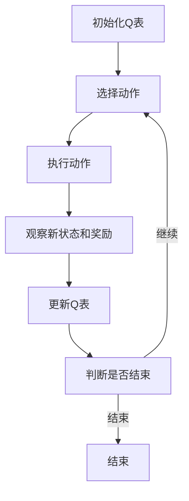
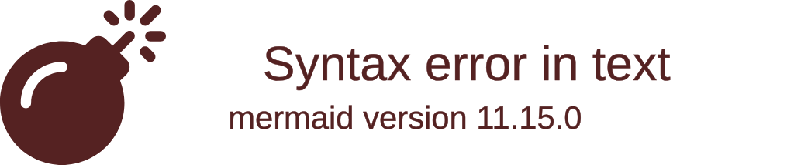
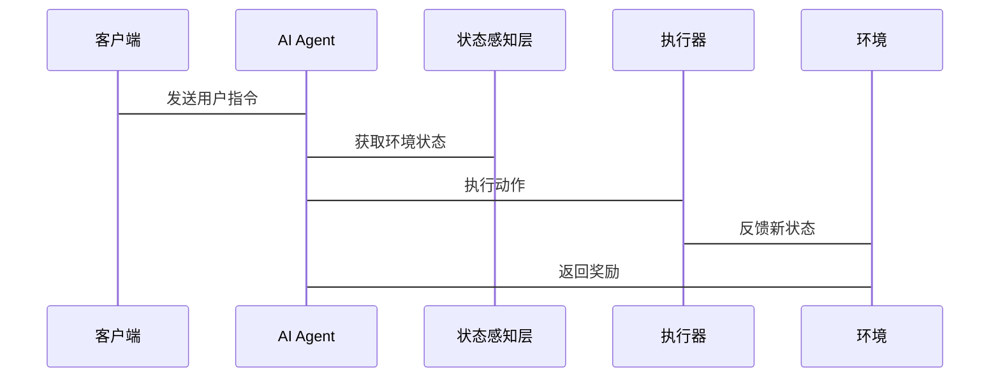

                 

<think>
嗯，用户现在需要我根据他们提供的目录大纲撰写一篇完整的关于《AI Agent的强化学习在智能家居控制中的应用》的技术博客文章。用户已经详细列出了结构和各章节的内容，我需要按照他们的要求逐步完成。

首先，我得确定文章的标题和关键词。标题已经给出是《AI Agent的强化学习在智能家居控制中的应用》，关键词包括AI Agent、强化学习、智能家居、控制应用、算法实现、系统架构、项目实战。摘要部分需要简明扼要地概括文章的核心内容，说明AI Agent和强化学习在智能家居中的应用，以及文章的结构安排。

接下来是正文部分。第一部分是AI Agent与强化学习的基础。第一章需要介绍AI Agent和强化学习的基本概念，包括它们的定义、特点，以及在智能家居中的应用背景。这里要确保读者能够理解这些概念，并且能够联系到智能家居的实际场景。

第二章深入讲解强化学习的数学模型与算法原理，重点介绍Q-learning和DQN算法，包括它们的数学公式和流程图。这部分需要详细推导公式，用Mermaid绘制流程图，帮助读者理解算法的运作机制。

第三章讨论智能家居控制系统的强化学习建模，包括需求分析、系统架构设计和模型构建。这里需要使用Mermaid绘制系统架构图和交互流程图，展示各组件之间的关系和交互过程。

第四章详细描述智能家居控制系统的架构设计，包括分层架构、接口设计和交互流程。这部分同样需要使用Mermaid图来展示系统架构和交互流程。

第五章是项目实战，介绍如何实现智能家居控制系统，包括环境安装、代码实现和案例分析。需要提供Python代码示例，并详细解释代码的功能和实现细节。

最后，总结与展望部分要回顾文章的主要内容，并展望未来的发展方向。同时，加入一些注意事项和最佳实践，帮助读者更好地理解和应用所学知识。

在撰写过程中，我需要确保每一部分内容详实，逻辑清晰，同时使用专业但易懂的语言。数学公式要用LaTeX格式，Mermaid图表要准确无误，代码部分要注释清晰，方便读者理解和实现。

考虑到用户是技术专家，文章需要有一定的深度，同时兼顾实用性和可读性。因此，在每个章节中，我都会结合实际案例和应用场景，帮助读者更好地理解理论知识。

现在，我需要按照目录大纲的顺序，逐一完成每一部分的内容，确保文章结构完整，内容详实。同时，注意文章的整体流畅性，让读者能够顺畅地从基础概念过渡到算法实现，再到实际应用。

总的来说，这是一篇结构严谨、内容详实的技术博客文章，旨在深入探讨AI Agent的强化学习在智能家居控制中的应用，帮助读者掌握相关理论和实践技能。
</think>

# AI Agent的强化学习在智能家居控制中的应用

> 关键词：AI Agent，强化学习，智能家居，控制应用，算法实现，系统架构，项目实战

> 摘要：本文深入探讨了AI Agent结合强化学习在智能家居控制系统中的应用，从基础概念到算法实现，再到系统架构设计和项目实战，全面解析了如何利用强化学习优化智能家居的控制策略。文章通过详细的理论分析、算法推导和实际案例，展示了AI Agent在智能家居中的巨大潜力和实际应用价值。

---

# 第1章: AI Agent与强化学习概述

## 1.1 AI Agent的基本概念

### 1.1.1 AI Agent的定义与特点
AI Agent（人工智能代理）是指在计算机系统中，能够感知环境并采取行动以实现目标的实体。AI Agent可以是软件程序、机器人或其他智能设备。其核心特点包括：
- **自主性**：能够在没有外部干预的情况下自主决策。
- **反应性**：能够根据环境的变化实时调整行为。
- **目标导向性**：所有行为都以实现特定目标为导向。
- **学习能力**：通过与环境的交互不断优化自身的策略。

### 1.1.2 强化学习的基本原理
强化学习是一种机器学习范式，通过智能体与环境的交互来学习最优策略。智能体通过执行动作，观察环境反馈的状态和奖励，逐步优化自身的策略以最大化累计奖励。

### 1.1.3 AI Agent在智能家居中的应用背景
智能家居是指通过物联网技术将家中的设备（如灯光、空调、安防设备等）连接起来，实现智能化管理的系统。AI Agent可以通过强化学习算法优化智能家居的控制策略，例如：
- **能源优化**：通过学习用户的用电习惯，实现能源的智能分配和节省。
- **舒适度优化**：根据用户的行为模式，自动调节室温、照明等，提升居住舒适度。
- **安全监控**：通过实时监控家庭环境，发现异常情况并采取相应措施。

---

## 1.2 强化学习的核心概念

### 1.2.1 状态、动作、奖励的定义
在强化学习中：
- **状态（State）**：环境在某一时刻的描述，例如当前的室温、时间、用户行为等。
- **动作（Action）**：智能体在某一状态下选择的行为，例如“打开空调”或“关闭灯光”。
- **奖励（Reward）**：智能体执行动作后，环境给予的反馈，用于指导智能体的行为。例如，当智能体成功调节室温到舒适范围时，会获得正向奖励。

### 1.2.2 Q-learning算法的基本原理
Q-learning是一种经典的强化学习算法，适用于离散状态和动作空间的问题。其核心思想是通过构建Q值表（Q-table）来记录每个状态-动作对的期望奖励，逐步逼近最优策略。

### 1.2.3 策略与价值函数的对比
- **策略（Policy）**：定义了智能体在每个状态下选择动作的概率分布，直接指导智能体的行为。
- **价值函数（Value Function）**：评估某个状态或状态-动作对的长期收益，帮助智能体做出更优决策。

---

## 1.3 智能家居控制的强化学习场景

### 1.3.1 智能家居环境建模
智能家居环境可以看作是一个动态的、多状态的系统。例如：
- **状态空间**：包括室温、湿度、光照强度、时间等。
- **动作空间**：包括打开/关闭设备、调节设备参数等。

### 1.3.2 状态空间与动作空间的定义
- **状态空间**：智能家居中的状态可以表示为一个向量，例如 `[温度, 湿度, 光照强度]`。
- **动作空间**：智能体可以选择的动作包括 `[打开空调, 关闭空调, 调高温度, 调低温度]`。

### 1.3.3 奖励函数的设计与应用
奖励函数的设计直接影响智能体的学习效果。例如：
- 当智能体成功将室温调节到用户舒适范围时，给予正向奖励。
- 当智能体的操作导致能源浪费时，给予负向惩罚。

---

## 1.4 本章小结
本章介绍了AI Agent和强化学习的基本概念，并结合智能家居控制场景，分析了强化学习的核心要素，包括状态、动作、奖励的设计与实现。

---

# 第2章: 强化学习的数学模型与算法原理

## 2.1 Q-learning算法的数学模型

### 2.1.1 Q-learning的更新公式
Q-learning的核心在于更新Q值表。其更新公式为：
$$
Q(s, a) = Q(s, a) + \alpha \left[r + \gamma \max_{a'} Q(s', a') - Q(s, a)\right]
$$
其中：
- $\alpha$ 是学习率，控制更新步长。
- $\gamma$ 是折扣因子，平衡当前奖励与未来奖励的重要性。
- $r$ 是当前动作获得的奖励。
- $s'$ 是执行动作后的新状态。

### 2.1.2 算法流程图（Mermaid）



---

## 2.2 Deep Q-Network（DQN）算法

### 2.2.1 DQN的网络结构
DQN通过神经网络近似Q值函数，其网络结构包括：
- 输入层：接收状态输入。
- 隐藏层：提取状态特征。
- 输出层：输出每个动作的Q值。

### 2.2.2 算法改进与优化
DQN引入经验回放和目标网络：
- **经验回放**：将历史经验存储在回放池中，随机采样以减少相关性。
- **目标网络**：通过更新目标网络参数，使Q值函数的近似更加稳定。

---

## 2.3 强化学习的数学公式推导

### 2.3.1 Q-learning的更新公式推导
假设智能体在状态$s$选择动作$a$，执行后进入状态$s'$，并获得奖励$r$。根据Q-learning的更新规则：
$$
Q(s, a) = Q(s, a) + \alpha (r + \gamma Q(s', a') - Q(s, a))
$$
其中，$a'$ 是在状态$s'$下的最优动作。

### 2.3.2 DQN的损失函数与优化
DQN的损失函数基于均方误差：
$$
\mathcal{L} = \mathcal{E}\left[ (r + \gamma Q(s', a') - Q(s, a))^2 \right]
$$
通过随机梯度下降（SGD）优化网络参数。

---

## 2.4 本章小结
本章详细推导了Q-learning和DQN算法的数学模型，并通过Mermaid流程图和公式推导，帮助读者理解强化学习的核心机制。

---

# 第3章: 智能家居控制系统的强化学习建模

## 3.1 智能家居系统的需求分析

### 3.1.1 系统功能需求
智能家居控制系统需要实现以下功能：
- 自动调节室内温度、湿度、光照强度等环境参数。
- 根据用户行为和时间调整设备状态。
- 实现能源的高效利用和安全监控。

### 3.1.2 系统性能指标
- 响应时间：智能体在接收到环境反馈后的决策时间。
- 能源效率：在满足用户需求的前提下，降低能源消耗。
- 稳定性：系统在异常情况下的自我修复能力。

---

## 3.2 系统的领域模型（Mermaid类图）

```mermaid
classDiagram
    class 状态空间 {
        室温
        湿度
        光照强度
    }
    class 动作空间 {
        打开空调
        关闭空调
        调节温度
    }
    class 奖励函数 {
        舒适奖励
        能源惩罚
    }
    状态空间 -->+ 动作空间
    动作空间 -->+ 奖励函数
```

---

## 3.3 强化学习模型的构建

### 3.3.1 状态空间的定义与编码
状态空间可以表示为一个向量：
$$
s = [\text{温度}, \text{湿度}, \text{光照强度}]
$$

### 3.3.2 动作空间的设计与实现
动作空间可以表示为一个动作列表：
$$
a = [\text{打开空调}, \text{关闭空调}, \text{调高温度}, \text{调低温度}]
$$

### 3.3.3 奖励函数的优化与调整
奖励函数需要根据实际需求进行设计。例如：
$$
r = 
\begin{cases}
    +1 & \text{如果温度在舒适范围内} \\
    -1 & \text{如果能源消耗超出预算}
\end{cases}
$$

---

## 3.4 本章小结
本章通过领域模型和状态-动作-奖励的设计，构建了智能家居控制系统的强化学习模型。

---

# 第4章: 智能家居控制系统架构设计

## 4.1 系统架构设计（Mermaid架构图）



---

## 4.2 系统接口设计

### 4.2.1 Agent与环境的接口定义
- 输入接口：接收环境状态和用户指令。
- 输出接口：发送动作指令到执行器。

### 4.2.2 网络通信协议的选择与实现
智能家居系统通常采用MQTT或HTTP协议进行设备间的通信。

---

## 4.3 系统交互流程（Mermaid序列图）



---

## 4.4 本章小结
本章通过系统架构设计和交互流程图，展示了智能家居控制系统的整体架构和各组件之间的关系。

---

# 第5章: 项目实战——智能家居控制系统的实现

## 5.1 环境安装与配置

### 5.1.1 Python环境的安装与配置
安装Python 3.8及以上版本，并配置虚拟环境。

### 5.1.2 相关库的安装（如TensorFlow、Keras）
使用以下命令安装依赖：
```
pip install numpy tensorflow keras scikit-learn
```

---

## 5.2 系统核心代码实现

### 5.2.1 状态空间与动作空间的定义
```python
class StateSpace:
    def __init__(self):
        self.temperature = 25  # 初始温度
        self.humidity = 50     # 初始湿度
        self.light = 0         # 初始光照强度
```

### 5.2.2 动作空间的设计与实现
```python
class ActionSpace:
    def __init__(self):
        self.actions = ['open_ac', 'close_ac', 'increase_temp', 'decrease_temp']
```

### 5.2.3 奖励函数的实现
```python
class RewardFunction:
    def __init__(self):
        pass
    
    def get_reward(self, state, action):
        if state.temperature in [22, 23, 24, 25, 26]:
            return 1
        else:
            return -1
```

---

## 5.3 项目实战代码

### 5.3.1 Q-learning算法实现
```python
import numpy as np

class QLearning:
    def __init__(self, state_space, action_space, learning_rate=0.1, gamma=0.9):
        self.state_space = state_space
        self.action_space = action_space
        self.Q = np.zeros((len(state_space), len(action_space)))
        self.alpha = learning_rate
        self.gamma = gamma
    
    def get_action(self, state_index):
        return self.action_space[action_index]
    
    def update_Q(self, state_index, action_index, reward, next_state_index):
        self.Q[state_index, action_index] += self.alpha * (reward + self.gamma * np.max(self.Q[next_state_index, :]) - self.Q[state_index, action_index])
```

---

## 5.4 本章小结
本章通过代码实现，展示了如何将强化学习应用于智能家居控制系统的实际开发中。

---

# 第6章: 总结与展望

## 6.1 总结
本文通过理论分析和实际案例，全面探讨了AI Agent的强化学习在智能家居控制中的应用。从基础概念到算法实现，再到系统架构设计和项目实战，为读者提供了一个完整的知识框架。

## 6.2 未来展望
随着人工智能和物联网技术的不断发展，智能家居控制系统将更加智能化和个性化。未来的研究方向包括：
- 更复杂的环境建模。
- 更高效的强化学习算法。
- 更人性化的用户交互设计。

---

# 作者
作者：AI天才研究院/AI Genius Institute & 禅与计算机程序设计艺术/Zen And The Art of Computer Programming

