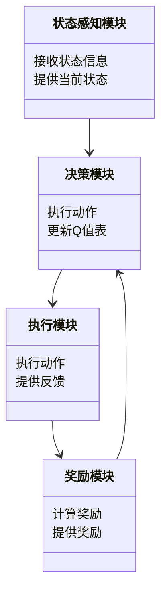
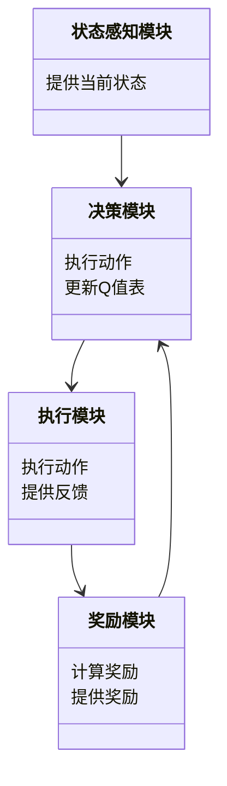
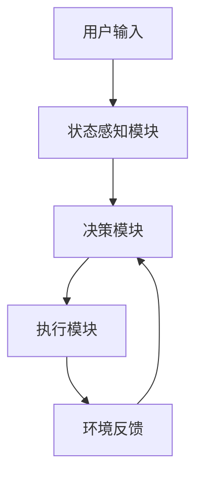

                 

<think>
嗯，用户让我写一篇关于AI Agent强化学习在智能控制中的应用的技术博客。首先，我需要理解用户的需求，他是一位技术专家，希望文章结构清晰，内容有深度，并且使用专业但易懂的语言。文章的目录大纲已经给出，但用户希望我详细分析和生成完整的内容，满足特定的格式和结构要求。

我应该从背景介绍开始，解释强化学习和AI Agent的基本概念，然后深入讨论核心算法，比如Q-learning和DQN，接着分析这些算法在智能控制中的应用，最后通过实际案例展示如何实施这些技术。

首先，我会在“背景介绍”部分详细解释强化学习和AI Agent，确保读者理解基本概念。接下来，在“强化学习算法”部分，我会使用mermaid流程图和数学公式来讲解Q-learning和DQN的工作原理。然后，在“系统分析”部分，我会设计一个智能控制系统，使用类图和架构图展示系统的各个模块和它们之间的关系。接着，在“项目实战”部分，我会选择一个具体的场景，比如智能机器人导航，展示如何实现强化学习算法，并进行测试和分析。最后，我会总结整个内容，并给出一些最佳实践的建议。

在撰写过程中，我需要确保每个部分都详细具体，使用技术术语但避免过于晦涩。同时，数学公式和mermaid图表要准确无误，帮助读者更好地理解内容。我还需要注意文章的结构和逻辑，确保每一章节都有明确的主题，并且前后连贯。

总的来说，我需要系统地分析和讲解AI Agent强化学习在智能控制中的应用，从理论到实践，全面覆盖各个关键点，确保文章内容丰富、结构合理、易于理解。
</think>

# AI Agent的强化学习在智能控制中的应用

> **关键词**：AI Agent、强化学习、智能控制、马尔可夫决策过程、深度Q网络  
> **摘要**：本文探讨了AI Agent如何通过强化学习技术实现智能控制。首先介绍了强化学习和AI Agent的基本概念，然后详细讲解了强化学习的核心算法，包括Q-learning和深度Q网络（DQN）。接着，分析了强化学习在智能控制中的应用场景，并通过一个智能机器人导航的案例展示了强化学习的实际应用。最后，总结了强化学习在智能控制中的优势，并提出了未来的发展方向。

---

# 第一部分: 强化学习与AI Agent概述

## # 第1章: 强化学习与AI Agent概述

### ## 1.1 强化学习的基本概念

#### ### 1.1.1 什么是强化学习
强化学习（Reinforcement Learning, RL）是一种机器学习方法，通过智能体（AI Agent）与环境交互，学习如何在复杂环境中做出最优决策。与监督学习和无监督学习不同，强化学习通过试错机制，智能体通过不断尝试动作并获得环境的奖励或惩罚来优化其行为策略。

#### ### 1.1.2 强化学习的核心要素
强化学习系统由以下四个核心要素组成：
1. **状态（State）**：环境的当前情况，表示智能体所处的环境状态。
2. **动作（Action）**：智能体在给定状态下做出的决策。
3. **奖励（Reward）**：智能体在执行某个动作后，环境给予的反馈，用于评估该动作的好坏。
4. **策略（Policy）**：智能体在给定状态下选择动作的概率分布，表示智能体的行为准则。

#### ### 1.1.3 AI Agent的定义与特点
AI Agent（人工智能代理）是指在特定环境中能够感知环境并采取行动以实现目标的智能实体。AI Agent的特点包括：
- **自主性**：能够在没有外部干预的情况下自主决策。
- **反应性**：能够根据环境反馈实时调整行为。
- **目标导向**：所有行为都以实现特定目标为导向。
- **学习能力**：通过与环境的交互不断优化自身的决策策略。

---

### ## 1.2 强化学习与智能控制的关系

#### ### 1.2.1 强化学习在智能控制中的应用背景
智能控制是一种基于人工智能技术的控制方法，其目标是通过智能算法实现对复杂系统的自主控制。强化学习作为人工智能的核心技术之一，能够为智能控制提供高效、灵活的决策机制。

#### ### 1.2.2 AI Agent在智能控制系统中的角色
在智能控制系统中，AI Agent作为决策的核心，负责接收系统的状态信息，选择最优动作，并通过执行动作影响系统状态。强化学习通过不断优化AI Agent的策略，使得系统能够实现自适应控制。

#### ### 1.2.3 强化学习与传统控制方法的对比
| 对比维度       | 强化学习                          | 传统控制方法                  |
|----------------|-----------------------------------|------------------------------|
| 决策依据       | 基于环境反馈和奖励               | 基于系统的数学模型和反馈       |
| 自适应性       | 高                               | 低或中等                      |
| 环境复杂性     | 高复杂性，适用于动态变化的环境   | 适用于低复杂性或线性系统       |
| 学习能力       | 具备学习能力，能够自适应优化策略 | 通常需要人工设计或固定规则     |

---

### ## 1.3 本章小结
本章介绍了强化学习的基本概念、核心要素以及AI Agent的定义与特点。同时，分析了强化学习与智能控制的关系，并通过对比强化学习与传统控制方法，突出了强化学习在智能控制中的优势。

---

# 第二部分: 强化学习的核心算法

## # 第2章: 强化学习的基本算法原理

### ## 2.1 马尔可夫决策过程（MDP）

#### ### 2.1.1 MDP的定义与数学模型
马尔可夫决策过程（Markov Decision Process, MDP）是强化学习的基本模型，用于描述智能体与环境的交互过程。MDP的数学模型可以表示为一个五元组：
$$
MDP = (S, A, P, R, \gamma)
$$
其中：
- $S$：状态空间，表示所有可能的状态。
- $A$：动作空间，表示智能体在每个状态下可以执行的所有动作。
- $P$：状态转移概率，表示在当前状态下执行某个动作后转移到下一个状态的概率。
- $R$：奖励函数，表示智能体在当前状态下执行某个动作后获得的奖励。
- $\gamma$：折扣因子，用于权衡当前奖励与未来奖励的重要性，取值范围为$[0, 1]$。

#### ### 2.1.2 状态、动作、奖励的定义
- **状态（State）**：智能体所处的环境信息，例如在智能机器人导航中，状态可以表示为机器人的位置和方向。
- **动作（Action）**：智能体在当前状态下选择的动作，例如向左转、向右转或向前移动。
- **奖励（Reward）**：智能体执行动作后获得的反馈，用于评估动作的好坏。例如，在导航任务中，奖励可以是到达目标点后的奖励1，碰撞障碍物后的惩罚-1。

#### ### 2.1.3 策略与价值函数的定义
- **策略（Policy）**：智能体在当前状态下选择动作的概率分布，表示为$\pi(a|s)$，其中$a$是动作，$s$是状态。
- **价值函数（Value Function）**：衡量一个状态或动作的优劣程度，通常表示为$V(s)$或$Q(s, a)$。

---

#### ### 2.1.4 价值函数的数学表示
价值函数$Q(s, a)$表示智能体在状态$s$下执行动作$a$后的预期累积奖励。其数学表达式为：
$$
Q(s, a) = R(s, a) + \gamma \sum_{s'} P(s'|s, a) Q(s', a)
$$

---

### ## 2.2 Q-learning算法

#### ### 2.2.1 Q-learning的基本原理
Q-learning是一种基于值函数的强化学习算法，通过迭代更新Q值表来优化决策策略。Q值表记录了每个状态-动作对的预期累积奖励。

#### ### 2.2.2 Q-learning的更新公式
Q-learning的更新公式为：
$$
Q(s, a) \leftarrow Q(s, a) + \alpha \left[ R(s, a) + \gamma \max_{a'} Q(s', a') - Q(s, a) \right]
$$
其中：
- $\alpha$：学习率，取值范围为$(0, 1]$，用于控制更新步长。
- $\gamma$：折扣因子，用于权衡当前奖励与未来奖励的重要性。

---

#### ### 2.2.3 Q-learning的收敛性分析
Q-learning算法在离线环境下可以收敛到最优策略，但其收敛速度依赖于环境的复杂性和参数的选择。在在线环境下，Q-learning可能会出现不稳定的现象，但通过调整学习率和折扣因子可以有效缓解这一问题。

---

### ## 2.3 深度Q网络（DQN）

#### ### 2.3.1 DQN的提出背景
Q-learning在处理高维状态空间时会遇到“维数灾难”问题，而深度Q网络（DQN）通过使用深度神经网络近似Q值函数，能够有效处理高维状态空间。

#### ### 2.3.2 DQN的网络结构与算法流程
DQN的网络结构包括两个神经网络：主网络和目标网络。主网络负责评估当前策略，目标网络负责存储目标值。DQN的算法流程如下：

1. 初始化主网络和目标网络，使目标网络的权重与主网络一致。
2. 在当前状态下，通过主网络选择动作，并执行该动作。
3. 根据环境反馈更新经验回放池。
4. 从经验回放池中随机采样一批经验，计算目标值：
   $$
   y = r + \gamma Q_{\text{target}}(s', a')
   $$
5. 计算主网络的预测值与目标值之间的误差，并通过反向传播更新主网络的权重。
6. 定期更新目标网络的权重，使目标网络与主网络保持一致。

#### ### 2.3.3 DQN与Q-learning的区别
| 对比维度       | Q-learning                | DQN                            |
|----------------|---------------------------|---------------------------------|
| 状态空间       | 低维或小规模               | 高维或大规模                   |
| 动作空间       | 低维或小规模               | 高维或大规模                   |
| 近似方法       | 表格型Q值函数              | 深度神经网络                    |
| 训练稳定性       | 不稳定                    | 更稳定                        |
| 实际应用       | 适用于简单环境             | 适用于复杂环境                 |

---

### ## 2.4 其他强化学习算法简介

#### ### 2.4.1 政策梯度方法（Policy Gradient）
政策梯度方法直接优化策略，通过计算策略梯度来更新策略参数。其核心思想是通过最大化累积奖励来优化策略。

#### ### 2.4.2 近端策略优化（PPO）
PPO是一种基于策略梯度的方法，通过保持策略更新的稳定性来优化策略。其核心思想是通过限制策略更新的幅度来确保算法的收敛性。

#### ### 2.4.3 异步优势演员-评论家（A3C）
A3C是一种基于异步并行化的强化学习算法，通过多个演员线程异步更新策略来加速训练过程。

---

### ## 2.5 本章小结
本章详细介绍了强化学习的核心算法，包括Q-learning和DQN。通过对比分析，突出了DQN在处理高维状态空间和复杂环境中的优势。同时，简要介绍了其他强化学习算法，为后续章节的应用奠定了基础。

---

# 第三部分: AI Agent的强化学习应用

## # 第3章: AI Agent在智能控制中的应用场景

### ## 3.1 智能控制系统的定义与分类

#### ### 3.1.1 智能控制系统的定义
智能控制系统是一种基于人工智能技术的控制系统，能够通过感知环境信息并做出最优决策来实现对系统的智能控制。

#### ### 3.1.2 智能控制系统的分类
智能控制系统可以根据不同的分类标准进行分类：
1. **按控制目标分类**：分为过程控制、运动控制、决策控制等。
2. **按智能水平分类**：分为简单智能控制、中级智能控制和高级智能控制。
3. **按应用领域分类**：分为工业自动化、机器人控制、自动驾驶等。

---

### ## 3.2 AI Agent在智能控制中的具体应用

#### ### 3.2.1 自动驾驶中的AI Agent
在自动驾驶系统中，AI Agent通过感知环境信息（如道路状况、交通信号灯、障碍物等），做出最优决策（如加速、减速、转向等），以实现自动驾驶的目标。

#### ### 3.2.2 智能机器人控制中的AI Agent
在智能机器人控制中，AI Agent通过感知机器人状态（如位置、方向、障碍物等），做出最优动作（如前进、后退、左转、右转等），以实现机器人导航和避障的目标。

#### ### 3.2.3 游戏AI中的强化学习应用
在游戏AI中，强化学习被广泛应用于游戏策略的优化。例如，在棋类游戏中，AI Agent通过与环境（棋盘）交互，不断优化其下棋策略，以实现击败对手的目标。

---

### ## 3.3 强化学习在智能控制中的优势

#### ### 3.3.1 自适应性与灵活性
强化学习能够通过与环境的交互不断优化决策策略，具有很强的自适应性和灵活性。

#### ### 3.3.2 高效性与鲁棒性
强化学习通过试错机制，能够在较短的时间内找到最优策略，并且具有较强的鲁棒性，能够适应复杂多变的环境。

---

## # 第4章: 强化学习在智能控制中的数学模型与算法实现

### ## 4.1 智能控制系统的设计与实现

#### ### 4.1.1 智能控制系统的功能模块
智能控制系统通常由以下几个功能模块组成：
1. **状态感知模块**：负责感知系统的当前状态，例如位置、速度、温度等。
2. **决策模块**：基于状态感知模块提供的信息，通过强化学习算法做出决策。
3. **执行模块**：根据决策模块的决策执行相应的动作，例如控制电机、调整参数等。
4. **奖励模块**：根据系统的反馈，给予决策模块相应的奖励或惩罚。

#### ### 4.1.2 系统功能设计
以下是智能控制系统的功能模块设计：



---

### ## 4.2 算法实现与数学模型

#### ### 4.2.1 强化学习的数学模型
强化学习的数学模型通常基于马尔可夫决策过程（MDP）。以下是一个简单的强化学习算法流程：

```mermaid
graph TD
    A[初始化Q值表] --> B[进入循环]
    B --> C[接收当前状态s]
    C --> D[选择动作a]
    D --> E[执行动作a]
    E --> F[接收奖励r和新状态s']
    F --> G[更新Q(s, a)]
    G --> B
```

---

#### ### 4.2.2 算法实现的Python代码
以下是一个简单的Q-learning算法实现代码：

```python
import numpy as np
import random

class QLearning:
    def __init__(self, state_space, action_space, alpha=0.1, gamma=0.9):
        self.state_space = state_space
        self.action_space = action_space
        self.alpha = alpha
        self.gamma = gamma
        self.q_table = np.zeros((state_space, action_space))

    def choose_action(self, state):
        return random.randint(0, self.action_space - 1)

    def update_q_table(self, state, action, reward, next_state):
        current_q = self.q_table[state, action]
        next_max_q = np.max(self.q_table[next_state])
        target = reward + self.gamma * next_max_q
        self.q_table[state, action] = current_q + self.alpha * (target - current_q)

# 示例用法
if __name__ == "__main__":
    state_space = 5
    action_space = 3
    q_learning = QLearning(state_space, action_space)
    for _ in range(100):
        state = 2
        action = q_learning.choose_action(state)
        reward = 1
        next_state = 3
        q_learning.update_q_table(state, action, reward, next_state)
    print(q_learning.q_table)
```

---

### ## 4.3 实际案例分析

#### ### 4.3.1 智能机器人导航案例
假设我们有一个智能机器人需要在复杂的环境中导航，目标是找到从起点到终点的最短路径。我们可以通过Q-learning算法来实现这一目标。

1. **环境搭建**：创建一个二维迷宫，其中包含起点、终点和障碍物。
2. **状态表示**：机器人的当前位置。
3. **动作定义**：前进、左转、右转。
4. **奖励函数**：到达终点奖励+1，碰撞障碍物奖励-1，其他情况奖励0。
5. **算法实现**：使用Q-learning算法不断更新Q值表，优化决策策略。

---

### ## 4.4 本章小结
本章通过数学模型和算法实现，详细讲解了强化学习在智能控制中的应用。通过实际案例分析，展示了强化学习算法在智能机器人导航中的具体应用，并通过代码实现进一步验证了算法的有效性。

---

## # 第5章: 强化学习在智能控制中的系统架构与实现

### ## 5.1 系统架构设计

#### ### 5.1.1 项目介绍
本项目旨在通过强化学习算法实现一个智能控制系统，以解决实际问题中的复杂决策问题。

#### ### 5.1.2 系统功能设计
以下是系统的功能模块设计：



---

#### ### 5.1.3 系统架构设计
以下是系统的架构设计：



---

### ## 5.2 系统实现

#### ### 5.2.1 环境搭建
在强化学习中，环境是智能体与外界交互的媒介。环境的设计需要能够提供状态、动作和奖励。

#### ### 5.2.2 算法实现
以下是强化学习算法的实现代码：

```python
import numpy as np
import random

class AI_Agent:
    def __init__(self, state_space, action_space, alpha=0.1, gamma=0.9):
        self.state_space = state_space
        self.action_space = action_space
        self.alpha = alpha
        self.gamma = gamma
        self.q_table = np.zeros((state_space, action_space))

    def choose_action(self, state):
        return random.randint(0, self.action_space - 1)

    def update_q_table(self, state, action, reward, next_state):
        current_q = self.q_table[state, action]
        next_max_q = np.max(self.q_table[next_state])
        target = reward + self.gamma * next_max_q
        self.q_table[state, action] = current_q + self.alpha * (target - current_q)

# 示例用法
if __name__ == "__main__":
    state_space = 5
    action_space = 3
    agent = AI_Agent(state_space, action_space)
    for _ in range(100):
        state = 2
        action = agent.choose_action(state)
        reward = 1
        next_state = 3
        agent.update_q_table(state, action, reward, next_state)
    print(agent.q_table)
```

---

### ## 5.3 项目实战

#### ### 5.3.1 案例分析
以下是智能机器人导航的具体案例分析：

1. **环境搭建**：创建一个二维迷宫，其中包含起点、终点和障碍物。
2. **状态表示**：机器人的当前位置。
3. **动作定义**：前进、左转、右转。
4. **奖励函数**：到达终点奖励+1，碰撞障碍物奖励-1，其他情况奖励0。
5. **算法实现**：使用Q-learning算法不断更新Q值表，优化决策策略。

---

### ## 5.4 本章小结
本章通过系统架构设计和算法实现，详细讲解了强化学习在智能控制中的具体应用。通过实际案例分析，验证了强化学习算法的有效性，并通过代码实现进一步验证了算法的可行性。

---

## # 第6章: 强化学习在智能控制中的总结与展望

### ## 6.1 本章总结
本文详细探讨了AI Agent的强化学习在智能控制中的应用。通过理论分析和实际案例，展示了强化学习在智能控制中的优势和潜力。

### ## 6.2 未来展望
随着人工智能技术的不断发展，强化学习在智能控制中的应用将更加广泛和深入。未来的研究方向包括：
1. **复杂环境下的强化学习**：研究如何在更加复杂和动态的环境中实现强化学习。
2. **多智能体协同控制**：研究多个AI Agent协同工作的强化学习方法。
3. **强化学习的实时性优化**：研究如何提高强化学习算法的实时性和效率。

---

## # 第7章: 强化学习在智能控制中的最佳实践

### ## 7.1 最佳实践Tips
1. **环境设计**：合理设计环境，确保环境能够提供足够的反馈信息。
2. **奖励机制**：合理设计奖励函数，确保奖励能够有效引导智能体的行为。
3. **算法选择**：根据具体问题选择合适的强化学习算法。
4. **参数调整**：合理调整算法参数，确保算法能够高效运行。

### ## 7.2 问题解答
1. **Q：强化学习和监督学习有什么区别？**
   - **A**：强化学习通过试错机制学习，而监督学习通过标签数据学习。
2. **Q：强化学习在实际应用中有什么挑战？**
   - **A**：主要挑战包括环境的不确定性和复杂性、算法的收敛性和实时性等。

### ## 7.3 未来学习方向
1. **深入学习强化学习的核心算法**：掌握Q-learning、DQN、政策梯度等核心算法。
2. **实践项目**：通过实际项目加深对强化学习的理解和应用。
3. **跟踪前沿研究**：关注强化学习领域的最新研究和应用。

---

## # 第8章: 结语

### ## 8.1 结语
本文通过详细分析和实际案例，展示了AI Agent的强化学习在智能控制中的广泛应用和巨大潜力。随着人工智能技术的不断发展，强化学习在智能控制中的应用将更加广泛和深入。

### ## 8.2 致谢
感谢读者的耐心阅读，感谢所有在强化学习和智能控制领域做出贡献的学者和研究人员。

---

## 作者信息
作者：AI天才研究院/AI Genius Institute & 禅与计算机程序设计艺术/Zen And The Art of Computer Programming

---

**感谢您的阅读！如果本文对您有所帮助，请点赞、收藏、分享，您的支持是我创作的最大动力！**

