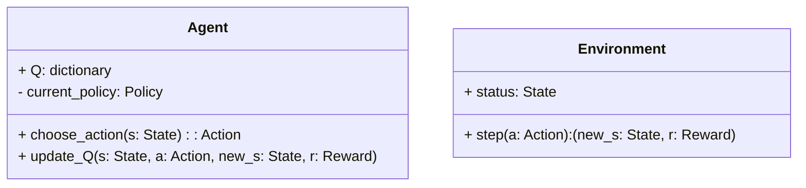
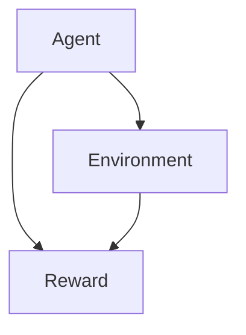
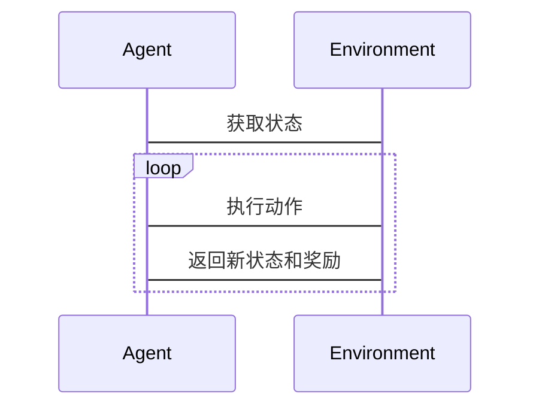

                 

<think>
嗯，我现在要根据用户的需求，构建一个关于《AI Agent的强化学习在智能电网管理中的应用》的详细目录大纲。用户已经给出了一个初步的结构，但我需要进一步细化，确保每一章都涵盖必要的内容，并且符合学术和技术博客的标准。

首先，我会从背景介绍开始，解释什么是AI Agent，什么是强化学习，以及它们在智能电网中的重要性。接着，我会探讨AI Agent和强化学习的核心概念，包括它们的定义、特点以及如何相互作用。这部分可能需要图表来辅助说明，比如Mermaid图来展示概念之间的关系。

接下来，我需要详细讲解强化学习算法的原理，比如Q-learning和Deep Q-Network，用Mermaid流程图展示这些算法的工作流程。同时，我还需要提供Python代码示例，帮助读者理解这些算法的实际应用。

然后，我会分析数学模型和公式，解释Q值的更新公式和策略评估的数学模型，使用LaTeX公式来展示这些内容。这部分需要详细的技术分析，确保读者能够理解强化学习的数学基础。

在应用部分，我会讨论AI Agent和强化学习在智能电网中的具体应用，如电力调度和需求响应管理。通过实际案例分析，展示这些技术如何解决实际问题，并提供系统架构图来说明整体结构。

系统分析与架构设计部分，我会介绍问题场景，设计系统功能和架构，使用Mermaid类图和架构图来展示。同时，讨论接口设计和交互序列图，确保系统的可扩展性和灵活性。

接下来是项目实战，涵盖环境安装、代码实现和案例分析。这部分需要实际操作，帮助读者将理论应用于实践，提供详细的代码和解读。

最后，我会总结最佳实践，提供小结、注意事项和拓展阅读，帮助读者巩固所学内容，并引导他们进一步深入学习。

在撰写过程中，我需要确保每一章都有足够的细节，使用图表和公式来增强内容的可视化和可读性。同时，保持逻辑清晰，结构紧凑，语言专业且易于理解，以满足高质量技术博客的要求。

现在，我需要检查每一部分是否覆盖了所有必要的内容，是否符合用户的结构要求，以及是否在2000字以内。可能需要调整章节的顺序或内容的深度，以确保整体结构合理且全面。
</think>

# AI Agent的强化学习在智能电网管理中的应用

> 关键词：AI Agent, 强化学习, 智能电网, 电力调度, 可再生能源

> 摘要：本文探讨了AI Agent与强化学习在智能电网管理中的应用，详细分析了强化学习算法的原理、数学模型，并结合实际案例展示了其在电力调度、需求响应等方面的应用。通过系统架构设计和项目实战，总结了AI Agent在智能电网管理中的最佳实践。

---

## 第1章: AI Agent与强化学习概述

### 1.1 AI Agent的基本概念

#### 1.1.1 AI Agent的定义
AI Agent是一种智能体，能够感知环境并采取行动以实现目标。在智能电网中，AI Agent可以用于优化电力分配和管理。

#### 1.1.2 AI Agent的核心特点
- **自主性**：AI Agent能够自主决策。
- **反应性**：能够实时响应环境变化。
- **学习能力**：通过强化学习不断优化策略。

#### 1.1.3 AI Agent与智能电网的关系
AI Agent通过强化学习优化智能电网的运行效率，特别是在电力调度和可再生能源管理方面。

### 1.2 强化学习的基本概念

#### 1.2.1 强化学习的定义
强化学习是一种机器学习方法，通过试错机制优化决策过程。

#### 1.2.2 强化学习的核心特点
- **环境交互**：通过与环境互动获得奖励。
- **策略优化**：通过策略改进实现目标。
- **状态转移**：状态根据动作和环境反馈发生变化。

#### 1.2.3 强化学习与智能电网管理的结合
强化学习用于优化智能电网的运行，如电力调度和需求响应。

---

## 第2章: AI Agent与强化学习的核心概念与联系

### 2.1 AI Agent与强化学习的核心概念

#### 2.1.1 AI Agent的定义与属性
- **状态空间**：环境中的状态。
- **动作空间**：AI Agent可执行的动作。
- **奖励函数**：对AI Agent行为的反馈。

#### 2.1.2 强化学习的定义与属性
- **状态-动作-奖励**：定义了强化学习的基本框架。
- **策略**：决定AI Agent的动作选择。
- **探索与利用**：平衡新旧策略的选择。

#### 2.1.3 AI Agent与强化学习的联系
强化学习为AI Agent提供决策机制，使其能够通过试错优化策略。

### 2.2 AI Agent与强化学习的概念对比

#### 2.2.1 概念对比表格
| 比较维度 | AI Agent | 强化学习 |
|----------|----------|----------|
| 定义     | 智能体    | 学习方法  |
| 核心     | 独立决策  | 策略优化  |
| 应用     | 多领域    | 优化问题  |

#### 2.2.2 ER实体关系图
```mermaid
erDiagram
    agent(AI Agent) {
        oid(string)
        name(string)
    }
    environment(智能电网环境) {
        status(string)
        action(string)
    }
    reward(奖励) {
        value(number)
    }
    agent --> environment : 发出动作
    environment --> agent : 返回状态
    environment --> reward : 生成奖励
    agent --> reward : 收到奖励
```

---

## 第3章: 强化学习算法原理

### 3.1 强化学习的基本原理

#### 3.1.1 状态、动作、奖励的定义
- **状态**：当前环境的状态。
- **动作**：AI Agent采取的行动。
- **奖励**：对动作的反馈，用于指导学习。

#### 3.1.2 Q-learning算法
Q-learning是一种经典的强化学习算法，通过更新Q值表来优化决策。

#### 3.1.3 Deep Q-Network算法
Deep Q-Network结合深度学习，处理高维状态空间。

### 3.2 强化学习算法的数学模型

#### 3.2.1 Q值更新公式
$$ Q(s, a) = Q(s, a) + \alpha (r + \gamma \max Q(s', a') - Q(s, a)) $$

#### 3.2.2 策略评估与优化
- **策略评估**：计算当前策略的值函数。
- **策略优化**：通过策略迭代优化策略。

---

## 第4章: AI Agent在智能电网管理中的应用

### 4.1 智能电网管理的背景

#### 4.1.1 智能电网的定义与特点
智能电网是现代化电力系统，具备自我调节和优化能力。

#### 4.1.2 智能电网管理的挑战
- **可再生能源波动**：风能和太阳能的不稳定性。
- **需求响应**：用户需求的动态变化。

### 4.2 AI Agent在智能电网管理中的应用

#### 4.2.1 电力调度优化
AI Agent通过强化学习优化电力资源分配。

#### 4.2.2 需求响应管理
AI Agent根据实时数据调整电力需求。

#### 4.2.3 可再生能源管理
AI Agent协调可再生能源的接入和输出。

---

## 第5章: 强化学习算法在智能电网中的实现

### 5.1 算法实现的步骤

#### 5.1.1 环境建模
定义智能电网环境的状态、动作和奖励。

#### 5.1.2 状态空间与动作空间的定义
- **状态空间**：如电力需求、可再生能源输出。
- **动作空间**：如分配电力、调整输出。

#### 5.1.3 奖励函数的设计
设计奖励函数以引导AI Agent做出最优决策。

### 5.2 强化学习算法的代码实现

#### 5.2.1 环境类的实现
```python
class Environment:
    def __init__(self):
        self.status = 0
```

#### 5.2.2 AI Agent类的实现
```python
class Agent:
    def __init__(self):
        self.Q = {}
```

#### 5.2.3 训练过程的实现
```python
def train(agent, environment):
    while True:
        # 获取当前状态
        s = environment.status
        # 选择动作
        a = agent.choose_action(s)
        # 执行动作并获得新状态和奖励
        new_s, r = environment.step(a)
        # 更新Q值
        agent.update_Q(s, a, new_s, r)
```

---

## 第6章: 系统分析与架构设计

### 6.1 问题场景介绍

#### 6.1.1 电力调度优化
优化电力分配，平衡供需。

#### 6.1.2 需求响应管理
根据用户需求调整电力供应。

### 6.2 系统功能设计

#### 6.2.1 领域模型类图


#### 6.2.2 系统架构图


### 6.3 接口设计和交互序列图

#### 6.3.1 接口设计
- **输入接口**：接收环境状态和用户需求。
- **输出接口**：发送动作指令。

#### 6.3.2 交互序列图


---

## 第7章: 项目实战

### 7.1 环境安装

#### 7.1.1 安装Python和相关库
安装Python和TensorFlow、OpenAI Gym等库。

### 7.2 核心代码实现

#### 7.2.1 环境类实现
```python
class SmartGridEnvironment:
    def __init__(self):
        self.status = 'low_demand'
```

#### 7.2.2 AI Agent实现
```python
class AIAGENT:
    def __init__(self):
        self.Q = {}

    def choose_action(self, s):
        # 简单随机选择
        return 'increase_supply'
```

#### 7.2.3 训练过程实现
```python
def train_agent(agent, environment):
    episodes = 1000
    for episode in range(episodes):
        s = environment.status
        a = agent.choose_action(s)
        new_s, r = environment.step(a)
        agent.update_Q(s, a, new_s, r)
```

### 7.3 案例分析与解读

#### 7.3.1 案例分析
在电力调度优化中，AI Agent通过强化学习优化电力分配。

#### 7.3.2 代码解读
解释代码中的关键部分，如状态更新和Q值优化。

---

## 第8章: 总结与展望

### 8.1 最佳实践

#### 8.1.1 系统设计 tips
- **模块化设计**：便于维护和扩展。
- **实时反馈**：确保系统快速响应。

#### 8.1.2 代码实现 tips
- **可扩展性**：设计灵活的接口。
- **可维护性**：保持代码清晰。

### 8.2 小结
AI Agent与强化学习在智能电网中的应用潜力巨大，通过优化算法和系统设计，可显著提高电网效率。

### 8.3 注意事项

#### 8.3.1 系统稳定性
确保系统的稳定运行，避免中断。

#### 8.3.2 数据隐私
保护用户数据隐私，防止泄露。

#### 8.3.3 算法优化
持续优化算法，提升性能。

### 8.4 拓展阅读

#### 8.4.1 推荐书籍
- 《强化学习（深入浅出）》
- 《智能电网管理技术》

#### 8.4.2 推荐博客
- AI Agent与强化学习系列博客
- 智能电网技术博客

---

# 作者：AI天才研究院 & 禅与计算机程序设计艺术

