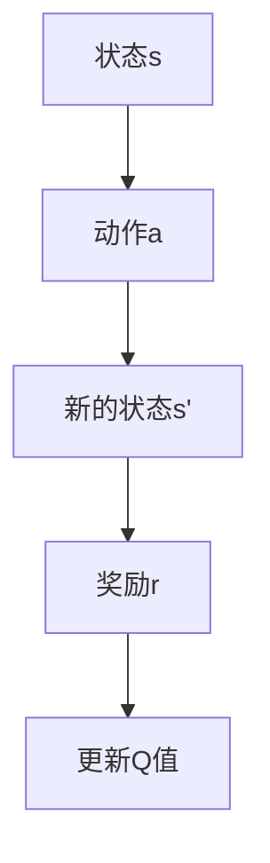
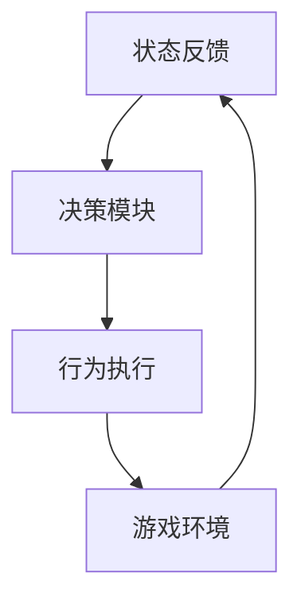

                 


---

# AI Agent的强化学习在游戏AI中的应用

> 关键词：AI Agent, 强化学习, 游戏AI, 状态空间, 动作空间, Q-learning, 深度强化学习

> 摘要：本文详细探讨了AI Agent在游戏AI中的应用，重点分析了强化学习在其中的作用。从强化学习的基本原理到数学模型，从算法实现到实际案例，系统地介绍了如何通过强化学习提升游戏AI的智能性和适应性。

---

# 第一部分: AI Agent与强化学习基础

## 第1章: AI Agent与强化学习概述

### 1.1 AI Agent的基本概念

#### 1.1.1 什么是AI Agent
AI Agent（人工智能代理）是一种能够感知环境并采取行动以实现目标的智能体。在游戏AI中，AI Agent通常用于控制非玩家角色（NPC）的行为，使其能够与玩家互动并做出复杂的决策。

#### 1.1.2 AI Agent的核心特征
- **自主性**：AI Agent能够在没有外部干预的情况下自主决策。
- **反应性**：能够实时感知环境并做出反应。
- **目标导向**：基于目标驱动行为，优化决策以提高目标实现的概率。
- **学习能力**：通过强化学习等方法不断优化自身的决策策略。

#### 1.1.3 AI Agent在游戏中的应用场景
- **NPC行为控制**：让NPC表现出智能的行为，如巡逻、逃跑、攻击等。
- **多智能体协作**：在多人游戏中，AI Agent可以用于实现团队协作。
- **自适应难度调整**：根据玩家的行为动态调整游戏难度，提升玩家体验。

### 1.2 强化学习的基本概念

#### 1.2.1 强化学习的定义
强化学习是一种机器学习方法，通过智能体与环境的交互，智能体通过试错学习策略，以最大化累积奖励。其核心是通过经验改进策略，使智能体在环境中获得最大化的累积奖励。

#### 1.2.2 强化学习的核心要素
- **状态（State）**：环境在某一时刻的信息表示。
- **动作（Action）**：智能体在给定状态下做出的行为选择。
- **奖励（Reward）**：智能体采取某动作后，环境给予的反馈，用于评估该动作的好坏。
- **策略（Policy）**：智能体选择动作的概率分布，用于描述智能体在每个状态下选择动作的概率。
- **值函数（Value Function）**：衡量某状态下策略的优劣，用于指导策略优化。

#### 1.2.3 强化学习与监督学习的区别
| 对比维度       | 监督学习                     | 强化学习                     |
|----------------|------------------------------|------------------------------|
| 数据来源       | 标签数据                     | 奖励信号                     |
| 反馈机制       | 即时反馈（标签是否正确）     | 延迟反馈（累积奖励）         |
| 决策空间       | 离散或连续                   | 离散或连续                   |
| 环境交互       | 无交互                       | 有交互                       |

### 1.3 AI Agent与强化学习的关系

#### 1.3.1 AI Agent的决策机制
AI Agent通过强化学习算法，从环境中获取信息，选择最优动作，以实现目标。强化学习为AI Agent提供了学习策略的能力，使其能够在复杂环境中做出智能决策。

#### 1.3.2 强化学习在AI Agent中的作用
- **策略优化**：通过强化学习，AI Agent能够不断优化其决策策略，提高行为的智能性。
- **自适应能力**：强化学习使AI Agent能够适应环境的变化，动态调整其行为模式。
- **复杂任务处理**：强化学习能够处理复杂的决策任务，如路径规划、资源分配等。

#### 1.3.3 游戏AI中的强化学习应用
- **游戏NPC行为控制**：通过强化学习，NPC能够根据玩家行为动态调整其策略，例如在MMORPG中，NPC可以根据玩家的攻击模式选择最优的防御策略。
- **游戏AI对战系统**：在RTS或MOBA类游戏中，AI Agent可以通过强化学习实现团队协作和策略调整，提升对战系统的智能化水平。
- **自适应难度调整**：通过强化学习，游戏可以根据玩家的表现动态调整难度，提升玩家的游戏体验。

### 1.4 本章小结
本章介绍了AI Agent和强化学习的基本概念，分析了强化学习在游戏AI中的应用。AI Agent通过强化学习能够实现智能决策和自适应行为，从而提升游戏的互动性和趣味性。

---

## 第2章: 强化学习的数学模型与算法原理

### 2.1 强化学习的基本框架

#### 2.1.1 状态空间
状态空间是智能体可能遇到的所有状态的集合。在游戏AI中，状态空间可以表示为游戏中的各种场景，例如玩家的位置、剩余生命值、持有的武器等。

#### 2.1.2 动作空间
动作空间是智能体在某一状态下可以执行的所有动作的集合。在游戏AI中，动作空间可以是移动、攻击、使用技能等。

#### 2.1.3 奖励函数
奖励函数定义了智能体在执行某个动作后获得的奖励。在游戏AI中，奖励函数可以是击败敌人的奖励、完成任务的奖励或被击败的惩罚。

### 2.2 Q-learning算法

#### 2.2.1 Q-learning的基本原理
Q-learning是一种基于值函数的强化学习算法，通过学习Q值函数来优化决策策略。Q值函数表示智能体在某一状态下采取某动作后的期望累计奖励。

#### 2.2.2 Q-learning的数学模型
$$ Q(s, a) = r + \gamma \max_{a'} Q(s', a') $$
其中：
- \( Q(s, a) \)：当前状态下采取动作 \( a \) 的Q值。
- \( r \)：执行动作 \( a \) 后获得的奖励。
- \( \gamma \)：折扣因子，表示未来奖励的现值。
- \( s' \)：执行动作 \( a \) 后进入的新状态。
- \( a' \)：新状态下可能采取的动作。

#### 2.2.3 Q-learning的算法流程图


### 2.3 深度强化学习

#### 2.3.1 DQN算法
DQN（Deep Q-Network）是一种结合深度学习和强化学习的算法，通过神经网络近似Q值函数。DQN在游戏AI中的应用非常广泛，例如在Atari游戏和棋类游戏中表现出色。

#### 2.3.2 DQN的网络结构
DQN通常由两个神经网络构成：
- **主网络（Main Network）**：用于评估当前策略的Q值。
- **目标网络（Target Network）**：用于稳定学习过程，定期更新主网络的参数。

#### 2.3.3 DQN的数学模型
$$ Q(s, a) = \arg \max_{a} Q_\theta(s, a) $$
其中：
- \( Q_\theta \)：主网络的参数。
- \( s \)：当前状态。
- \( a \)：动作。

### 2.4 本章小结
本章详细介绍了强化学习的数学模型和算法原理，重点讲解了Q-learning和DQN算法。这些算法为AI Agent提供了强大的决策能力，使其能够在复杂环境中做出最优选择。

---

## 第3章: AI Agent的系统架构设计

### 3.1 AI Agent的系统组成

#### 3.1.1 状态感知模块
状态感知模块负责从环境中获取信息，例如玩家的位置、敌人的位置等。这些信息将被传递给决策模块。

#### 3.1.2 决策模块
决策模块根据当前状态和策略模型，选择最优的动作。决策模块的核心是强化学习算法，例如Q-learning或DQN。

#### 3.1.3 行为执行模块
行为执行模块负责将决策模块选择的动作转化为实际的操作，例如移动角色或使用技能。

### 3.2 游戏环境的建模

#### 3.2.1 游戏环境的抽象
游戏环境需要被抽象为一个状态空间和动作空间的组合。例如，在一个2D游戏中，状态可以是(x, y)坐标和剩余生命值，动作可以是移动左、右、上、下或攻击。

#### 3.2.2 状态空间的定义
状态空间需要明确游戏中的所有可能状态。在实际应用中，状态空间可能非常复杂，因此需要进行适当的简化和抽象。

#### 3.2.3 动作空间的设计
动作空间的设计需要考虑游戏规则和物理限制。例如，在一个格斗游戏中，动作空间可能包括攻击、防御、闪避等动作。

### 3.3 AI Agent的交互流程

#### 3.3.1 状态感知
AI Agent首先感知当前环境的状态，例如玩家的位置和生命值。

#### 3.3.2 决策计算
根据当前状态，AI Agent通过强化学习算法计算出最优动作。

#### 3.3.3 行为执行
AI Agent执行计算出的动作，例如攻击玩家或闪避玩家的攻击。

### 3.4 本章小结
本章详细介绍了AI Agent的系统架构设计，包括状态感知、决策计算和行为执行三个模块。这些模块共同协作，使AI Agent能够在游戏环境中做出智能决策。

---

## 第4章: 强化学习在游戏AI中的应用挑战

### 4.1 游戏环境的复杂性

#### 4.1.1 多智能体协作
在多人游戏中，AI Agent需要与其他多个智能体协作，例如在MOBA游戏中，AI Agent需要与队友协作完成任务。

#### 4.1.2 动态环境变化
游戏环境可能是动态变化的，例如玩家的位置和行为可能随时变化，这要求AI Agent具有高度的适应性。

#### 4.1.3 高维状态空间
在复杂游戏中，状态空间可能是高维的，例如在开放世界游戏中，状态空间可能包括多个属性和参数，导致状态空间的维度非常高。

### 4.2 强化学习的训练难点

#### 4.2.1 训练效率
强化学习需要大量的训练样本，训练效率可能较低，尤其是在复杂环境中。

#### 4.2.2 过度拟合
强化学习算法可能在特定环境下过度拟合，导致在实际应用中表现不佳。

#### 4.2.3 奖励函数设计
奖励函数的设计非常关键，如果设计不合理，可能无法引导智能体做出正确的决策。

### 4.3 应用案例分析

#### 4.3.1 游戏NPC行为控制
通过强化学习，NPC可以实现复杂的巡逻、逃跑和攻击行为，提升游戏的趣味性。

#### 4.3.2 游戏AI对战系统
在RTS或MOBA类游戏中，AI Agent可以通过强化学习实现团队协作和策略调整，提升对战系统的智能化水平。

#### 4.3.3 自适应难度调整
通过强化学习，游戏可以根据玩家的表现动态调整难度，提升玩家的游戏体验。

### 4.4 本章小结
本章分析了强化学习在游戏AI中的应用挑战，包括多智能体协作、动态环境变化和高维状态空间等。同时，还介绍了几个典型的应用案例，展示了强化学习在游戏AI中的巨大潜力。

---

## 第5章: 强化学习在游戏AI中的实际应用

### 5.1 项目背景介绍

#### 5.1.1 项目目标
本项目旨在通过强化学习算法，实现一个智能的AI Agent，能够在复杂游戏中做出智能决策。

#### 5.1.2 项目技术选型
- **算法选择**：选择DQN算法作为强化学习的核心算法。
- **框架选择**：使用TensorFlow框架实现神经网络。
- **环境选择**：选择一个2D游戏作为实验环境。

### 5.2 系统功能设计

#### 5.2.1 状态感知模块
通过传感器获取游戏环境中的状态信息，例如玩家的位置和生命值。

#### 5.2.2 决策模块
使用DQN算法，根据当前状态计算最优动作。

#### 5.2.3 行为执行模块
将计算出的动作转化为实际的操作，例如移动角色或使用技能。

### 5.3 系统架构设计

#### 5.3.1 系统架构图


#### 5.3.2 神经网络结构
DQN算法使用两个神经网络，主网络和目标网络，用于评估和优化Q值函数。

### 5.4 项目实现代码

#### 5.4.1 环境搭建
```python
import gym
env = gym.make('MyGame-v0')
```

#### 5.4.2 神经网络实现
```python
import tensorflow as tf

class DQN:
    def __init__(self, state_size, action_size):
        self.state_size = state_size
        self.action_size = action_size
        self.gamma = 0.99
        self.epsilon = 1.0
        self.epsilon_min = 0.01
        self.epsilon_decay = 0.995
        self.model = self.build_model()
        self.target_model = self.build_model()

    def build_model(self):
        model = tf.keras.Sequential()
        model.add(tf.keras.layers.Dense(64, activation='relu', input_dim=self.state_size))
        model.add(tf.keras.layers.Dense(self.action_size, activation='linear'))
        return model
```

#### 5.4.3 训练过程
```python
def train(agent, env):
    for episode in range(1000):
        state = env.reset()
        while True:
            action = agent.act(state)
            next_state, reward, done = env.step(action)
            agent.remember(state, action, reward, next_state, done)
            agent.replay()
            if done:
                break
```

### 5.5 实际案例分析

#### 5.5.1 训练结果
通过训练，AI Agent能够在游戏环境中逐步掌握最优策略，例如在遇到敌人时选择最优的攻击或防御动作。

#### 5.5.2 动态适应
AI Agent能够根据环境的变化动态调整其行为，例如在敌人数量增加时选择更高效的防御策略。

### 5.6 本章小结
本章通过一个实际项目，详细介绍了强化学习在游戏AI中的应用。从环境搭建到算法实现，再到训练过程，展示了强化学习在游戏AI中的巨大潜力。

---

## 第6章: 总结与展望

### 6.1 本章总结
本文详细探讨了AI Agent在游戏AI中的应用，重点分析了强化学习在其中的作用。从强化学习的基本原理到数学模型，从算法实现到实际案例，系统地介绍了如何通过强化学习提升游戏AI的智能性和适应性。

### 6.2 未来展望
随着强化学习技术的不断发展，游戏AI将变得更加智能和人性化。未来的研究方向包括：
- **多智能体协作**：研究如何在多智能体协作中实现更高效的策略。
- **复杂环境建模**：探索如何在复杂环境中建模和优化AI Agent的行为。
- **实时决策优化**：研究如何在实时环境中实现高效的决策优化。

### 6.3 最佳实践Tips
- **算法选择**：根据具体问题选择合适的强化学习算法，例如在复杂环境中选择DQN算法。
- **环境建模**：合理简化和抽象环境，避免状态空间过于复杂。
- **奖励设计**：设计合理的奖励函数，引导智能体做出正确的决策。

### 6.4 本章小结
本章总结了全文的主要内容，展望了未来的研究方向，并给出了最佳实践建议，为读者提供了宝贵的参考。

---

## 作者信息

作者：AI天才研究院/AI Genius Institute & 禅与计算机程序设计艺术/Zen And The Art of Computer Programming

---

以上是《AI Agent的强化学习在游戏AI中的应用》的完整目录大纲和文章内容，涵盖了从基础概念到实际应用的各个方面，详细介绍了强化学习在游戏AI中的应用及其技术实现。

