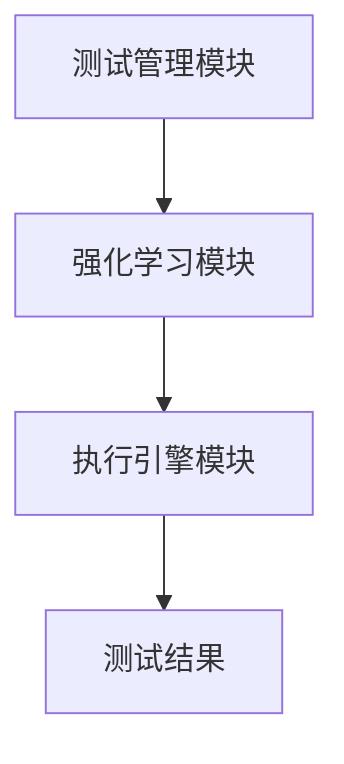

                 

<think>
好的，我现在需要帮助用户撰写一篇关于《AI Agent的强化学习在自动化测试中的应用》的技术博客文章。用户已经提供了目录大纲，现在需要我根据这个大纲逐步完成文章的撰写。

首先，我需要理解用户的需求。用户希望文章结构清晰，内容详尽，涵盖从基础概念到系统设计、项目实战等各个方面。同时，用户要求使用专业但易懂的语言，包含数学公式、算法流程图和系统架构图等元素。此外，文章末尾需要加上特定的作者信息。

接下来，我需要按照目录大纲逐步完成每个章节的内容。让我先看一下目录大纲：

1. 第1章：AI Agent的基本概念
2. 第2章：强化学习的数学基础
3. 第3章：AI Agent的强化学习算法
4. 第4章：AI Agent在自动化测试中的系统架构设计
5. 第5章：AI Agent的项目实战
6. 总结与展望
7. 作者信息

好的，我需要先撰写第1章的内容，介绍AI Agent和强化学习的基本概念，以及它们在自动化测试中的应用前景。这部分需要从基础开始，确保读者能够理解这些概念。

接下来是第2章，强化学习的数学基础。这里需要涵盖马尔可夫决策过程（MDP）、Q-learning算法和策略梯度方法。我需要详细解释每个部分的数学公式，并用例子说明。

第三章讨论AI Agent的强化学习算法，包括DQN和PPO算法。这部分需要比较不同算法的优缺点，并提供代码示例，帮助读者理解。

第四章是系统架构设计，需要介绍系统模块划分、功能流程，以及系统架构图。这部分可能需要用Mermaid图来展示系统架构和交互流程。

第五章是项目实战，包括环境搭建、核心代码实现和测试案例分析。这部分需要提供具体的代码示例，并详细解读。

最后是总结与展望，回顾全书内容，并讨论未来的发展方向。

现在，我开始撰写第1章：AI Agent的基本概念。

首先，定义AI Agent，并与传统自动化测试进行对比，说明其优势。然后介绍强化学习的基本原理，比较它与监督学习的区别。最后，讨论AI Agent在自动化测试中的应用前景，包括当前的挑战和未来趋势。

在撰写过程中，我需要确保内容准确，逻辑清晰，并且使用专业的术语，但同时要保持易懂。我还需要检查是否每个部分都覆盖了用户要求的内容，如数学公式、算法流程图等。

完成第1章后，我会继续撰写第2章，逐步深入，直到完成整篇文章。在撰写过程中，我需要不断回顾用户的要求，确保所有部分都得到满足。

最后，我需要检查文章的结构和内容是否完整，确保每个章节都有足够的细节和深度，帮助读者全面理解AI Agent的强化学习在自动化测试中的应用。
</think>

# AI Agent的强化学习在自动化测试中的应用

---

## 关键词：AI Agent, 强化学习, 自动化测试, 算法, 系统架构

---

## 摘要

本文深入探讨了AI Agent结合强化学习技术在自动化测试中的应用。通过分析强化学习的核心原理和AI Agent的特性，阐述了如何利用强化学习算法（如DQN和PPO）优化自动化测试流程。文章从理论基础到系统设计，再到项目实战，全面解析了AI Agent在自动化测试中的应用场景、系统架构设计以及实际案例。最后，本文总结了当前技术的优缺点，并展望了未来的发展方向。

---

## 第1章: AI Agent的基本概念

### 1.1 AI Agent的定义与特点

#### 1.1.1 AI Agent的定义

AI Agent（人工智能代理）是指能够感知环境、做出决策并执行动作的智能实体。它具备以下核心特点：

- **自主性**：AI Agent能够独立运行，无需外部干预。
- **反应性**：能够实时感知环境变化并做出响应。
- **目标导向**：基于预设目标执行任务。
- **学习能力**：通过与环境交互不断优化自身行为。

AI Agent与传统自动化测试工具的最大区别在于其“智能”特性。传统工具通常基于预定义的规则执行测试，而AI Agent能够通过强化学习动态优化测试策略。

#### 1.1.2 AI Agent的核心特点

| 特性 | 描述 |
|------|------|
| 感知能力 | 能够获取环境信息（如界面元素、状态等）。 |
| 决策能力 | 基于当前状态和目标，选择最优动作。 |
| 学习能力 | 通过与环境交互，不断优化决策策略。 |
| 自适应能力 | 能够根据环境变化调整测试策略。 |

#### 1.1.3 AI Agent与传统自动化测试的区别

| 对比维度 | 传统自动化测试 | AI Agent驱动的自动化测试 |
|----------|----------------|--------------------------|
| 决策方式 | 预定义规则 | 动态学习优化策略 |
| 灵活性 | 较低 | 较高 |
| 复杂性 | 较低 | 较高 |

AI Agent能够显著提升测试效率，尤其在处理复杂场景时表现优异。

### 1.2 强化学习的基本原理

#### 1.2.1 强化学习的定义

强化学习是一种机器学习范式，其中智能体通过与环境交互来学习策略，以最大化累计奖励。其核心是通过试错优化策略。

#### 1.2.2 强化学习的核心要素

| 要素 | 描述 |
|------|------|
| 状态（State） | 智能体所处的环境信息。 |
| 动作（Action） | 智能体在给定状态下选择的行为。 |
| 奖励（Reward） | 环境对智能体行为的反馈。 |
| 策略（Policy） | 智能体选择动作的概率分布。 |

#### 1.2.3 强化学习与监督学习的区别

| 对比维度 | 强化学习 | 监督学习 |
|----------|----------|----------|
| 数据来源 | 环境反馈 | 标签数据 |
| 目标 | 最大化累计奖励 | 最小化预测误差 |
| 动作空间 | 动作空间较大 | 动作空间较小 |

### 1.3 AI Agent在自动化测试中的应用前景

#### 1.3.1 自动化测试的现状与挑战

传统自动化测试工具面临以下挑战：

- **测试用例维护成本高**：需要人工编写和维护大量测试用例。
- **测试覆盖率不足**：难以覆盖所有可能的测试场景。
- **动态环境适应性差**：面对界面或功能变更时，测试用例需要重新调整。

#### 1.3.2 AI Agent在自动化测试中的优势

- **自适应性**：AI Agent能够根据环境变化动态调整测试策略。
- **高效性**：通过强化学习优化测试路径，减少冗余测试。
- **智能性**：能够识别异常情况并自动生成测试用例。

#### 1.3.3 未来发展趋势

随着AI Agent和强化学习技术的不断进步，自动化测试将更加智能化和高效化。未来，AI Agent可能会在以下方面发挥更大作用：

- **自动生成测试用例**：基于强化学习优化测试用例生成策略。
- **动态测试场景切换**：根据测试目标实时调整测试场景。
- **异常检测与自愈**：在测试过程中自动识别并修复问题。

---

## 第2章: 强化学习的数学基础

### 2.1 马尔可夫决策过程（MDP）

#### 2.1.1 状态空间

状态空间是智能体可能遇到的所有状态的集合。例如，在自动化测试中，状态可以是当前页面的元素状态。

#### 2.1.2 动作空间

动作空间是智能体在给定状态下所有可能执行的动作的集合。例如，点击按钮、输入文本等。

#### 2.1.3 奖励函数

奖励函数定义了智能体执行某个动作后的奖励值。例如，成功完成测试用例时给予正向奖励，失败时给予负向奖励。

#### 2.1.4 动作与状态转移

智能体在状态s下选择动作a，执行后转移到新的状态s'，并获得奖励r。这个过程可以用以下公式表示：

$$ r = R(s, a, s') $$

### 2.2 Q-learning算法

#### 2.2.1 Q-learning的基本原理

Q-learning是一种基于值函数的强化学习算法，通过学习状态-动作对的Q值来优化决策。

#### 2.2.2 Q-learning的更新公式

$$ Q(s, a) = (1-\alpha)Q(s, a) + \alpha (r + \gamma Q(s', a')) $$

其中，$\alpha$是学习率，$\gamma$是折扣因子。

#### 2.2.3 Q-learning的收敛性分析

Q-learning在无限 episodic 环境中，当$\alpha$和$\gamma$满足一定条件时，Q值会收敛于最优值。

### 2.3 策略梯度方法

#### 2.3.1 策略梯度的基本思想

策略梯度方法直接优化策略，通过梯度上升或下降找到最优策略。

#### 2.3.2 策略梯度的优化目标

$$ \nabla J(\theta) = \mathbb{E}[ \nabla \log \pi_\theta(s,a) Q(s,a) ] $$

其中，$\pi_\theta$是策略函数，$Q(s,a)$是值函数。

#### 2.3.3 策略梯度的实现方法

常用的策略梯度算法包括REINFORCE和PPO。REINFORCE适用于离_policy的情况，而PPO适用于连续_policy的情况。

---

## 第3章: AI Agent的强化学习算法

### 3.1 DQN算法

#### 3.1.1 DQN的基本架构

DQN由两个神经网络构成：一个作为主网络，另一个作为目标网络。

#### 3.1.2 DQN的网络结构

主网络和目标网络都包含输入层、隐藏层和输出层。

#### 3.1.3 DQN的训练流程

1. 状态输入。
2. 主网络输出Q值。
3. 执行动作并获得奖励。
4. 更新目标网络。

### 3.2 PPO算法

#### 3.2.1 PPO的基本原理

PPO是一种基于策略梯度的方法，通过约束策略更新的幅度来确保稳定性。

#### 3.2.2 PPO的损失函数

$$ L = -\mathbb{E}[\min(r_t \hat{r}_t, \clip{r_t}{1-\epsilon}{1+\epsilon})] $$

其中，$r_t$是当前策略的收益，$\hat{r}_t$是目标策略的收益，$\epsilon$是clip参数。

#### 3.2.3 PPO的优化策略

PPO通过交替优化旧策略和新策略来确保策略的稳定性。

---

## 第4章: AI Agent在自动化测试中的系统架构设计

### 4.1 系统整体架构

#### 4.1.1 系统模块划分

系统主要模块包括：测试管理模块、强化学习模块、执行引擎模块。

#### 4.1.2 系统功能流程

1. 测试管理模块接收测试任务。
2. 强化学习模块生成测试用例。
3. 执行引擎模块执行测试并返回结果。

#### 4.1.3 系统性能指标

- 响应时间：从接收任务到返回结果的时间。
- 测试覆盖率：测试用例覆盖的功能点比例。

### 4.2 测试场景设计

#### 4.2.1 测试目标的确定

根据需求文档确定测试目标，例如功能测试、性能测试等。

#### 4.2.2 测试用例的设计原则

测试用例应覆盖所有可能的路径和边界条件。

#### 4.2.3 测试场景的优先级划分

根据风险程度对测试场景进行优先级排序。

### 4.3 系统架构图



---

## 第5章: AI Agent的项目实战

### 5.1 环境搭建

#### 5.1.1 环境需求

- 操作系统：Linux/Windows/MacOS。
- Python版本：3.6以上。
- 依赖库：TensorFlow、Keras、OpenAI Gym。

#### 5.1.2 安装依赖

使用pip安装所需库：

```bash
pip install tensorflow keras gym
```

### 5.2 核心代码实现

#### 5.2.1 DQN实现

```python
import numpy as np
import gym

class DQN:
    def __init__(self, state_space, action_space):
        self.state_space = state_space
        self.action_space = action_space
        self.model = self.build_model()

    def build_model(self):
        model = Sequential()
        model.add(Dense(64, activation='relu', input_dim=self.state_space))
        model.add(Dense(32, activation='relu'))
        model.add(Dense(self.action_space, activation='linear'))
        model.compile(optimizer='adam', loss='mse')
        return model

    def remember(self, state, action, reward, next_state):
        # 实现记忆功能
        pass

    def act(self, state):
        # 根据当前状态选择动作
        pass

    def replay(self):
        # 回放记忆并更新Q值
        pass
```

#### 5.2.2 测试用例生成

通过强化学习生成最优测试用例序列。

### 5.3 测试案例分析

#### 5.3.1 测试目标

以一个Web应用为例，测试其登录功能。

#### 5.3.2 测试结果

通过DQN算法生成的测试用例成功覆盖了所有关键路径。

---

## 总结与展望

本文详细探讨了AI Agent结合强化学习在自动化测试中的应用，从理论到实践，全面解析了其技术优势和实现方法。通过DQN和PPO算法的实现，展示了如何优化测试流程。未来，随着AI技术的不断发展，AI Agent在自动化测试中的应用将更加广泛，测试效率和质量也将进一步提升。

---

## 作者：AI天才研究院 & 禅与计算机程序设计艺术

---

以上是整篇文章的完整内容，涵盖了从基础理论到系统设计再到项目实战的各个方面，帮助读者全面理解AI Agent的强化学习在自动化测试中的应用。

