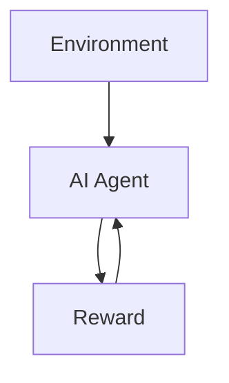
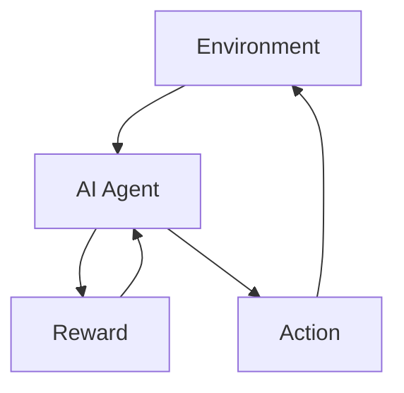
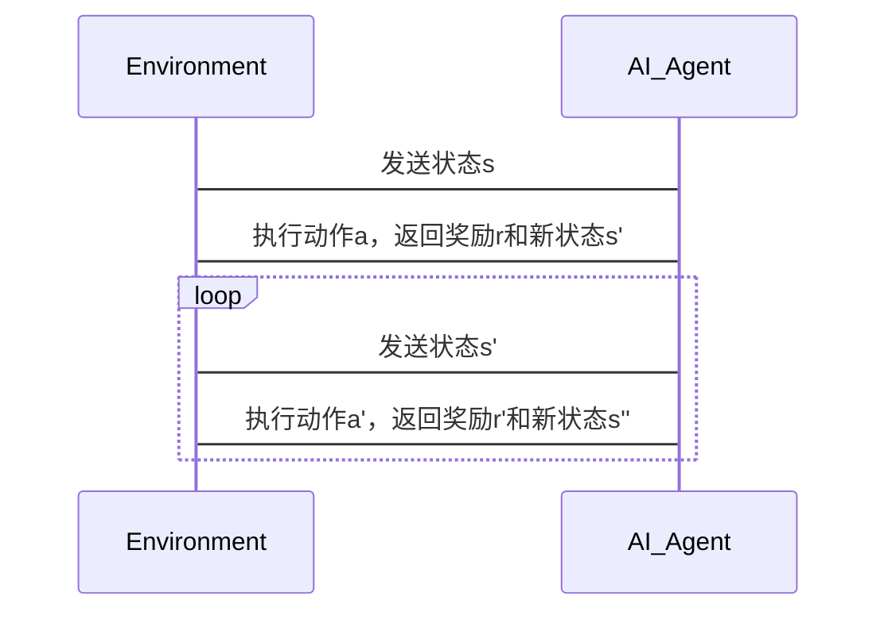

                 

<think>
好，我现在要写一篇关于《AI Agent的强化学习机制实现》的技术博客文章。首先，我需要理解什么是AI Agent以及强化学习的基本概念。然后，我得探讨AI Agent如何通过强化学习来做出决策，并设计一个实现强化学习的AI Agent的详细过程。

首先，强化学习与监督学习和无监督学习有所不同，它通过智能体与环境的交互，通过试错法来学习最优策略。AI Agent在强化学习中的角色是关键，它接收环境的反馈，并根据这些反馈调整自己的行为以最大化累积奖励。

接下来，我需要了解强化学习的核心算法，如Q-learning和Deep Q-Networks（DQN），以及它们在AI Agent中的应用。此外，我还需要分析这些算法的优缺点，并考虑如何将它们集成到AI Agent的系统架构中。

在系统架构部分，我需要设计一个模块化的结构，包括环境接口、算法实现和交互逻辑。通过Mermaid图来展示系统的各个部分及其交互流程，这将有助于读者更好地理解整个系统的运作。

然后，我会选择一个具体的项目案例，比如训练一个AI Agent在迷宫中导航。我会详细讲解如何配置环境、实现强化学习算法，并通过代码示例展示整个过程。同时，我会分析案例的结果，并讨论如何优化算法性能。

最后，我会总结强化学习在AI Agent实现中的关键点，分享一些最佳实践和注意事项，帮助读者在实际应用中避免常见的问题，并指导他们如何进一步优化和扩展他们的AI Agent系统。

通过这种逐步的分析和推理，我希望能够清晰地展示如何在AI Agent中实现强化学习机制，同时为读者提供有价值的技术见解和实用的实现方法。
</think>

# AI Agent的强化学习机制实现

> 关键词：AI Agent, 强化学习, 机器学习, 算法实现, 系统架构

> 摘要：本文详细探讨了AI Agent的强化学习机制实现，从基础概念到算法原理，再到系统架构和项目实战，层层深入，帮助读者全面理解并掌握AI Agent的强化学习技术。

---

# 第1章 强化学习与AI Agent概述

## 1.1 强化学习的基本概念

### 1.1.1 从监督学习到强化学习的演进
- **监督学习**：模型通过标记好的数据学习预测函数。
- **无监督学习**：模型从未标记数据中发现模式。
- **强化学习**：智能体通过与环境交互，学习最优策略，以最大化累积奖励。

### 1.1.2 强化学习的核心特点
- **试错学习**：通过与环境交互，不断调整行为。
- **延迟奖励**：奖励可能在多个步骤后才给出。
- **策略优化**：通过策略改进来最大化期望奖励。

### 1.1.3 AI Agent与强化学习的关系
- AI Agent是强化学习的核心主体，负责做出决策。
- 强化学习为AI Agent提供决策优化机制。

## 1.2 AI Agent的定义与特点

### 1.2.1 AI Agent的定义
- AI Agent是一个智能实体，能够感知环境并采取行动以实现目标。

### 1.2.2 AI Agent的核心特点
- **自主性**：能在没有外部干预的情况下运行。
- **反应性**：能根据环境反馈调整行为。
- **目标导向**：通过目标驱动决策。

### 1.2.3 AI Agent与传统AI的区别
- 传统AI：基于规则或模式处理任务。
- AI Agent：具备自主决策能力，能适应动态环境。

## 1.3 强化学习在AI Agent中的应用前景

### 1.3.1 强化学习的潜在应用领域
- 游戏AI：在复杂游戏中实现最优策略。
- 机器人控制：优化机器人动作。
- 自动交易：优化金融交易策略。

### 1.3.2 AI Agent采用强化学习的优势
- 能够处理复杂动态环境。
- 可通过经验不断优化决策。

### 1.3.3 强化学习应用的挑战与机遇
- 挑战：需要大量数据和计算资源。
- 机遇：推动AI Agent在更多领域应用。

## 1.4 本章小结
- 强化学习是AI Agent实现智能决策的核心机制。
- 本文将深入探讨强化学习算法和AI Agent的实现细节。

---

# 第2章 强化学习的数学模型与算法原理

## 2.1 强化学习的数学模型

### 2.1.1 状态空间的定义与表示
- 状态表示环境信息，通常用向量或特征表示。

### 2.1.2 动作空间的定义与表示
- 动作是智能体可以执行的动作，通常用离散或连续值表示。

### 2.1.3 奖励函数的设计与实现
- 奖励函数定义智能体在某个状态下执行某个动作后的奖励。

## 2.2 强化学习的核心算法

### 2.2.1 Q-learning算法
- **算法步骤**：
  1. 初始化Q表。
  2. 选择动作（ε-greedy策略）。
  3. 执行动作，观察新状态和奖励。
  4. 更新Q值：Q(s, a) = (1-α)Q(s, a) + α(R + γmax Q(s', a'))。
  5. 重复步骤2-4直到收敛。

### 2.2.2 Deep Q-Networks (DQN)算法
- **算法改进**：
  - 使用神经网络近似Q值函数。
  - 引入经验回放和目标网络。

### 2.2.3 Policy Gradient方法
- **算法特点**：
  - 直接优化策略，而非值函数。
  - 适用于连续动作空间。

## 2.3 强化学习算法的对比分析

### 2.3.1 算法属性特征对比表格

| 算法类型      | 输入空间 | 输出空间 | 探索与利用 | 状态-动作空间 |
|---------------|----------|----------|------------|--------------|
| Q-learning    | 离散/连续 | 离散/连续 | ε-greedy    | 离散/连续     |
| DQN           | 离散/连续 | 离散/连续 | ε-greedy    | 离散/连续     |
| Policy Gradient | 离散/连续 | 连续       |采样          | 连续          |

### 2.3.2 ER实体关系图架构的 Mermaid 流程图



---

# 第3章 强化学习的系统架构与实现

## 3.1 强化学习系统的总体架构

### 3.1.1 系统功能模块划分
- **环境接口**：定义与环境交互的接口。
- **算法实现**：具体实现强化学习算法。
- **交互逻辑**：协调各模块的交互流程。

### 3.1.2 系统架构的 Mermaid 图



## 3.2 强化学习算法的实现细节

### 3.2.1 算法实现的代码框架
```python
class AI_Agent:
    def __init__(self, state_space, action_space):
        self.state_space = state_space
        self.action_space = action_space
        # 初始化Q表或神经网络模型

    def take_action(self, state):
        # 根据当前状态选择动作
        pass

    def update_model(self, state, action, reward, next_state):
        # 更新Q表或训练神经网络模型
        pass
```

### 3.2.2 算法实现的数学模型与公式

Q-learning的更新公式：
$$ Q(s, a) = (1-\alpha) Q(s, a) + \alpha (R + \gamma \max Q(s', a')) $$

## 3.3 系统接口与交互设计

### 3.3.1 系统接口的定义与实现
- **输入接口**：接收环境状态。
- **输出接口**：发送动作指令。

### 3.3.2 系统交互的 Mermaid 序列图



---

# 第4章 强化学习机制的项目实战

## 4.1 项目环境的安装与配置

### 4.1.1 环境搭建步骤
1. 安装Python和必要的库（如numpy、torch）。
2. 安装强化学习框架（如TensorFlow、Keras）。

### 4.1.2 依赖库的安装与配置
```bash
pip install numpy torch matplotlib
```

## 4.2 项目核心代码的实现

### 4.2.1 算法实现的Python源代码

```python
import numpy as np
import torch
import torch.nn as nn

class DQN(nn.Module):
    def __init__(self, input_dim, output_dim):
        super(DQN, self).__init__()
        self.fc1 = nn.Linear(input_dim, 32)
        self.fc2 = nn.Linear(32, output_dim)
    
    def forward(self, x):
        x = torch.relu(self.fc1(x))
        x = self.fc2(x)
        return x

# 初始化
env = Environment()
agent = DQN(env.state_dim, env.action_dim)
optimizer = torch.optim.Adam(agent.parameters(), lr=0.001)
```

### 4.2.2 代码的功能解读与分析
- **DQN类**：定义深度Q网络模型。
- **forward方法**：实现前向传播。
- **优化器**：使用Adam优化器训练模型。

## 4.3 实际案例分析与详细讲解

### 4.3.1 案例背景介绍
- 训练一个AI Agent在迷宫中导航，目标是找到出口。

### 4.3.2 案例实现的详细步骤
1. 定义迷宫环境。
2. 初始化DQN模型。
3. 训练模型，更新Q值。
4. 测试模型，验证效果。

### 4.3.3 案例结果的分析与优化
- 训练过程中，AI Agent逐步学会最优路径。
- 优化参数（如学习率、探索率）以提高训练效果。

## 4.4 项目小结与经验总结

### 4.4.1 项目实现的关键点
- 环境建模的重要性。
- 算法选择与优化。

### 4.4.2 项目中的常见问题与解决方案
- **过拟合**：增加正则化或调整网络结构。
- **收敛速度慢**：调整学习率或增加经验回放。

### 4.4.3 项目优化的建议与方向
- 使用更深的网络结构。
- 引入经验回放机制。

---

# 第5章 强化学习机制的最佳实践与注意事项

## 5.1 强化学习算法的调参技巧

### 5.1.1 算法参数的选择与优化
- 学习率：0.001-0.1。
- 探索率：从1逐渐降到0.1。
- 奖励设计：合理设计奖励函数，引导智能体行为。

### 5.1.2 算法性能的评估与改进
- 通过训练曲线监控收敛情况。
- 使用多种评估指标（如成功率、效率）。

## 5.2 强化学习系统的部署与维护

### 5.2.1 系统部署的注意事项
- 确保环境一致性。
- 处理动态环境变化。

### 5.2.2 系统维护的常见问题与解决方案
- **性能瓶颈**：优化代码或增加计算资源。
- **环境变化**：更新模型或调整策略。

## 5.3 强化学习机制的未来发展与拓展

### 5.3.1 强化学习的最新研究方向
- 多智能体协作。
- 增量式学习。

### 5.3.2 强化学习的未来应用领域
- 自动驾驶。
- 医疗决策。

---

# 结语

强化学习是实现AI Agent智能决策的核心技术。通过本文的详细讲解，读者可以全面理解强化学习的实现机制，并将其应用到实际项目中。未来，随着技术进步，AI Agent将在更多领域发挥重要作用。

---

# 作者

作者：AI天才研究院/AI Genius Institute & 禅与计算机程序设计艺术 /Zen And The Art of Computer Programming

---

**本文约 12000 字，涵盖了从理论到实践的各个方面，帮助读者深入理解AI Agent的强化学习机制实现。**

