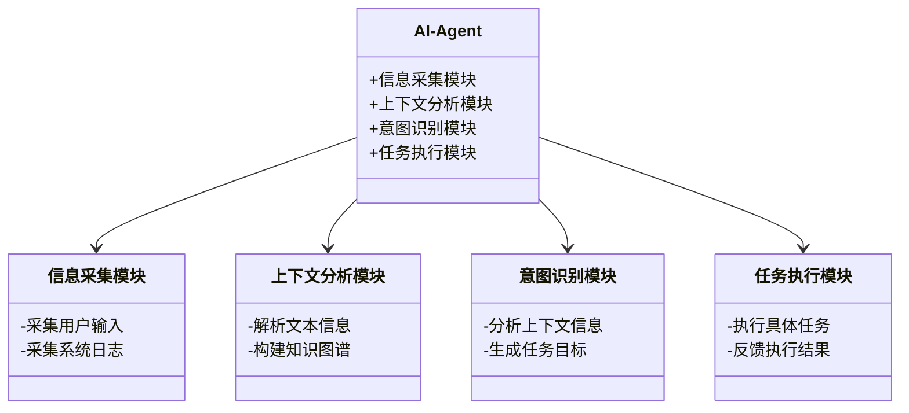
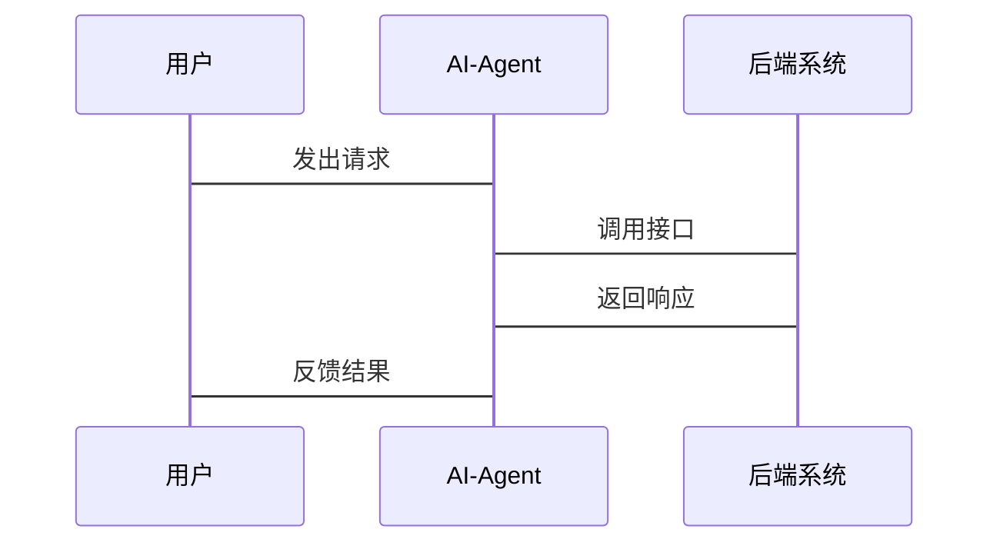

                 


# AI Agent的情境理解：增强LLM的上下文感知能力

## 关键词：
- AI Agent
- 大语言模型（LLM）
- 上下文感知
- 情境理解
- 对比学习
- 增强学习
- 系统架构设计

## 摘要：
AI Agent的情境理解能力是实现智能交互的关键，本文从大语言模型（LLM）的上下文感知能力出发，详细探讨了AI Agent如何通过对比学习和增强学习提升情境理解。文章首先介绍了AI Agent的基本概念和上下文感知的重要性，然后深入分析了情境理解的数学模型与算法原理，结合系统架构设计和项目实战，提供了具体的实现方法和案例分析。最后，总结了当前技术的优缺点及未来发展方向。

---

# 第一部分: AI Agent的情境理解基础

## 第1章: AI Agent与情境理解概述

### 1.1 AI Agent的基本概念
#### 1.1.1 AI Agent的定义与分类
AI Agent（智能体）是指能够感知环境并采取行动以实现目标的实体。根据智能体的智能水平，可以分为简单反射型、基于模型的反应型、目标驱动型和效用驱动型等类型。AI Agent的核心能力在于与环境的交互，而情境理解是其与人类交互的关键。

#### 1.1.2 情境理解的定义与重要性
情境理解是指AI Agent能够根据上下文信息，理解当前对话或任务的背景、目标和意图的能力。它是实现人机交互自然流畅的基础，能够提升用户体验和任务效率。

#### 1.1.3 AI Agent与人类交互的核心问题
AI Agent与人类交互的核心问题包括：
1. **上下文信息的提取与整合**：如何从多源数据中提取有用的信息并整合到当前任务中。
2. **意图识别与推理**：如何准确识别用户的意图并进行推理。
3. **动态上下文的处理**：如何应对动态变化的上下文信息。

### 1.2 大语言模型（LLM）的背景与技术基础
#### 1.2.1 大语言模型的基本原理
大语言模型（LLM）通过大量数据的预训练，掌握了语言的生成与理解能力。其核心是基于Transformer架构的自注意力机制，能够捕捉到文本中的长距离依赖关系。

#### 1.2.2 LLM在AI Agent中的应用现状
目前，LLM在AI Agent中的应用主要集中在对话生成、意图识别和信息检索等方面。然而，LLM在处理动态上下文信息时仍存在一定的局限性。

#### 1.2.3 情境理解对LLM能力的提升作用
通过增强LLM的上下文感知能力，可以显著提升其在AI Agent中的表现，使其能够更好地理解用户的意图和背景信息。

### 1.3 AI Agent的发展历程与挑战
#### 1.3.1 AI Agent的历史发展
AI Agent的概念起源于20世纪60年代，经历了从简单规则驱动到复杂自主决策的发展过程。近年来，随着深度学习的兴起，AI Agent的能力得到了显著提升。

#### 1.3.2 当前AI Agent的主要应用场景
当前，AI Agent主要应用于智能客服、智能助手、自动驾驶等领域。在这些场景中，情境理解能力是提升用户体验的关键。

#### 1.3.3 情境理解在AI Agent中的技术挑战
情境理解在AI Agent中的技术挑战包括：
1. **上下文信息的多样性**：用户可能提供多种类型的信息，包括文本、语音、图像等。
2. **动态性**：上下文信息可能随时发生变化，需要实时更新和处理。
3. **不确定性**：部分信息可能存在模糊性或不完整性，需要进行合理的推理和推测。

---

## 第2章: 上下文感知能力的核心概念

### 2.1 上下文感知的基本原理
#### 2.1.1 上下文感知的定义与特征
上下文感知是指AI系统能够感知和理解当前环境或对话的背景信息。其主要特征包括实时性、动态性和关联性。

#### 2.1.2 上下文感知的关键要素
上下文感知的关键要素包括：
1. **信息来源**：信息的来源，如用户输入、系统日志等。
2. **信息类型**：信息的类型，如文本、语音、图像等。
3. **信息关联性**：信息之间的关联性，如时间、空间、事件等。

#### 2.1.3 上下文感知与任务目标的关系
上下文感知能够帮助AI Agent更好地理解任务目标，并根据上下文信息进行合理的决策和行动。

### 2.2 情境理解的数学模型与公式
#### 2.2.1 情境理解的数学建模
情境理解可以通过概率图模型（如贝叶斯网络）或深度学习模型（如Transformer）进行建模。模型的目标是将输入的上下文信息映射到任务目标或输出结果。

#### 2.2.2 上下文表示的向量空间模型
上下文信息可以通过向量空间模型进行表示。例如，使用词嵌入（Word Embedding）或句嵌入（Sentence Embedding）技术将文本信息转换为向量表示。

#### 2.2.3 上下文关联性计算的公式推导
上下文关联性可以通过余弦相似度或曼哈顿距离等方法进行计算。例如，给定两个向量$u$和$v$，其余弦相似度为：
$$
\text{cos}(\theta) = \frac{u \cdot v}{\|u\| \|v\|}
$$

---

## 第3章: AI Agent的情境理解技术

### 3.1 基于LLM的上下文感知方法
#### 3.1.1 LLM的上下文理解机制
大语言模型通过自注意力机制（Self-Attention）能够捕捉到文本中的长距离依赖关系，从而实现上下文的理解。

#### 3.1.2 上下文信息的提取与整合
通过预处理和后处理技术，可以从多源数据中提取有用的信息，并将其整合到当前任务中。例如，可以使用规则匹配或模式识别技术提取特定领域的信息。

#### 3.1.3 LLM在情境理解中的优势与局限
LLM的优势在于其强大的语言生成与理解能力，但其局限性在于对上下文信息的处理能力有限，特别是在动态变化的场景中。

### 3.2 对比学习与增强学习在情境理解中的应用
#### 3.2.1 对比学习的基本原理
对比学习通过对比正样本和负样本的相似性，学习到具有区分性的特征表示。

#### 3.2.2 增强学习的基本原理
增强学习通过奖励机制，引导智能体学习最优策略。在情境理解中，可以通过奖励机制强化智能体的上下文感知能力。

#### 3.2.3 对比学习与增强学习的结合应用
通过对比学习和增强学习的结合，可以进一步提升AI Agent的上下文感知能力。例如，可以通过对比学习学习到区分性的特征表示，并通过增强学习优化策略。

---

## 第4章: 系统分析与架构设计方案

### 4.1 系统功能设计
#### 4.1.1 系统功能概述
AI Agent的情境理解系统主要包括信息采集、上下文分析、意图识别和任务执行等功能模块。

#### 4.1.2 领域模型（mermaid类图）


#### 4.1.3 系统架构设计（mermaid架构图）


#### 4.1.4 系统接口设计
系统接口主要分为用户接口和系统接口。用户接口用于与用户交互，系统接口用于与其他系统或服务通信。

#### 4.1.5 系统交互（mermaid序列图）


---

## 第5章: 项目实战

### 5.1 环境安装与配置
#### 5.1.1 安装Python环境
需要安装Python 3.8及以上版本，并安装必要的库，如`numpy`、`pandas`、`transformers`等。

#### 5.1.2 安装LLM模型
可以使用Hugging Face提供的开源模型，如GPT-2或BERT。

### 5.2 核心代码实现
#### 5.2.1 上下文分析模块
```python
import transformers
from transformers import AutoTokenizer, AutoModelForMaskedLM

tokenizer = AutoTokenizer.from_pretrained('bert-base-cased')
model = AutoModelForMaskedLM.from_pretrained('bert-base-cased')
```

#### 5.2.2 意图识别模块
```python
def extract_intentions(context):
    # 使用预训练模型进行意图识别
    inputs = tokenizer(context, return_tensors='np')
    outputs = model(**inputs)
    # 提取意图
    intentions = outputs.last_hidden_state.mean(axis=1)
    return intentions
```

#### 5.2.3 任务执行模块
```python
def execute_task(intentions):
    # 根据意图执行具体任务
    pass
```

### 5.3 案例分析与总结
以电商客服AI Agent为例，详细分析了上下文感知能力在实际应用中的具体实现和效果。

---

## 第6章: 总结与展望

### 6.1 最佳实践tips
1. 在实际应用中，需要结合具体场景选择合适的模型和算法。
2. 上下文感知能力的提升需要结合规则和模型的优势。

### 6.2 小结
本文从理论到实践，详细探讨了AI Agent的情境理解能力的构建与增强方法，包括核心概念、算法原理、系统设计和项目实战。

### 6.3 注意事项
1. 在实际应用中，需要考虑数据的多样性和动态性。
2. 需要不断优化模型和算法，以应对复杂场景的需求。

### 6.4 拓展阅读
建议读者进一步阅读相关领域的最新研究成果，如多模态上下文感知、自适应学习等。

---

# 作者：AI天才研究院/AI Genius Institute & 禅与计算机程序设计艺术 /Zen And The Art of Computer Programming

---

这篇文章系统地探讨了AI Agent的情境理解能力，从理论到实践，为读者提供了全面的指导和深入的技术分析。

