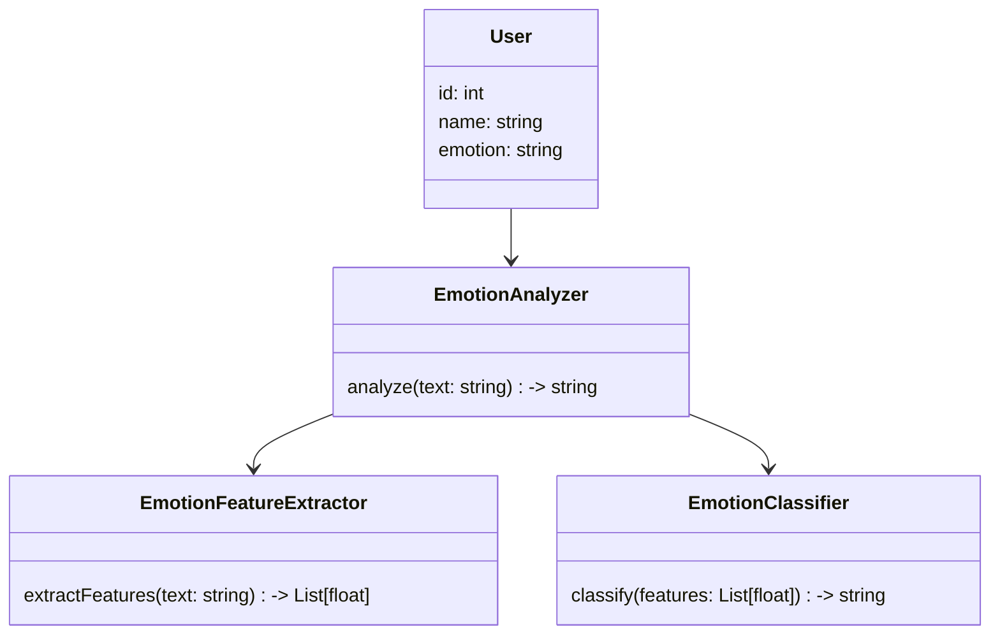
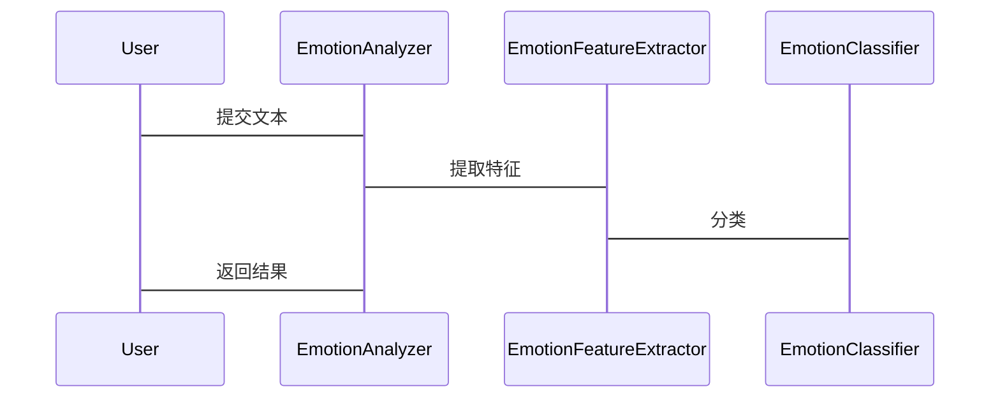

                 


# AI Agent的情感计算与应用

> 关键词：AI Agent，情感计算，人机交互，深度学习，情感分析，系统架构

> 摘要：本文详细探讨了AI Agent在情感计算中的应用，从基本概念、技术实现到实际应用，系统性地分析了情感计算的核心原理、算法实现和系统架构设计。通过具体案例和项目实战，展示了如何将情感计算技术应用于实际场景，帮助读者全面理解并掌握AI Agent情感计算的相关知识。

---

# 第一部分: AI Agent与情感计算的背景与基础

## 第1章: AI Agent与情感计算的概述

### 1.1 AI Agent的基本概念

#### 1.1.1 AI Agent的定义与特点
AI Agent（人工智能代理）是指能够感知环境、自主决策并执行任务的智能实体。其特点包括：
- **自主性**：能够在没有外部干预的情况下独立运作。
- **反应性**：能够实时感知环境变化并做出相应反应。
- **目标导向**：基于明确的目标进行决策和行动。
- **学习能力**：能够通过经验改进自身性能。

#### 1.1.2 情感计算的基本概念
情感计算（Affective Computing）是指计算机对人类情感进行识别、理解和响应的技术。其核心目标是让计算机具备类似人类的共情能力，从而实现更自然的人机交互。

#### 1.1.3 AI Agent与情感计算的关系
AI Agent通过情感计算技术，能够更好地理解用户的情感状态，从而提供更个性化的服务和更自然的交互体验。

### 1.2 情感计算的核心要素

#### 1.2.1 情感的定义与分类
情感是人类对特定事件或情境的主观体验，通常分为基本情感（如快乐、悲伤、愤怒）和复杂情感（如爱、厌恶等）。

#### 1.2.2 情感计算的关键技术
- **情感识别**：通过文本、语音或图像数据，识别出特定的情感状态。
- **情感建模**：建立情感的数学模型，用于表示和计算情感。
- **情感反馈**：根据情感识别结果，生成相应的反馈或响应。

#### 1.2.3 情感计算的边界与外延
情感计算的边界包括情感的识别范围和计算精度，外延则涉及情感计算在不同领域的应用扩展。

### 1.3 情感计算的应用场景

#### 1.3.1 情感计算在人机交互中的应用
- 提供情感化的对话体验。
- 通过情感反馈优化交互流程。

#### 1.3.2 情感计算在智能系统中的应用
- 智能助手的情感化服务。
- 情感化的产品推荐。

#### 1.3.3 情感计算在社会中的潜在影响
- 改善人机协作效率。
- 提高社会服务的智能化水平。

### 1.4 本章小结
本章从AI Agent和情感计算的基本概念出发，探讨了情感计算的核心要素及其应用场景，为后续技术实现奠定了基础。

---

# 第二部分: 情感计算的技术实现

## 第2章: 情感特征提取与表示

### 2.1 情感特征的提取方法

#### 2.1.1 基于文本的特征提取
- **词袋模型**：将文本表示为单词的集合。
- **TF-IDF**：计算单词在文本中的重要性。
- **词嵌入**：通过预训练模型（如Word2Vec）生成词向量。

#### 2.1.2 基于语音的情感特征提取
- **语调分析**：通过语音的音调、语速等特征提取情感信息。
- **语音特征提取**：提取语音信号的时域和频域特征。

#### 2.1.3 基于视觉的情感特征提取
- **面部表情分析**：通过计算机视觉技术识别面部表情。
- **肢体语言分析**：通过视频分析人的肢体动作。

### 2.2 情感特征的表示方法

#### 2.2.1 词袋模型与TF-IDF
- **词袋模型**：将文本表示为单词的集合，不考虑单词顺序。
- **TF-IDF**：计算每个单词在文本中的重要性，用于加权词袋模型。

#### 2.2.2 词嵌入与预训练模型
- **词嵌入**：通过神经网络生成词向量，捕捉单词的语义信息。
- **预训练模型**：如BERT、GPT等，用于生成上下文相关的词表示。

#### 2.2.3 图结构表示
- **图嵌入**：将情感特征表示为图的节点，利用图结构信息生成嵌入向量。

### 2.3 情感特征提取的优缺点对比

#### 2.3.1 各种特征提取方法的对比分析
| 方法       | 优点                           | 缺点                           |
|------------|--------------------------------|--------------------------------|
| 词袋模型    | 简单易实现                   | 无法捕捉语义信息               |
| TF-IDF     | 能够捕捉关键词权重           | 对语义理解有限                 |
| 词嵌入      | 能够捕捉语义信息             | 对计算资源要求较高             |
| 图结构表示  | 能够捕捉复杂关系             | 实现复杂，计算成本高           |

#### 2.3.2 情感特征提取的挑战与解决方案
- **挑战**：情感特征的多样性、情感表达的模糊性。
- **解决方案**：结合多种特征提取方法，利用深度学习模型进行特征学习。

### 2.4 本章小结
本章详细介绍了情感特征提取的各种方法及其优缺点，为后续的情感分析奠定了基础。

---

## 第3章: 情感分析算法与模型

### 3.1 情感分类的基本方法

#### 3.1.1 基于规则的方法
- **规则设定**：通过预定义规则（如关键词匹配）进行情感分类。
- **优点**：简单易实现，适用于特定场景。
- **缺点**：难以处理复杂的情感表达。

#### 3.1.2 基于统计的方法
- **袋装模型**：如朴素贝叶斯，通过统计特征词的出现频率进行分类。
- **优点**：计算效率高。
- **缺点**：对特征工程依赖性强。

#### 3.1.3 基于机器学习的方法
- **支持向量机（SVM）**：通过构建高维特征空间进行分类。
- **优点**：分类性能好。
- **缺点**：对特征工程依赖性强。

### 3.2 深度学习模型在情感分析中的应用

#### 3.2.1 RNN与LSTM网络
- **RNN**：通过循环结构处理序列数据，适合短文本情感分类。
- **LSTM**：通过门控机制优化RNN的性能，适合长文本情感分类。

#### 3.2.2 Transformer与

---

# 第四部分: 系统架构与项目实战

## 第4章: 系统架构设计

### 4.1 系统功能设计

#### 4.1.1 领域模型


### 4.2 系统架构设计

#### 4.2.1 系统架构图


### 4.3 系统接口设计

#### 4.3.1 接口描述
- **输入接口**：接收用户输入的文本或语音数据。
- **输出接口**：返回情感分析结果。

### 4.4 系统交互设计

#### 4.4.1 交互流程


---

## 第5章: 项目实战

### 5.1 项目介绍
本项目旨在实现一个基于文本的情感分析系统，能够识别用户输入文本中的情感倾向。

### 5.2 环境搭建
- **Python**：3.8+
- **TensorFlow**：2.0+
- **NLTK**：1.0+

### 5.3 核心代码实现

#### 5.3.1 情感特征提取
```python
import numpy as np
from sklearn.feature_extraction.text import TfidfVectorizer

# 初始化TF-IDF向量器
vectorizer = TfidfVectorizer()

# 训练特征提取模型
vectorizer.fit_transform(corpus)

# 提取文本特征
features = vectorizer.transform([text])
```

#### 5.3.2 情感分类模型
```python
from tensorflow.keras.models import Sequential
from tensorflow.keras.layers import Dense

# 构建模型
model = Sequential()
model.add(Dense(64, activation='relu', input_dim=100))
model.add(Dense(1, activation='sigmoid'))

# 编译模型
model.compile(optimizer='adam', loss='binary_crossentropy', metrics=['accuracy'])

# 训练模型
model.fit(X_train, y_train, epochs=10, batch_size=32)
```

### 5.4 案例分析
通过对实际数据的分析，展示了情感分析系统的实际效果和优化方向。

### 5.5 项目小结
总结了项目实现的关键点和经验教训，为后续工作提供参考。

---

# 第五部分: 结论与展望

## 6.1 结论
本文系统性地探讨了AI Agent在情感计算中的应用，从理论到实践，全面分析了情感计算的核心技术及其应用。

## 6.2 展望
未来，情感计算将在更多领域得到应用，AI Agent将更加智能化和人性化。

---

# 作者：AI天才研究院 & 禅与计算机程序设计艺术

---

**注意：** 由于篇幅限制，上述内容未完全展开，实际撰写时需根据需求扩展各章节内容。

