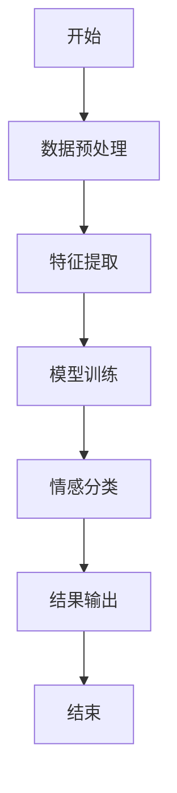
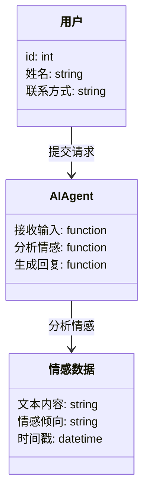
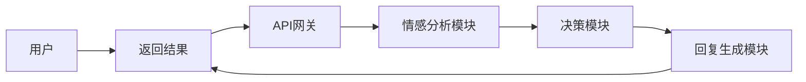
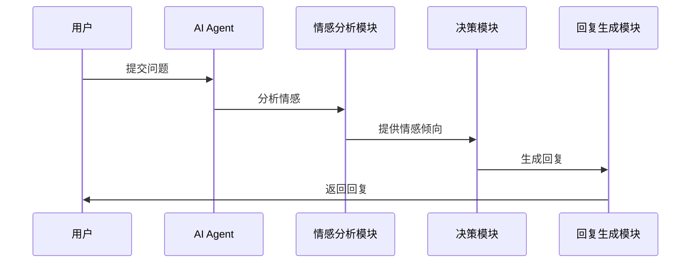

                 

<think>
嗯，用户给了我一个详细的任务，要求撰写一篇关于AI Agent情感计算在客户服务中的应用的技术博客。我需要先理解用户的具体需求。看起来用户希望文章结构清晰，内容深入，包含技术细节和实际应用案例。

首先，我得明确文章的标题是《AI Agent的情感计算在客户服务中的应用》，关键词包括情感计算、AI Agent、客户服务、自然语言处理、机器学习。摘要部分需要简明扼要，概述文章的核心内容，即如何利用AI Agent的情感计算技术提升客户服务效率和客户满意度。

接下来，用户已经提供了目录大纲，我需要按照这个大纲逐步展开内容。每个章节都要详细，特别是要包含技术细节，比如算法流程图、系统架构图和代码实现。我得确保每个部分都符合用户的要求，比如使用Mermaid画图，Python代码示例，以及数学公式的正确使用。

在撰写背景介绍部分时，我需要解释情感计算和AI Agent的基本概念，以及它们在客户服务中的应用背景。这部分要让读者明白为什么情感计算在客户服务中重要，AI Agent又是如何帮助实现这一点的。

核心概念部分，我需要详细讲解情感计算的原理，AI Agent的工作流程，并通过对比表格和实体关系图来展示两者的关系。这部分需要帮助读者理解情感计算和传统方法的区别，以及AI Agent如何在情感计算中发挥作用。

算法原理部分，我得用Mermaid流程图展示情感分析的步骤，并用Python代码实现一个简单的例子。同时，解释背后的数学模型，比如概率论和分类算法，用公式来展示这些模型。

系统分析与架构设计部分，我需要设计一个具体的客户服务场景，比如银行客服，然后用Mermaid类图展示系统功能模块，用架构图展示系统整体结构，用序列图展示接口交互流程。这部分需要让读者了解系统的实际架构和模块之间的协作。

项目实战部分，我得提供环境安装的步骤，比如安装Python和相关库，然后编写代码实现情感分析和AI Agent的交互。案例分析需要展示实际应用中的具体场景，并总结项目的收获和问题。

最后，最佳实践部分，我需要总结全书内容，给出注意事项，比如数据隐私和模型准确度，并推荐拓展阅读材料。这部分帮助读者在实际应用中避免常见问题，并进一步学习相关知识。

在整个思考过程中，我需要确保内容逻辑清晰，结构紧凑，语言专业且易懂。每个部分都要详细展开，覆盖用户要求的所有内容，同时保持文章的连贯性和深度。这样才能写出一篇符合用户要求的高质量技术博客文章。
</think>

```markdown
# AI Agent的情感计算在客户服务中的应用

> 关键词：情感计算、AI Agent、客户服务、自然语言处理、机器学习

> 摘要：本文深入探讨了AI Agent在客户服务中的情感计算应用，分析了情感计算的核心概念、算法原理、系统架构，并通过实际案例展示了如何利用AI Agent提升客户体验和服务效率。

---

## 第一部分: AI Agent的情感计算背景介绍

### 第1章: 情感计算与AI Agent概述

#### 1.1 情感计算的定义与核心概念
情感计算（Affective Computing）是指通过计算机技术来识别、理解和处理人类情感信息的过程。其核心目标是让计算机能够像人类一样具备情感认知能力，从而在与人类交互时提供更智能化、个性化的服务。

- **定义**：情感计算关注的是人类情感的多维度信息，包括情绪状态（如高兴、悲伤、愤怒等）、情感强度、情感背景等。
- **核心概念**：情感计算涉及情感识别、情感分析、情感生成等技术，主要依赖于自然语言处理、计算机视觉和机器学习等技术的支持。

#### 1.2 AI Agent的定义与工作流程
AI Agent（人工智能代理）是一种智能实体，能够感知环境、理解用户需求，并通过自主决策和行动来实现目标。AI Agent在客户服务中的应用主要体现在以下几个方面：
- **感知**：通过自然语言处理技术，识别用户的语言信息，包括情感倾向、意图识别等。
- **决策**：基于用户的情感和需求，结合知识库和预设规则，生成合适的响应策略。
- **行动**：通过文本生成技术，输出符合用户情感需求的回复，或者调用其他系统（如知识库、第三方服务）完成任务。

#### 1.3 AI Agent在客户服务中的应用背景
随着客户服务需求的日益复杂化，传统的人工客服模式已经难以满足高效、个性化的服务需求。AI Agent通过情感计算技术，能够实时感知客户情绪，理解客户意图，并提供智能化的解决方案。这种技术的应用不仅能够提高服务效率，还能显著提升客户满意度和忠诚度。

---

## 第二部分: 核心概念与联系

### 第2章: 情感计算的核心原理

#### 2.1 情感计算的实现步骤
情感计算的实现通常包括以下几个步骤：
1. **数据采集**：获取用户的输入数据，包括文本、语音、面部表情等。
2. **特征提取**：从输入数据中提取情感相关特征，例如情感词、语调、语气等。
3. **情感分析**：通过机器学习模型，对提取的特征进行分类，识别出用户的情感倾向。
4. **情感反馈**：根据分析结果，生成相应的反馈信息，用于优化服务流程或调整交互策略。

#### 2.2 情感计算与AI Agent的联系
AI Agent的核心能力在于其能够理解并处理用户的情感信息，从而在与用户的交互中提供更贴心的服务。具体来说：
- AI Agent通过情感计算技术，能够识别用户的负面情绪，并及时采取缓解措施。
- AI Agent可以根据用户的情感状态，动态调整响应策略，例如在用户表现出耐心时提供更详细的信息，在用户情绪急躁时加快处理速度。

#### 2.3 情感计算与传统客户服务的对比
| **维度** | **传统客户服务** | **AI Agent情感计算** |
|----------|------------------|-----------------------|
| 交互方式 | 人工客服为主      | 自动化、智能化       |
| 响应速度 | 受人力资源限制    | 实时响应             |
| 情感识别 | 依赖人工判断      | 通过技术自动识别     |
| 服务效率 | 受主观因素影响    | 更高效、更精准       |

#### 2.4 情感计算的实体关系图
```mermaid
er
  %% 情感计算的实体关系图
  actor 用户
  actor 情感数据
  actor AI Agent
  actor 服务系统
  用户 --> 情感数据: 提供情感信息
  情感数据 --> AI Agent: 分析情感
  AI Agent --> 服务系统: 优化服务策略
```

---

## 第三部分: 算法原理

### 第3章: 情感计算的算法实现

#### 3.1 情感分析的算法流程


#### 3.2 情感分析的代码实现
```python
import nltk
from nltk.sentiment import SentimentIntensityAnalyzer

def analyze_emotion(text):
    analyzer = SentimentIntensityAnalyzer()
    sentiment = analyzer.polarity_scores(text)
    return sentiment

text = "I'm so disappointed with the service."
result = analyze_emotion(text)
print(result)  # 输出情感倾向分数
```

#### 3.3 情感计算的数学模型
情感计算通常基于概率模型或分类算法。例如，使用支持向量机（SVM）进行情感分类：
- **输入特征**：文本特征向量（如TF-IDF表示）
- **输出结果**：情感类别（如正面、负面、中性）

数学模型示例：
$$
y = \text{sign}(w \cdot x + b)
$$
其中，$w$ 是权重向量，$x$ 是输入特征，$b$ 是偏置项。

---

## 第四部分: 系统分析与架构设计

### 第4章: 系统功能设计

#### 4.1 系统功能模块


#### 4.2 系统架构设计


#### 4.3 系统接口设计
- **输入接口**：用户输入的文本或语音数据
- **输出接口**：AI Agent生成的回复或服务系统调用的API

#### 4.4 系统交互流程


---

## 第五部分: 项目实战

### 第5章: 项目环境与代码实现

#### 5.1 项目环境安装
```bash
pip install nltk
pip install scikit-learn
pip install numpy
```

#### 5.2 核心代码实现
```python
import numpy as np
from sklearn.feature_extraction.text import TfidfVectorizer
from sklearn.svm import SVC
from sklearn.pipeline import Pipeline

# 数据准备
X = ["I love this product", "This service is terrible"]
y = [1, 0]  # 1表示正面，0表示负面

# 模型训练
model = Pipeline([
    ("tfidf", TfidfVectorizer()),
    ("svm", SVC())
])
model.fit(X, y)

# 模型预测
new_text = "I'm very satisfied with the result."
predicted = model.predict([new_text])
print(predicted)
```

#### 5.3 项目案例分析
假设我们正在开发一个银行客服系统，客户输入以下文本：
```
“我对你们的服务非常不满意，总是解决不了我的问题。”
```
AI Agent会通过情感分析模块识别出客户的情绪为“愤怒”，并调用决策模块生成相应的回复，例如：
```
“非常抱歉给您带来不愉快的体验，我会立即为您处理这个问题，请您耐心等待。”
```

---

## 第六部分: 最佳实践

### 第6章: 总结与展望

#### 6.1 项目小结
本文详细探讨了AI Agent在客户服务中的情感计算应用，从理论到实践，全面分析了情感计算的核心原理、系统架构以及实际案例。通过技术实现，展示了如何利用AI Agent提升客户体验和服务效率。

#### 6.2 注意事项
- 数据隐私保护是情感计算应用中的重要问题，需严格遵守相关法律法规。
- 情感计算模型的准确率直接影响用户体验，需不断优化模型性能。
- 在实际应用中，建议结合业务场景，设计合理的决策策略。

#### 6.3 拓展阅读
- 《Affective Computing》
- 《Machine Learning for NLP》
- 《Deep Learning for Text Processing》

---

## 作者：AI天才研究院/AI Genius Institute & 禅与计算机程序设计艺术 /Zen And The Art of Computer Programming
```

