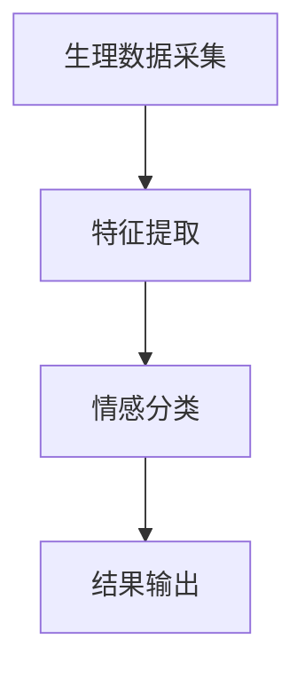
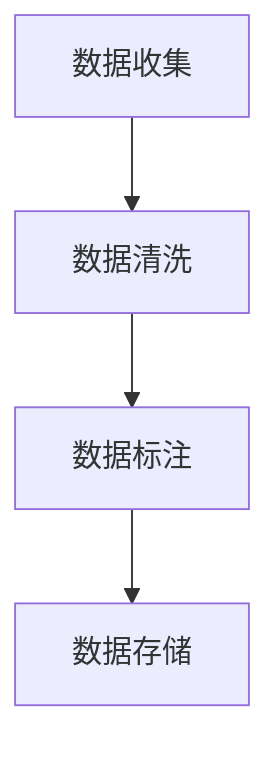
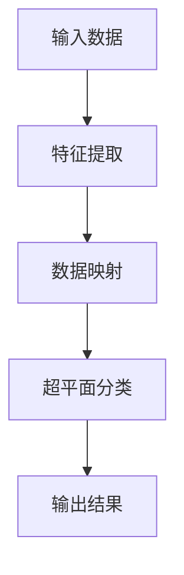
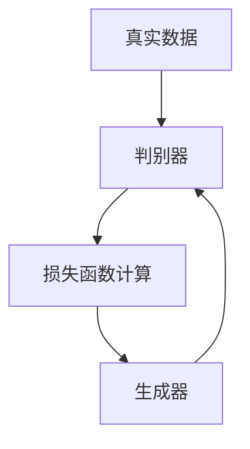
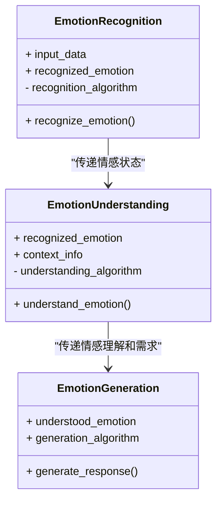
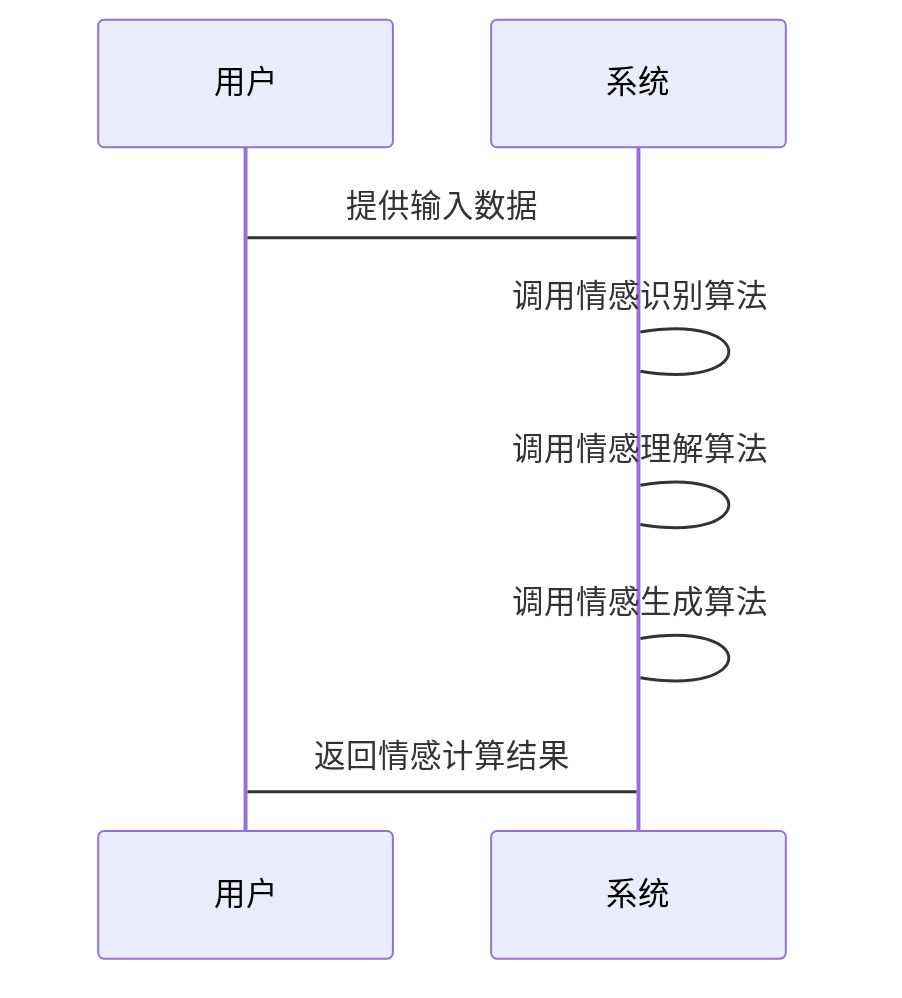

                 


# AI Agent的情感计算：识别、理解和生成情感反应

---

## 关键词：情感计算、AI Agent、情感识别、情感生成、人机交互

---

## 摘要

情感计算（Affective Computing）是人工智能领域的重要分支，旨在让计算机能够理解、识别和模拟人类情感。本文将深入探讨AI Agent在情感计算中的应用，涵盖情感识别、理解和生成的关键技术，分析其算法原理、系统架构，并通过实际案例展示如何实现这些技术。文章还提供了最佳实践和未来发展方向的建议，帮助读者全面掌握AI Agent情感计算的核心内容。

---

## 目录大纲

### 第一部分: AI Agent情感计算的背景与核心概念

### 第二部分: 情感识别的理论基础与实现方法

### 第三部分: 情感理解与生成的算法原理

### 第四部分: 情感计算系统的架构设计与实现

### 第五部分: 项目实战：构建一个AI Agent情感计算系统

### 第六部分: 最佳实践与未来展望

---

## 正文内容

### 第一部分: AI Agent情感计算的背景与核心概念

#### 1.1 情感计算的定义与研究领域

情感计算是一种通过计算机技术来识别、理解和模拟人类情感的科学。它不仅关注情感的外在表现，如面部表情和语调，还关注情感的内在特征，如情绪状态和情感动机。情感计算的研究领域包括心理学、人工智能、机器学习、自然语言处理和计算机视觉等多个学科。

**关键概念对比表：**

| 概念       | 定义                                                                 |
|------------|----------------------------------------------------------------------|
| 情感识别    | 通过生理指标或行为数据识别情感状态。                                       |
| 情感理解    | 基于情感识别结果，分析情感的语境和含义。                                   |
| 情感生成    | 根据情感理解和需求，生成相应的情感表达或反馈。                             |

#### 1.2 AI Agent与情感计算的关系

AI Agent（智能体）是一种能够感知环境、自主决策并采取行动的实体。情感计算为AI Agent提供了理解人类情感的能力，使其能够更自然地与人类交互。AI Agent在情感计算中的应用包括情感支持、个性化推荐和情感陪护等。

**AI Agent情感计算的实体关系图：**

```mermaid
erDiagram
    user &&-|> emotion_data : "产生"
    emotion_data ||--|> emotion_recognition : "输入"
    emotion_recognition ||--|> emotion_understanding : "处理"
    emotion_understanding ||--|> emotion_generation : "输出"
    emotion_generation -->| user : "反馈"
```

---

### 第二部分: 情感识别的理论基础与实现方法

#### 2.1 情感识别的基本概念

情感识别是通过分析用户的输入（如语音、文本、面部表情）来确定其情感状态。常用的情感识别方法包括基于语音的情感分析和基于文本的情感分析。

**情感识别的关键技术对比：**

| 技术         | 描述                                                                 |
|--------------|----------------------------------------------------------------------|
| 语音分析     | 通过语音的音调、语速等特征识别情感。                                     |
| 文本分析     | 基于文本的情感词提取和情感倾向分析。                                     |
| 面部表情分析 | 通过计算机视觉技术识别面部表情特征。                                     |

#### 2.2 情感识别的生理基础

情感识别的生理指标包括心率、皮肤电活动和呼吸频率等。这些指标的变化可以反映人的情感状态。

**基于生理指标的情感识别流程图：**



#### 2.3 情感识别的语料库构建

语料库是情感识别的重要数据来源。常用的语料库包括情感标注的文本数据和语音数据。

**语料库构建流程图：**



---

### 第三部分: 情感理解与生成的算法原理

#### 3.1 情感理解的算法实现

情感理解需要分析情感的语境和含义，常用算法包括支持向量机（SVM）和卷积神经网络（CNN）。

**支持向量机（SVM）流程图：**



**SVM数学模型：**

$$ \text{目标函数} = \min_{w,b,\xi} \frac{1}{2}||w||^2 + C\sum_{i=1}^n \xi_i $$
$$ \text{约束条件} = y_i(w \cdot x_i + b) \geq 1 - \xi_i, \xi_i \geq 0 $$

#### 3.2 情感生成的算法实现

情感生成需要根据情感理解和需求生成相应的情感表达。常用算法包括生成对抗网络（GAN）和循环神经网络（RNN）。

**生成对抗网络（GAN）流程图：**



**GAN数学模型：**

$$ \min_{G} \max_{D} \mathbb{E}_{x \sim p_{\text{data}}}[\log D(x)] + \mathbb{E}_{z \sim p_{z}}[\log (1 - D(G(z)))] $$

---

### 第四部分: 情感计算系统的架构设计与实现

#### 4.1 系统功能设计

情感计算系统需要实现情感识别、理解和生成功能。

**系统功能设计类图：**



#### 4.2 系统架构设计

情感计算系统的架构通常采用分层设计，包括数据层、算法层和应用层。

**系统架构设计图：**


#### 4.3 系统接口设计

情感计算系统的接口设计需要考虑数据输入、算法调用和结果输出。

**系统接口设计序列图：**



---

### 第五部分: 项目实战：构建一个AI Agent情感计算系统

#### 5.1 环境安装

需要安装Python、TensorFlow、Keras和OpenCV等库。

```bash
pip install numpy
pip install pandas
pip install scikit-learn
pip install tensorflow
pip install matplotlib
pip install opencv-python
```

#### 5.2 核心实现

以下是情感识别和情感生成的代码示例：

**情感识别代码：**

```python
import numpy as np
from sklearn import svm

# 假设X是特征向量，y是标签
X = np.array([[1, 2], [3, 4], [5, 6], [7, 8]])
y = np.array([0, 1, 0, 1])

# 创建SVM分类器
clf = svm.SVC()
clf.fit(X, y)

# 预测新数据
new_data = np.array([[2, 3]])
print(clf.predict(new_data))  # 输出结果
```

**情感生成代码：**

```python
import tensorflow as tf
from tensorflow.keras import layers

# 创建GAN模型
generator = layers.Dense(10, activation='relu')(layers.Input(shape=(5,)))
discriminator = layers.Dense(1, activation='sigmoid')(layers.Input(shape=(10,))

# 编译模型
generator_model = tf.keras.Model(generator_input, generator)
discriminator_model = tf.keras.Model(discriminator_input, discriminator)

# 定义损失函数
cross_entropy = tf.keras.losses.BinaryCrossentropy()

# 训练循环
for epoch in range(100):
    # 生成假数据
    noise = tf.random.normal([batch_size, 5])
    generated_data = generator_model(noise)
    
    # 训练判别器
    real_data = real_dataset[batch_size]
    combined_data = tf.concat([generated_data, real_data], axis=0)
    labels = tf.concat([tf.ones_like(generated_data), tf.zeros_like(real_data)], axis=0)
    discriminator_loss = cross_entropy(labels, discriminator_model(combined_data))
    discriminator_model.trainable_weights, tf.GradientTape().tape.gradient(discriminator_loss, discriminator_model.trainable_weights)
    
    # 训练生成器
    noise = tf.random.normal([batch_size, 5])
    generated_data = generator_model(noise)
    labels = tf.ones_like(generated_data)
    generator_loss = cross_entropy(labels, discriminator_model(generated_data))
    generator_model.trainable_weights, tf.GradientTape().tape.gradient(generator_loss, generator_model.trainable_weights)
```

#### 5.3 案例分析

以一个简单的情感识别项目为例，展示如何从数据采集、模型训练到结果输出的完整流程。

---

### 第六部分: 最佳实践与未来展望

#### 6.1 最佳实践

- 数据质量：确保语料库的多样性和代表性。
- 模型调优：通过交叉验证和超参数优化提升性能。
- 伦理问题：确保情感计算的应用符合伦理规范。

#### 6.2 未来展望

- 多模态情感计算：结合文本、语音和图像等多种数据源。
- 情感计算的个性化：根据用户需求定制情感反馈。
- 情感计算的实时性：提升计算效率和响应速度。

---

## 小结

本文系统地介绍了AI Agent在情感计算中的应用，从情感识别到情感生成，详细讲解了相关算法和系统设计。通过实际案例展示了情感计算的实现过程，并提出了未来的发展方向和最佳实践建议。

---

## 作者

作者：AI天才研究院（AI Genius Institute） & 禅与计算机程序设计艺术（Zen And The Art of Computer Programming）

---

**注意：** 以上内容为示例，实际撰写时需根据具体需求进行调整和扩展。

