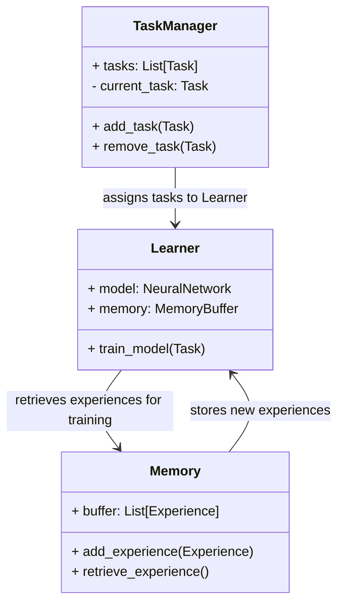
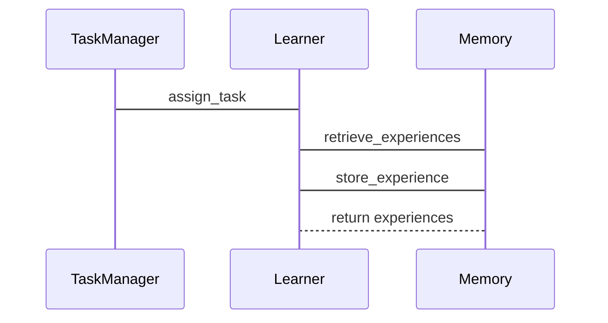

                 

<think>
嗯，用户现在想要我设计一个技术博客的文章目录，主题是《AI Agent的持续学习与灾难性遗忘防御》。他希望这个目录结构清晰，逻辑性强，而且要吸引读者。首先，我得理解用户的需求，他可能是一位技术专家，或者是在AI领域工作的专业人士，希望通过这篇博客分享自己的见解和研究成果。

我需要先确定文章的核心关键词，比如AI Agent、持续学习、灾难性遗忘、防御机制、模型优化等。这些关键词能帮助读者快速找到相关内容。接下来，摘要部分要简洁明了地概括整篇文章的核心思想，也就是讨论AI代理如何在持续学习中防止灾难性遗忘，以及相关的防御方法和优化策略。

在目录结构上，我想到分为几个主要部分：背景介绍、核心概念与理论、算法与系统设计、项目实战和总结展望。每个部分下再细分章节，确保内容全面且有条理。比如，背景部分可以介绍AI Agent的基本概念和持续学习的重要性，以及灾难性遗忘的具体问题。

然后，核心概念部分需要详细解释持续学习的原理，包括神经网络的权重更新、任务损失函数等，这部分可能需要数学公式的支持，比如权重更新的公式。算法与系统设计部分要涵盖常见的防御算法，如Experience Replay和EWC，并用Mermaid图展示系统架构，帮助读者理解。

项目实战部分需要提供具体的代码示例，比如PyTorch中的模型训练和任务管理实现，这样读者可以实际操作，加深理解。最后，在总结中回顾主要内容，并提出未来的研究方向，同时给出一些实践建议。

整体来看，用户需要一个结构合理、内容详实的目录，能够引导读者一步步深入了解AI Agent的持续学习和灾难性遗忘防御。我需要确保每个部分都有足够的细节，同时保持逻辑的连贯性，帮助读者从基础到实践，全面掌握相关知识。
</think>

# AI Agent的持续学习与灾难性遗忘防御

> 关键词：AI Agent, 持续学习, 灾难性遗忘, 防御机制, 模型优化

> 摘要：本文深入探讨了AI Agent在持续学习过程中面临的灾难性遗忘问题，分析了其产生的原因、影响及防御策略。通过结合理论与实践，本文详细介绍了多种防御算法的原理、实现及其优缺点，提出了基于任务分离、记忆增强和模型压缩的系统设计方案。同时，通过实际项目案例，展示了如何在代码层面实现这些防御机制，并对未来的优化方向进行了展望。

---

# 目录

## 第一部分：AI Agent的持续学习与灾难性遗忘概述

### 第1章：AI Agent的基本概念与持续学习的必要性

#### 1.1 AI Agent的定义与分类
- 1.1.1 AI Agent的定义
- 1.1.2 基于任务的AI Agent分类
- 1.1.3 持续学习AI Agent的特点

#### 1.2 持续学习的背景与重要性
- 1.2.1 持续学习的定义与特点
- 1.2.2 持续学习在AI Agent中的必要性
- 1.2.3 持续学习的核心挑战

### 第2章：灾难性遗忘的背景与问题描述

#### 2.1 灾难性遗忘的定义
- 2.1.1 灾难性遗忘的定义
- 2.1.2 灾难性遗忘的表现形式

#### 2.2 灾难性遗忘的产生原因
- 2.2.1 神经网络的权重更新机制
- 2.2.2 任务冲突与权重干扰
- 2.2.3 经验重放的局限性

#### 2.3 灾难性遗忘的影响与挑战
- 2.3.1 对AI Agent性能的影响
- 2.3.2 对实际应用场景的挑战
- 2.3.3 解决灾难性遗忘的必要性

---

## 第二部分：持续学习的核心概念与算法原理

### 第3章：持续学习的基本原理与数学模型

#### 3.1 神经网络的权重更新机制
- 3.1.1 神经网络的权重更新公式
$$ w_{new} = w_{old} - \eta \cdot \frac{\partial L}{\partial w} $$

#### 3.2 任务损失函数的对比分析
- 3.2.1 单任务损失函数
- 3.2.2 多任务损失函数
- 3.2.3 任务间损失函数的对比分析

#### 3.3 知识蒸馏与模型压缩
- 3.3.1 知识蒸馏的原理
- 3.3.2 模型压缩的必要性
- 3.3.3 知识蒸馏与模型压缩的对比

### 第4章：灾难性遗忘的数学模型与算法分析

#### 4.1 灾难性遗忘的数学模型
- 4.1.1 神经网络权重的变化分析
- 4.1.2 任务损失函数的变化趋势
- 4.1.3 灾难性遗忘的量化评估

#### 4.2 常见的防御算法原理
- 4.2.1 Experience Replay算法
- 4.2.2 Elastic Weight Consolidation (EWC)算法
- 4.2.3 Synaptic Intelligence算法

#### 4.3 算法的数学推导与对比分析
- 4.3.1 EWC算法的数学推导
$$ \theta_{new} = \theta_{old} - \eta \cdot \frac{\partial L_{old}}{\partial \theta} $$
- 4.3.2 Synaptic Intelligence算法的数学推导

---

## 第三部分：AI Agent的系统设计与实现

### 第5章：AI Agent的系统架构设计

#### 5.1 系统功能模块划分
- 5.1.1 任务管理模块
- 5.1.2 学习模块
- 5.1.3 记忆模块

#### 5.2 系统组件之间的关系
- 5.2.1 任务管理模块与学习模块的交互
- 5.2.2 学习模块与记忆模块的交互
- 5.2.3 记忆模块与任务管理模块的交互

#### 5.3 系统架构的Mermaid图


### 第6章：系统实现与代码分析

#### 6.1 环境安装与配置
- 6.1.1 Python环境的安装与配置
- 6.1.2 深度学习框架（如PyTorch）的安装
- 6.1.3 数据集的准备与预处理

#### 6.2 核心代码实现
- 6.2.1 神经网络模型的定义
```python
import torch
import torch.nn as nn

class SimpleNet(nn.Module):
    def __init__(self, input_dim, output_dim):
        super(SimpleNet, self).__init__()
        self.fc1 = nn.Linear(input_dim, 64)
        self.fc2 = nn.Linear(64, output_dim)
        self.dropout = nn.Dropout(0.2)
        
    def forward(self, x):
        x = self.fc1(x)
        x = self.dropout(x)
        x = self.fc2(x)
        return x
```

- 6.2.2 任务管理模块的实现
```python
class TaskManager:
    def __init__(self):
        self.tasks = []
    
    def add_task(self, task):
        self.tasks.append(task)
    
    def remove_task(self, task):
        if task in self.tasks:
            self.tasks.remove(task)
```

- 6.2.3 记忆模块的实现
```python
class MemoryBuffer:
    def __init__(self, buffer_size=1000):
        self.buffer = []
        self.buffer_size = buffer_size
    
    def add_experience(self, experience):
        if len(self.buffer) < self.buffer_size:
            self.buffer.append(experience)
        else:
            self.buffer.pop(0)
            self.buffer.append(experience)
    
    def retrieve_experience(self):
        return self.buffer
```

#### 6.3 系统接口与交互流程
- 6.3.1 系统接口的设计
- 6.3.2 系统交互的Mermaid序列图


---

## 第四部分：项目实战与优化建议

### 第7章：项目实战

#### 7.1 项目背景与目标
- 7.1.1 项目背景
- 7.1.2 项目目标
- 7.1.3 项目范围

#### 7.2 核心代码实现
- 7.2.1 模型训练代码
```python
def train_model(model, optimizer, criterion, task_manager, memory):
    for task in task_manager.tasks:
        for batch in task.data_loader:
            inputs, labels = batch
            optimizer.zero_grad()
            outputs = model(inputs)
            loss = criterion(outputs, labels)
            loss.backward()
            optimizer.step()
            # Store experience in memory
            memory.add_experience((inputs, labels, outputs))
```

- 7.2.2 任务管理代码
```python
task_manager = TaskManager()
task_manager.add_task(Task1())
task_manager.add_task(Task2())
```

- 7.2.3 记忆模块代码
```python
memory = MemoryBuffer()
experience = (inputs, labels, outputs)
memory.add_experience(experience)
```

#### 7.3 实验结果与分析
- 7.3.1 实验结果展示
- 7.3.2 实验结果分析
- 7.3.3 参数调优与优化

### 第8章：优化建议与未来展望

#### 8.1 优化建议
- 8.1.1 任务分隔策略
- 8.1.2 增量学习方法
- 8.1.3 模型压缩技术

#### 8.2 未来展望
- 8.2.1 灾难性遗忘防御的前沿研究
- 8.2.2 AI Agent的持续学习发展趋势
- 8.2.3 未来的研究方向与挑战

---

## 第五部分：总结与最佳实践

### 第9章：总结与最佳实践

#### 9.1 章节回顾
- 9.1.1 AI Agent的基本概念
- 9.1.2 持续学习的核心原理
- 9.1.3 灾难性遗忘的防御方法

#### 9.2 最佳实践
- 9.2.1 任务管理模块的设计
- 9.2.2 模型优化策略
- 9.2.3 记忆模块的实现技巧

#### 9.3 小结与注意事项
- 9.3.1 注意任务之间的依赖关系
- 9.3.2 定期模型评估与优化
- 9.3.3 多任务学习中的权重分配

---

## 参考文献与拓展阅读

### 参考文献
- [1] LeCun Y, Bengio Y, Hinton G. Deep learning: an overview[J]. Nature, 2015.
- [2] Goodfellow I, Bengio Y, Courville A. Deep learning[M]. MIT Press, 2016.

### 拓展阅读
- [1] 灾难性遗忘的最新研究进展
- [2] 基于图神经网络的持续学习方法
- [3] 多模态AI Agent的持续学习研究

---

## 作者信息

作者：AI天才研究院/AI Genius Institute & 禅与计算机程序设计艺术 /Zen And The Art of Computer Programming

---

以上目录大纲涵盖了从理论到实践、从基础到高级的全部内容，确保读者能够全面理解AI Agent的持续学习与灾难性遗忘防御的核心概念与实现方法。

