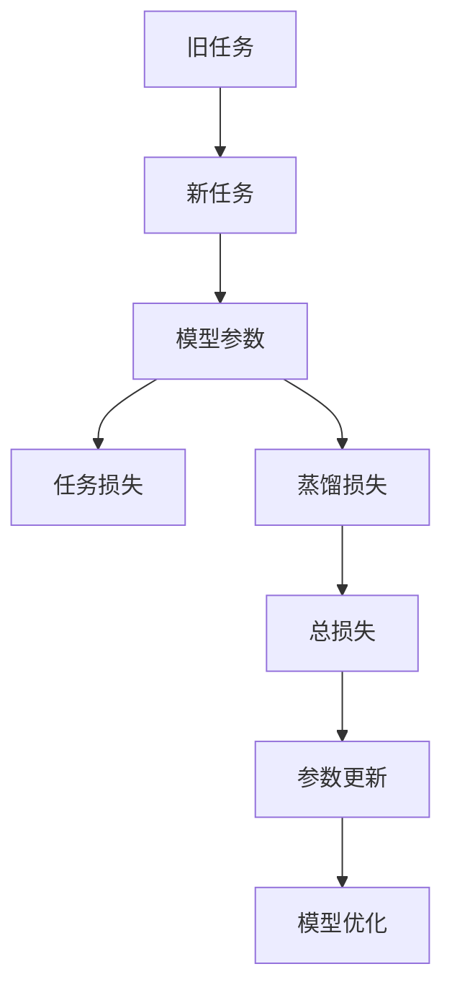
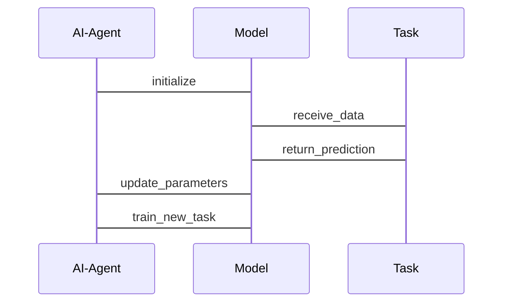

                 


# AI Agent的持续学习与灾难性遗忘防御策略

## 关键词：AI Agent, 持续学习, 灾难性遗忘, 知识蒸馏, 参数约束, 梯度干扰

## 摘要

本文深入探讨了AI Agent在持续学习过程中面临的灾难性遗忘问题，并提出了一套系统化的防御策略。文章首先介绍了AI Agent和持续学习的基本概念，详细阐述了灾难性遗忘的定义、成因及其对AI Agent性能的负面影响。接着，从算法原理、数学模型和系统架构等多个维度，分析了知识蒸馏、参数约束和梯度干扰三种主流的灾难性遗忘防御策略。通过结合实际案例和代码实现，本文为AI开发者提供了一套完整的解决方案，并展望了未来的研究方向。

---

## 第一章：AI Agent与持续学习概述

### 1.1 AI Agent的基本概念

#### 1.1.1 AI Agent的定义与特点

AI Agent（人工智能代理）是一种能够感知环境、自主决策并执行任务的智能体。它具备以下特点：
- **自主性**：能够在没有外部干预的情况下自主决策。
- **反应性**：能够根据环境反馈实时调整行为。
- **目标导向**：基于预设目标或学习目标执行任务。
- **适应性**：能够在动态环境中自适应调整策略。

#### 1.1.2 AI Agent的应用场景

AI Agent广泛应用于多个领域，包括：
- **自动驾驶**：实时感知环境并做出驾驶决策。
- **智能助手**：如Siri、Alexa等，能够执行语音指令。
- **游戏AI**：在电子游戏中实现智能对手或队友。
- **机器人控制**：用于工业机器人或服务机器人。

#### 1.1.3 持续学习的定义与特点

持续学习是指模型在不断接收新任务或新数据时，能够逐步提升性能，同时保持对旧任务的良好表现。其特点包括：
- **在线性**：数据按顺序输入，模型无法回溯。
- **渐进性**：模型能力逐步提升。
- **多样性**：新旧任务可能差异较大。

### 1.2 灾难性遗忘的背景与问题描述

#### 1.2.1 灾难性遗忘的定义

灾难性遗忘（Catastrophic Forgetting）是指神经网络在学习新任务时，忘记旧任务的现象。这种现象严重影响了模型的持续学习能力。

#### 1.2.2 灾难性遗忘的产生原因

- **权重共享**：神经网络通过共享权重参数来表征不同任务，新任务的学习可能导致旧任务的权重被过度调整。
- **梯度干扰**：新任务的梯度更新可能干扰旧任务的参数空间，导致旧任务性能下降。

#### 1.2.3 灾难性遗忘的影响与挑战

- **性能下降**：模型在旧任务上的表现显著下降。
- **学习效率降低**：需要更多的数据和训练时间来弥补遗忘。
- **应用受限**：在需要长期稳定性能的任务中，模型难以得到有效应用。

### 1.3 持续学习与灾难性遗忘的关系

- **持续学习的核心目标**：在新旧任务之间找到平衡，避免性能下降。
- **灾难性遗忘对持续学习的威胁**：新任务的学习可能以牺牲旧任务为代价。
- **灾难性遗忘的边界与外延**：不仅限于神经网络，还适用于其他机器学习模型。

---

## 第二章：灾难性遗忘的防御策略

### 2.1 灾难性遗忘的防御原理

#### 2.1.1 知识蒸馏的基本原理

知识蒸馏通过将旧任务的知识迁移到新任务中，减少遗忘的发生。具体步骤包括：
1. **教师模型训练**：在旧任务上训练一个教师模型。
2. **学生模型学习**：学生模型通过蒸馏损失函数，学习教师模型的知识。

#### 2.1.2 参数空间的稳定性分析

通过分析参数空间的变化，可以发现灾难性遗忘的早期征兆。具体方法包括：
- **参数变化监测**：跟踪模型参数在新任务训练中的变化幅度。
- **任务重要性评估**：根据任务的重要性调整参数更新步长。

#### 2.1.3 梯度干扰的机制

梯度干扰是指通过调整新任务的梯度更新方向，减少对旧任务参数的影响。具体方法包括：
- **梯度加权**：对新任务梯度进行加权，降低其对旧任务参数的干扰。
- **梯度门控**：引入门控机制，动态调整梯度的更新幅度。

### 2.2 灾难性遗忘防御的数学模型

#### 2.2.1 知识蒸馏的数学表达

知识蒸馏的目标函数包括两部分：新任务损失和蒸馏损失。

$$ \mathcal{L}_{total} = \mathcal{L}_{new} + \lambda \mathcal{L}_{distill} $$

其中，蒸馏损失定义为：

$$ \mathcal{L}_{distill} = \text{KL}(p,q) = \sum p_i \log \frac{p_i}{q_i} $$

#### 2.2.2 参数约束的数学模型

通过约束参数的变化幅度，防止参数的剧烈变化导致遗忘。

$$ \|w_{new} - w_{old}\|_2 \leq \epsilon $$

#### 2.2.3 梯度干扰的数学表达

在梯度更新过程中引入干扰项，减少对旧任务的影响。

$$ \nabla L_{new} = \nabla L_{old} + \lambda \nabla L_{new} $$

### 2.3 灾难性遗忘防御的ER实体关系图



---

## 第三章：系统分析与架构设计

### 3.1 系统架构设计

```mermaid
classDiagram
    class AI-Agent {
        +environment
        +model
        +task
    }
    class Model {
        +parameters
        +layers
    }
    class Task {
        +data
        +label
    }
    AI-Agent -> Model: uses
    Model -> Task: depends
    Model -> environment: interacts
```

### 3.2 系统交互设计



---

## 第四章：项目实战

### 4.1 环境安装

```bash
pip install numpy
pip install tensorflow
pip install matplotlib
```

### 4.2 系统核心实现

#### 4.2.1 知识蒸馏实现

```python
import tensorflow as tf
from tensorflow import keras

def distillation_loss(y_true, y_pred, teacher logits):
    alpha = 0.5
    loss = (1 - alpha) * tf.nn.sparse_softmax_cross_entropy_with_logits(labels=y_true, logits=y_pred) + alpha * tf.nn.sparse_softmax_cross_entropy_with_logits(labels=y_true, logits=teacher logits)
    return loss
```

#### 4.2.2 参数约束实现

```python
import numpy as np

def parameter_constraint(w_old, w_new, epsilon=0.1):
    delta = w_new - w_old
    if np.linalg.norm(delta) > epsilon:
        w_new = w_old + epsilon * delta / np.linalg.norm(delta)
    return w_new
```

#### 4.2.3 梯度干扰实现

```python
import tensorflow as tf

def gradient_modulation(g_old, g_new, lambda_=0.5):
    modulated_g = g_new + lambda_ * g_old
    return modulated_g
```

### 4.3 实际案例分析

以图像分类任务为例，假设我们已经在MNIST数据集上训练了一个手写数字识别模型。现在希望在新任务（如Fashion MNIST数据集）上进行训练，同时保持对手写数字识别的性能。

---

## 第五章：总结与展望

### 5.1 本章总结

本文系统地探讨了AI Agent在持续学习中的灾难性遗忘问题，并提出了一套完整的防御策略。通过理论分析和实践案例，展示了如何通过知识蒸馏、参数约束和梯度干扰等方法，有效减少灾难性遗忘的影响。

### 5.2 未来研究方向

- **更高效的蒸馏方法**：探索更高效的蒸馏技术，减少计算开销。
- **动态参数约束**：根据任务重要性动态调整参数约束。
- **多任务学习优化**：结合多任务学习框架，进一步提升模型的持续学习能力。

### 5.3 最佳实践 Tips

- **任务排序**：根据任务重要性排序，优先学习关键任务。
- **模型复用**：在新任务中复用旧任务的模型结构。
- **持续评估**：定期评估模型对旧任务的性能，及时调整防御策略。

---

## 作者：AI天才研究院/AI Genius Institute & 禅与计算机程序设计艺术 /Zen And The Art of Computer Programming

---

通过本文的系统性分析与实践，读者可以全面理解AI Agent的持续学习能力，掌握灾难性遗忘的防御策略，并在实际应用中有效提升模型的持续学习性能。

