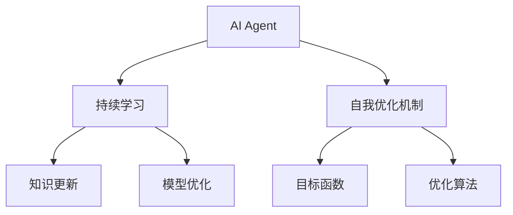
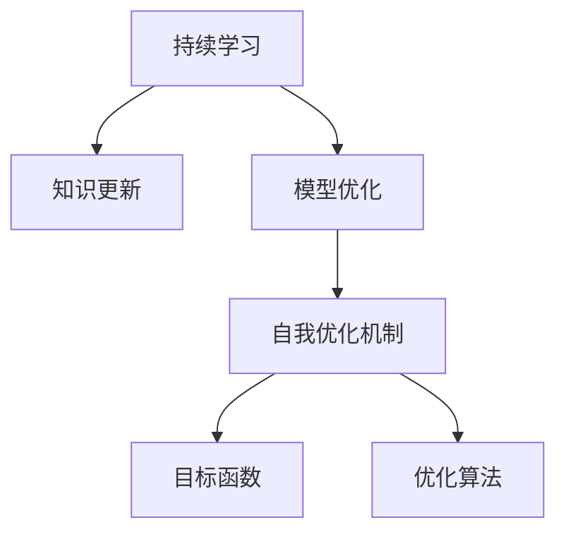
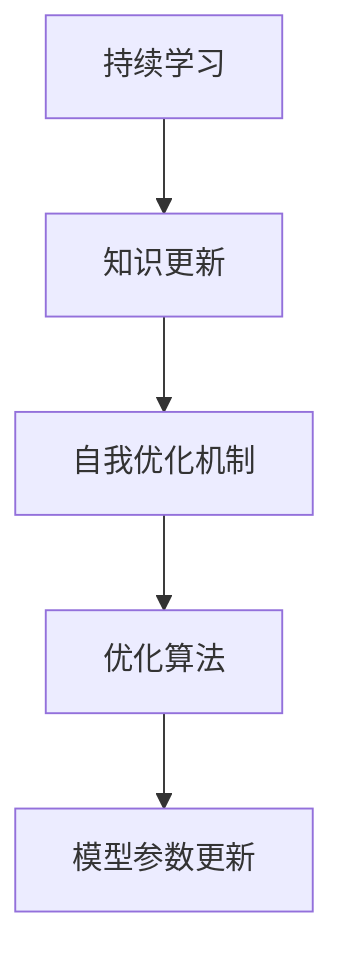
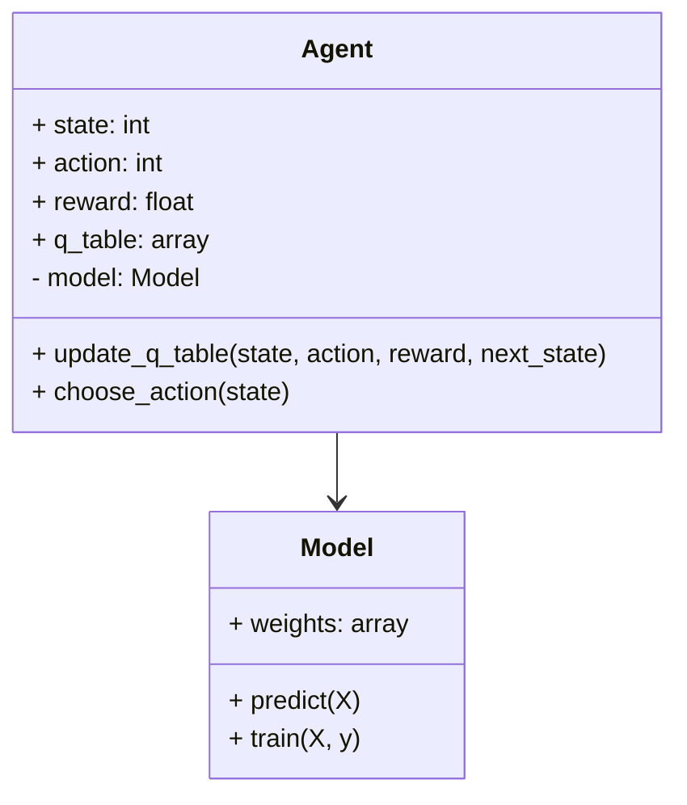
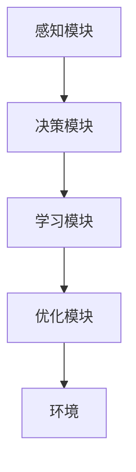
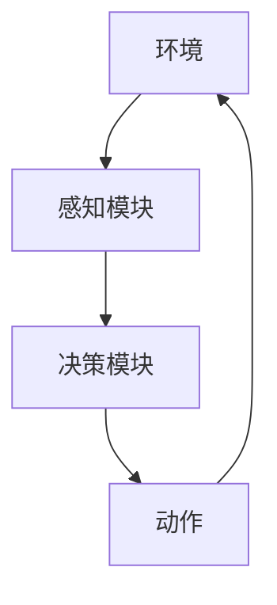

                 


# AI Agent的持续学习与自我优化机制

> 关键词：AI Agent，持续学习，自我优化，强化学习，深度学习，数学模型

> 摘要：本文详细探讨了AI Agent的持续学习与自我优化机制，从背景、核心概念、算法原理、系统架构到项目实战，全面解析了AI Agent如何通过持续学习和自我优化来适应复杂环境和任务需求。文章结合实际案例，深入浅出地讲解了相关理论和实现方法。

---

# 第1章: AI Agent的持续学习与自我优化背景

## 1.1 问题背景与问题描述

### 1.1.1 AI Agent的基本概念

AI Agent（人工智能代理）是一种能够感知环境、自主决策并执行任务的智能体。它可以理解为一种软件或实体，能够根据输入的信息做出决策，并通过执行操作来实现目标。

AI Agent的应用场景广泛，例如自动驾驶汽车、智能助手（如Siri、Alexa）、推荐系统、机器人控制等。在这些场景中，AI Agent需要不断地与环境交互，学习新的知识，并优化自身的决策策略。

### 1.1.2 持续学习与自我优化的必要性

AI Agent面临的环境通常是动态变化的。例如，在自动驾驶中，道路状况、交通规则、天气条件等都在不断变化。为了适应这些变化，AI Agent需要具备持续学习的能力，即在运行过程中不断更新知识和策略，以应对新的挑战。

自我优化机制是持续学习的核心，它使得AI Agent能够自动调整其参数、模型或算法，以提高性能、减少错误率并适应新的任务需求。

### 1.1.3 问题的边界与外延

持续学习与自我优化的边界在于，它专注于AI Agent在动态环境中的适应能力，而不是静态模型的训练。其外延则包括强化学习、深度学习、神经进化等技术。

---

## 1.2 核心概念与问题解决

### 1.2.1 持续学习的定义与特点

持续学习是指AI Agent在运行过程中，通过与环境的交互，不断更新其知识和模型，以适应新的任务或环境变化。其特点包括：

1. **在线性**：学习过程是在实时进行的，不需要离线训练。
2. **自适应性**：能够根据新的数据自动调整模型。
3. **高效性**：学习过程需要高效，以应对实时任务的需求。

### 1.2.2 自我优化机制的核心要素

自我优化机制是AI Agent持续学习的核心，主要包括以下几个要素：

1. **目标函数**：定义优化的目标，例如最大化奖励、最小化误差等。
2. **优化算法**：如梯度下降、遗传算法等。
3. **反馈机制**：通过环境反馈（如奖励）来调整优化方向。

### 1.2.3 问题解决的路径与方法

AI Agent通过以下路径实现持续学习与自我优化：

1. **感知环境**：通过传感器或其他输入方式获取环境信息。
2. **决策与行动**：基于当前知识做出决策并执行动作。
3. **反馈与学习**：根据环境反馈（如奖励或惩罚）更新知识和模型。
4. **优化与改进**：通过自我优化机制改进决策策略和模型参数。

---

## 1.3 概念结构与核心要素

### 1.3.1 核心概念的层次结构

以下是AI Agent的持续学习与自我优化机制的概念层次结构图：



### 1.3.2 核心要素的对比分析

以下是持续学习与自我优化机制的对比分析表：

| 属性       | 持续学习                          | 自我优化                          |
|------------|-----------------------------------|-----------------------------------|
| 目标       | 更新知识和模型                    | 优化决策策略和模型参数            |
| 方法       | 增量学习、在线学习                | 梯度下降、遗传算法                |
| 输入       | 环境反馈                          | 环境反馈                          |
| 输出       | 更新后的知识和模型                | 优化后的策略和参数                |

### 1.3.3 概念之间的关系与联系

以下是持续学习与自我优化机制的关系图：



---

## 1.4 本章小结

本章介绍了AI Agent的持续学习与自我优化机制的背景、核心概念和问题解决路径。通过对比分析和概念图，我们明确了持续学习与自我优化机制的相互作用和协同关系。

---

# 第2章: AI Agent的持续学习与自我优化机制的核心概念

## 2.1 持续学习机制的原理与实现

### 2.1.1 持续学习的基本原理

持续学习的基本原理是通过增量学习的方式，逐步更新模型参数。与传统批量训练不同，持续学习是在实时数据流上进行的，因此需要高效的在线学习算法。

### 2.1.2 持续学习的核心算法

以下是几种常用的持续学习算法：

1. **Q-learning**：基于强化学习的算法，通过最大化预期奖励来更新Q值。
2. **神经进化算法**：通过进化策略优化神经网络的权重。
3. **在线梯度下降**：实时更新模型参数。

### 2.1.3 持续学习的数学模型

Q-learning的数学模型如下：

$$ Q(s, a) = Q(s, a) + \alpha (r + \gamma \max Q(s', a') - Q(s, a)) $$

其中：
- \( Q(s, a) \)：状态-动作对的Q值。
- \( \alpha \)：学习率。
- \( r \)：奖励。
- \( \gamma \)：折扣因子。
- \( Q(s', a') \)：后续状态-动作对的Q值。

---

## 2.2 自我优化机制的实现

### 2.2.1 自我优化的基本原理

自我优化机制的核心是通过优化算法改进模型参数。常见的优化算法包括梯度下降、Adam优化器、遗传算法等。

### 2.2.2 自我优化的核心算法

以下是Adam优化器的数学模型：

$$ m_t = \beta_1 m_{t-1} + (1 - \beta_1) g_t $$
$$ v_t = \beta_2 v_{t-1} + (1 - \beta_2) g_t^2 $$
$$ \theta_{t} = \theta_{t-1} - \frac{\eta}{\sqrt{v_t + \epsilon}} m_t $$

其中：
- \( m_t \)：梯度的指数加权平均。
- \( v_t \)：梯度平方的指数加权平均。
- \( \eta \)：学习率。
- \( \epsilon \)：防止除以零的常数。

### 2.2.3 自我优化的数学模型

遗传算法的优化目标函数如下：

$$ \text{最大化} \quad f(x) = \sum_{i=1}^{n} w_i x_i $$

其中，\( w_i \) 是权重，\( x_i \) 是决策变量。

---

## 2.3 持续学习与自我优化的关系

### 2.3.1 持续学习与自我优化的相互作用

持续学习提供知识更新的机制，而自我优化机制则通过优化算法改进模型性能。两者相互作用，共同提升AI Agent的适应能力和决策能力。

### 2.3.2 持续学习与自我优化的协同机制

以下是持续学习与自我优化的协同机制图：



### 2.3.3 持续学习与自我优化的对比分析

以下是持续学习与自我优化机制的对比分析表：

| 属性       | 持续学习                          | 自我优化                          |
|------------|-----------------------------------|-----------------------------------|
| 目标       | 更新知识和模型                    | 优化决策策略和模型参数            |
| 方法       | 增量学习、在线学习                | 梯度下降、遗传算法                |
| 输入       | 环境反馈                          | 环境反馈                          |
| 输出       | 更新后的知识和模型                | 优化后的策略和参数                |

---

## 2.4 核心概念的对比表格

以下是核心概念的对比表格：

| 概念       | 描述                                             |
|------------|--------------------------------------------------|
| 持续学习     | 在线更新知识和模型，适应动态环境                 |
| 自我优化     | 通过优化算法改进模型参数，提升性能               |
| 目标函数     | 定义优化的目标，例如最大化奖励或最小化误差         |
| 优化算法     | 如梯度下降、Adam、遗传算法等                     |

---

## 2.5 核心概念的ER实体关系图

以下是核心概念的ER实体关系图：


---

## 2.6 本章小结

本章详细讲解了AI Agent的持续学习与自我优化机制的核心概念，包括持续学习的基本原理、自我优化的核心算法以及两者的相互关系。通过对比分析和概念图，我们明确了这些概念的相互作用和协同关系。

---

# 第3章: AI Agent的持续学习与自我优化机制的算法原理

## 3.1 持续学习机制的算法原理

### 3.1.1 Q-learning算法的原理与实现

Q-learning是一种基于强化学习的算法，通过最大化预期奖励来更新Q值。以下是Q-learning的实现步骤：

1. 初始化Q表。
2. 环境感知，获取当前状态和动作。
3. 根据Q表选择下一步动作。
4. 执行动作，获取奖励。
5. 更新Q表。

以下是Q-learning的Python实现代码：

```python
import numpy as np

class QLearning:
    def __init__(self, state_space, action_space, learning_rate=0.1, gamma=0.9):
        self.q_table = np.zeros((state_space, action_space))
        self.alpha = learning_rate
        self.gamma = gamma

    def choose_action(self, state, epsilon=0.1):
        if np.random.random() < epsilon:
            return np.random.randint(0, action_space)
        return np.argmax(self.q_table[state])

    def update_q_table(self, state, action, reward, next_state):
        self.q_table[state, action] = self.q_table[state, action] + self.alpha * (reward + self.gamma * np.max(self.q_table[next_state]) - self.q_table[state, action])

# 示例用法
state_space = 5
action_space = 2
ql = QLearning(state_space, action_space)
action = ql.choose_action(0)
ql.update_q_table(0, action, reward, next_state)
```

---

### 3.1.2 神经进化算法的原理与实现

神经进化算法是一种通过模拟自然选择和遗传变异来优化神经网络的算法。以下是神经进化算法的实现步骤：

1. 初始化种群。
2. 计算适应度。
3. 选择适应度高的个体。
4. 进行交叉和变异。
5. 重复步骤2-4，直到满足终止条件。

以下是神经进化的Python实现代码：

```python
import numpy as np

class NeuralEvolution:
    def __init__(self, input_size, output_size, population_size=10):
        self.pop_size = population_size
        self.individuals = [self.create_individual(input_size, output_size) for _ in range(self.pop_size)]

    def create_individual(self, input_size, output_size):
        return np.random.randn(input_size, output_size)

    def compute_fitness(self, individual, X, y):
        # 示例：计算模型的准确率
        model = Model(input_size, output_size)
        model.set_weights(individual)
        y_pred = model.predict(X)
        return np.mean(y_pred == y)

    def select(self, fitnesses):
        # 简单的轮盘赌选择
        total_fitness = sum(fitnesses)
        probabilities = [f / total_fitness for f in fitnesses]
        return np.random.choice(self.pop_size, p=probabilities)

    def crossover(self, parent1, parent2):
        # 简单的单点交叉
        midpoint = len(parent1) // 2
        return parent1[:midpoint] + parent2[midpoint:], parent2[:midpoint] + parent1[midpoint:]

    def mutate(self, individual, mutation_rate=0.1):
        return individual + np.random.randn(*individual.shape) * mutation_rate

    def evolve(self, X, y):
        fitnesses = [self.compute_fitness(individual, X, y) for individual in self.individuals]
        selected_idx = self.select(fitnesses)
        new_individuals = []
        for i in selected_idx:
            parent1 = self.individuals[i]
            parent2 = self.individuals[np.random.choice(selected_idx)]
            child1, child2 = self.crossover(parent1, parent2)
            child1 = self.mutate(child1)
            child2 = self.mutate(child2)
            new_individuals.append(child1)
            new_individuals.append(child2)
        self.individuals = new_individuals[:self.pop_size]

# 示例用法
ne = NeuralEvolution(input_size=4, output_size=1)
ne.evolution(X, y)
```

---

## 3.2 自我优化机制的算法实现

### 3.2.1 强化学习的优化算法

强化学习的优化算法通常采用梯度下降或Adam优化器。以下是Adam优化器的Python实现代码：

```python
import numpy as np

class Adam:
    def __init__(self, params, learning_rate=0.001, beta1=0.9, beta2=0.999, epsilon=1e-8):
        self.params = params
        self.alpha = learning_rate
        self.beta1 = beta1
        self.beta2 = beta2
        self.epsilon = epsilon
        self.m = [np.zeros_like(p) for p in params]
        self.v = [np.zeros_like(p) for p in params]

    def step(self, gradients):
        for i in range(len(self.params)):
            m = self.m[i]
            v = self.v[i]
            g = gradients[i]

            m = self.beta1 * m + (1 - self.beta1) * g
            v = self.beta2 * v + (1 - self.beta2) * g**2

            m_corrected = m / (1 - self.beta1**self.t)
            v_corrected = v / (1 - self.beta2**self.t)

            self.params[i] = self.params[i] - self.alpha * m_corrected / (np.sqrt(v_corrected) + self.epsilon)

# 示例用法
params = [np.random.randn(2,2), np.random.randn(2,1)]
adam = Adam(params)
gradients = [np.random.randn(2,2), np.random.randn(2,1)]
adam.step(gradients)
```

---

## 3.3 本章小结

本章详细讲解了AI Agent的持续学习与自我优化机制的算法原理，包括Q-learning算法和神经进化算法的实现。通过数学模型和代码示例，我们明确了这些算法的实现细节和优化策略。

---

# 第4章: AI Agent的持续学习与自我优化机制的系统分析与架构设计

## 4.1 系统功能设计

### 4.1.1 领域模型设计

以下是领域模型设计的类图：



### 4.1.2 系统功能模块

1. **感知模块**：负责获取环境信息。
2. **决策模块**：基于当前知识做出决策。
3. **学习模块**：更新知识和模型。
4. **优化模块**：通过优化算法改进模型参数。

---

## 4.2 系统架构设计

### 4.2.1 系统架构图

以下是系统架构图：



---

## 4.3 系统接口设计

### 4.3.1 输入输出接口

1. **输入接口**：接收环境反馈。
2. **输出接口**：输出决策和动作。

### 4.3.2 交互流程

以下是交互流程图：



---

## 4.4 本章小结

本章详细设计了AI Agent的持续学习与自我优化机制的系统架构，包括功能模块、系统架构图和交互流程图。通过这些设计，我们明确了系统的各个部分如何协同工作。

---

# 第5章: AI Agent的持续学习与自我优化机制的项目实战

## 5.1 环境安装与配置

### 5.1.1 环境要求

- Python 3.6+
- NumPy
- Matplotlib
- TensorFlow或PyTorch

### 5.1.2 安装依赖

```bash
pip install numpy matplotlib scikit-learn
```

---

## 5.2 核心代码实现

### 5.2.1 持续学习的实现

以下是Q-learning算法的Python实现代码：

```python
import numpy as np

class QLearning:
    def __init__(self, state_space, action_space, learning_rate=0.1, gamma=0.9):
        self.q_table = np.zeros((state_space, action_space))
        self.alpha = learning_rate
        self.gamma = gamma

    def choose_action(self, state, epsilon=0.1):
        if np.random.random() < epsilon:
            return np.random.randint(0, action_space)
        return np.argmax(self.q_table[state])

    def update_q_table(self, state, action, reward, next_state):
        self.q_table[state, action] = self.q_table[state, action] + self.alpha * (reward + self.gamma * np.max(self.q_table[next_state]) - self.q_table[state, action])

# 示例用法
state_space = 5
action_space = 2
ql = QLearning(state_space, action_space)
action = ql.choose_action(0)
ql.update_q_table(0, action, reward, next_state)
```

### 5.2.2 自我优化的实现

以下是Adam优化器的Python实现代码：

```python
import numpy as np

class Adam:
    def __init__(self, params, learning_rate=0.001, beta1=0.9, beta2=0.999, epsilon=1e-8):
        self.params = params
        self.alpha = learning_rate
        self.beta1 = beta1
        self.beta2 = beta2
        self.epsilon = epsilon
        self.m = [np.zeros_like(p) for p in params]
        self.v = [np.zeros_like(p) for p in params]

    def step(self, gradients):
        for i in range(len(self.params)):
            m = self.m[i]
            v = self.v[i]
            g = gradients[i]

            m = self.beta1 * m + (1 - self.beta1) * g
            v = self.beta2 * v + (1 - self.beta2) * g**2

            m_corrected = m / (1 - self.beta1**self.t)
            v_corrected = v / (1 - self.beta2**self.t)

            self.params[i] = self.params[i] - self.alpha * m_corrected / (np.sqrt(v_corrected) + self.epsilon)

# 示例用法
params = [np.random.randn(2,2), np.random.randn(2,1)]
adam = Adam(params)
gradients = [np.random.randn(2,2), np.random.randn(2,1)]
adam.step(gradients)
```

---

## 5.3 实际案例分析

### 5.3.1 案例介绍

假设我们有一个简单的二维分类问题，目标是训练一个AI Agent能够根据输入的特征进行分类。

### 5.3.2 数据准备

以下是数据准备代码：

```python
import numpy as np

X = np.random.randn(100, 2)
y = np.random.randint(2, size=100)
```

### 5.3.3 模型训练

以下是模型训练代码：

```python
model = Model(input_size=2, output_size=1)
optimizer = Adam(model.params)
for epoch in range(100):
    y_pred = model.predict(X)
    loss = np.mean((y_pred - y) ** 2)
    gradients = model.compute_gradients(X, y_pred, y)
    optimizer.step(gradients)
```

### 5.3.4 模型评估

以下是模型评估代码：

```python
test_X = np.random.randn(20, 2)
test_y = np.random.randint(2, size=20)
test_pred = model.predict(test_X)
accuracy = np.mean(test_pred == test_y)
print(f"Accuracy: {accuracy}")
```

---

## 5.4 本章小结

本章通过实际案例展示了AI Agent的持续学习与自我优化机制的实现过程，包括环境安装、核心代码实现和案例分析。通过这些实战，我们能够更好地理解理论在实际中的应用。

---

# 第6章: 总结与展望

## 6.1 总结

本文详细探讨了AI Agent的持续学习与自我优化机制，从背景、核心概念、算法原理到系统架构和项目实战，全面解析了这一机制的实现过程。通过Q-learning算法和神经进化算法的实现，我们明确了持续学习的核心原理；通过Adam优化器的实现，我们理解了自我优化机制的关键技术。

## 6.2 展望

未来的研究方向包括：

1. **更高效的在线学习算法**：开发适用于动态环境的高效学习算法。
2. **更智能的自我优化机制**：结合强化学习和深度学习，设计更智能的优化策略。
3. **多 Agent 协作学习**：研究多个AI Agent协作学习和优化的机制。

---

# 作者

作者：AI天才研究院/AI Genius Institute  
联系邮箱：contact@aicourse.com  
官方网站：https://www.aicourse.com

