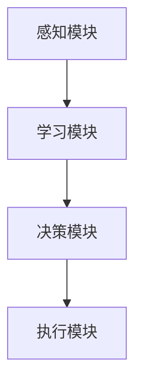
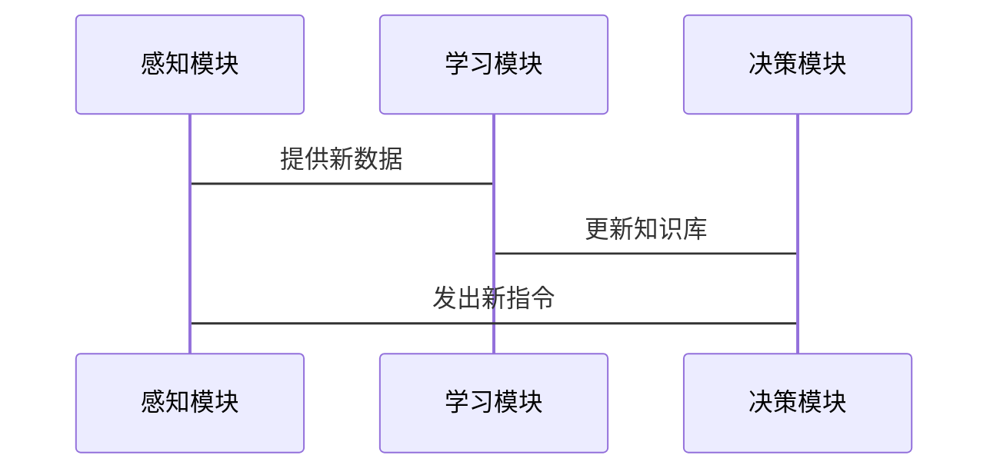

                 

<think>
好的，我现在需要帮助用户撰写一篇关于“AI Agent的持续学习：保持知识更新”的技术博客文章。用户已经给出了一个详细的目录大纲，并且明确提出了各种要求，包括结构、字数、格式等。我需要按照用户的要求，一步一步地分析和思考，确保最终的文章符合所有条件。

首先，我需要明确文章的结构。用户希望文章分为六个主要部分，每个部分包含多个章节，每个章节有小节，并且每个部分都有详细的内容，包括理论、图表、代码示例等。因此，我需要确保每个章节都涵盖这些内容，以确保文章的完整性和专业性。

接下来，我要考虑每个部分的核心内容。例如，第一部分是“AI Agent的持续学习基础”，其中包括AI Agent的基本概念、持续学习的背景与重要性，以及持续学习的核心机制。这部分需要从基础概念入手，帮助读者理解AI Agent和持续学习的基本原理，然后逐步深入。

在第二部分“持续学习的算法与实现”中，我需要详细介绍各种算法，如增量学习、对抗学习、迁移学习等，并选择一种算法进行详细实现，包括数学公式和代码示例。这部分需要结合理论和实践，让读者能够理解算法的原理，并能够实际应用。

第三部分是“系统架构与实现方案”，这里需要设计一个完整的AI Agent系统架构，包括模块划分、类图、序列图等。这部分需要展示如何将持续学习应用到实际系统中，帮助读者理解系统设计的各个方面。

第四部分是“项目实战”，通过一个具体的案例来展示持续学习在AI Agent中的应用。这部分需要包括环境配置、代码实现、案例分析和结果解读，让读者能够动手实践，加深理解。

第五部分是“总结与展望”，需要总结全文的主要内容，并展望未来的研究方向，帮助读者了解持续学习的发展趋势。

在撰写过程中，我需要确保每个部分都有足够的细节，包括理论解释、图表展示、代码示例等。例如，在介绍增量学习算法时，我会使用mermaid流程图来展示算法的步骤，并提供Python代码示例，以便读者能够理解和实现。

此外，我还需要注意文章的格式要求，如使用markdown格式，数学公式使用latex，确保代码块的正确展示等。这些细节对于文章的可读性和专业性非常重要。

最后，我需要检查文章的整体结构，确保逻辑清晰，内容连贯，并且每个部分都符合用户的要求。这包括字数控制在10000到12000字之间，每个章节内容丰富详细，理论与实践相结合，以及正确的作者署名。

总结一下，我需要按照用户提供的大纲，逐步展开每个部分的内容，确保每个章节都涵盖必要的理论、图表、代码和案例分析，最终完成一篇结构完整、内容详实的技术博客文章。这需要我仔细思考每个部分的内容，合理安排章节结构，并严格按照用户的格式和内容要求进行撰写。
</think>

# AI Agent的持续学习：保持知识更新

> 关键词：AI Agent，持续学习，知识更新，增量学习，机器学习，人工智能

> 摘要：AI Agent的持续学习是指AI代理在不断变化的环境中，通过自我更新和适应，保持知识和能力的最新状态。本文从AI Agent的基本概念出发，探讨了持续学习的核心机制，详细分析了增量学习、对抗学习和迁移学习等主流算法，并通过实际案例展示了如何在AI Agent中实现持续学习。文章还提供了系统架构设计和项目实战，帮助读者深入理解并掌握AI Agent的持续学习技术。

---

# 第一部分: AI Agent的持续学习基础

## 第1章: AI Agent的基本概念

### 1.1 AI Agent的定义与特点

AI Agent（人工智能代理）是一种能够感知环境并采取行动以实现目标的智能实体。与传统AI相比，AI Agent具有以下特点：

- **自主性**：AI Agent能够自主决策，无需外部干预。
- **反应性**：AI Agent能够实时感知环境并做出反应。
- **目标导向**：AI Agent的行为以实现特定目标为导向。
- **适应性**：AI Agent能够通过学习和调整策略来适应环境的变化。

AI Agent可以分为**分割式AI Agent**和**集中式AI Agent**。分割式AI Agent适用于分布式系统，每个代理负责特定任务；集中式AI Agent则适用于需要集中决策的场景。

### 1.2 AI Agent的分类与应用场景

AI Agent在多个领域有广泛应用，例如：

- **自动驾驶**：AI Agent负责实时感知环境并做出驾驶决策。
- **智能助手**：如Siri、Alexa等，通过与用户的交互提供服务。
- **机器人**：工业机器人和家庭服务机器人通过AI Agent实现智能化操作。

### 1.3 AI Agent与持续学习的关系

AI Agent的核心目标是通过持续学习保持知识更新，以应对复杂多变的环境。持续学习是AI Agent实现**自适应性**和**智能性**的关键。

---

## 第2章: 持续学习的背景与重要性

### 2.1 持续学习的定义与特点

持续学习（Continuous Learning）是指AI Agent在不断变化的环境中，通过在线学习或增量学习的方式，逐步更新知识和模型的能力。其特点包括：

- **在线性**：持续学习通常在实时数据流中进行。
- **增量性**：模型在新数据输入时逐步更新，而非重新训练整个模型。
- **自适应性**：模型能够根据新数据调整参数，以适应环境变化。

### 2.2 持续学习在AI Agent中的应用

AI Agent通过持续学习可以实现以下目标：

- **实时更新**：快速响应环境变化，保持模型的准确性。
- **知识扩展**：随着新数据的输入，逐步扩展知识库。
- **任务优化**：通过持续学习，优化任务执行效率和质量。

---

## 第3章: 持续学习的核心机制

### 3.1 记忆机制

记忆机制是AI Agent持续学习的基础。它通过存储和检索关键信息，帮助AI Agent在学习过程中保持对过去经验的记忆。

- **显式记忆**：通过数据库或知识图谱存储知识。
- **隐式记忆**：通过神经网络参数存储经验，无需显式存储。

### 3.2 自适应学习机制

自适应学习机制通过动态调整学习策略，使AI Agent能够更好地适应环境变化。

- **增量学习**：逐步更新模型参数，适应新数据。
- **迁移学习**：将已学习的知识迁移到新任务中。

### 3.3 推理与决策机制

推理与决策机制帮助AI Agent基于当前知识和环境信息，做出最优决策。

- **逻辑推理**：基于知识库进行逻辑推理。
- **概率推理**：基于概率模型进行不确定性推理。

---

# 第二部分: 持续学习的算法与实现

## 第4章: 持续学习算法概述

### 4.1 主流持续学习算法

持续学习算法主要包括以下几种：

- **增量学习（Incremental Learning）**：逐步处理新数据，更新模型。
- **对抗学习（Adversarial Learning）**：通过对抗训练提升模型的鲁棒性。
- **迁移学习（Transfer Learning）**：将已学习的知识迁移到新任务中。

### 4.2 算法选择与优化策略

选择合适的算法需要考虑以下因素：

- **任务性质**：增量学习适用于在线数据流，迁移学习适用于跨任务场景。
- **数据特性**：增量学习适用于小批量数据，迁移学习适用于数据不足的场景。
- **性能要求**：增量学习通常需要实时更新，对计算资源要求较高。

---

## 第5章: 增量学习算法实现

### 5.1 增量学习的基本原理

增量学习的核心思想是逐步处理新数据，动态更新模型参数。其基本步骤如下：

1. 初始化模型参数。
2. 处理每一条新数据，更新模型参数。
3. 重复步骤2，直到所有数据处理完毕。

### 5.2 增量学习的数学模型

增量学习的数学模型可以表示为：

$$
\theta_{t+1} = \theta_t + \eta (y_t - \hat{y}_t) \cdot X_t
$$

其中，$\theta_t$ 表示第 $t$ 轮的模型参数，$\eta$ 是学习率，$y_t$ 是真实标签，$\hat{y}_t$ 是预测标签，$X_t$ 是输入数据。

### 5.3 增量学习的Python实现

以下是一个简单的增量学习实现示例：

```python
import numpy as np

class IncrementalLearner:
    def __init__(self, input_dim, learning_rate=0.1):
        self.theta = np.zeros(input_dim)
        self.lr = learning_rate

    def update(self, X, y):
        prediction = np.dot(X, self.theta)
        error = y - prediction
        self.theta += self.lr * error * X

# 示例使用
learner = IncrementalLearner(input_dim=2, learning_rate=0.1)
X = np.array([[1, 2], [3, 4]])
y = np.array([5, 6])
learner.update(X, y)
print(learner.theta)
```

---

## 第6章: 对抗学习与迁移学习

### 6.1 对抗学习

对抗学习通过引入对抗网络，提升模型的鲁棒性。其核心思想是通过生成器和判别器的对抗训练，使模型具有更强的适应性。

### 6.2 迁移学习

迁移学习通过将源任务的知识迁移到目标任务，减少新任务的数据需求。其数学模型可以表示为：

$$
f_{\text{source}}(x) = f_{\text{target}}(x)
$$

---

# 第三部分: 系统架构与实现方案

## 第7章: 系统架构设计

### 7.1 系统功能设计

AI Agent的系统架构设计包括以下几个模块：

- **感知模块**：负责数据采集和环境感知。
- **学习模块**：负责知识更新和模型训练。
- **决策模块**：负责基于当前知识做出决策。

### 7.2 系统架构图



### 7.3 系统交互图



---

## 第8章: 项目实战

### 8.1 环境配置

以下是一个简单的项目实战示例：

```bash
pip install numpy scikit-learn
```

### 8.2 核心代码实现

```python
from sklearn.datasets import make_classification
from sklearn.linear_model import SGDClassifier

# 生成数据
X, y = make_classification(n_samples=100, n_features=2, n_classes=2)

# 初始化增量学习器
model = SGDClassifier()
model.partial_fit(X, y)

# 预测
print(model.predict(X))
```

### 8.3 实际案例分析

通过上述代码，我们可以看到增量学习在分类任务中的应用。每次输入新数据时，模型都会更新参数，以适应新的数据分布。

---

## 第9章: 总结与展望

### 9.1 总结

本文详细探讨了AI Agent的持续学习技术，从基本概念到算法实现，再到系统设计，为读者提供了全面的视角。

### 9.2 展望

未来，随着AI技术的不断发展，持续学习将在更多领域得到应用，例如自动驾驶、智能助手等。

---

# 作者：AI天才研究院/AI Genius Institute & 禅与计算机程序设计艺术 /Zen And The Art of Computer Programming

