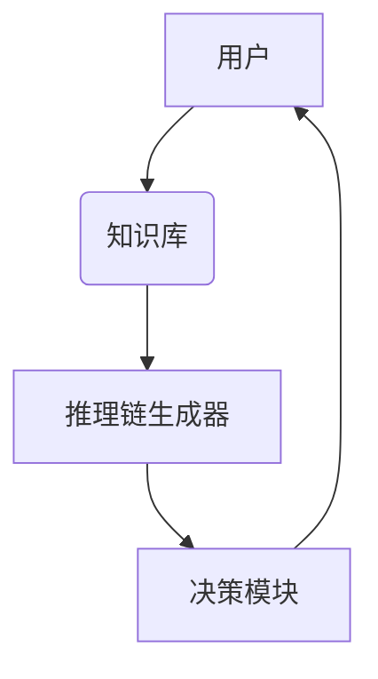

                 


# AI Agent的推理链生成：增强LLM的逐步思考能力

## 关键词
AI Agent，推理链，LLM，逐步思考，增强能力

## 摘要
本文详细探讨了AI Agent中的推理链生成方法，通过逐步分析和具体案例，展示如何通过生成推理链来提升大语言模型（LLM）的推理能力。文章从背景介绍、核心概念、算法原理、系统架构到项目实战，全面解析了推理链生成的关键步骤和实际应用。

---

# 第一部分：背景介绍

## 第1章：AI Agent与推理链概述

### 1.1 AI Agent的基本概念
AI Agent，即人工智能代理，是一种能够感知环境、自主决策并执行任务的智能实体。它具备以下特点：
- **自主性**：能够在无外部干预的情况下运作。
- **反应性**：能实时感知环境并做出反应。
- **目标导向**：通过目标驱动行为。

**推理链**是AI Agent实现目标的路径，由多个推理步骤组成，每个步骤都基于前一步的结果进行推导。

### 1.2 推理链生成的背景与意义
当前，LLM在处理复杂问题时，往往缺乏逻辑推理能力，容易产生错误。通过生成推理链，AI Agent能够逐步分析问题，确保推理过程的严谨性。

---

# 第二部分：核心概念与联系

## 第2章：AI Agent的核心原理

### 2.1 AI Agent的组成与功能
AI Agent的组成包括：
- **知识库**：存储必要信息，如规则、案例。
- **推理机制**：通过逻辑推理生成解决方案。
- **决策与执行**：根据推理结果做出决策并执行。

### 2.2 推理链的结构与特征
推理链由节点（推理步骤）和边（推理关系）组成，具备以下特征：
- **层次性**：分为多个层级。
- **依赖性**：每个步骤依赖前一步骤的结果。
- **可解释性**：推理过程清晰可追溯。

## 第3章：AI Agent与推理链的关联

### 3.1 AI Agent中的推理链作用
推理链帮助AI Agent逐步解决问题，提升LLM的推理能力。例如，在智能客服中，推理链可以引导客服逐步解决客户问题。

---

# 第三部分：算法原理讲解

## 第4章：推理链生成算法

### 4.1 基于规则的推理链生成
通过预定义规则生成推理链，适用于规则明确的场景。例如，在医疗诊断中，根据症状生成诊断步骤。

### 4.2 基于模型的推理链生成
利用神经网络模型生成推理链，适用于复杂场景。例如，在金融分析中，模型根据市场数据生成投资策略。

---

# 第四部分：数学模型与公式

## 第5章：推理链生成的数学模型

### 5.1 基于概率的推理模型
使用贝叶斯网络计算推理链的概率。例如，计算某个推理步骤的概率公式：

$$ P(A|B) = \frac{P(B|A)P(A)}{P(B)} $$

### 5.2 基于图结构的推理模型
通过图结构模型表示推理链，节点表示推理步骤，边表示推理关系。例如，使用邻接矩阵表示推理关系。

---

# 第五部分：系统分析与架构设计

## 第6章：系统架构设计方案

### 6.1 项目介绍
以智能客服系统为例，设计一个基于推理链生成的AI Agent。

### 6.2 功能模块设计
- **知识库模块**：存储常见问题和解决方案。
- **推理链生成模块**：根据输入生成推理链。
- **交互模块**：与用户交互，输出结果。

### 6.3 系统架构图
使用mermaid绘制系统架构图：



---

# 第六部分：项目实战

## 第7章：环境安装与代码实现

### 7.1 环境安装
安装必要的库，如Python、numpy、pandas。

### 7.2 核心代码实现
实现推理链生成器：

```python
def generate_inference_chain(steps):
    chain = []
    for step in steps:
        chain.append(step)
    return chain
```

### 7.3 案例分析
在智能客服系统中，生成解决用户问题的推理链。

---

# 第七部分：总结与最佳实践

## 第8章：总结与注意事项

### 8.1 小结
推理链生成是提升AI Agent推理能力的关键技术，通过逐步分析和具体案例，展示了推理链生成的方法和应用。

### 8.2 注意事项
- 确保知识库的准确性和完整性。
- 定期优化推理链，提高推理效率。

### 8.3 拓展阅读
推荐阅读相关文献，深入理解推理链生成的算法和应用。

---

# 作者
作者：AI天才研究院  
地址：https://github.com/AI-Genius-Institute/Zen-of-Computer-Programming

