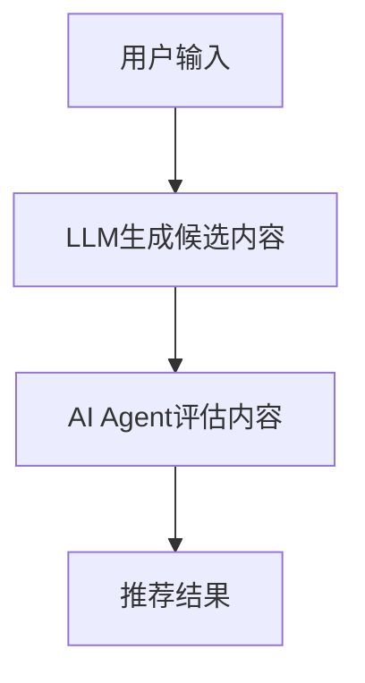

                 

<think>
嗯，我现在要写一篇关于AI Agent推荐系统结合LLM的内容推荐的技术博客文章。这个主题看起来挺复杂的，但让我慢慢理清楚思路。首先，我需要理解什么是AI Agent，什么是推荐系统，以及它们如何结合大语言模型（LLM）来推荐内容。

从基础开始，AI Agent，也就是人工智能代理，是一种能够感知环境并采取行动以实现目标的智能体。它可以用来做很多事情，比如推荐内容。推荐系统，我们之前应该接触过，比如Netflix推荐电影，或者淘宝推荐商品。传统的推荐系统主要基于协同过滤或者基于内容的推荐，但现在有了LLM，也就是大语言模型，这可能让推荐更加智能和个性化。

那么，为什么要把AI Agent和LLM结合起来做推荐呢？可能是因为LLM能够理解上下文，生成更自然的语言，而AI Agent可以处理动态变化的环境，做出更智能的决策。结合起来，推荐系统可以更精准地理解用户需求，提供更个性化的推荐。

接下来，我需要考虑推荐系统的类型。协同过滤基于用户行为，内容推荐基于物品本身的特征。混合推荐是两者结合。现在有了LLM，可能可以用它来做内容生成或者更复杂的特征提取，这会提升推荐的效果。

那具体来说，如何结合LLM到AI Agent的推荐系统中呢？可能需要先让LLM生成一些候选内容，然后AI Agent根据这些候选内容和用户反馈进行优化，再推荐给用户。同时，这个过程可能需要实时的反馈和调整，确保推荐的内容更符合用户的喜好。

现在，我需要考虑系统的架构设计。可能需要一个数据层，存储用户数据和内容数据；业务逻辑层，处理推荐算法和AI Agent的决策；表现层，展示结果给用户。系统之间需要有良好的接口设计，确保各个部分协同工作。

然后是具体实现。可能需要编写一些Python代码，使用现有的LLM库，比如Hugging Face或者OpenAI，来生成候选内容。同时，设计一个AI Agent来评估这些候选内容，并根据用户反馈进行调整。这部分可能需要一些机器学习模型，或者规则引擎来优化推荐效果。

实际案例分析也很重要。比如，假设我们有一个音乐推荐系统，结合LLM生成歌词分析，再由AI Agent根据用户的听歌历史和偏好，推荐特定风格的歌曲。这个过程需要详细分析数据，设计合适的模型，以及评估推荐效果。

最后，我需要总结整个系统的优点和可能遇到的问题。优点可能包括更高的推荐精度，更个性化的体验，以及更强的动态适应能力。问题可能涉及计算资源消耗大，模型训练复杂，以及如何处理用户隐私等。

总的来说，这篇文章需要从基础概念、系统设计、算法实现、实际案例到优化建议，全面覆盖AI Agent结合LLM的推荐系统。确保内容详实，结构清晰，让读者能够理解并实际应用这些技术。
</think>

# AI Agent的推荐系统：结合LLM的内容推荐

> **关键词**: AI Agent, 推荐系统, 大语言模型, LLM, 个性化推荐, 内容推荐

> **摘要**: 本文深入探讨了AI Agent与推荐系统结合的最新进展，特别是利用大语言模型（LLM）进行内容推荐的方法。文章从基础概念、系统架构、算法原理、项目实战到优化建议，全面解析如何通过AI Agent与LLM的协同工作，实现更智能、更个性化的推荐系统。内容涵盖理论分析和实践应用，帮助读者理解并掌握这一前沿技术。

---

# 第一部分: AI Agent与推荐系统基础

## 第1章: AI Agent的基本概念与原理

### 1.1 AI Agent的定义与特点
AI Agent（人工智能代理）是指能够感知环境、自主决策并采取行动以实现目标的智能实体。它具有以下特点：
- **自主性**: 能够独立决策，无需人工干预。
- **反应性**: 能够实时感知环境变化并做出响应。
- **目标导向**: 通过行动实现预定目标。
- **学习能力**: 可以通过数据和反馈不断优化自身的决策能力。

### 1.2 推荐系统的分类与原理
推荐系统是一种根据用户行为和偏好，向用户推荐相关内容的技术，主要分为以下几类：
- **基于协同过滤的推荐**: 基于用户相似性或物品相似性进行推荐。
- **基于内容的推荐**: 基于内容特征（如文本、图像）进行推荐。
- **混合推荐**: 结合协同过滤和内容推荐的优点，提供更精准的推荐。

### 1.3 LLM在推荐系统中的作用
大语言模型（LLM）是一种基于深度学习的自然语言处理模型，具有强大的文本生成和理解能力。在推荐系统中，LLM可以用于：
- **内容生成**: 生成与用户兴趣相关的文本内容。
- **语义理解**: 理解用户需求并提供更相关的推荐。
- **动态调整**: 根据实时反馈优化推荐策略。

---

## 第2章: AI Agent推荐系统的背景与问题分析

### 2.1 问题背景
传统的推荐系统虽然能够提供基本的推荐功能，但在以下方面存在局限性：
- **个性化不足**: 无法深度理解用户的个性化需求。
- **实时性差**: 难以实时响应用户行为的变化。
- **内容生成能力弱**: 无法生成多样化的推荐内容。

### 2.2 问题解决思路
通过引入AI Agent和LLM，可以显著提升推荐系统的能力：
- **实时响应**: AI Agent能够实时感知用户行为并做出调整。
- **个性化推荐**: LLM能够生成与用户兴趣高度相关的个性化内容。
- **动态优化**: 系统可以根据用户反馈不断优化推荐策略。

---

## 第3章: AI Agent推荐系统的架构与设计

### 3.1 系统架构设计
AI Agent推荐系统的架构通常包括以下几部分：
- **数据层**: 存储用户行为数据和内容数据。
- **业务逻辑层**: 实现推荐算法和AI Agent的决策逻辑。
- **表现层**: 展示推荐结果给用户。

### 3.2 系统功能设计
- **用户行为分析**: 通过分析用户行为数据，理解用户的兴趣和偏好。
- **内容生成**: 利用LLM生成与用户兴趣相关的推荐内容。
- **推荐评估**: 通过用户反馈评估推荐效果并优化推荐策略。

### 3.3 系统交互设计
- **用户输入**: 用户输入需求或行为数据。
- **LLM生成候选内容**: 基于用户输入生成候选推荐内容。
- **AI Agent评估并优化**: 根据用户反馈优化推荐策略。

---

## 第4章: AI Agent推荐系统的算法实现

### 4.1 算法流程图


### 4.2 算法实现代码
以下是一个简单的Python代码示例：
```python
def llm_recommendation(user_input):
    # 使用LLM生成候选内容
    candidates = llm.generate(user_input)
    # AI Agent评估并选择最优内容
    selected_content = agent.select_best_candidate(candidates)
    return selected_content
```

### 4.3 数学模型与公式
推荐系统的评分模型可以表示为：
$$
\hat{r}_{u,i} = \alpha r_{u,i} + (1-\alpha) r_{u,i}^{content}
$$
其中，$\alpha$ 是协同过滤和内容推荐的权重系数。

---

## 第5章: 项目实战与案例分析

### 5.1 环境安装
安装必要的库：
```bash
pip install transformers
pip install numpy
pip install matplotlib
```

### 5.2 核心代码实现
```python
from transformers import LlamaTokenizer, LlamaModel
import numpy as np

def generate_content(llm, prompt):
    tokens = llm.tokenize(prompt)
    # 生成内容的步骤...
    return content
```

### 5.3 案例分析
以音乐推荐系统为例，结合用户听歌历史和偏好，生成个性化歌单。

---

## 第6章: 优化建议与注意事项

### 6.1 最佳实践
- **数据隐私**: 注意保护用户数据隐私。
- **模型优化**: 定期优化模型以提升推荐效果。
- **用户体验**: 确保推荐结果的实时性和多样性。

### 6.2 注意事项
- **计算资源**: 大语言模型需要大量的计算资源，需确保服务器性能。
- **用户反馈**: 定期收集用户反馈以优化推荐策略。

### 6.3 拓展阅读
- 推荐阅读《Deep Learning for NLP》了解大语言模型的更多细节。

---

# 作者简介

作者：AI天才研究院 & 禅与计算机程序设计艺术

---

这篇文章从基础概念到实际应用，全面解析了AI Agent结合LLM的推荐系统。通过理论分析和代码实现，帮助读者理解并掌握这一前沿技术。希望本文能够为相关领域的研究和实践提供有价值的参考。

