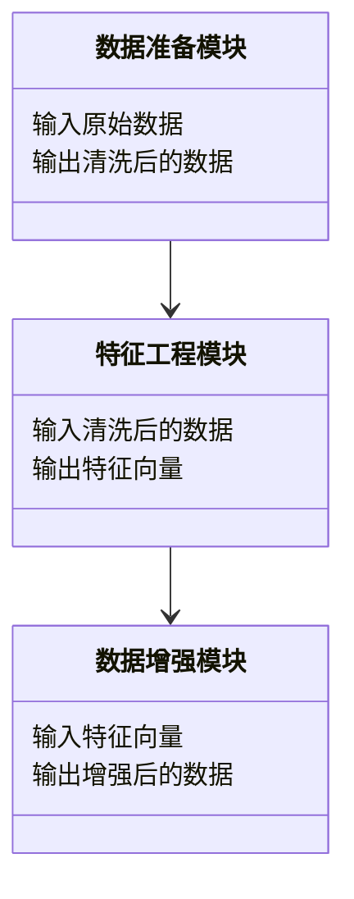
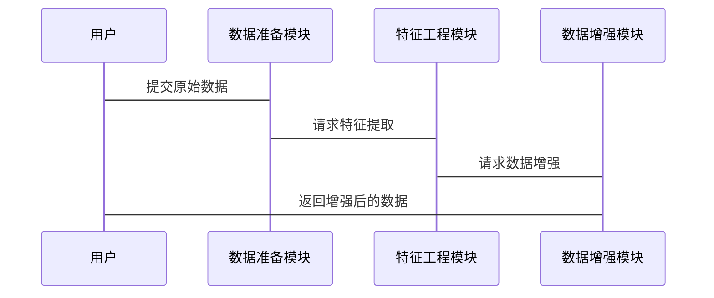

                 

<think>
嗯，用户希望我根据他提供的《AI Agent的数据准备和预处理技巧》的目录大纲，撰写一篇符合他详细要求的完整技术博客文章。我需要仔细分析用户的请求，确保理解所有要求，包括文章的结构、内容深度、格式以及作者信息等。

首先，用户明确要求文章分为多个部分，每部分都有具体的小节，内容需要涵盖数据准备的背景、核心概念、算法原理、系统架构、项目实战和最佳实践。我需要确保每一部分都详细展开，符合技术博客的专业性和深度。

接下来，用户提到文章必须使用markdown格式，并且每个部分都要有丰富的细节，包括核心概念的解释、算法的流程图、数学公式的latex表示以及系统架构的设计图。这意味着我需要在文章中嵌入mermaid图表和latex公式，确保格式正确。

我还需要注意文章的字数要求，大约在10000到12000字之间。这意味着每个章节需要详细展开，提供足够的内容，而不仅仅是简要概述。例如，在数据清洗部分，我需要详细解释每种方法，给出实现步骤，并结合案例分析。

此外，用户特别指出要包含环境安装、代码实现、案例分析和项目总结等内容。因此，在项目实战部分，我需要提供具体的代码示例，并解释代码的功能和应用场景。同时，案例分析需要真实且详细，帮助读者理解如何将理论应用于实践。

最后，作者信息需要放在文章末尾，确保格式正确。我还需要在每个小结后加入一些注意事项或最佳实践，为读者提供实用的建议。

综上所述，我需要按照用户提供的目录大纲，逐部分撰写内容，确保每个章节都详细且符合技术博客的要求。同时，要注意使用专业的技术术语，保持逻辑清晰，结构紧凑。接下来，我将根据目录大纲，逐步撰写每一部分的内容，确保满足用户的所有要求。
</think>

# AI Agent的数据准备和预处理技巧

## 关键词：AI Agent, 数据准备, 数据预处理, 特征工程, 数据清洗, 文本处理

## 摘要：  
本文详细探讨了AI Agent在数据准备和预处理过程中的关键技巧。从数据清洗、特征工程到文本处理，文章系统地分析了每个步骤的核心概念、算法原理和实际应用。通过丰富的案例分析和代码实现，读者可以全面掌握AI Agent数据准备和预处理的核心方法，从而提升AI Agent的性能和准确性。

---

## 第一部分: AI Agent数据准备与预处理基础

### 第1章: AI Agent与数据准备概述

#### 1.1 AI Agent的基本概念

##### 1.1.1 AI Agent的定义与特点
AI Agent（人工智能代理）是指能够感知环境并采取行动以实现目标的智能实体。它具有以下特点：
- **自主性**：能够在没有外部干预的情况下自主决策。
- **反应性**：能够根据环境变化实时调整行为。
- **目标导向性**：所有行动都围绕特定目标展开。
- **学习能力**：能够通过经验优化自身的决策过程。

##### 1.1.2 数据在AI Agent中的核心作用
数据是AI Agent的“燃料”，决定了其智能水平和决策能力。高质量的数据能够显著提升AI Agent的性能，而低质量的数据则可能导致错误的决策。

##### 1.1.3 数据准备与预处理的定义与目标
数据准备是指将原始数据转化为适合模型输入的形式，而数据预处理则是对数据进行清洗、转换和增强，以提高数据质量和一致性。目标是为AI Agent提供干净、一致、有意义的数据输入。

#### 1.2 数据准备与预处理的重要性

##### 1.2.1 数据质量对AI Agent性能的影响
数据质量直接影响AI Agent的决策能力。低质量数据可能导致模型过拟合或欠拟合，甚至引发错误的决策。

##### 1.2.2 数据准备与预处理的常见挑战
- 数据缺失：部分数据字段未填写或缺失。
- 数据噪声：数据中存在错误或不一致的信息。
- 数据不平衡：某些类别数据数量远少于其他类别。
- 数据格式多样性：数据来源多样，格式不统一。

##### 1.2.3 数据准备与预处理的流程与方法
数据准备与预处理的流程通常包括以下步骤：
1. 数据收集
2. 数据清洗
3. 数据转换
4. 数据增强
5. 数据标注

---

### 第2章: 数据质量评估与清洗

#### 2.1 数据质量评估

##### 2.1.1 数据完整性评估
数据完整性评估是指检查数据是否包含所有必要字段且没有缺失值。例如，在客户数据中，如果缺少“电话号码”字段，则数据完整性不足。

##### 2.1.2 数据一致性评估
数据一致性评估是指检查数据是否符合预定义的格式和规则。例如，日期字段应为“YYYY-MM-DD”格式。

##### 2.1.3 数据准确性评估
数据准确性评估是指验证数据是否真实反映现实情况。例如，检查传感器数据是否准确无误。

#### 2.2 数据清洗技术

##### 2.2.1 删除重复数据
重复数据会增加数据冗余，影响模型训练效率。可以通过唯一标识字段去重。

##### 2.2.2 处理缺失值
缺失值处理方法包括：
- 删除包含缺失值的记录（适合数据量较大的情况）。
- 填充缺失值：使用均值、中位数或众数填充。
- 使用回归模型或机器学习算法预测缺失值。

##### 2.2.3 处理异常值
异常值处理方法包括：
- 剔除异常值（适合对结果影响较小的异常值）。
- 使用回归模型修复异常值。
- 对异常值进行标记，供后续处理。

#### 2.3 数据清洗的实现与案例

##### 2.3.1 数据清洗的实现步骤
1. 识别数据中的缺失值和异常值。
2. 根据具体情况选择合适的清洗方法。
3. 清洗后的数据进行验证，确保数据质量。

##### 2.3.2 数据清洗的案例分析
假设我们有一个客户数据集，其中包含“客户ID”、“姓名”、“年龄”、“性别”、“收入”等字段。发现“收入”字段有大量缺失值，选择使用均值填充缺失值。

---

### 第3章: 特征工程与数据增强

#### 3.1 特征工程的基本概念

##### 3.1.1 特征工程的定义
特征工程是指通过对原始数据进行变换、组合或降维，提取更有意义的特征，以提高模型性能的过程。

##### 3.1.2 特征工程的目标
特征工程的目标是：
- 提升模型的可解释性。
- 提高模型的泛化能力。
- 降低模型的计算复杂度。

##### 3.1.3 特征工程的常见方法
- 特征选择：根据特征的重要性选择关键特征。
- 特征变换：对特征进行数学变换，如标准化、归一化。
- 特征组合：将多个特征组合成新的特征。

#### 3.2 数据增强技术

##### 3.2.1 数据增强的定义
数据增强是指通过对现有数据进行变换，生成更多样化的数据，以增加数据集的多样性和鲁棒性。

##### 3.2.2 常见的数据增强方法
- **图像数据增强**：旋转、缩放、翻转、裁剪等。
- **文本数据增强**：同义词替换、句式变换、数据扩展。
- **语音数据增强**：改变音调、速度、背景噪声。

##### 3.2.3 数据增强的实现与案例
以图像数据增强为例，可以通过Python的`imgaug`库实现图像的随机变换，如随机裁剪、随机旋转等。

---

### 第4章: 文本数据的预处理

#### 4.1 文本数据的清洗与标注

##### 4.1.1 文本清洗的常见方法
- 去除停用词：移除常见词汇，如“的”、“是”等。
- 去除标点符号和特殊字符。
- 转换为小写或统一大小写。

##### 4.1.2 文本标注的实现与案例
以情感分析任务为例，需要对文本进行情感标签标注，如正面、负面、中性。

#### 4.2 文本数据的特征提取

##### 4.2.1 基于词袋模型的特征提取
词袋模型是一种简单有效的文本表示方法，它将文本表示为单词的集合，不考虑单词的顺序。

##### 4.2.2 基于词嵌入模型的特征提取
词嵌入模型（如Word2Vec、GloVe）能够将单词表示为高维向量，捕捉单词之间的语义关系。

##### 4.2.3 基于句法分析的特征提取
句法分析能够提取文本的语法结构信息，帮助模型理解句子的语义。

---

## 第四部分: 数据准备与预处理的系统架构

### 第6章: 数据准备与预处理的系统架构设计

#### 6.1 问题场景介绍
以一个电商客服AI Agent为例，需要处理大量的客户咨询数据，包括文本、图片和视频等多种类型的数据。

#### 6.2 系统功能设计

##### 6.2.1 领域模型设计
使用Mermaid类图描述系统功能模块之间的关系。



#### 6.3 系统架构设计

##### 6.3.1 系统架构图
使用Mermaid架构图描述系统的整体架构。

```mermaid
archimate
title 数据准备与预处理系统架构
布局: 单元
数据准备模块 --> 数据清洗 --> 数据增强模块 --> 特征工程模块 --> 数据存储模块
```

#### 6.4 系统接口设计

##### 6.4.1 数据输入接口
数据输入接口负责接收原始数据，支持多种数据格式（如CSV、JSON、XML）。

##### 6.4.2 数据输出接口
数据输出接口负责将处理后的数据输出到目标存储位置，支持多种数据格式。

#### 6.5 系统交互设计

##### 6.5.1 系统交互序列图
使用Mermaid序列图描述系统交互流程。



---

## 第五部分: 项目实战

### 第7章: 数据准备与预处理的实战案例

#### 7.1 环境安装与配置

##### 7.1.1 环境需求
- Python 3.8+
- 数据处理库：Pandas、NumPy
- 可视化库：Matplotlib、Seaborn
- 数据增强库：imgaug（图像数据增强）

#### 7.2 数据准备与预处理的代码实现

##### 7.2.1 数据清洗代码
```python
import pandas as pd
import numpy as np

# 加载数据
df = pd.read_csv('data.csv')

# 处理缺失值
df['收入'].fillna(df['收入'].mean(), inplace=True)

# 删除重复数据
df.drop_duplicates(inplace=True)

# 处理异常值
Q1 = df['收入'].quantile(0.25)
Q3 = df['收入'].quantile(0.75)
IQR = Q3 - Q1
df['收入'] = df['收入'].where((df['收入'] >= Q1 - 1.5 * IQR) & (df['收入'] <= Q3 + 1.5 * IQR), np.nan)
```

##### 7.2.2 特征工程代码
```python
from sklearn.preprocessing import StandardScaler

# 标准化处理
scaler = StandardScaler()
df[['年龄', '收入']] = scaler.fit_transform(df[['年龄', '收入']])
```

##### 7.2.3 数据增强代码
```python
import imgaug as ia
from imgaug import augmenters as iaa

# 定义数据增强方法
augmenter = iaa.Sequential([
    iaa.Rotate(rotate=(-10, 10)),  # 随机旋转
    iaa.Flipud(0.5),  # 上下翻转
    iaa.Sometimes(0.5, iaa.GaussianBlur(1.0))  # 有时高斯模糊
])

# 应用数据增强
augmented_images = augmenter(images)
```

#### 7.3 案例分析与结果解读
以图像数据增强为例，通过`imgaug`库实现图像的随机旋转和翻转，生成多样化的训练数据，提升模型的鲁棒性。

#### 7.4 项目总结
通过本项目，我们掌握了数据清洗、特征工程和数据增强的核心技巧，能够为AI Agent提供高质量的数据输入，显著提升模型的性能。

---

## 第六部分: 最佳实践与注意事项

### 第8章: 数据准备与预处理的最佳实践

#### 8.1 数据安全与隐私保护
在数据准备过程中，必须注意数据的隐私保护，避免泄露敏感信息。

#### 8.2 数据版本控制
建议对数据进行版本控制，记录每次数据的变化，便于追溯和管理。

#### 8.3 数据工具的选择
选择合适的数据处理工具和库，能够显著提高数据准备的效率。

#### 8.4 数据文档编写
编写详细的数据文档，记录数据的来源、格式和处理流程，便于团队协作和后续维护。

---

## 作者：AI天才研究院 & 禅与计算机程序设计艺术

