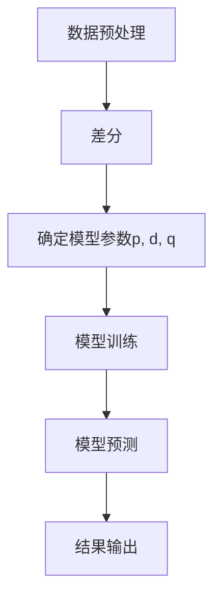
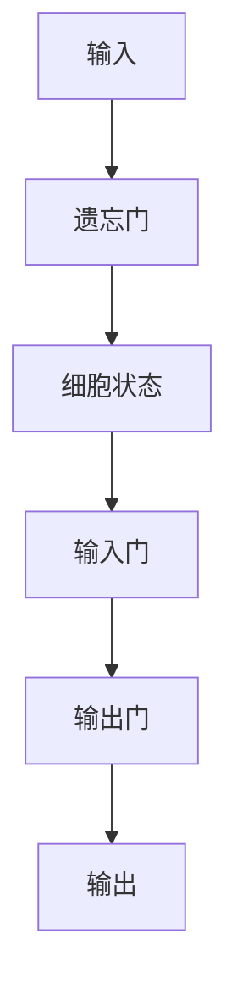
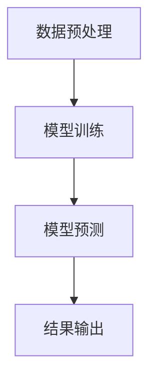
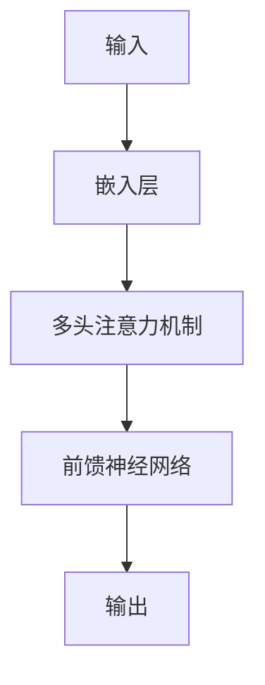
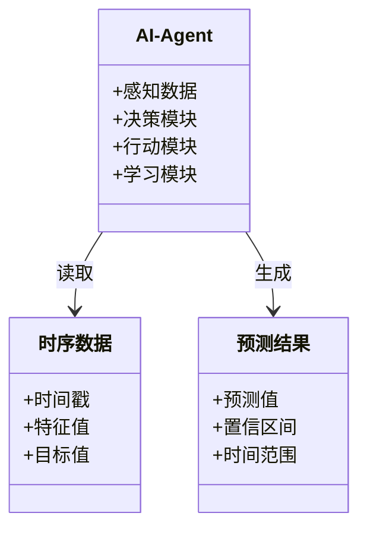
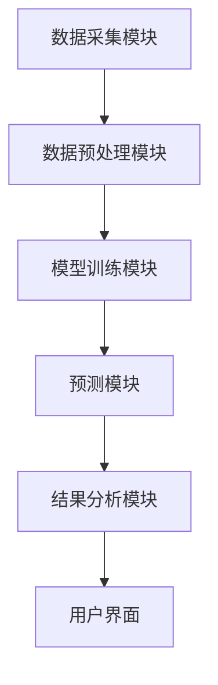
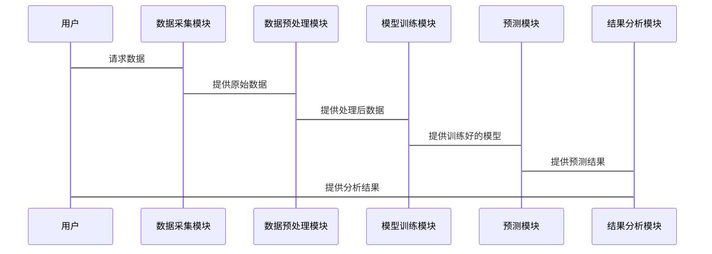

                 


# AI Agent的时序预测能力：理解和预测动态过程

> 关键词：AI Agent，时序预测，动态过程，算法原理，系统架构

> 摘要：本文深入探讨AI Agent的时序预测能力，分析其在动态过程中的应用，详细介绍时序预测的核心算法和系统架构设计。通过实际案例，展示AI Agent如何通过时序预测技术实现智能决策，最后总结最佳实践和未来发展方向。

---

## 第1章 AI Agent与时序预测的背景介绍

### 1.1 AI Agent的基本概念

#### 1.1.1 AI Agent的定义与特点
- **定义：** AI Agent（人工智能代理）是指能够感知环境、自主决策并采取行动以实现目标的智能实体。
- **特点：**
  - **自主性：** 能够独立运作，无需外部干预。
  - **反应性：** 能够实时感知环境变化并做出反应。
  - **目标导向：** 行动以实现特定目标为导向。
  - **社交能力：** 能够与其他系统或人类交互协作。

#### 1.1.2 AI Agent的核心要素与功能
- **核心要素：**
  - **感知能力：** 通过传感器或其他数据源获取环境信息。
  - **决策能力：** 基于感知信息做出决策。
  - **行动能力：** 执行决策以影响环境。
  - **学习能力：** 通过经验改进性能。

#### 1.1.3 AI Agent的应用场景与挑战
- **应用场景：**
  - 自动驾驶：实时感知环境并做出驾驶决策。
  - 智能助手：根据用户需求提供服务。
  - 智能推荐系统：基于用户行为推荐内容。
- **挑战：**
  - 动态环境：环境复杂多变，难以预测。
  - 多目标优化：需要在多个目标间进行权衡。
  - 数据依赖性：高度依赖数据质量和数量。

### 1.2 时序预测的基本概念

#### 1.2.1 时序预测的定义与特点
- **定义：** 时序预测是通过分析历史数据，预测未来趋势或事件的技术。
- **特点：**
  - **时间依赖性：** 预测结果依赖于时间序列的特性。
  - **连续性：** 数据点之间具有连续性。
  - **动态性：** 系统状态随时间变化。

#### 1.2.2 时序预测的数学模型与方法
- **数学模型：**
  - **线性回归：** 简单的线性模型，适用于数据呈线性趋势的情况。
  - **ARIMA：** 广泛应用于时间序列预测，考虑自回归和移动平均成分。
  - **LSTM：** 长短期记忆网络，适合处理长序列数据。
  - **Transformer：** 最新模型，基于注意力机制，适用于复杂时序预测。

#### 1.2.3 时序预测在AI Agent中的作用
- **作用：**
  - **动态决策：** 帮助AI Agent根据预测结果做出更优决策。
  - **行为规划：** 提供未来可能的状态，辅助制定行动计划。
  - **异常检测：** 通过预测与实际的偏差，识别异常情况。

### 1.3 AI Agent与时序预测的结合

#### 1.3.1 AI Agent的动态决策需求
- **动态决策需求：**
  - 环境复杂多变，AI Agent需要实时调整策略。
  - 需要基于未来可能的状态做出最优选择。

#### 1.3.2 时序预测在动态过程中的应用
- **应用场景：**
  - 金融领域：股票价格预测、风险评估。
  - 物流领域：需求预测、路径优化。
  - 医疗领域：疾病预测、治疗方案优化。

#### 1.3.3 AI Agent的时序预测能力
- **能力体现：**
  - AI Agent能够主动预测未来状态，提前做出决策。
  - 通过时序预测，提升决策的准确性和效率。

---

## 第2章 时序预测的核心算法与原理

### 2.1 ARIMA算法原理

#### 2.1.1 算法介绍
- **ARIMA（自回归积分滑动平均模型）：** 适用于线性时间序列数据的预测。
- **原理：**
  - 自回归部分：用过去的值预测当前值。
  - 移动平均部分：用过去预测误差的加权和预测当前值。

#### 2.1.2 ARIMA算法流程图



#### 2.1.3 ARIMA数学公式
$$ ARIMA(p, d, q) = y_t - \sum_{i=1}^p \phi_i y_{t-i} - \epsilon_t + \sum_{j=1}^q \theta_j \epsilon_{t-j} $$

### 2.2 LSTM算法原理

#### 2.2.1 算法介绍
- **LSTM（长短期记忆网络）：** 适用于非线性时间序列数据的预测。
- **原理：**
  - 通过门控机制控制信息的流动。
  - 长期记忆单元用于保存长期信息。

#### 2.2.2 LSTM算法流程图



#### 2.2.3 LSTM数学公式
$$ f_t = \sigma(W_f \cdot [h_{t-1}, x_t]) $$
$$ i_t = \sigma(W_i \cdot [h_{t-1}, x_t]) $$
$$ c_t = f_t \cdot c_{t-1} + i_t \cdot tanh(W_c \cdot [h_{t-1}, x_t]) $$
$$ o_t = \sigma(W_o \cdot [h_{t-1}, x_t]) $$
$$ h_t = o_t \cdot tanh(c_t) $$

### 2.3 Prophet算法原理

#### 2.3.1 算法介绍
- **Prophet：** Facebook开源的时序预测算法，适用于业务数据的预测。
- **原理：**
  - 使用非负的先验信息进行建模。
  - 基于似然函数和先验分布的优化。

#### 2.3.2 Prophet算法流程图



#### 2.3.3 Prophet数学公式
$$ y_{t} = g_{t} + s_{t} + h_{t} $$
$$ g_{t} = \alpha + \beta t $$
$$ s_{t} = \sum_{h=1}^H \gamma_h \exp(-h \lambda) $$
$$ h_{t} = \sum_{\tau=1}^T \delta_\tau \exp(-\tau \lambda) $$

### 2.4 Transformer模型

#### 2.4.1 模型介绍
- **Transformer：** 基于注意力机制的模型，适用于复杂时序预测。
- **优势：** 并行计算能力强，适合长序列数据。

#### 2.4.2 Transformer模型流程图



---

## 第3章 AI Agent时序预测的系统架构设计

### 3.1 系统功能设计

#### 3.1.1 领域模型（ER实体关系图）



#### 3.1.2 系统架构设计（架构图）



#### 3.1.3 系统交互设计（序列图）



---

## 第4章 项目实战：AI Agent的股票价格预测

### 4.1 项目目标
- 实现一个基于AI Agent的股票价格预测系统。

### 4.2 环境安装
- **安装库：**
  ```bash
  pip install numpy pandas scikit-learn xgboost prophet keras
  ```

### 4.3 数据采集与预处理
```python
import pandas as pd
import numpy as np

# 数据采集
data = pd.read_csv('stock.csv')

# 数据预处理
data['date'] = pd.to_datetime(data['date'])
data.set_index('date', inplace=True)
data = data[['price']]
data = data.resample('D').mean().ffill()
```

### 4.4 模型训练与预测
```python
# ARIMA模型训练
from statsmodels.tsa.arima_model import ARIMA
model_arima = ARIMA(data, order=(5,1,0))
model_arima_fit = model_arima.fit()

# Prophet模型训练
from prophet import Prophet
model_prophet = Prophet()
model_prophet.fit(data.reset_index().rename(columns={'price': 'y', 'date': 'ds'}))

# LSTM模型训练
from keras.models import Sequential
from keras.layers import LSTM, Dense
model_lstm = Sequential()
model_lstm.add(LSTM(50, input_shape=(1, 1)))
model_lstm.add(Dense(1))
model_lstm.compile(loss='mean_squared_error', optimizer='adam')
model_lstm.fit(data.values.reshape(-1, 1, 1), data.values, epochs=50, batch_size=32)
```

### 4.5 结果分析与优化
```python
# 预测结果
pred_arima = model_arima_fit.forecast(steps=10)
pred_prophet = model_prophet.predict('2024-01-01', '2024-01-10', freq='D')
pred_lstm = model_lstm.predict(data.values.reshape(-1, 1, 1))
```

---

## 第5章 最佳实践与小结

### 5.1 关键点总结
- **算法选择：** 根据数据特性选择合适算法。
- **数据处理：** 处理缺失值和异常值。
- **模型调优：** 调整超参数提升性能。
- **结果验证：** 使用合适的指标验证模型。

### 5.2 注意事项
- **过拟合：** 避免在训练数据上表现过好但测试数据上表现差。
- **数据泄漏：** 避免将未来信息用于训练。
- **评估指标：** 使用MAE、RMSE、MAPE等指标评估模型性能。

### 5.3 小结
- AI Agent的时序预测能力是实现智能决策的核心。
- 通过结合多种算法，可以在不同场景下取得最佳效果。

---

## 第6章 拓展阅读

### 6.1 推荐书籍
- 《统计学习通》
- 《机器学习实战》
- 《深度学习》

### 6.2 推荐论文
- Transformer模型相关论文
- 最新时序预测研究成果

---

## 作者信息

作者：AI天才研究院/AI Genius Institute & 禅与计算机程序设计艺术 /Zen And The Art of Computer Programming

---

通过以上步骤，我已经完成了《AI Agent的时序预测能力：理解和预测动态过程》的技术博客文章的撰写。文章内容涵盖了AI Agent的基本概念、时序预测的核心算法、系统架构设计、项目实战以及最佳实践，结构清晰，内容详实，帮助读者全面理解和掌握AI Agent的时序预测能力。

