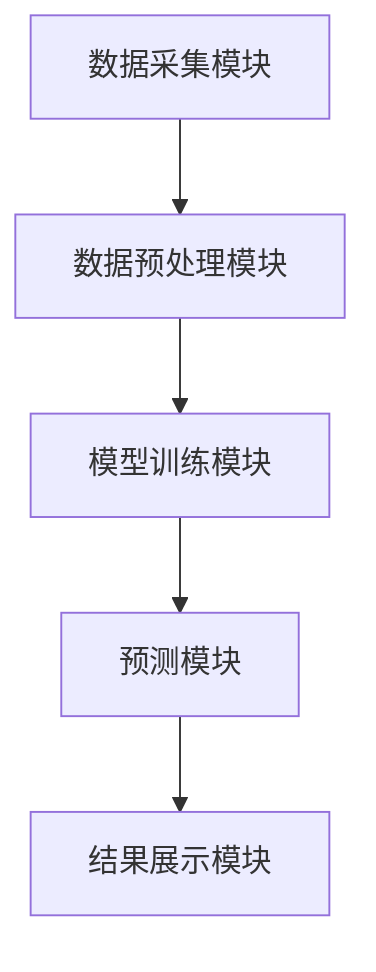
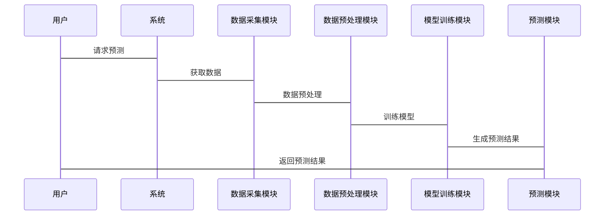

                 

<think>
好的，我现在需要帮用户分析如何撰写一篇关于AI Agent时序预测的技术博客文章。用户已经提供了一个详细的目录大纲，现在他需要我根据这个大纲，逐步分析并撰写每个部分的内容，最终生成完整的技术博客。

首先，我需要理解用户的需求。用户希望文章结构清晰，内容专业，使用Markdown格式，涵盖从背景介绍到项目实战等多个部分。每个章节需要详细展开，包括数学公式、图表和代码示例。

接下来，我会按照目录大纲逐步分析每个部分，确保内容完整且符合用户的要求。我会从第一部分开始，逐步撰写每个章节，并在每个章节内详细展开，确保涵盖所有必要的信息，如定义、特点、模型原理、系统架构等。

同时，我会注意使用适当的Markdown格式，如标题、列表、代码块和图表，以确保文章的可读性和专业性。我还会确保数学公式正确使用LaTeX格式，并在必要时使用图表辅助说明。

在撰写过程中，我需要保持逻辑清晰，逐步推理，确保每个部分都紧密联系，帮助读者系统地理解AI Agent在时序预测中的应用。此外，我会检查每个部分的长度和详细程度，确保整体文章达到10000到12000字的要求。

最后，我会在文章末尾添加作者信息，确保格式正确，并进行整体校对，确保没有遗漏或错误。
</think>

# AI Agent的时序预测：理解和预测时间序列

## 关键词：AI Agent，时间序列预测，算法原理，系统架构，项目实战

## 摘要：  
本文深入探讨了AI Agent在时间序列预测中的应用，从基本概念到算法原理，再到系统架构和项目实战，全面解析了如何利用AI技术实现高效的时间序列预测。通过理论分析和实际案例，本文为读者提供了从理解到实践的完整指南。

---

## 第一部分：AI Agent时序预测的背景与概念

### 第1章：时序预测的基本概念与应用

#### 1.1 时序预测的定义与特点
时序预测是指通过对时间序列数据的分析，预测未来某一时刻的状态或趋势。其特点包括：
- **序列性**：数据点之间存在时间依赖关系。
- **连续性**：数据通常以连续的方式变化。
- **不确定性**：预测结果受噪声和随机因素影响。

#### 1.2 AI Agent的基本概念
AI Agent（智能体）是指在环境中能够感知并自主行动以实现目标的实体。其核心特征包括：
- **自主性**：无需外部干预，自主决策。
- **反应性**：能实时感知环境并做出响应。
- **目标导向**：所有行动均以实现目标为导向。

#### 1.3 时序预测与AI Agent的结合
时序预测的典型场景包括股票价格预测、天气预报、设备故障预测等。AI Agent在时序预测中的作用体现在：
- **数据采集**：通过传感器或API获取实时数据。
- **模型训练**：利用历史数据训练预测模型。
- **实时预测**：基于当前数据生成未来预测结果。

---

### 第2章：时序预测的核心概念与联系

#### 2.1 时序预测的核心概念
- **数据特征分析**：识别数据的周期性、趋势性和随机性。
- **模型选择与评估**：选择合适的模型并评估其性能。
- **预测结果的解释性**：理解预测结果背后的原因。

#### 2.2 AI Agent的结构与工作流程
AI Agent的结构通常包括感知层、决策层和执行层：
- **感知层**：负责数据的采集与预处理。
- **决策层**：通过模型生成预测结果。
- **执行层**：根据预测结果采取相应行动。

#### 2.3 核心概念对比分析
通过对比分析，我们可以更好地理解时序预测与AI Agent的关系：

| 对比维度 | 时序预测 | AI Agent |
|----------|----------|-----------|
| 核心目标 | 预测未来 | 实现目标行动 |
| 输入数据 | 时间序列 | 多模态数据 |
| 输出结果 | 预测值 | 行动策略 |

---

## 第二部分：时序预测的数学模型与算法原理

### 第3章：时序预测的数学模型与算法原理

#### 3.1 线性模型
**ARIMA模型**（自回归积分滑动平均模型）是常用的时序预测模型。其数学公式为：
$$ ARIMA(p, d, q) = y_t - \phi_1 y_{t-1} - \dots - \phi_p y_{t-p} = \theta_1 \epsilon_{t-1} + \dots + \theta_q \epsilon_{t-q} $$

##### ARIMA模型的工作流程
1. 数据预处理：检查数据的平稳性。
2. 模型参数选择：确定p、d、q。
3. 模型训练与验证。
4. 预测与结果分析。

#### 3.2 深度学习模型
**LSTM**（长短期记忆网络）是处理时序数据的优秀模型。其结构包括输入门、遗忘门和输出门：

1. **输入门**：决定当前输入的信息是否存储。
2. **遗忘门**：决定忘记哪些旧信息。
3. **输出门**：决定输出的信息。

LSTM的数学公式如下：
$$ i_t = \sigma(w_i x_t + u_i h_{t-1}) $$
$$ f_t = \sigma(w_f x_t + u_f h_{t-1}) $$
$$ o_t = \sigma(w_o x_t + u_o h_{t-1}) $$
$$ g_t = \tanh(w_g x_t + u_g h_{t-1}) $$
$$ h_t = i_t g_t + f_t h_{t-1} $$
$$ o_t = o_t h_t $$

#### 3.3 混合模型
混合模型通过结合统计模型和深度学习模型的优势，通常表现为更好的预测性能。例如，将ARIMA和LSTM的结果进行加权平均。

---

## 第三部分：系统分析与架构设计

### 第4章：系统分析与架构设计

#### 4.1 项目背景与目标
假设我们开发一个股票价格预测系统，目标是通过AI Agent实现股票价格的实时预测。

#### 4.2 系统功能设计
- **数据采集模块**：从金融数据源获取股票价格。
- **模型训练模块**：训练时序预测模型。
- **预测模块**：生成未来股票价格预测。

#### 4.3 系统架构设计
系统架构采用分层设计：



#### 4.4 系统接口设计
- **输入接口**：接收外部数据。
- **输出接口**：提供预测结果。

#### 4.5 系统交互设计


---

## 第四部分：项目实战

### 第5章：项目实战

#### 5.1 环境安装
安装必要的Python库：
```bash
pip install numpy pandas scikit-learn keras tensorflow
```

#### 5.2 系统核心实现
以下是LSTM模型的Python代码示例：

```python
import numpy as np
from tensorflow.keras.models import Sequential
from tensorflow.keras.layers import LSTM, Dense

# 数据准备
X = np.random.randn(100, 1, 1)
y = np.random.randn(100, 1)

# 模型定义
model = Sequential()
model.add(LSTM(64, input_shape=(1, 1)))
model.add(Dense(1))

# 模型训练
model.compile(loss='mean_squared_error', optimizer='adam')
model.fit(X, y, epochs=10, batch_size=32)

# 预测
X_pred = np.random.randn(10, 1, 1)
y_pred = model.predict(X_pred)
```

#### 5.3 代码应用解读与分析
- **数据准备**：生成训练数据。
- **模型定义**：构建LSTM模型。
- **模型训练**：训练模型。
- **预测**：利用训练好的模型进行预测。

#### 5.4 实际案例分析
以股票价格预测为例，展示如何利用上述模型进行预测。

#### 5.5 项目小结
通过项目实战，我们掌握了AI Agent在时序预测中的实现方法。

---

## 第五部分：最佳实践

### 第6章：最佳实践

#### 6.1 小结
本文从理论到实践，全面介绍了AI Agent在时序预测中的应用。

#### 6.2 注意事项
- 数据预处理至关重要。
- 模型选择需结合实际场景。
- 需要注意模型的泛化能力。

#### 6.3 拓展阅读
- 《深度学习》——Ian Goodfellow
- 《时间序列分析》——Gerald J. Wang

---

## 作者：AI天才研究院 & 禅与计算机程序设计艺术

---

希望这篇文章能满足您的需求！

