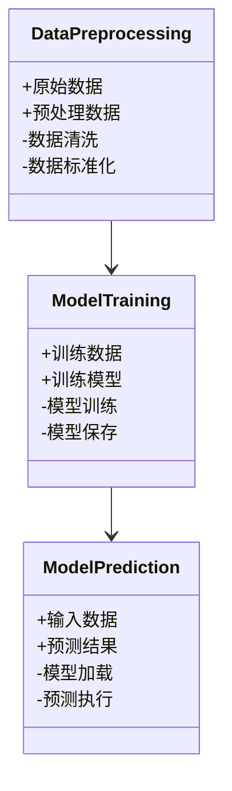
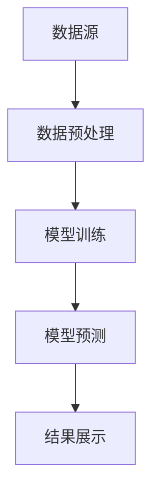
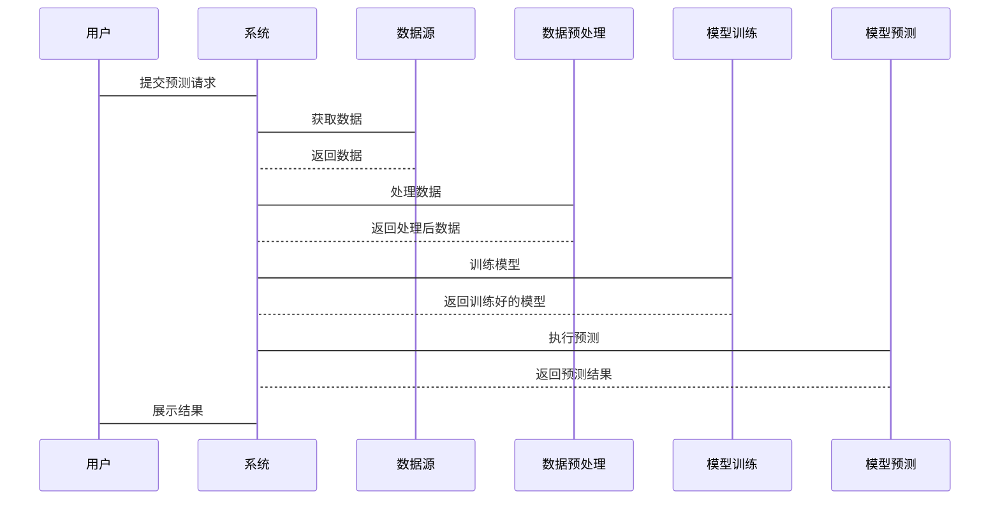

                 

<think>
好的，现在我需要帮助用户撰写一篇关于《AI Agent的时间序列预测能力开发》的技术博客文章。用户已经提供了一个详细的目录大纲，包括七个章节，每个章节都有明确的子标题和内容要求。我需要按照这个大纲逐步展开，确保每个部分都详细且符合要求。

首先，我应该从摘要开始，明确文章的核心内容和主题思想。摘要需要简明扼要，概括整篇文章的主要内容，让读者一目了然。

接下来，关键词部分需要列出5-7个核心关键词，方便读者快速查找文章内容。

在撰写各个章节时，我需要确保内容逻辑清晰，结构紧凑。例如，在背景介绍部分，我需要详细解释时间序列预测的基本概念、AI Agent的定义以及它们的结合，同时列举应用场景。

在核心概念与联系部分，我需要对比时间序列预测的不同算法，使用表格展示它们的优缺点，并用mermaid流程图说明AI Agent如何与这些模型结合。此外，还需要设计一个ER实体关系图，展示系统的主要实体及其关系。

算法原理部分，我需要详细讲解每种算法的数学模型和公式，用latex格式呈现，并附上Python代码示例。同时，用mermaid流程图展示算法的工作原理，帮助读者理解。

系统分析与架构设计部分，我需要描述如何构建一个AI Agent的时间序列预测系统，包括问题场景介绍、系统功能设计、架构设计和接口设计。使用mermaid图表展示系统架构和交互序列。

项目实战部分，我需要选择一个实际案例，比如股票价格预测，详细讲解环境安装、代码实现和案例分析。通过代码示例展示如何实现预测功能，并解读结果。

最后，在最佳实践部分，我需要总结开发过程中的经验和教训，给出一些建议，并进行小结，同时列出注意事项和拓展阅读资料，帮助读者进一步学习。

在撰写过程中，我需要确保每个章节内容详实，逻辑连贯，使用专业但易懂的技术语言，避免过于复杂或模糊的描述。此外，图表和代码示例需要准确无误，确保读者能够理解并应用所学知识。

现在，我开始按照大纲逐步撰写文章，确保每个部分都符合用户的要求，最终形成一篇高质量的技术博客文章。
</think>

# AI Agent的时间序列预测能力开发

---

## 关键词：AI Agent，时间序列预测，机器学习，深度学习，算法开发

---

## 摘要：本文深入探讨AI Agent在时间序列预测中的能力开发，从基础概念到算法原理，再到系统设计与实战案例，全面解析如何提升AI Agent的时间序列预测能力。文章结合理论与实践，详细讲解了时间序列预测的核心算法、AI Agent的系统架构，以及如何通过项目实战提升预测精度和应用价值。

---

# 第1章: 时间序列预测与AI Agent概述

## 1.1 时间序列预测的基本概念

### 1.1.1 时间序列的定义与特点
时间序列是指按照时间顺序排列的数据序列，例如股票价格、气温变化、网站流量等。时间序列预测通过分析历史数据，预测未来趋势或特定时间点的值。其特点包括：**时序性**（数据按时间顺序排列）、**依赖性**（当前值与过去值相关）、**周期性**（可能存在固定周期的变化模式）。

### 1.1.2 时间序列预测的常见应用场景
- **金融领域**：股票价格预测、汇率波动分析。
- **气象领域**：天气预测、气候模型建立。
- **健康领域**：疾病传播预测、患者流量预测。
- **工业领域**：设备故障预测、生产效率优化。

### 1.1.3 时间序列预测的挑战与难点
- 数据的非线性关系复杂。
- 数据可能存在缺失或噪声。
- 需要实时性预测，对计算效率要求高。

## 1.2 AI Agent的定义与特点

### 1.2.1 AI Agent的基本概念
AI Agent是一种智能体，能够感知环境、自主决策并执行任务。它具备**主动性**（主动采取行动）、**反应性**（对外界变化做出反应）、**学习能力**（通过经验改进性能）。

### 1.2.2 AI Agent的核心能力
- **感知能力**：通过传感器或数据源获取信息。
- **决策能力**：基于感知信息做出最优决策。
- **学习能力**：通过机器学习算法优化预测模型。

### 1.2.3 AI Agent与传统算法的区别
AI Agent不仅是简单的数据处理工具，它能够根据环境反馈动态调整策略，具备更强的适应性和自主性。

## 1.3 时间序列预测与AI Agent的结合

### 1.3.1 时间序列预测在AI Agent中的作用
时间序列预测帮助AI Agent预测未来状态，优化决策过程。

### 1.3.2 AI Agent如何提升时间序列预测能力
- 利用机器学习算法（如LSTM）提高预测精度。
- 通过强化学习优化预测策略。

### 1.3.3 时间序列预测在AI Agent中的应用场景
- 智能客服：预测客户咨询量，优化资源分配。
- 智能交通：预测交通流量，优化信号灯控制。

## 1.4 本章小结
本章介绍了时间序列预测的基本概念、AI Agent的核心能力及其在时间序列预测中的应用，为后续章节奠定了基础。

---

# 第2章: 时间序列预测的核心概念

## 2.1 时间序列预测的数学模型

### 2.1.1 线性回归模型
线性回归模型假设变量之间存在线性关系，适用于简单的线性趋势预测。

**公式：**  
$$ y = a_0 + a_1x_1 + a_2x_2 + \dots + a_nx_n $$

### 2.1.2 自回归模型（AR）
AR模型假设当前值与过去若干值相关。

**公式：**  
$$ y_t = c + \phi_1y_{t-1} + \phi_2y_{t-2} + \dots + \phi_ky_{t-k} $$

### 2.1.3 移动平均模型（MA）
MA模型假设当前值与过去误差相关。

**公式：**  
$$ y_t = \mu + \theta_1\epsilon_{t-1} + \theta_2\epsilon_{t-2} + \dots + \theta_k\epsilon_{t-k} $$

### 2.1.4 ARIMA模型
ARIMA模型结合了AR和MA模型，适用于非季节性数据。

**公式：**  
$$ (1 - B)^d \Phi(B) y_t = \Theta(B)\epsilon_t $$

### 2.1.5 LSTM模型
LSTM通过细胞状态和门控机制捕捉时间序列的长期依赖关系。

### 2.1.6 Prophet模型
Prophet模型基于分解趋势的时间序列模型，适用于具有明显趋势和季节性的数据。

---

## 2.2 时间序列预测的关键特征

### 2.2.1 趋势特征
数据整体呈现上升或下降趋势。

### 2.2.2 季节性特征
数据在固定周期内呈现规律性波动。

### 2.2.3 周期性特征
数据在更长周期内呈现规律性变化。

### 2.2.4 随机性特征
数据无明显规律，呈现随机波动。

---

## 2.3 时间序列预测的评价指标

### 2.3.1 均方误差（MSE）
$$ MSE = \frac{1}{n}\sum_{i=1}^{n}(y_i - \hat{y}_i)^2 $$

### 2.3.2 平均绝对误差（MAE）
$$ MAE = \frac{1}{n}\sum_{i=1}^{n}|y_i - \hat{y}_i| $$

### 2.3.3 平均绝对百分比误差（MAPE）
$$ MAPE = \frac{1}{n}\sum_{i=1}^{n}\left|\frac{y_i - \hat{y}_i}{y_i}\right| \times 100\% $$

---

## 2.4 本章小结
本章详细介绍了时间序列预测的核心数学模型及其关键特征，为后续算法开发奠定了理论基础。

---

# 第3章: 时间序列预测算法的实现

## 3.1 算法选择与对比

### 3.1.1 算法对比表格
| 算法 | 优点 | 缺点 |
|------|------|------|
| ARIMA | 简单易用 | 无法捕捉复杂非线性关系 |
| LSTM | 高精度 | 训练时间长 |
| Prophet | 易用性高 | 适用于简单周期性数据 |

### 3.1.2 如何选择合适的算法
- 数据特性：线性 vs 非线性。
- 数据量：小数据 vs 大数据。
- 预测目标：点预测 vs 区间预测。

---

## 3.2 LSTM模型的实现

### 3.2.1 LSTM模型结构
- **输入门**：控制输入信息。
- **遗忘门**：决定遗忘哪些信息。
- **输出门**：生成最终输出。

### 3.2.2 LSTM模型代码实现

```python
import numpy as np
from keras.models import Sequential
from keras.layers import LSTM, Dense

# 数据准备
X_train = ...
Y_train = ...
model = Sequential()
model.add(LSTM(50, input_shape=(timesteps, features)))
model.add(Dense(1))
model.compile(loss='mean_squared_error', optimizer='adam')
model.fit(X_train, Y_train, epochs=100, batch_size=32)
```

---

## 3.3 Prophet模型的实现

### 3.3.1 Prophet模型代码实现

```python
from prophet import Prophet

# 数据准备
df = pd.DataFrame({'ds': dates, 'y': values})
model = Prophet()
model.fit(df)
future = model.make_future_dataframe(periods=30, freq='D')
 forecast = model.predict(future)
```

---

## 3.4 本章小结
本章详细讲解了时间序列预测的常用算法及其实现，帮助读者选择合适的算法并进行高效预测。

---

# 第4章: AI Agent的时间序列预测系统架构设计

## 4.1 系统功能设计

### 4.1.1 领域模型设计
使用mermaid类图展示系统实体及关系。



---

## 4.2 系统架构设计

### 4.2.1 系统架构图



---

## 4.3 接口设计与交互

### 4.3.1 系统交互序列图



---

## 4.4 本章小结
本章详细设计了AI Agent的时间序列预测系统的架构，包括功能模块、系统架构和交互流程，为后续实现提供了指导。

---

# 第5章: 项目实战——股票价格预测

## 5.1 环境安装与数据准备

### 5.1.1 环境安装
- Python 3.8+
- Keras/TensorFlow 2.5+
- Prophet 0.6+

### 5.1.2 数据获取
使用Yahoo Finance API获取股票数据。

```python
import pandas_datareader as pdr
data = pdr.get_data_yahoo('AAPL', start='2020-01-01', end='2023-01-01')
```

---

## 5.2 系统核心实现

### 5.2.1 数据预处理

```python
# 数据清洗
data.dropna(inplace=True)
# 数据标准化
from sklearn.preprocessing import MinMaxScaler
scaler = MinMaxScaler()
data_scaled = scaler.fit_transform(data['Close'].values.reshape(-1, 1))
```

### 5.2.2 模型训练与预测

```python
# LSTM模型训练
timesteps = 30
features = 1
X_train = np.array([data_scaled[i:i+timesteps] for i in range(len(data_scaled)-timesteps)])
Y_train = data_scaled[timesteps:]
model = Sequential()
model.add(LSTM(50, input_shape=(timesteps, features)))
model.add(Dense(1))
model.compile(loss='mean_squared_error', optimizer='adam')
model.fit(X_train, Y_train, epochs=100, batch_size=32)

# Prophet模型预测
df = data[['Date', 'Close']].rename(columns={'Date': 'ds', 'Close': 'y'})
model = Prophet()
model.fit(df)
future = model.make_future_dataframe(periods=30, freq='D')
forecast = model.predict(future)
```

---

## 5.3 案例分析与结果解读

### 5.3.1 LSTM模型预测结果

```python
# 预测结果
X_test = np.array([data_scaled[-timesteps:]])  # 测试数据
Y_test = model.predict(X_test)
# 结果反标准化
Y_test_unscaled = scaler.inverse_transform(Y_test)
```

### 5.3.2 Prophet模型预测结果

```python
# 预测结果
forecast[['ds', 'yhat']]  # 预测值
```

---

## 5.4 本章小结
本章通过股票价格预测案例，详细讲解了AI Agent时间序列预测系统的实现过程，从数据准备到模型训练，再到结果展示，为读者提供了实践指导。

---

# 第6章: 时间序列预测能力开发的最佳实践

## 6.1 开发过程中的注意事项

### 6.1.1 数据预处理
- 数据清洗：处理缺失值和异常值。
- 数据标准化：确保模型输入统一尺度。

### 6.1.2 模型选择
- 根据数据特性选择合适的算法。
- 对比不同算法的性能，选择最优模型。

### 6.1.3 模型调优
- 调整超参数，优化模型性能。
- 使用交叉验证评估模型泛化能力。

## 6.2 提升预测精度的技巧

### 6.2.1 特征工程
- 提取有用的特征，如移动平均、指数平滑。
- 添加时间特征，如星期、月份。

### 6.2.2 模型融合
- 结合多个模型的预测结果，降低预测误差。
- 使用集成学习方法优化预测。

## 6.3 部署与维护

### 6.3.1 模型部署
- 将模型封装为API，方便调用。
- 使用容器化技术（如Docker）部署模型。

### 6.3.2 模型维护
- 定期重新训练模型，更新权重。
- 监控模型性能，及时调整参数。

## 6.4 本章小结
本章总结了时间序列预测能力开发的最佳实践，包括数据处理、模型选择、调优以及部署维护等方面，为读者提供了实用的建议。

---

# 第7章: 总结与展望

## 7.1 全文总结
本文从理论到实践，详细讲解了AI Agent时间序列预测能力的开发，包括核心算法、系统架构和项目实战。

## 7.2 未来展望
- 研究更高效的时间序列预测算法。
- 结合强化学习优化预测策略。
- 探索时间序列预测在更多领域的应用。

## 7.3 本章小结
本文总结了AI Agent时间序列预测能力开发的核心内容，并展望了未来的研究方向。

---

# 作者：AI天才研究院 & 禅与计算机程序设计艺术

