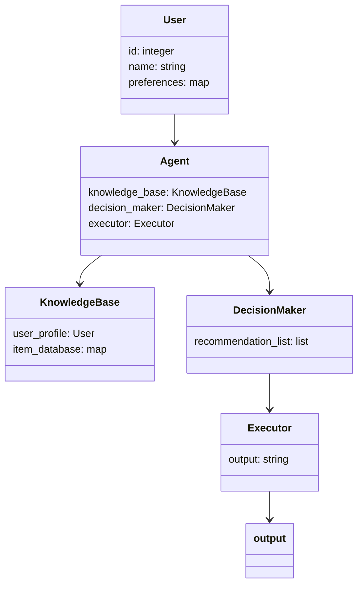
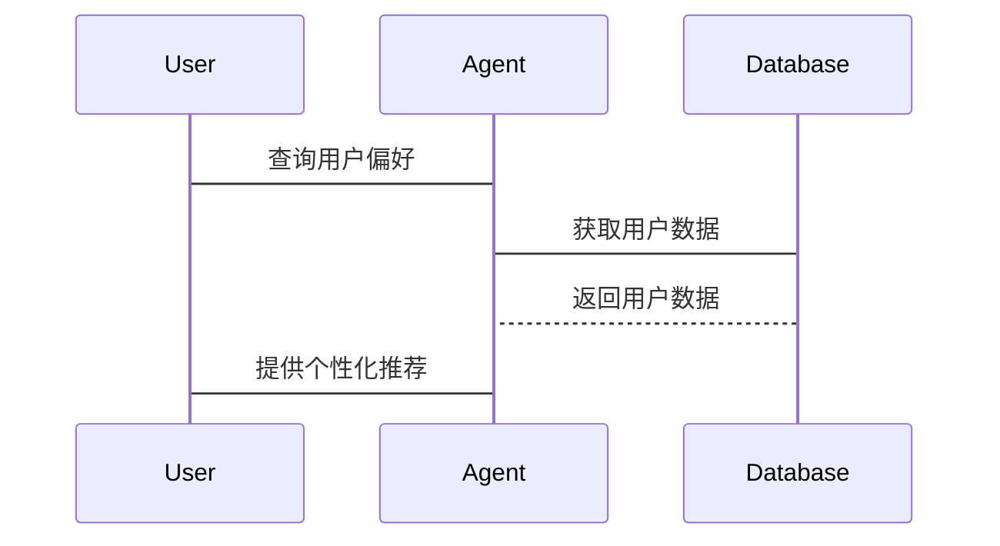

                 

<think>
嗯，用户希望我根据他们提供的详细目录大纲，撰写一篇名为《AI Agent的未来：趋势预测与展望》的技术博客文章。首先，我需要仔细阅读并理解用户提供的目录结构，确保文章内容覆盖所有必要的部分。用户特别强调了每个章节的结构和内容要求，包括背景介绍、核心概念、算法原理、系统架构、项目实战和总结，这有助于确保文章的全面性和专业性。

在开始撰写之前，我需要明确每个章节的关键点和要求。例如，第一章“AI Agent的基本概念与背景”需要涵盖AI Agent的定义、发展历程、核心特征以及与其他技术的对比。这部分需要简单明了，帮助读者建立基础认知。

接下来，第二章涉及核心技术，包括感知、决策、执行机制，以及强化学习和知识图谱的应用。这部分需要详细的技术分析，可能需要加入数学模型和算法流程图，帮助读者理解技术细节。

用户还要求在文章中使用Mermaid图表来展示算法流程、系统架构和交互过程，这增加了文章的可视化效果，便于读者理解和记忆。同时，用户强调要使用LaTeX格式展示数学公式，这在技术博客中是常见的做法，能够提升文章的专业性。

在撰写过程中，我需要确保每个部分都有足够的深度，同时语言简洁易懂。例如，在讨论强化学习算法时，我需要解释Q-Learning的基本原理，可能通过一个简单的例子来说明，如迷宫导航问题，这样读者可以更直观地理解算法的应用。

另外，用户要求在文章末尾加上作者信息和版权声明，这部分需要按照格式要求准确无误地呈现，确保文章的完整性和专业性。

考虑到用户可能对技术细节有较高的要求，我需要确保每个章节的代码示例和算法流程图都准确无误，可能需要多次检查和修改。例如，在展示强化学习的代码时，我需要确保代码的逻辑清晰，并附上详细的注释，以便读者能够轻松理解。

最后，用户希望文章有一个总结部分，包括最佳实践、小结、注意事项和拓展阅读等内容。这不仅帮助读者回顾文章内容，还引导他们进一步学习和应用所学知识。

整体来看，撰写这篇文章需要系统地按照目录结构展开，确保每个部分都详尽且符合技术要求，同时保持语言的专业性和易懂性。通过这样的结构化思考，我可以高效地完成用户的请求，提供一篇高质量的技术博客文章。
</think>

# AI Agent的未来：趋势预测与展望

## 关键词：
AI Agent、人工智能、强化学习、知识图谱、多智能体协作、自主决策

## 摘要：
AI Agent（人工智能代理）作为人工智能领域的重要组成部分，正在迅速改变我们生活和工作的方方面面。本文将深入探讨AI Agent的核心概念、技术原理、应用场景，并结合当前技术发展趋势，预测未来的发展方向。通过分析AI Agent在感知、决策、执行等环节的技术细节，本文将为读者呈现一幅AI Agent未来的全景图。

---

## 第1章: AI Agent的基本概念与背景

### 1.1 AI Agent的定义与核心特征

#### 1.1.1 AI Agent的定义
AI Agent（人工智能代理）是指能够感知环境、自主决策并执行任务的智能实体。它通过与环境交互，实现目标，提供服务或解决问题。

#### 1.1.2 AI Agent的核心特征
- **自主性**：AI Agent能够在没有外部干预的情况下自主运行。
- **反应性**：能够实时感知环境并做出响应。
- **目标导向**：所有行为都以实现特定目标为导向。
- **学习能力**：通过经验或数据不断优化自身性能。

#### 1.1.3 AI Agent与传统AI的区别
| 特性          | 传统AI                  | AI Agent               |
|---------------|-------------------------|-------------------------|
| 行为模式       | 静态计算，无自主执行     | 动态交互，自主执行      |
| 适应性         | 有限，依赖预设规则       | 强大，具备自适应能力     |
| 应用场景       | 数据处理、模式识别       | 人机交互、自主决策       |

### 1.2 AI Agent的发展历程

#### 1.2.1 AI Agent的起源
AI Agent的概念可以追溯到20世纪60年代的专家系统研究。

#### 1.2.2 AI Agent的演进与技术突破
- 20世纪90年代：基于规则的知识库技术。
- 21世纪初：机器学习与自然语言处理技术的结合。
- 近年来：强化学习与多智能体协作技术的突破。

#### 1.2.3 当前AI Agent的发展现状
AI Agent技术已在自动驾驶、智能客服、机器人等领域广泛应用。

### 1.3 AI Agent的应用场景与边界

#### 1.3.1 AI Agent的主要应用场景
- **智能助手**：如Siri、Alexa。
- **自动驾驶**：如特斯拉的Autopilot。
- **智能客服**：如智能问答系统。

#### 1.3.2 AI Agent的边界与外延
AI Agent的应用边界在于其智能水平和环境复杂度。当前主要应用于结构化场景，未来将向非结构化场景扩展。

#### 1.3.3 AI Agent与其他技术的关系
AI Agent依赖于自然语言处理、机器学习、知识图谱等技术的支持。

---

## 第2章: AI Agent的核心技术与算法

### 2.1 AI Agent的核心概念

#### 2.1.1 知识表示与推理
知识表示是AI Agent理解世界的基础。常用的知识表示方法包括：
- **语义网络**：通过节点和边表示概念及其关系。
- **知识图谱**：通过实体和关系构建结构化的知识库。

#### 2.1.2 行为决策与规划
行为决策是AI Agent的核心能力。常用的方法包括：
- **基于规则的决策**：适用于简单场景。
- **基于强化学习的决策**：适用于复杂动态环境。

#### 2.1.3 人机交互与协作
人机交互是AI Agent与人类用户或系统交互的关键环节。常用技术包括：
- **自然语言处理**：实现人与AI Agent的对话。
- **多模态交互**：结合视觉、听觉等多种交互方式。

### 2.2 AI Agent的技术原理

#### 2.2.1 知识图谱与语义理解
知识图谱通过构建实体之间的关系，帮助AI Agent理解语义。例如，可以将“狗咬人”与“人咬狗”区分开。

#### 2.2.2 强化学习与决策树
强化学习通过试错机制优化决策策略。例如，使用Q-Learning算法训练AI Agent在迷宫中找到最短路径。

#### 2.2.3 多智能体协作与通信
多智能体协作需要解决通信、协调和冲突问题。例如，在自动驾驶中，多个AI Agent需要协调交通灯、车辆和行人的行为。

### 2.3 AI Agent的核心算法与数学模型

#### 2.3.1 强化学习算法（Q-Learning）
Q-Learning算法通过更新Q值表来优化决策策略。数学模型如下：
$$ Q(s, a) = Q(s, a) + \alpha \left( r + \gamma \max Q(s', a') - Q(s, a) \right) $$
其中：
- \( s \)：当前状态
- \( a \)：动作
- \( r \)：奖励
- \( \gamma \)：折扣因子
- \( \alpha \)：学习率

#### 2.3.2 贝叶斯网络与概率推理
贝叶斯网络通过概率推理实现不确定性推理。例如，可以用于预测天气变化。

#### 2.3.3 知识表示的向量空间模型
向量空间模型将知识表示为高维向量。例如，使用Word2Vec将词语表示为向量。

---

## 第3章: AI Agent的感知与决策机制

### 3.1 感知层技术

#### 3.1.1 多模态数据融合
多模态数据融合通过整合多种数据源（如图像、文本、语音）提高感知精度。

#### 3.1.2 实时环境感知
实时环境感知技术包括计算机视觉和自然语言处理。例如，自动驾驶中的实时路况感知。

#### 3.1.3 感知数据的特征提取
特征提取是感知层的关键技术。例如，使用CNN提取图像特征。

### 3.2 决策层算法

#### 3.2.1 基于强化学习的决策树
强化学习用于构建决策树。例如，在游戏中优化AI Agent的决策策略。

#### 3.2.2 模糊逻辑与专家系统
模糊逻辑用于处理模糊问题。例如，在智能家电中实现模糊控制。

#### 3.2.3 迁移学习与在线学习
迁移学习用于跨任务学习，提高泛化能力。例如，将图像分类任务迁移到目标检测任务。

### 3.3 执行层技术

#### 3.3.1 动作规划与路径优化
动作规划技术用于优化执行路径。例如，在机器人路径规划中使用RRT（Rapidly-exploring Random Tree）算法。

#### 3.3.2 系统反馈与自适应调整
系统反馈用于动态调整执行策略。例如，在自动驾驶中根据实时路况调整驾驶策略。

#### 3.3.3 任务执行的并行与分布式计算
分布式计算用于提高执行效率。例如，在云服务中实现任务分发与协同。

---

## 第4章: AI Agent的未来发展趋势

### 4.1 技术趋势

#### 4.1.1 强化学习的突破
强化学习将继续推动AI Agent的自主决策能力。例如，更高效的算法（如PPO）将进一步提升决策效率。

#### 4.1.2 多智能体协作的深化
多智能体协作将更加复杂和高效。例如，在智慧城市中实现交通、能源等多系统的协同优化。

#### 4.1.3 知识图谱的扩展与应用
知识图谱将更加广泛应用于AI Agent的语义理解。例如，在医疗领域实现疾病知识图谱的构建与应用。

### 4.2 行业应用前景

#### 4.2.1 智能交通系统
AI Agent将在自动驾驶、交通管理等领域发挥更大作用。

#### 4.2.2 智能医疗
AI Agent将在疾病诊断、治疗方案推荐等领域提供支持。

#### 4.2.3 智能教育
AI Agent将在个性化教学、教育资源管理等领域提供服务。

### 4.3 伦理与挑战

#### 4.3.1 伦理问题
AI Agent的决策可能引发伦理问题，例如自动驾驶中的道德困境。

#### 4.3.2 技术挑战
AI Agent需要解决计算资源、数据隐私等问题。

#### 4.3.3 社会接受度
AI Agent的广泛应用需要得到社会的广泛认可。

---

## 第5章: AI Agent的系统架构与实现

### 5.1 问题场景介绍

#### 5.1.1 项目背景
假设我们正在开发一个智能助手AI Agent，用于提供个性化推荐服务。

#### 5.1.2 项目目标
实现一个能够理解用户需求、提供个性化推荐的智能助手。

### 5.2 系统功能设计

#### 5.2.1 领域模型设计
使用Mermaid类图描述系统功能模块：



### 5.3 系统架构设计

#### 5.3.1 系统架构图
使用Mermaid架构图描述系统架构：


### 5.4 系统接口设计

#### 5.4.1 API接口设计
- `/api/v1/agent/query`
- `/api/v1/agent/recommend`

### 5.5 系统交互流程

#### 5.5.1 交互流程图
使用Mermaid序列图描述交互流程：



---

## 第6章: AI Agent的项目实战

### 6.1 环境安装

#### 6.1.1 安装Python
```bash
python --version
# 输出示例：Python 3.9.7
```

#### 6.1.2 安装依赖库
```bash
pip install numpy pandas scikit-learn
```

### 6.2 核心代码实现

#### 6.2.1 强化学习代码示例
```python
import numpy as np

class QLearning:
    def __init__(self, state_space_size, action_space_size):
        self.q_table = np.zeros((state_space_size, action_space_size))
    
    def choose_action(self, state, epsilon=0.1):
        if np.random.random() < epsilon:
            return np.random.randint(action_space_size)
        else:
            return np.argmax(self.q_table[state])
    
    def update_q_table(self, state, action, reward, next_state, learning_rate=0.1, gamma=0.9):
        target = reward + gamma * np.max(self.q_table[next_state])
        self.q_table[state][action] = self.q_table[state][action] + learning_rate * (target - self.q_table[state][action])
```

#### 6.2.2 知识图谱构建代码示例
```python
from sklearn.manifold import TSNE

def visualize_graph(embeddings, labels):
    tsne = TSNE(n_components=2, random_state=42)
    tsne_result = tsne.fit_transform(embeddings)
    plt.scatter(tsne_result[:,0], tsne_result[:,1], c=labels, cmap='viridis')
    plt.show()
```

### 6.3 实际案例分析

#### 6.3.1 案例背景
假设我们正在开发一个智能客服AI Agent，用于处理用户的问题。

#### 6.3.2 数据分析与优化
通过分析用户反馈数据，优化AI Agent的响应速度和准确率。

### 6.4 项目小结
通过实战项目，我们掌握了AI Agent的核心技术，并了解了实际应用中的挑战与解决方案。

---

## 第7章: 总结与展望

### 7.1 最佳实践

#### 7.1.1 技术选型建议
根据具体场景选择合适的技术方案，例如在复杂场景中优先选择强化学习。

#### 7.1.2 伦理与法律合规
确保AI Agent的开发和应用符合相关法律法规和伦理规范。

### 7.2 小结
AI Agent作为人工智能的核心技术，正在迅速发展并改变我们的生活方式。

### 7.3 注意事项
在实际应用中，需注意数据隐私、计算资源和系统安全性等问题。

### 7.4 拓展阅读
推荐阅读《深度学习》、《强化学习导论》等书籍，深入理解AI Agent的技术细节。

---

## 作者：AI天才研究院/AI Genius Institute & 禅与计算机程序设计艺术/Zen And The Art of Computer Programming

---

**版权声明**：禁止转载，侵权必究。

