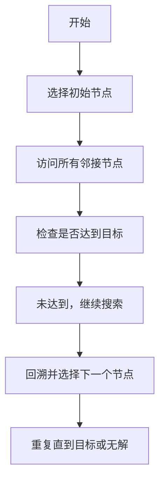
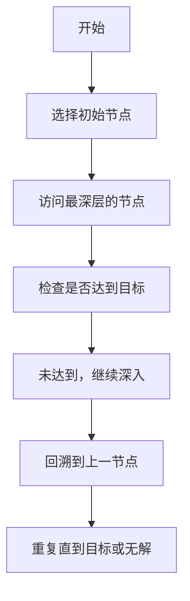
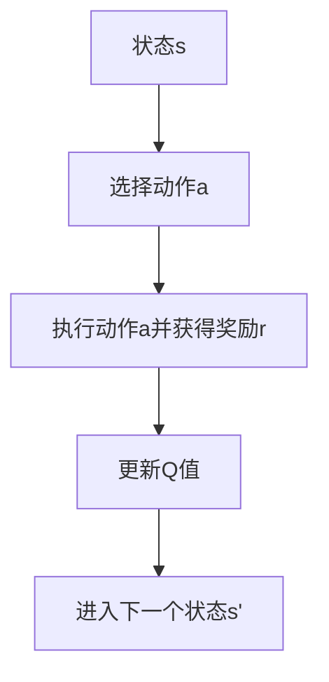
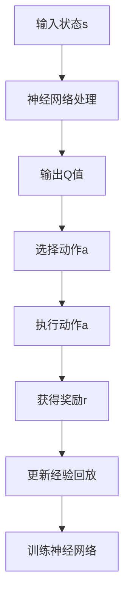
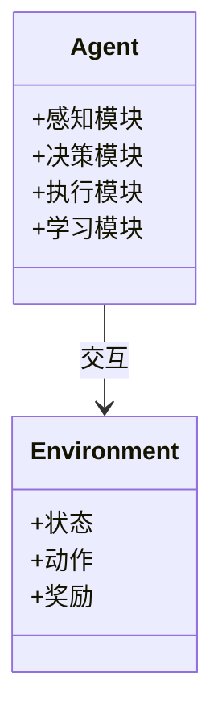
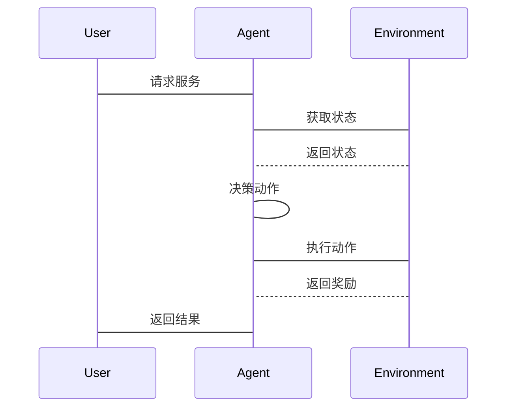
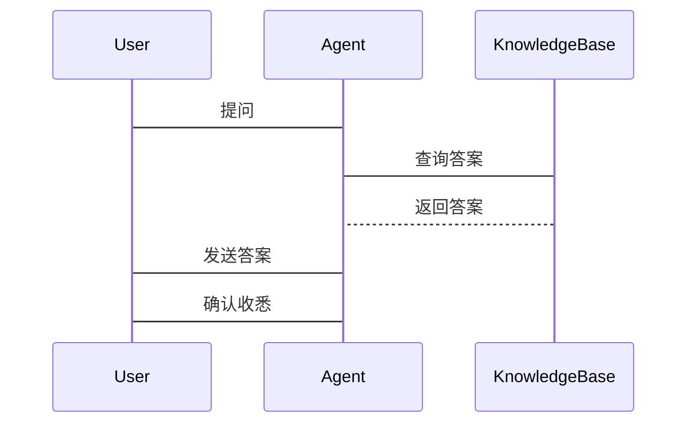
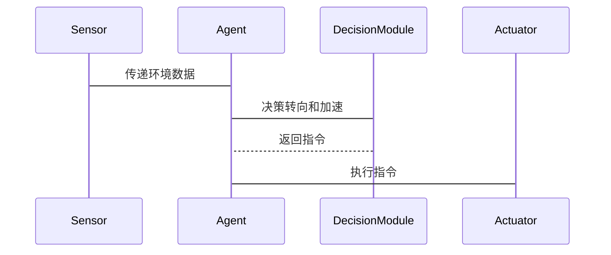

                 

<think>
好的，我现在需要帮助用户设计一篇关于AI Agent架构设计的技术博客文章。用户已经提供了一个详细的目录大纲，但还需要进一步的思考和扩展。首先，我需要理解用户的需求，确保每个部分都符合要求。

首先，用户希望文章结构清晰，逻辑严密，内容深入浅出。这意味着每个章节需要详细展开，确保读者能够一步步理解AI Agent的架构设计。

从目录来看，文章分为七个主要部分：背景介绍、核心概念、算法原理、系统架构、项目实战、扩展阅读和附录。每个部分下还有多个小节，内容涵盖了从基础概念到实际应用的各个方面。

在背景介绍部分，我需要确保涵盖AI Agent的基本定义、历史发展、核心要素以及应用场景。这部分需要简明扼要，帮助读者建立基本理解。

接下来是核心概念与联系，这部分需要详细讲解AI Agent的原理，并用表格和图示进行对比，帮助读者更好地理解不同概念之间的联系。我需要确保使用Mermaid图来展示实体关系，使内容更直观。

算法原理部分是关键，需要详细讲解搜索算法、强化学习和知识表示的相关算法。这部分需要结合数学公式和Python代码示例，帮助读者理解实现过程。同时，使用Mermaid流程图展示算法步骤，增强可读性。

系统分析与架构设计部分需要介绍应用场景，设计系统功能、架构、接口和交互流程。这部分可能需要更多的Mermaid图，如类图、架构图和序列图，帮助读者理解系统结构。

项目实战部分需要具体，包括环境安装、核心代码实现、案例分析和项目总结。这部分要确保读者能够动手实践，巩固所学知识。

扩展与展望部分讨论当前研究热点和未来趋势，以及总结学习的重点和注意事项。这有助于读者进一步深入学习和应用。

在编写过程中，我需要确保每个部分都有足够的细节，并且逻辑连贯，从理论到实践，层层递进。同时，要注意使用正确的Markdown格式，确保层次分明，符合用户的要求。

可能的问题包括是否遗漏了某些关键点，比如在系统架构部分是否需要更多的技术选型或设计模式？或者在项目实战中是否需要更详细的代码解释？这些问题需要仔细考虑，确保内容全面。

总的来说，我需要按照用户的目录大纲，逐步扩展每个部分，确保内容丰富、结构清晰，帮助读者系统地掌握AI Agent的架构设计，从概念到实现。现在，我可以开始按照这个思路来构建详细的文章内容了。
</think>

# AI Agent的架构设计：从概念到实现

## 关键词：
AI Agent, 架构设计, 强化学习, 知识表示, 多智能体系统, 人机协作, 智能系统开发

## 摘要：
本文将深入探讨AI Agent的架构设计，从基本概念到实现细节，逐步分析其核心原理、算法模型、系统架构以及实际应用。通过理论与实践结合的方式，帮助读者全面理解AI Agent的设计与实现过程，掌握其在现代智能系统中的应用技巧。

---

# 第一部分: AI Agent的背景与概念

## 第1章: AI Agent的基本概念与背景

### 1.1 AI Agent的定义与背景

#### 1.1.1 什么是AI Agent
AI Agent（人工智能代理）是指能够感知环境、做出决策并采取行动以实现目标的智能实体。它不同于传统的静态程序，具备自主性、反应性、目标导向性和社会性等特性。

#### 1.1.2 AI Agent的发展历史
AI Agent的概念起源于20世纪60年代的知识表示与推理研究，随着机器学习、自然语言处理和强化学习等技术的发展，AI Agent逐渐从理论走向实际应用。

#### 1.1.3 当前AI Agent的应用场景
- 智能助手（如Siri、Alexa）
- 自动驾驶系统
- 智能客服
- 多智能体协作（如游戏AI、分布式系统）

### 1.2 AI Agent的核心要素

#### 1.2.1 感知能力
AI Agent需要通过传感器、API或其他方式获取环境信息，包括状态、事件和上下文数据。

#### 1.2.2 决策能力
基于感知到的信息，AI Agent需要通过推理、规划或学习生成决策。

#### 1.2.3 执行能力
通过执行动作或调用外部服务，AI Agent将决策转化为实际操作。

#### 1.2.4 学习能力
通过强化学习或监督学习，AI Agent可以不断优化自身的决策策略和知识表示。

### 1.3 AI Agent的分类与特点

#### 1.3.1 基于规则的AI Agent
通过预定义的规则和条件进行决策，适用于简单且稳定的场景。

#### 1.3.2 基于模型的AI Agent
基于知识库或模型进行推理，适用于复杂且动态变化的场景。

#### 1.3.3 基于强化学习的AI Agent
通过与环境交互，学习最优策略，适用于不确定性和探索性问题。

#### 1.3.4 基于生成模型的AI Agent
利用生成对抗网络（GAN）等技术生成创造性内容或解决方案。

### 1.4 本章小结
本章介绍了AI Agent的基本概念、发展历程、核心要素及其分类，为后续章节的深入分析奠定了基础。

---

# 第二部分: AI Agent的核心概念与联系

## 第2章: AI Agent的核心原理

### 2.1 AI Agent的感知与决策模型

#### 2.1.1 知识表示与推理
知识表示是AI Agent理解世界的基础，常用的表示方法包括逻辑推理、语义网络和图模型。

#### 2.1.2 状态空间与动作空间
状态空间描述了AI Agent可能遇到的所有环境状态，动作空间则定义了AI Agent可以采取的所有行动。

#### 2.1.3 决策树与概率模型
决策树和马尔可夫决策过程（MDP）是常用的决策模型，帮助AI Agent在复杂环境中做出最优选择。

### 2.2 AI Agent的行为模式

#### 2.2.1 单智能体与多智能体系统
单智能体系统适用于简单场景，而多智能体系统则适用于需要协作或竞争的复杂场景。

#### 2.2.2 协作与竞争机制
通过协调和博弈论，AI Agent可以在多智能体系统中实现协作或竞争。

#### 2.2.3 动态环境中的适应性
AI Agent需要具备动态调整策略的能力，以应对环境的变化。

### 2.3 AI Agent的通信与协作

#### 2.3.1 通信协议与消息传递
AI Agent之间需要通过标准协议进行通信，如HTTP、WebSocket或自定义协议。

#### 2.3.2 分布式决策与协调
在多智能体系统中，分布式决策和协调机制是确保系统高效运行的关键。

#### 2.3.3 跨Agent的知识共享
通过知识共享，多个AI Agent可以共同完成复杂任务，提高整体智能水平。

## 第3章: AI Agent的核心概念对比与联系

### 3.1 AI Agent与传统AI的区别

#### 3.1.1 传统AI的核心特点
传统AI依赖于固定的规则和程序，不具备自主决策能力。

#### 3.1.2 AI Agent的创新之处
AI Agent具备自主性、反应性和目标导向性，能够适应动态环境。

#### 3.1.3 两者的应用场景对比
传统AI适用于数据处理和模式识别，而AI Agent适用于需要自主决策和交互的场景。

### 3.2 AI Agent与机器学习的关系

#### 3.2.1 机器学习在AI Agent中的应用
机器学习为AI Agent提供了感知和决策能力，使其能够从数据中学习和优化。

#### 3.2.2 AI Agent对机器学习的扩展
AI Agent在机器学习的基础上，引入了目标导向性和交互能力，使其能够更好地适应复杂场景。

#### 3.2.3 两者的协同与区别
机器学习是AI Agent的核心技术之一，但AI Agent还包括感知、决策和执行等多方面的能力。

### 3.3 AI Agent的ER实体关系

```mermaid
er
actor: 用户
agent: AI Agent
environment: 环境
action: 动作
state: 状态
rule: 规则
knowledge: 知识库
interaction: 交互
```

---

# 第三部分: AI Agent的算法原理

## 第4章: AI Agent的核心算法与实现

### 4.1 搜索算法

#### 4.1.1 广度优先搜索（BFS）



```python
def bfs(initial_state, goal_state):
    queue = deque([initial_state])
    visited = set([initial_state])
    while queue:
        current = queue.popleft()
        if current == goal_state:
            return current
        for neighbor in current.neighbors:
            if neighbor not in visited:
                visited.add(neighbor)
                queue.append(neighbor)
    return None
```

#### 4.1.2 深度优先搜索（DFS）



### 4.2 强化学习

#### 4.2.1 Q-Learning算法



```python
import numpy as np

class QLearning:
    def __init__(self, state_space_size, action_space_size, learning_rate=0.1, gamma=0.9):
        self.Q = np.zeros((state_space_size, action_space_size))
        self.learning_rate = learning_rate
        self.gamma = gamma

    def choose_action(self, state, epsilon=0.1):
        if np.random.random() < epsilon:
            return np.random.randint(0, self.Q.shape[1])
        else:
            return np.argmax(self.Q[state])

    def update_Q(self, state, action, reward, next_state):
        self.Q[state][action] = self.Q[state][action] + self.learning_rate * (reward + self.gamma * np.max(self.Q[next_state]) - self.Q[state][action])
```

#### 4.2.2 Deep Q-Network（DQN）



### 4.3 知识表示与推理

#### 4.3.1 逻辑推理

```python
def logical_inference(knowledge_base, query):
    # 基于知识库进行推理，返回推理结果
    pass
```

#### 4.3.2 语义网络

```python
class SemanticNetwork:
    def __init__(self):
        self.concepts = {}  # 概念及其关系
        self.relations = {}  # 关系及其属性
```

---

# 第四部分: AI Agent的系统架构与设计

## 第5章: AI Agent的系统分析与架构设计

### 5.1 系统功能设计

#### 5.1.1 领域模型



#### 5.1.2 系统架构

```mermaid
container 容器 {
    component 感知模块
    component 决策模块
    component 执行模块
    component 学习模块
}
```

#### 5.1.3 接口设计
- `perceive(environment: Environment) -> State`
- `decide(state: State) -> Action`
- `execute(action: Action) -> Reward`

### 5.2 系统交互流程



---

# 第五部分: AI Agent的项目实战

## 第6章: AI Agent的实现与案例分析

### 6.1 项目环境与工具

#### 6.1.1 环境安装
- Python 3.8+
- NumPy、Pandas、Scikit-learn、TensorFlow

#### 6.1.2 开发工具
- VS Code
- Jupyter Notebook
- Git

### 6.2 核心代码实现

#### 6.2.1 搜索算法实现

```python
from collections import deque

def bfs(initial_state, goal_state, neighbors_func):
    visited = set()
    queue = deque([initial_state])
    visited.add(initial_state)
    while queue:
        current = queue.popleft()
        if current == goal_state:
            return current
        for neighbor in neighbors_func(current):
            if neighbor not in visited:
                visited.add(neighbor)
                queue.append(neighbor)
    return None
```

#### 6.2.2 强化学习实现

```python
import numpy as np

class DQN:
    def __init__(self, state_size, action_size):
        self.state_size = state_size
        self.action_size = action_size
        self.Q = np.zeros((state_size, action_size))
        self.learning_rate = 0.1
        self.gamma = 0.9

    def choose_action(self, state, epsilon=0.1):
        if np.random.random() < epsilon:
            return np.random.randint(self.action_size)
        else:
            return np.argmax(self.Q[state])

    def learn(self, state, action, reward, next_state):
        self.Q[state][action] += self.learning_rate * (reward + self.gamma * np.max(self.Q[next_state]) - self.Q[state][action])
```

### 6.3 案例分析

#### 6.3.1 应用场景：智能客服



#### 6.3.2 应用场景：自动驾驶



### 6.4 项目总结

---

# 第六部分: AI Agent的扩展与展望

## 第7章: AI Agent的扩展与未来展望

### 7.1 当前研究热点

#### 7.1.1 多智能体协作
- 基于区块链的多智能体协作
- 基于联邦学习的多智能体协作

#### 7.1.2 智能人机协作
- 自然语言交互
- 共情计算

### 7.2 未来发展趋势

#### 7.2.1 更强的自主性
- 自适应学习
- 自我修复

#### 7.2.2 更广泛的应用
- 智能城市
- 智能医疗

### 7.3 学习与实践 tips

#### 7.3.1 学习资源
- 《强化学习（Deep Reinforcement Learning）》
- 《分布式系统与多智能体协作》

#### 7.3.2 实践建议
- 从简单场景入手
- 注重算法与实际应用的结合
- 善于复盘与优化

---

# 附录: 术语表

- AI Agent：人工智能代理
- 强化学习：Reinforcement Learning
- 知识表示：Knowledge Representation
- 多智能体系统：Multi-Agent System
- 分布式决策：Distributed Decision Making

---

# 作者

作者：AI天才研究院/AI Genius Institute & 禅与计算机程序设计艺术/Zen And The Art of Computer Programming

