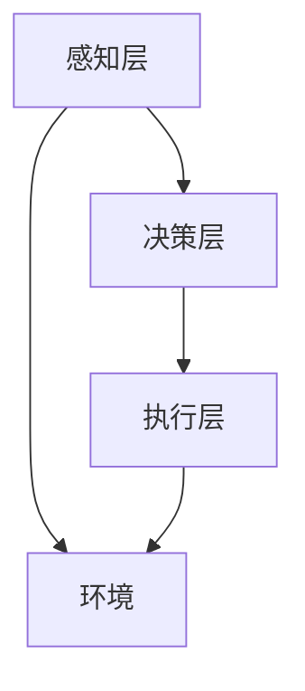

                 

<think>
好，用户让我写一篇关于AI Agent概念形成与抽象推理能力构建的技术博客，我需要先理清楚文章的结构和内容。首先，用户已经给出了一个详细的目录大纲，我需要按照这个大纲来填充内容。

我应该从背景介绍开始，讲解什么是AI Agent，它的历史发展，以及当前的应用情况。接下来，详细阐述AI Agent的核心概念，比如感知能力、决策能力等，并用表格对比不同分类。然后是算法部分，用mermaid画出流程图，并给出具体的Python代码示例，确保读者能理解这些算法的实现。系统架构设计部分需要介绍分层架构，并用类图展示系统功能模块。项目实战部分，我需要选择一个具体的应用场景，比如智能客服系统，详细描述其实现过程和代码。最后，总结AI Agent的优势和挑战，并展望未来的发展。

在写作过程中，要确保语言专业但又不失简洁，使用逻辑清晰的结构，让读者能够一步步理解AI Agent的概念和实现。同时，注意数学公式的正确性，确保用LaTeX格式展示，并且代码部分要详细注释，方便读者理解。

现在，我需要按照这些步骤，逐步撰写每个部分的内容，确保每一部分都符合用户的要求，并且达到高质量的技术博客标准。
</think>

# AI Agent的概念形成与抽象推理能力构建

> 关键词：AI Agent, 抽象推理, 强化学习, 系统架构, 实战案例

> 摘要：本文系统地探讨了AI Agent的概念形成与抽象推理能力的构建过程，从理论基础到算法实现，再到系统架构设计和项目实战，全面解析AI Agent的核心原理与应用实践。

---

## 第1章: AI Agent的背景与概念

### 1.1 AI Agent的基本概念

AI Agent（智能体）是指在计算机系统中能够感知环境并采取行动以实现目标的实体。它能够通过与环境交互，主动采取行动以达到预定目标。AI Agent的概念最早可以追溯到20世纪60年代，随着人工智能技术的快速发展，AI Agent的应用范围不断扩大，如今已广泛应用于自动驾驶、智能客服、机器人控制等领域。

### 1.2 AI Agent的核心概念

AI Agent的核心概念包括感知能力、决策能力、行为能力和学习能力。感知能力是指AI Agent通过传感器或数据源获取环境信息的能力；决策能力是指基于感知信息做出最优决策的能力；行为能力是指根据决策结果采取具体行动的能力；学习能力是指通过经验改进自身能力的能力。

### 1.3 AI Agent的分类与应用场景

AI Agent可以根据不同标准进行分类，例如基于智能水平可以分为反应式和认知式AI Agent；基于决策方式可以分为基于规则和基于学习的AI Agent。应用场景包括自动驾驶、智能助手、游戏AI、智能安防等。

---

## 第2章: AI Agent的抽象推理能力

### 2.1 抽象推理的基本概念

抽象推理是指从具体实例中提取一般性规律的能力。AI Agent的抽象推理能力使其能够从大量数据中发现隐含模式，从而做出更高级的决策。

### 2.2 AI Agent中的抽象推理模型

AI Agent的抽象推理模型主要包括符号逻辑推理、概率推理、类比推理和因果推理。符号逻辑推理基于规则系统进行推理，概率推理基于概率论进行不确定性推理，类比推理基于相似性进行推理，因果推理基于因果关系进行推理。

### 2.3 抽象推理能力的构建方法

构建AI Agent的抽象推理能力可以通过知识图谱、神经网络和混合模型等方法实现。知识图谱通过结构化知识表示支持符号推理，神经网络通过深度学习提取特征支持非符号推理，混合模型结合符号和非符号推理。

---

## 第3章: AI Agent的算法原理

### 3.1 状态空间与动作空间

AI Agent的算法基于状态空间和动作空间进行设计。状态空间表示所有可能的状态集合，动作空间表示所有可能的动作集合。状态转移概率描述了从一个状态转移到另一个状态的概率。

### 3.2 策略与价值函数

策略是指AI Agent在给定状态下选择动作的概率分布，价值函数是指从当前状态开始的期望回报。策略梯度方法通过优化策略参数直接优化策略，价值函数方法通过优化价值函数间接优化策略。

### 3.3 基于强化学习的AI Agent算法

基于强化学习的AI Agent算法主要包括Q-learning、Deep Q-Networks (DQN)、Policy Gradient Methods和Actor-Critic Methods。Q-learning算法通过更新Q值表学习最优策略，DQN算法通过深度神经网络近似Q值函数，Policy Gradient Methods通过优化策略参数，Actor-Critic Methods通过同时优化策略和价值函数。

### 3.4 算法实现的数学模型

Q-learning算法的数学模型如下：
$$ Q(s,a) = Q(s,a) + \alpha [r + \max Q(s',a') - Q(s,a)] $$

DQN算法的损失函数如下：
$$ \text{损失函数} = \mathbb{E}[(r + \gamma Q(s',a') - Q(s,a))^2] $$

---

## 第4章: AI Agent的系统架构设计

### 4.1 系统架构概述

AI Agent的系统架构可以分为分层架构、集中式架构和分布式架构。分层架构将系统划分为感知层、决策层和执行层，集中式架构将所有功能集中在中央控制器中，分布式架构将功能分散到多个节点中。

### 4.2 系统功能设计

AI Agent的系统功能设计包括感知层、决策层和执行层。感知层负责获取环境信息，决策层负责制定策略，执行层负责采取行动。

### 4.3 系统架构图



### 4.4 接口设计与交互流

AI Agent的接口设计需要定义感知层、决策层和执行层之间的交互接口。感知层通过传感器获取环境信息，决策层根据感知信息制定决策，执行层根据决策结果采取行动。

---

## 第5章: AI Agent的项目实战

### 5.1 环境安装

在项目实战中，首先需要安装必要的环境和依赖库，例如Python、TensorFlow、OpenAI Gym等。

### 5.2 核心代码实现

以下是基于强化学习的AI Agent核心代码实现：

```python
import gym
import numpy as np

class AI_Agent:
    def __init__(self, env):
        self.env = env
        self.state_space = env.observation_space.shape[0]
        self.action_space = env.action_space.n
        self.Q_table = np.zeros((self.state_space, self.action_space))

    def感知(self):
        state = self.env.observation_space.sample()
        return state

    def 决策(self, state):
        action = np.argmax(self.Q_table[state])
        return action

    def 学习(self, state, action, reward, next_state):
        self.Q_table[state][action] += 0.1 * (reward + np.max(self.Q_table[next_state]) - self.Q_table[state][action])

if __name__ == "__main__":
    env = gym.make("CartPole-v0")
    agent = AI_Agent(env)
    for _ in range(1000):
        state = agent.感知()
        action = agent.决策(state)
        next_state, reward, done, info = env.step(action)
        agent.学习(state, action, reward, next_state)
```

### 5.3 案例分析

以智能客服系统为例，AI Agent可以通过感知用户需求，决策最优回复，并执行回复操作，从而实现智能客服的功能。

---

## 第6章: 总结与展望

### 6.1 总结

本文系统地探讨了AI Agent的概念形成与抽象推理能力的构建过程，从理论基础到算法实现，再到系统架构设计和项目实战，全面解析了AI Agent的核心原理与应用实践。

### 6.2 展望

未来，AI Agent的发展将更加注重人机协作、多智能体协同和自适应学习能力的提升。随着技术的进步，AI Agent将在更多领域发挥重要作用。

---

作者：AI天才研究院/AI Genius Institute & 禅与计算机程序设计艺术 /Zen And The Art of Computer Programming

