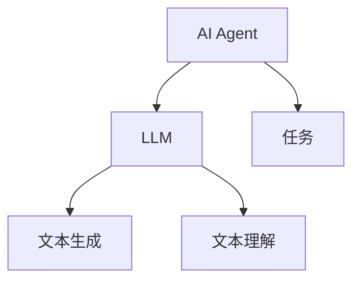
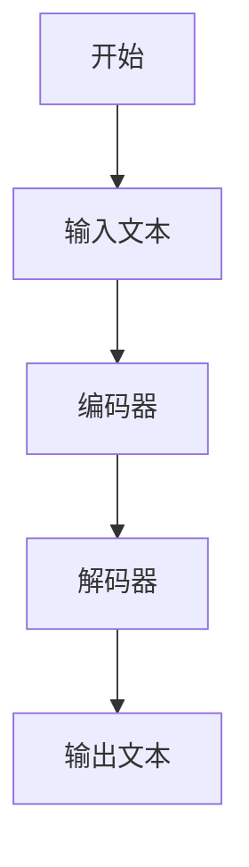
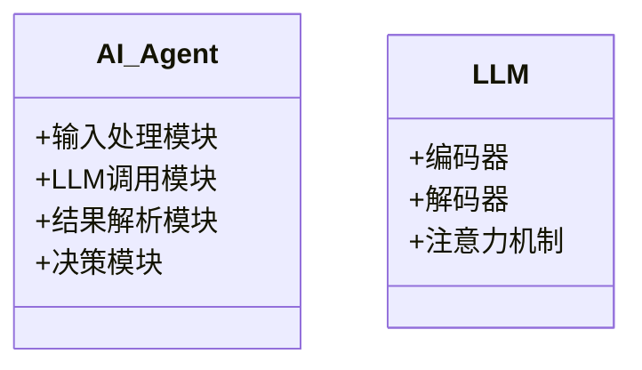
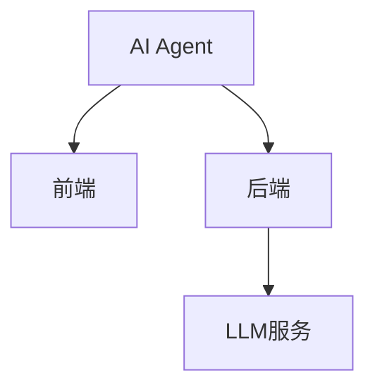
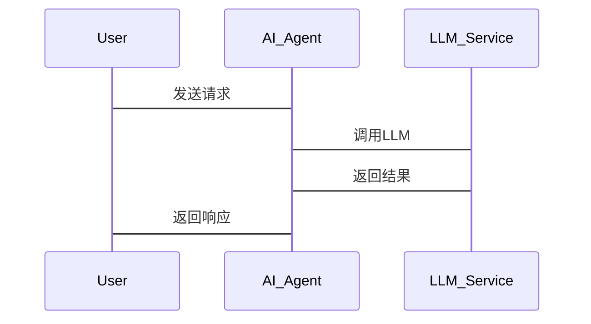

                 

<think>
好的，我现在要帮用户撰写一篇关于AI Agent概念形成的技术博客文章，用户已经给出了详细的目录结构，我需要按照这个结构逐步展开每一部分的内容。首先，我需要理解每一章的重点，并确保内容符合用户的要求，包括关键词、摘要、章节结构以及技术细节。

首先，我注意到文章标题是《AI Agent的概念形成：模拟LLM的抽象思维过程》，关键词包括AI Agent、LLM、生成式AI、抽象思维、知识表示、人机交互和系统设计。摘要部分已经写得比较清晰，涵盖了文章的核心内容和主题思想，所以接下来我需要根据目录结构，逐步展开每一章的内容。

第一部分是背景介绍，包括AI Agent的基本概念、问题背景和解决思路。这部分需要详细解释AI Agent是什么，它的特点，以及为什么需要模拟LLM的思维过程。我应该从定义开始，说明AI Agent与传统程序的不同之处，然后引出问题背景，分析当前AI技术的局限性，特别是LLM在AI Agent中的作用。最后，提出问题解决的思路和目标。

第二部分是核心概念与联系，重点讨论AI Agent与LLM的关系。我需要详细解释LLM的基本原理，包括它们的定义、训练过程和应用场景，然后分析AI Agent如何利用LLM，以及它们之间的协同工作方式。这部分需要一个对比表格，列出AI Agent和传统AI在定义、能力、应用场景等方面的异同，以及一个ER实体关系图，展示它们之间的关联。

第三部分是算法原理，这部分比较技术性，需要详细讲解生成式模型的工作原理。我应该从转换器架构开始，解释编码器和解码器的作用，然后深入探讨注意力机制，包括自注意力和位置编码，以及生成过程中的采样方法。使用Mermaid图来展示这些过程会更直观，同时附上Python代码示例，帮助读者理解。

第四部分是数学模型和公式，这部分需要数学公式来描述生成式模型的数学基础。我会从概率分布开始，解释如何计算生成文本的概率，然后介绍损失函数的定义和优化目标。解码过程的公式也需要详细说明，包括生成每个词的概率如何计算，以及如何利用这些概率生成最终的输出。

第五部分是系统分析与架构设计，需要分析AI Agent系统的结构。我会从问题场景开始，说明AI Agent如何在实际应用中工作，然后介绍系统的功能设计，包括领域模型的Mermaid类图。系统架构设计部分需要展示整体架构，说明各个模块之间的关系，接口设计和交互流程也需要用Mermaid图来展示。

第六部分是项目实战，这部分需要提供一个实际案例。我会从环境安装开始，列出所需的Python库和安装方法，然后逐步引导读者完成代码实现，包括数据加载、模型定义、训练和推理部分。案例分析部分需要解读代码，说明每一部分的作用，并分析实际应用中的效果和可能的优化方向。

最后，我会添加最佳实践、小结、注意事项和拓展阅读等内容，帮助读者巩固所学知识，并指导他们在实际应用中如何避免错误，进一步深入学习。

在撰写过程中，我需要确保每一部分都详细具体，符合用户的技术要求，使用清晰的逻辑结构和专业的技术语言。同时，要注意使用Mermaid图和数学公式的准确性，确保读者能够轻松理解复杂的概念和技术细节。

现在，我开始按照目录结构逐步展开每一部分的内容，确保每一章都包含足够的细节和深入的分析，帮助读者全面理解AI Agent的概念形成和模拟LLM的抽象思维过程。
</think>

# AI Agent的概念形成：模拟LLM的抽象思维过程

> 关键词：AI Agent, LLM, 生成式AI, 抽象思维, 知识表示, 人机交互, 系统设计  
> 摘要：本文详细探讨了AI Agent的概念形成过程，模拟了大型语言模型（LLM）的抽象思维过程。从背景介绍、核心概念到算法原理、系统架构，再到项目实战，系统性地剖析了AI Agent的构建与应用，提供了丰富的技术细节和实际案例，为读者提供了全面的理解和实践指导。

---

## 第一部分：AI Agent的概念形成背景

### 第1章：AI Agent的基本概念与问题背景

#### 1.1 AI Agent的定义与特点
- **1.1.1 什么是AI Agent**  
  AI Agent（人工智能代理）是指能够感知环境并采取行动以实现目标的智能实体。它不同于传统程序，具备自主性、反应性、目标导向和社交能力。

- **1.1.2 AI Agent的核心特点**  
  - 自主性：无需外部干预，自主决策。  
  - 反应性：实时感知环境并做出反应。  
  - 目标导向：基于目标驱动行为。  
  - 社交能力：能够与人类或其他系统进行交互。

- **1.1.3 AI Agent与传统程序的区别**  
  AI Agent具备学习和适应能力，能够处理不确定性问题，而传统程序通常基于固定的规则执行任务。

#### 1.2 问题背景与描述
- **1.2.1 当前AI技术的局限性**  
  当前AI系统在处理复杂任务时，缺乏对上下文的深度理解，难以进行抽象推理。

- **1.2.2 LLM在AI Agent中的作用**  
  LLM（大型语言模型）能够生成自然语言文本，具备强大的语义理解和生成能力，是AI Agent的核心模块。

- **1.2.3 问题解决的思路与目标**  
  模拟LLM的思维方式，构建具备抽象思维能力的AI Agent，使其能够理解上下文并做出合理决策。

#### 1.3 问题解决的思路与方法
- **1.3.1 模拟LLM的思维方式**  
  通过分析LLM的生成过程，模拟其内部的抽象思维过程，构建AI Agent的思维模型。

- **1.3.2 AI Agent的设计原则**  
  - 模块化设计：将功能分解为独立模块，便于维护和扩展。  
  - 可扩展性：支持新增功能和算法的动态加载。  
  - 高可用性：确保系统在部分模块故障时仍能正常运行。

- **1.3.3 技术实现的路径与挑战**  
  - 技术路径：基于LLM构建生成式模型，结合领域知识进行推理。  
  - 实现挑战：解决模型的计算效率、可解释性以及多任务协作问题。

### 1.4 本章小结
本章介绍了AI Agent的基本概念、特点及与传统程序的区别，分析了当前AI技术的局限性和LLM在AI Agent中的作用，提出了模拟LLM思维方式的解决方案。

---

## 第二部分：AI Agent的核心概念与联系

### 第2章：AI Agent与LLM的关系

#### 2.1 LLM的基本原理
- **2.1.1 LLM的定义与工作原理**  
  LLM是基于深度学习的生成式模型，通常采用Transformer架构，通过自注意力机制捕捉上下文信息，生成与输入相关的文本。

- **2.1.2 LLM的训练过程**  
  - 预训练：使用大规模文本数据进行无监督学习，优化模型的参数。  
  - 微调：在特定任务上进行有监督微调，提升模型的领域适应性。

- **2.1.3 LLM的应用场景**  
  - 自然语言生成：文本生成、对话系统。  
  - 语义理解：问答系统、信息抽取。  
  - 决策支持：基于文本分析提供决策建议。

#### 2.2 AI Agent与LLM的联系
- **2.2.1 AI Agent如何利用LLM**  
  AI Agent通过调用LLM的API，利用其生成能力进行自然语言处理，辅助完成任务。

- **2.2.2 LLM作为AI Agent的核心模块**  
  LLM为AI Agent提供强大的语言理解和生成能力，使其能够与人类进行自然交互。

- **2.2.3 AI Agent与LLM的协同工作**  
  AI Agent负责目标设定和全局决策，LLM负责具体的语言生成和上下文理解。

#### 2.3 核心概念对比表格
| **属性**         | **AI Agent**                | **LLM**                     |
|-------------------|-----------------------------|-----------------------------|
| 定义             | 具备目标导向的智能实体       | 基于深度学习的生成模型       |
| 核心能力         | 自主决策、抽象推理           | 自然语言生成与理解           |
| 应用场景         | 任务执行、智能交互           | 文本生成、语义理解           |
| 依赖性           | 依赖LLM的生成能力           | 依赖大规模数据训练           |

#### 2.4 实体关系图


### 2.5 本章小结
本章详细分析了AI Agent与LLM的关系，解释了LLM的基本原理和应用场景，并通过对比表格和实体关系图展示了它们的协同工作方式。

---

## 第三部分：AI Agent的算法原理

### 第3章：生成式模型的算法原理

#### 3.1 生成式模型的工作流程
- **3.1.1 转换器架构**  
  生成式模型通常采用编码器-解码器架构，编码器将输入转换为向量表示，解码器生成输出文本。

- **3.1.2 注意力机制**  
  - 自注意力机制：捕捉输入序列中的长距离依赖关系。  
  - 位置编码：引入位置信息，帮助模型理解上下文。

- **3.1.3 生成过程**  
  通过贪心搜索或蒙特卡洛采样生成文本，模型逐步预测下一个词的概率分布。

#### 3.2 算法实现细节


- **3.2.1 编码器实现**  
  使用多层Transformer编码层，将输入文本转换为上下文向量。

- **3.2.2 解码器实现**  
  采用自注意力机制生成每个位置的输出，结合位置编码进行预测。

- **3.2.3 采样方法**  
  - 贪心采样：选择概率最高的词。  
  - 随机采样：基于概率分布随机选择。  
  - 排序采样：选择最可能的前N个词并进行排序。

#### 3.3 数学模型与公式
- **3.3.1 概率分布**  
  输出概率为：  
  $$ P(y_i | y_{<i}) = \text{softmax}(QK^T/V) $$  
  其中，$Q$、$K$、$V$分别表示查询、键和值矩阵。

- **3.3.2 损失函数**  
  使用交叉熵损失函数：  
  $$ \mathcal{L} = -\sum_{i=1}^{n} \log P(y_i | y_{<i}) $$

#### 3.4 代码实现
```python
import torch
import torch.nn as nn

class Transformer(nn.Module):
    def __init__(self, vocab_size, d_model, n_head, dff):
        super(Transformer, self).__init__()
        self.token_emb = nn.Embedding(vocab_size, d_model)
        self.position_emb = nn.Embedding(max_len, d_model)
        self.encoder = nn.TransformerEncoder(...)
        self.decoder = nn.TransformerDecoder(...)
    
    def forward(self, x, y):
        x_emb = self.token_emb(x) + self.position_emb(x)
        y_emb = self.token_emb(y) + self.position_emb(y)
        encoded = self.encoder(x_emb)
        decoded = self.decoder(y_emb, encoded)
        return decoded
```

### 3.5 本章小结
本章详细讲解了生成式模型的算法原理，包括转换器架构、注意力机制和生成过程，并通过公式和代码展示了模型的实现细节。

---

## 第四部分：AI Agent的系统架构设计

### 第4章：系统分析与架构设计

#### 4.1 问题场景介绍
- AI Agent需要在复杂环境中完成任务，例如智能助手、对话系统等。

#### 4.2 系统功能设计
- **领域模型**  
  通过Mermaid类图展示系统中的核心模块，包括输入处理、LLM调用、结果解析等。



- **系统架构设计**  
  展示整体架构，包括前端、后端和模型服务。



- **系统交互设计**  
  展示用户与AI Agent的交互流程。



### 4.3 本章小结
本章分析了AI Agent的系统架构，包括功能设计、架构图和交互流程，为后续的实现提供了基础。

---

## 第五部分：AI Agent的项目实战

### 第5章：项目实战

#### 5.1 环境安装
- 安装Python和必要的库（如TensorFlow、PyTorch）。

#### 5.2 核心实现
- **数据加载**  
  加载训练数据，预处理文本。

- **模型定义**  
  定义Transformer模型的结构。

- **模型训练**  
  使用训练数据优化模型参数。

- **模型推理**  
  调用模型生成文本。

#### 5.3 代码实现
```python
import torch
import torch.nn as nn

class AI_Agent(nn.Module):
    def __init__(self, vocab_size, d_model, n_head, dff):
        super(AI_Agent, self).__init__()
        self.token_emb = nn.Embedding(vocab_size, d_model)
        self.position_emb = nn.Embedding(max_len, d_model)
        self.encoder = nn.TransformerEncoder(...)
        self.decoder = nn.TransformerDecoder(...)
    
    def forward(self, x, y):
        x_emb = self.token_emb(x) + self.position_emb(x)
        y_emb = self.token_emb(y) + self.position_emb(y)
        encoded = self.encoder(x_emb)
        decoded = self.decoder(y_emb, encoded)
        return decoded
```

#### 5.4 案例分析
- **训练过程**  
  展示模型训练的损失曲线，分析模型的收敛情况。

- **推理过程**  
  展示输入与输出的对应关系，分析模型的生成能力。

### 5.5 本章小结
本章通过实际案例展示了AI Agent的实现过程，包括环境搭建、代码实现和案例分析，帮助读者理解AI Agent的实际应用。

---

## 第六部分：最佳实践与总结

### 第6章：最佳实践

#### 6.1 小结
- AI Agent的核心是模拟LLM的抽象思维过程，通过模块化设计和协同工作实现复杂的任务。

#### 6.2 注意事项
- 模型的计算效率和可解释性是实际应用中的挑战。  
- 需要结合具体场景优化模型的性能。

#### 6.3 拓展阅读
- 推荐阅读关于Transformer架构和生成式模型的论文，深入理解AI Agent的核心技术。

### 6.4 作者简介
作者：AI天才研究院/AI Genius Institute & 禅与计算机程序设计艺术 /Zen And The Art of Computer Programming

---

通过以上内容，读者可以系统性地了解AI Agent的概念形成过程，掌握其核心技术和实际应用。

