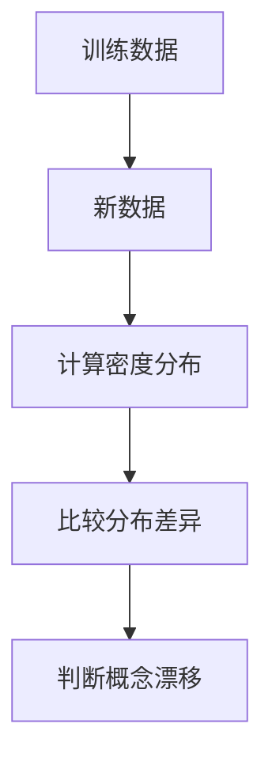
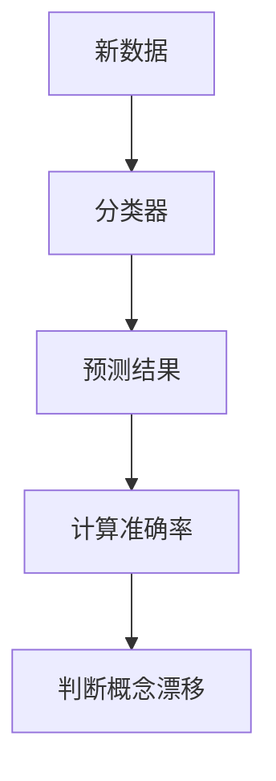
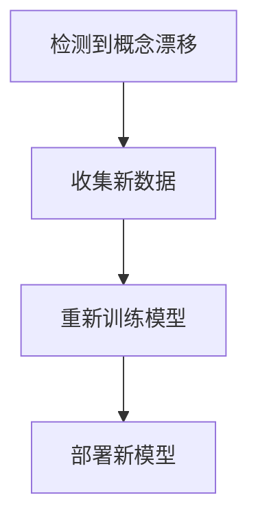
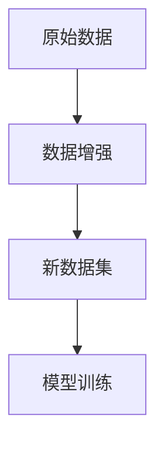
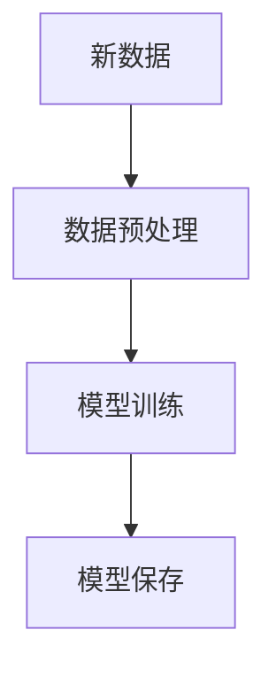
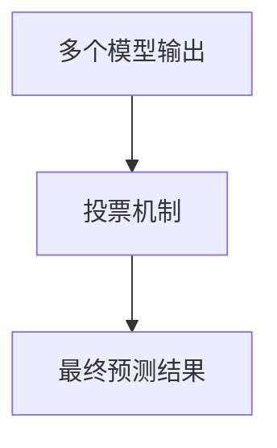
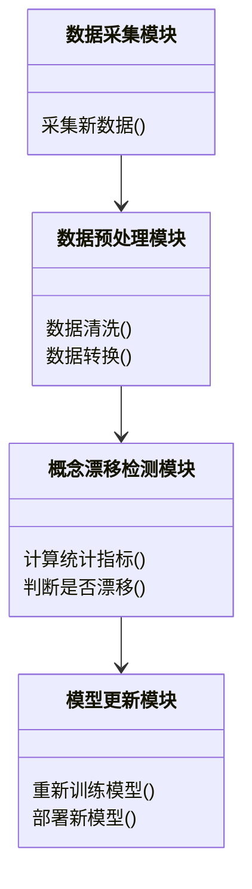
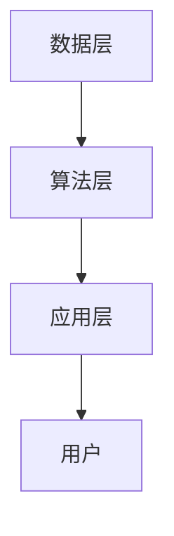
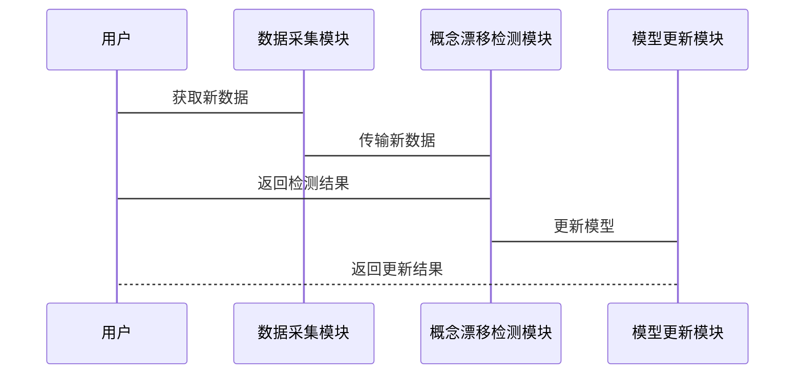

                 


# AI Agent的概念漂移检测与适应

> 关键词：AI Agent, 概念漂移, 检测与适应, 机器学习, 数据变化检测

> 摘要：本文将探讨AI Agent在面对数据分布变化时的概念漂移检测与适应问题。从基本概念到实际应用，详细分析概念漂移的类型、检测方法及适应策略，结合系统架构设计与项目实战，提供一套完整的解决方案。通过本文，读者将能够理解并掌握如何在实际场景中应用AI Agent进行概念漂移检测与适应，确保模型的持续有效性和可靠性。

---

# 第一部分: 概念漂移检测与适应基础

## 第1章: 概念漂移的基本概念

### 1.1 概念漂移的背景与问题描述

概念漂移（Concept Drift）是机器学习模型在实际应用中面临的一个重要挑战。随着数据分布的变化，模型的性能可能会逐渐下降，甚至失效。这种变化可能源于数据源的变化、环境的变化或用户行为的变化等。例如，在电商推荐系统中，用户的购买偏好可能会随时间变化，导致推荐模型的效果下降。

### 1.2 AI Agent的基本概念

AI Agent（人工智能代理）是一种能够感知环境、做出决策并执行任务的智能实体。与传统机器学习模型相比，AI Agent具有更强的自主性和适应性，能够在动态环境中主动调整策略。

### 1.3 概念漂移检测与适应的重要性

1. **数据变化对企业AI系统的挑战**：数据分布的变化可能导致模型失效，影响企业的决策和收益。
2. **概念漂移对AI Agent的影响**：AI Agent需要实时感知数据变化，及时调整策略以保持性能。
3. **概念漂移检测与适应的必要性**：通过检测和适应概念漂移，AI Agent可以延长模型的有效生命周期，提高系统的鲁棒性和可靠性。

---

# 第二部分: 概念漂移检测与适应的核心原理

## 第2章: 概念漂移的检测方法

### 2.1 基于统计的方法

#### 2.1.1 统计距离度量

统计距离度量是通过计算数据分布的变化来判断是否发生概念漂移。常用的方法包括Kullback-Leibler散度（KL散度）和Hellinger距离。

**公式：**
$$
KL散度 = D_{KL}(P \parallel Q) = \sum_{i} P(i) \log \frac{P(i)}{Q(i)}
$$

#### 2.1.2 分布变化检测

通过比较训练数据和新数据的分布差异，判断是否发生概念漂移。例如，使用Kernel密度估计方法。

**流程图：**


#### 2.1.3 熵变化检测

通过计算数据的熵变化来判断数据分布是否发生变化。

**公式：**
$$
H(P) = -\sum_{i} P(i) \log P(i)
$$

### 2.2 基于模型的方法

#### 2.2.1 分类模型性能监控

通过监控分类模型的性能变化来判断是否发生概念漂移。例如，通过计算分类准确率的变化。

**流程图：**


#### 2.2.2 回归模型性能监控

通过监控回归模型的均方误差（MSE）变化来判断是否发生概念漂移。

**公式：**
$$
MSE = \frac{1}{n} \sum_{i=1}^{n} (y_i - \hat{y}_i)^2
$$

#### 2.2.3 模型更新与再训练

当检测到概念漂移时，通过重新训练模型来适应新的数据分布。

**流程图：**


---

## 第3章: 概念漂移的适应方法

### 3.1 培训数据增强

#### 3.1.1 数据重采样技术

通过重新采样数据来平衡数据分布，例如使用SMOTE算法。

**代码示例：**
```python
from imblearn import under_sampling, over_sampling
from imblearn.over_sampling import SMOTE

# 假设X为特征矩阵，y为标签
X_resampled, y_resampled = SMOTE().fit_resample(X, y)
```

#### 3.1.2 数据增强技术

通过增加数据的多样性来提高模型的鲁棒性，例如图像旋转、平移等。

**流程图：**


### 3.2 模型再训练

#### 3.2.1 离线再训练

定期离线训练模型，使用最新的数据进行模型更新。

**流程图：**


#### 3.2.2 在线增量学习

在数据流环境下，实时更新模型参数。

**代码示例：**
```python
import sklearn.linear_model as lm

# 假设X为新特征，y为新标签
model = lm.LogisticRegression()
model.partial_fit(X, y)
```

### 3.3 模型融合与集成

通过集成多个模型来提高系统的鲁棒性，例如使用投票机制或加权平均。

**流程图：**


---

## 第4章: 概念漂移检测与适应的系统架构设计

### 4.1 系统模块划分

系统主要模块包括数据采集模块、数据预处理模块、概念漂移检测模块和模型更新模块。

**类图：**


### 4.2 系统架构设计

采用分层架构，包括数据层、算法层和应用层。

**架构图：**


### 4.3 系统接口设计

系统提供以下接口：
- 数据采集接口：用于获取新数据。
- 检测接口：用于判断是否发生概念漂移。
- 更新接口：用于更新模型。

### 4.4 系统交互流程



---

## 第5章: 项目实战

### 5.1 环境安装

安装必要的库，例如scikit-learn、imblearn等。

**代码示例：**
```python
import sys
import sklearn
import imblearn
print(sklearn.__version__)
print(imblearn.__version__)
```

### 5.2 核心代码实现

实现概念漂移检测与适应的代码。

**代码示例：**
```python
import numpy as np
from sklearn.linear_model import LogisticRegression
from imblearn.over_sampling import SMOTE

# 模拟数据变化
X_train = np.random.rand(100, 2)
y_train = np.random.randint(2, size=100)
X_test = np.random.rand(50, 2)
y_test = np.random.randint(2, size=50)

# 数据增强
smote = SMOTE()
X_resampled, y_resampled = smote.fit_resample(X_train, y_train)

# 模型训练
model = LogisticRegression()
model.fit(X_resampled, y_resampled)

# 模型更新
# 假设检测到概念漂移
X_new = np.random.rand(50, 2)
y_new = np.random.randint(2, size=50)
model.partial_fit(X_new, y_new)
```

### 5.3 案例分析

以电商推荐系统为例，展示如何通过概念漂移检测与适应提高推荐准确性。

### 5.4 项目总结

总结项目实现过程中的经验和教训，提出改进建议。

---

## 第6章: 最佳实践与小结

### 6.1 最佳实践

1. **定期监控模型性能**：通过持续监控模型性能，及时发现概念漂移。
2. **选择合适的检测方法**：根据具体场景选择合适的概念漂移检测方法。
3. **模型更新策略**：结合离线和在线学习，制定合理的模型更新策略。

### 6.2 小结

本文详细探讨了AI Agent在概念漂移检测与适应中的应用，从理论到实践，为读者提供了完整的解决方案。通过本文的学习，读者可以掌握概念漂移检测与适应的核心方法，并能够将其应用于实际项目中。

---

# 结语

概念漂移检测与适应是AI Agent技术中的重要环节，通过不断优化检测方法和适应策略，可以显著提高AI系统的可靠性和性能。未来的研究方向包括更高效的检测算法和更智能的适应策略。

---

作者：AI天才研究院/AI Genius Institute & 禅与计算机程序设计艺术 /Zen And The Art of Computer Programming

