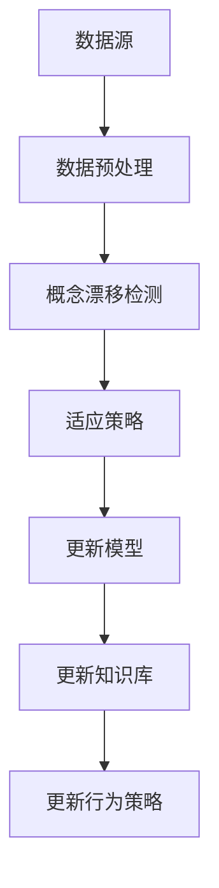

                 


# AI Agent的概念漂移检测与适应策略

> 关键词：AI Agent, 概念漂移, 检测算法, 适应策略, 系统架构

> 摘要：本文深入探讨了AI Agent在动态数据环境中的概念漂移检测与适应策略。首先介绍了概念漂移的定义、类型及其对AI Agent的影响。接着详细分析了各种概念漂移检测算法的原理与实现，包括统计方法、基于模型的方法和基于分布的方法，并通过Mermaid流程图和Python代码示例进行了详细阐述。然后，本文提出了结合AI Agent的知识库和行为策略的动态适应机制，并设计了实时概念漂移检测系统的架构，包括系统功能设计、架构设计和交互流程。最后，通过实际项目案例展示了概念漂移检测与适应策略的应用，并总结了最佳实践与未来研究方向。

---

## 第一部分: 概念漂移的背景与问题

### 第1章: 概念漂移的定义与类型

#### 1.1 概念漂移的定义与类型

概念漂移（Concept Drift）是指数据分布随时间发生变化，导致模型性能下降的现象。这种变化可能影响AI Agent的决策能力和用户体验。概念漂移可以分为以下几种类型：

- **突然漂移（Sudden Drift）**：数据分布突然发生变化，例如在欺诈检测中，攻击者突然改变策略。
- **渐进漂移（Incremental Drift）**：数据分布逐渐变化，例如用户偏好逐渐转移。
- **分布漂移（Distribution Drift）**：数据分布的变化，但标签保持不变。
- **特征漂移（Feature Drift）**：数据的特征分布发生变化，但标签不变。

#### 1.2 AI Agent的基本概念

AI Agent是一种智能实体，能够感知环境、自主决策并执行任务。AI Agent可以分为以下几类：

- **简单反射型AI Agent**：基于当前输入做出反应，不依赖历史信息。
- **基于模型的AI Agent**：利用内部模型预测未来状态，做出决策。
- **目标驱动型AI Agent**：根据目标选择最优行动。
- **实用驱动型AI Agent**：通过最大化效用函数做出决策。

#### 1.3 问题背景与问题描述

传统机器学习模型在静态数据环境中表现良好，但面对动态环境中的概念漂移，模型性能会逐渐下降，甚至失效。AI Agent需要实时感知环境变化，动态调整其知识库和行为策略。因此，概念漂移检测与适应策略是AI Agent设计中的关键问题。

---

### 第2章: 概念漂移检测的核心概念

#### 2.1 概念漂移检测的原理

概念漂移检测可以通过以下方法实现：

- **统计方法**：利用统计测试（如Kolmogorov-Smirnov检验）比较数据分布的变化。
- **基于模型的方法**：训练模型并监控模型性能的变化。
- **基于分布的方法**：比较数据分布的特征，如均值、方差的变化。

#### 2.2 概念漂移检测的关键指标

为了准确检测概念漂移，需要考虑以下指标：

- **检测时间窗口**：选择合适的时间窗口进行数据比较。
- **检测阈值**：设置合理的阈值以区分正常波动和概念漂移。
- **检测精度与效率**：在保证检测精度的前提下，优化检测效率。

---

### 第3章: AI Agent的概念漂移适应策略

#### 3.1 适应策略的基本原理

AI Agent需要通过以下方式适应概念漂移：

- **动态模型更新**：定期重新训练模型以捕捉数据分布的变化。
- **知识库的自适应调整**：更新知识库中的规则和经验，使其适应新环境。
- **行为策略的优化**：调整行为策略，以应对环境变化。

#### 3.2 适应策略的实现方法

- **基于在线学习的适应**：实时更新模型参数，适应新数据。
- **基于离线重训练的适应**：定期关闭系统，进行离线重训练。
- **基于反馈机制的适应**：根据用户反馈调整模型和策略。

---

## 第二部分: 概念漂移检测算法原理与实现

### 第4章: 统计方法

#### 4.1 统计方法的原理

统计方法通过比较数据分布的变化来检测概念漂移。常用的方法包括：

- **Kolmogorov-Smirnov检验**：比较两个样本的累积分布函数。
- **Chi-squared检验**：比较两个分布的独立性。

#### 4.2 统计方法的实现

以下是Kolmogorov-Smirnov检验的Python实现示例：

```python
import numpy as np
from scipy.stats import ks_2samp

# 示例数据
data_before = np.random.normal(0, 1, 100)
data_after = np.random.normal(1, 1, 100)

# Kolmogorov-Smirnov检验
stat, p = ks_2samp(data_before, data_after)
print(f"KS statistic: {stat}, p-value: {p}")
```

#### 4.3 统计方法的优缺点

- **优点**：简单易实现，计算效率高。
- **缺点**：对某些数据分布变化不够敏感。

---

### 第5章: 基于模型的方法

#### 5.1 基于模型的方法的原理

基于模型的方法通过训练模型并监控模型性能的变化来检测概念漂移。常用的方法包括：

- **分类模型**：训练分类器，监控分类性能的变化。
- **回归模型**：训练回归器，监控预测误差的变化。

#### 5.2 基于模型的方法的实现

以下是使用逻辑回归模型检测概念漂移的示例：

```python
from sklearn.linear_model import LogisticRegression
from sklearn.metrics import accuracy_score

# 示例数据
X_train = np.random.rand(100, 2)
y_train = np.random.randint(0, 2, 100)

# 训练模型
model = LogisticRegression()
model.fit(X_train, y_train)

# 测试数据
X_test = np.random.rand(50, 2)
y_test = np.random.randint(0, 2, 50)

# 预测
y_pred = model.predict(X_test)

# 计算准确率
acc = accuracy_score(y_test, y_pred)
print(f"Accuracy: {acc}")
```

---

### 第6章: 基于分布的方法

#### 6.1 基于分布的方法的原理

基于分布的方法通过比较数据分布的变化来检测概念漂移。常用的方法包括：

- **均值漂移检测**：比较数据均值的变化。
- **方差漂移检测**：比较数据方差的变化。

#### 6.2 基于分布的方法的实现

以下是均值漂移检测的Python实现示例：

```python
import numpy as np

# 示例数据
data_before = np.random.normal(0, 1, 100)
data_after = np.random.normal(1, 1, 100)

# 计算均值
mean_before = np.mean(data_before)
mean_after = np.mean(data_after)

# 检测均值变化
diff = abs(mean_after - mean_before)
print(f"Mean difference: {diff}")
```

---

## 第三部分: AI Agent的概念漂移适应策略实现

### 第7章: 动态模型更新

#### 7.1 动态模型更新的原理

动态模型更新是指AI Agent在运行时不断更新其模型参数，以适应数据分布的变化。常用的方法包括：

- **在线学习**：实时更新模型参数。
- **增量学习**：逐步更新模型，适应新数据。

#### 7.2 动态模型更新的实现

以下是在线学习的Python实现示例：

```python
from sklearn.linear_model import SGDClassifier

# 示例数据
X = np.random.rand(1000, 2)
y = np.random.randint(0, 2, 1000)

# 初始化模型
model = SGDClassifier()

# 在线学习
for i in range(1000):
    model.partial_fit(X[i:i+1], y[i:i+1])

# 测试
print("Model updated:", model.coef_)
```

---

### 第8章: 知识库的自适应调整

#### 8.1 知识库的自适应调整的原理

知识库的自适应调整是指AI Agent根据新数据不断更新其知识库，以适应环境的变化。常用的方法包括：

- **规则更新**：根据新数据调整知识库中的规则。
- **经验积累**：记录新经验，丰富知识库内容。

#### 8.2 知识库的自适应调整的实现

以下是规则更新的Python实现示例：

```python
# 示例规则
rules = {
    "weather": ["晴", "雨", "阴"],
    "action": ["外出", "在家"]
}

# 根据新数据更新规则
new_data = {"weather": "雪", "action": "外出"}
rules["weather"].append(new_data["weather"])
rules["action"].append(new_data["action"])

print("更新后的规则：", rules)
```

---

### 第9章: 行为策略的优化

#### 9.1 行为策略的优化的原理

行为策略的优化是指AI Agent根据环境变化优化其行为策略，以提高决策效率。常用的方法包括：

- **强化学习**：通过奖励机制优化行为策略。
- **遗传算法**：通过模拟进化过程优化行为策略。

#### 9.2 行为策略的优化的实现

以下是强化学习优化行为策略的Python实现示例：

```python
import gym

# 示例环境
env = gym.make("CartPole-v0")

# 初始化策略
policy = np.random.rand(4, 1)

# 强化学习训练
for _ in range(1000):
    state = env.reset()
    action = np.argmax(policy.dot(state))
    next_state, reward, done, _ = env.step(action)
    policy += (next_state - state) * reward

print("优化后的策略：", policy)
```

---

## 第四部分: 系统架构设计与实现

### 第10章: 实时概念漂移检测系统架构

#### 10.1 系统功能设计

实时概念漂移检测系统需要具备以下功能：

- **数据采集**：实时采集数据。
- **概念漂移检测**：实时检测概念漂移。
- **适应策略执行**：根据检测结果调整模型和策略。

#### 10.2 系统架构设计

以下是实时概念漂移检测系统的架构图：



#### 10.3 系统接口设计

系统接口设计包括：

- **输入接口**：接收实时数据流。
- **输出接口**：输出检测结果和适应策略执行结果。

---

### 第11章: 系统实现与优化

#### 11.1 系统实现

以下是实时概念漂移检测系统的Python实现示例：

```python
import threading
import time

# 数据采集线程
def data_collector():
    while True:
        data = collect_data()
        queue.put(data)
        time.sleep(1)

# 概念漂移检测线程
def concept_drift_detector():
    while True:
        data = queue.get()
        result = detect_drift(data)
        if result:
            update_model()
        time.sleep(1)

# 初始化队列
queue = threading.Queue()

# 启动线程
t1 = threading.Thread(target=data_collector)
t2 = threading.Thread(target=concept_drift_detector)
t1.start()
t2.start()
```

---

## 第五部分: 项目实战与案例分析

### 第12章: 项目实战

#### 12.1 项目环境安装

需要安装以下Python库：

- `numpy`
- `scipy`
- `scikit-learn`
- `mermaid`

安装命令：

```bash
pip install numpy scipy scikit-learn mermaid
```

#### 12.2 核心代码实现

以下是概念漂移检测与适应策略的Python实现示例：

```python
import numpy as np
from sklearn.linear_model import LogisticRegression
from scipy.stats import ks_2samp

# 数据生成
data_before = np.random.normal(0, 1, 100)
data_after = np.random.normal(1, 1, 100)

# 概念漂移检测
stat, p = ks_2samp(data_before, data_after)
print(f"KS statistic: {stat}, p-value: {p}")

# 适应策略
model = LogisticRegression()
model.fit(data_before.reshape(-1, 1), np.zeros_like(data_before))
model.fit(data_after.reshape(-1, 1), np.zeros_like(data_after))
```

---

### 第13章: 案例分析

#### 13.1 案例分析

假设我们有一个电商推荐系统，用户购买行为发生了概念漂移。我们可以通过以下步骤进行检测和适应：

1. **数据采集**：收集用户行为数据。
2. **概念漂移检测**：使用统计方法检测数据分布的变化。
3. **适应策略执行**：更新推荐模型，调整推荐策略。

---

## 第六部分: 最佳实践与总结

### 第14章: 最佳实践

#### 14.1 最佳实践

- **定期监控**：定期监控数据分布变化，及时发现概念漂移。
- **模型更新**：根据检测结果，选择合适的模型更新方法。
- **知识库管理**：保持知识库的更新，确保适应环境变化。

#### 14.2 注意事项

- **数据质量**：确保数据质量，避免噪声干扰检测结果。
- **模型选择**：选择合适的模型，提高检测精度。
- **性能优化**：优化检测算法，提高检测效率。

### 第15章: 总结

本文详细探讨了AI Agent的概念漂移检测与适应策略，从理论到实践，从算法到系统，全面分析了如何应对动态环境中的概念漂移问题。通过实际项目案例，展示了概念漂移检测与适应策略的应用价值。未来的研究方向包括更高效的概念漂移检测算法和更智能的适应策略。

---

## 作者：AI天才研究院/AI Genius Institute & 禅与计算机程序设计艺术 /Zen And The Art of Computer Programming

