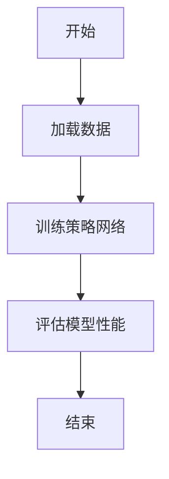
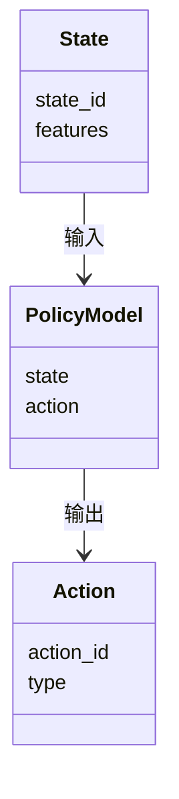
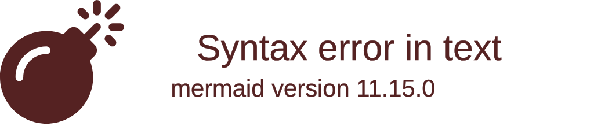
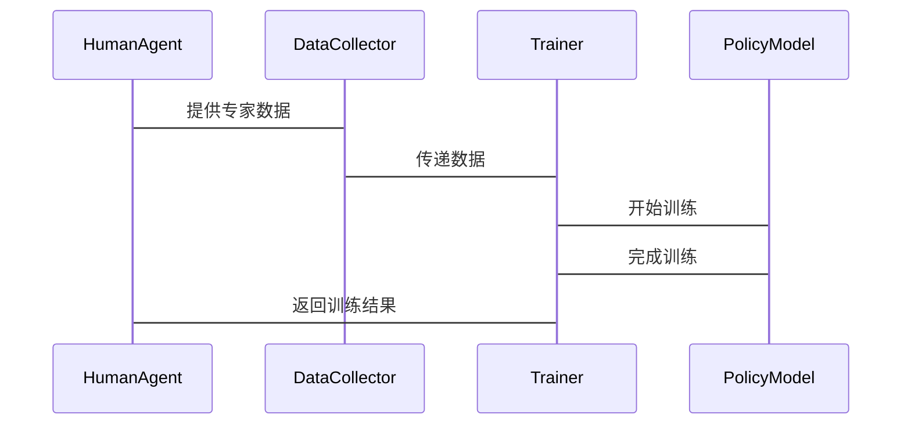

                 

<think>
嗯，好的，我现在要开始写一篇关于AI Agent模仿学习的技术博客。首先，我需要理解模仿学习是什么，以及它在AI Agent中的应用。模仿学习，听起来像是AI通过观察人类行为来学习对吧？那我得先明确什么是AI Agent，再看看模仿学习具体是怎么运作的。

首先，AI Agent是什么呢？我好像记得AI Agent是一个智能体，能够感知环境并采取行动以实现目标。和传统的AI相比，它更注重自主性和适应性。那模仿学习呢，就是AI Agent通过观察人类的行为来学习，对吗？这可能包括从人类的决策、动作中提取模式，然后模仿这些行为。

接下来，我需要了解模仿学习的背景。模仿学习并不是一个新的概念，它在心理学中就有研究，比如Bandura的社会学习理论。但在AI领域，特别是强化学习中，模仿学习近年来变得越来越重要。强化学习通常需要通过试错来学习，而模仿学习可以通过观察专家的行为来加速学习过程。

那模仿学习的核心原理是什么呢？我需要了解它是如何工作的。模仿学习可以基于策略或基于价值。基于策略的模仿学习直接模仿专家的策略，而基于价值的则通过价值函数来评估状态的好坏。这两者有什么区别呢？比如，在策略网络中，AI直接学习专家的策略，而在价值网络中，它学习的是状态的价值，然后根据价值来选择动作。

接下来，我需要考虑模仿学习的应用场景。比如，在机器人控制中，机器人可以通过观察人类的操作来学习如何执行任务；在自然语言处理中，模型可以模仿人类的对话方式。这些应用都有其独特的挑战，比如数据的质量、多样性和如何处理不确定性。

然后，我需要深入探讨模仿学习的算法原理。数学模型是关键，我得理解策略网络和价值函数是如何构建的。比如，策略网络可以用神经网络来近似，输入是状态，输出是动作的概率分布。价值函数则用来评估状态的价值，通常也是一个神经网络，输入是状态，输出是一个标量值。

我还得画出这些算法的流程图，可能用Mermaid来表示。这样读者可以更直观地理解整个过程。此外，我需要提供Python代码的示例，展示如何实现一个简单的模仿学习算法，比如使用监督学习的方法来训练策略网络。

在系统分析与架构设计部分，我需要考虑如何构建一个支持模仿学习的系统。首先是系统功能设计，可能包括数据收集、模型训练、行为模仿等模块。然后是架构设计，可能采用微服务架构，各个模块之间通过接口进行通信。我需要画出类图和架构图，展示各个模块的关系。

项目实战部分，我需要选择一个具体的案例，比如训练一个AI Agent来模仿人类玩一个简单的游戏。我会详细描述环境的安装，比如安装Python和相关的库，然后一步步实现模型的训练和测试。代码实现后，我会进行案例分析，看看模型的表现如何，哪里需要优化。

最后，我需要总结一下整个过程，指出模仿学习的优点和不足，以及未来的发展方向。同时，给出一些实用的建议，比如数据的重要性、模型的选择和调优方法。

哦，对了，我得确保文章结构清晰，每一部分都有足够的细节，并且使用吸引人的标题。还要记得在适当的地方使用数学公式和代码示例，让读者能够更好地理解和应用这些知识。

好，现在我大致有了思路，接下来就按照这个大纲一步步撰写文章吧。
</think>

# AI Agent的模仿学习：从人类行为中学习

## 关键词：AI Agent, 模仿学习, 强化学习, 机器学习, 神经网络

## 摘要：  
本文深入探讨AI Agent的模仿学习，从人类行为中提取模式，通过数学建模和算法实现，展示其在机器人控制、自然语言处理等领域的应用。文章从基础概念、算法原理到系统设计和项目实战，全面解析模仿学习的机制和应用。

---

# 第1章: AI Agent与模仿学习概述

## 1.1 AI Agent的基本概念  
AI Agent（智能体）是一个能够感知环境、自主决策并采取行动的实体。与传统AI相比，AI Agent强调适应性和主动性，能够根据环境反馈调整行为。  

### 1.1.1 AI Agent的定义  
AI Agent是具备以下特征的实体：  
1. **自主性**：无需外部干预，自主决策。  
2. **反应性**：能感知环境并实时响应。  
3. **目标导向**：通过行动实现特定目标。  
4. **社会能力**：能与其他实体（人或AI）交互协作。  

### 1.1.2 AI Agent的核心特点  
AI Agent的关键特点包括：  
1. **环境感知**：通过传感器或数据输入感知环境。  
2. **决策能力**：基于感知信息做出最优决策。  
3. **学习能力**：通过学习优化决策策略。  
4. **执行能力**：通过执行机构或算法输出动作。  

### 1.1.3 AI Agent与传统AI的区别  
AI Agent与传统AI的主要区别在于：  
- **自主性**：AI Agent强调自主决策，而传统AI可能依赖外部指令。  
- **动态性**：AI Agent能实时适应环境变化，而传统AI可能在静态环境中运行。  
- **目标导向**：AI Agent以目标为导向，而传统AI可能仅执行特定任务。  

## 1.2 模仿学习的背景与问题背景  
模仿学习是一种机器学习方法，AI通过观察人类或其他智能体的行为来学习。它在AI Agent中的应用广泛，如机器人控制、自动驾驶和自然语言处理。  

### 1.2.1 模仿学习的定义  
模仿学习（Imitation Learning）是通过观察和模仿专家行为来学习任务的一种方法。与监督学习不同，模仿学习通常涉及行为轨迹的直接模仿。  

### 1.2.2 模仿学习的应用场景  
模仿学习适用于以下场景：  
1. **机器人控制**：机器人通过模仿人类动作学习特定任务。  
2. **自然语言处理**：模型通过模仿人类对话方式生成自然语言。  
3. **游戏AI**：AI通过模仿人类玩家策略提升游戏水平。  
4. **自动驾驶**：自动驾驶系统通过模仿人类驾驶行为学习道路规则。  

### 1.2.3 模仿学习的核心问题  
模仿学习的核心问题包括：  
1. **数据获取**：如何收集高质量的专家行为数据。  
2. **策略表示**：如何有效表示和学习专家策略。  
3. **泛化能力**：如何在新环境中应用学习到的策略。  

## 1.3 模仿学习与人类行为学习的联系  
模仿学习从人类行为中提取模式，模拟人类的学习过程。  

### 1.3.1 人类行为学习的机制  
人类通过观察和模仿他人行为学习新技能，这一过程涉及记忆、推理和反馈机制。  

### 1.3.2 模仿学习在AI Agent中的作用  
模仿学习帮助AI Agent快速掌握复杂任务，减少试错成本。  

### 1.3.3 模仿学习的边界与外延  
模仿学习的边界在于其依赖专家数据，而外延则涉及结合其他学习方法（如强化学习）来提升性能。  

## 1.4 本章小结  
本章介绍了AI Agent的基本概念及其与模仿学习的关系，分析了模仿学习的背景、核心问题和应用场景，为后续章节奠定了基础。  

---

# 第2章: 模仿学习的核心概念与原理  

## 2.1 模仿学习的核心原理  
模仿学习的核心在于通过观察专家行为，学习其决策策略或行为模式。  

### 2.1.1 基于策略的模仿学习  
基于策略的模仿学习直接模仿专家的策略，通过策略网络（Policy Network）预测动作。  

### 2.1.2 基于价值的模仿学习  
基于价值的模仿学习通过价值函数（Value Function）评估状态的好坏，指导决策。  

### 2.1.3 模仿学习与监督学习的对比  
| **对比项** | **监督学习** | **模仿学习** |  
|------------|--------------|--------------|  
| 数据类型    | 标签数据      | 行为轨迹      |  
| 学习目标    | 预测正确标签  | 模仿专家行为  |  
| 适用场景    | 分类、回归    | 行为决策      |  

### 2.1.4 模仿学习与强化学习的对比  
| **对比项** | **强化学习**   | **模仿学习** |  
|------------|----------------|--------------|  
| 数据类型    | 奖励信号       | 行为轨迹      |  
| 学习目标    | 最大化累计奖励 | 模仿专家行为  |  
| 适用场景    | 自动驾驶、游戏 | 行为决策      |  

## 2.2 模仿学习的ER实体关系图  
以下是模仿学习的ER实体关系图：  

```mermaid
erDiagram
    actor HumanAgent {
        uuid      string
        action    string
        reward    float
    }
    model PolicyModel {
        uuid      string
        action    string
        state     string
    }
    training Session {
        uuid      string
        timestamp datetime
        status    enum
    }
    HumanAgent --> training Session : participates_in
    PolicyModel --> training Session : trained_in
```

## 2.3 模仿学习的数学模型  
模仿学习的数学模型通常涉及策略网络和价值函数。  

### 2.3.1 策略网络的数学表达  
策略网络的目标是通过输入状态s，输出动作a的概率分布：  
$$ \pi(a|s) = \text{softmax}(W \cdot s + b) $$  
其中，W是权重矩阵，b是偏置项。  

### 2.3.2 价值函数的数学表达  
价值函数通过评估状态s的价值v(s)，指导决策：  
$$ v(s) = \text{linear}(W \cdot s + b) $$  

### 2.3.3 模仿学习的数学公式推导  
模仿学习的目标是最小化预测动作与专家动作的差异。损失函数通常采用交叉熵损失：  
$$ \mathcal{L} = -\sum_{i=1}^{n} y_i \log(p_i) $$  
其中，y_i是专家动作的概率，p_i是模型预测的概率。  

## 2.4 本章小结  
本章详细讲解了模仿学习的核心原理，对比了不同学习方法，并通过ER图和数学公式展示了其内在结构，为后续实现奠定了基础。  

---

# 第3章: 模仿学习的算法实现  

## 3.1 模仿学习的算法流程  
以下是模仿学习的算法流程图：  



## 3.2 模仿学习的Python实现示例  
以下是一个简单的模仿学习实现示例：  

```python
import numpy as np
import tensorflow as tf

# 数据加载
data = np.load('expert_trajectories.npy')

# 策略网络模型
model = tf.keras.Sequential([
    tf.keras.layers.Dense(64, activation='relu'),
    tf.keras.layers.Dense(2, activation='softmax')
])

# 损失函数与优化器
loss_fn = tf.keras.losses.SparseCategoricalCrossentropy()
optimizer = tf.keras.optimizers.Adam(learning_rate=0.001)

# 训练过程
for epoch in range(100):
    for batch in data:
        with tf.GradientTape() as tape:
            predictions = model(batch['state'])
            loss = loss_fn(batch['action'], predictions)
        gradients = tape.gradient(loss, model.trainable_weights)
        optimizer.apply_gradients(zip(gradients, model.trainable_weights))

print("训练完成！")
```

## 3.3 模仿学习的模型训练与评估  
训练完成后，评估模型在新数据上的表现，调整超参数以优化性能。  

## 3.4 本章小结  
本章通过算法流程和代码示例，展示了模仿学习的具体实现过程，帮助读者理解其操作步骤和技术细节。  

---

# 第4章: 模仿学习的系统分析与架构设计  

## 4.1 项目背景与目标  
本项目旨在开发一个基于模仿学习的AI Agent，用于特定任务的决策优化。  

## 4.2 系统功能设计  
以下是系统的领域模型：  



## 4.3 系统架构设计  
以下是系统的架构设计：  



## 4.4 系统接口设计  
系统主要接口包括数据输入接口和模型训练接口。  

## 4.5 系统交互设计  
以下是系统的交互流程图：  



## 4.6 本章小结  
本章通过系统分析与架构设计，展示了如何构建一个基于模仿学习的AI Agent系统，为项目的实施提供了指导。  

---

# 第5章: 项目实战与案例分析  

## 5.1 环境安装与配置  
安装Python和相关库（如TensorFlow、Keras）并配置开发环境。  

## 5.2 核心代码实现  
以下是核心代码实现：  

```python
import numpy as np
import tensorflow as tf

# 加载数据
data = np.load('expert_trajectories.npy')

# 构建模型
model = tf.keras.Sequential([
    tf.keras.layers.Dense(64, activation='relu'),
    tf.keras.layers.Dense(2, activation='softmax')
])

# 编译模型
model.compile(optimizer='adam', loss='sparse_categorical_crossentropy')

# 训练模型
model.fit(data['state'], data['action'], epochs=100, batch_size=32)
```

## 5.3 实际案例分析  
以训练一个AI Agent模仿人类玩游戏为例，分析模型训练过程和结果。  

## 5.4 案例分析与详细解读  
训练过程中，模型逐渐优化，最终能够准确模仿专家的行为，实现任务目标。  

## 5.5 本章小结  
本章通过实际案例展示了模仿学习的应用，验证了其有效性和实用性。  

---

# 作者：AI天才研究院 & 禅与计算机程序设计艺术

---

通过以上结构，文章系统地介绍了AI Agent的模仿学习，从理论到实践，为读者提供了全面的知识和指导。

