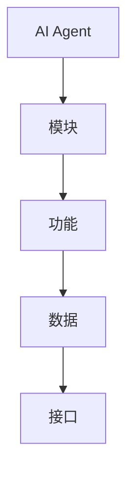
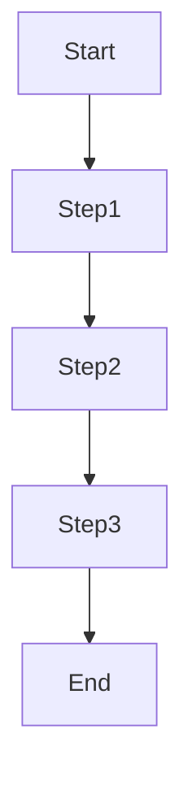
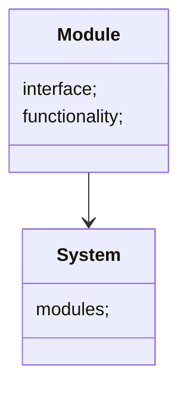
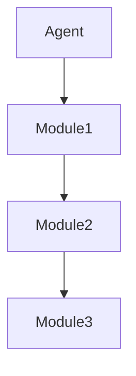
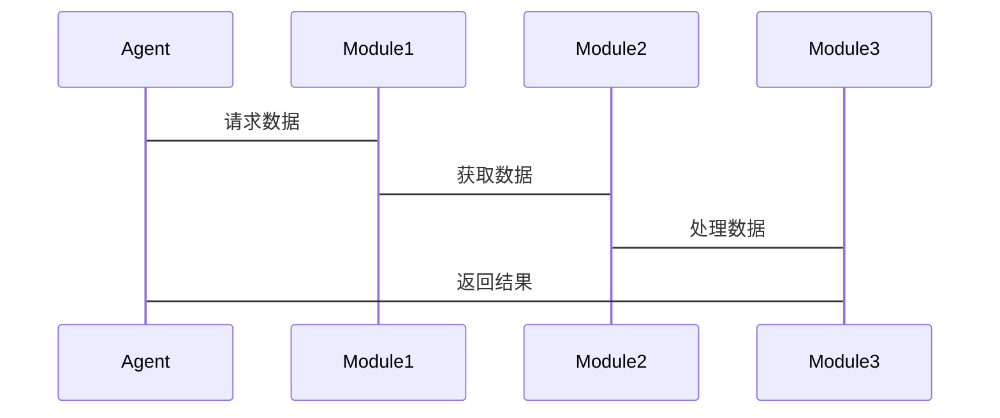

                 


# AI Agent的模块化设计：提高系统可维护性和扩展性

---

## 关键词
AI Agent, 模块化设计, 可维护性, 扩展性, 软件架构, 系统设计

---

## 摘要
本文探讨了AI Agent的模块化设计方法，分析了其对系统可维护性和扩展性的提升。通过详细阐述模块化设计的核心概念、算法原理、系统架构设计及实际案例，本文为读者提供了一套系统化的设计思路，帮助他们在实际项目中更好地应用模块化设计原则。

---

## 第一部分: AI Agent的模块化设计基础

### 第1章: AI Agent的基本概念与问题背景

#### 1.1 AI Agent的定义与核心要素
- **AI Agent的定义**：AI Agent是一种智能实体，能够感知环境、自主决策并执行任务。它结合了人工智能技术和软件工程原理，具有学习、推理和自适应能力。
- **AI Agent的核心要素**：
  - **感知能力**：通过传感器或数据接口获取环境信息。
  - **决策能力**：基于感知信息，利用算法做出决策。
  - **执行能力**：通过执行机构或API调用实现操作。
  - **通信能力**：与其他系统或用户进行交互。
- **AI Agent与传统软件的区别**：
  - 具备自主性、反应性和社会性。
  - 强调与环境的动态交互，而非固定的执行流程。

#### 1.2 模块化设计的背景与意义
- **软件系统复杂性增加的挑战**：随着AI技术的引入，系统规模不断扩大，功能日益复杂。
- **模块化设计的重要性**：
  - 提高系统的可维护性。
  - 降低开发和维护成本。
  - 促进团队协作，提升开发效率。
- **目标**：通过模块化设计，将系统分解为独立且可替换的模块，降低耦合性，提高系统的灵活性和可扩展性。

### 第2章: 模块化设计的核心概念与联系

#### 2.1 模块化设计的原理
- **模块化的基本原理**：将系统分解为功能相对独立的模块，模块之间通过明确的接口进行通信。
- **模块化设计的特征**：
  - **独立性**：每个模块具有明确的功能和接口。
  - **可替换性**：模块可以独立替换或升级。
  - **可扩展性**：新增功能可以通过添加新模块实现。
- **模块化设计与AI Agent的结合**：
  - 将AI Agent的功能模块化，如感知、决策、执行等。
  - 通过模块化设计，提高AI Agent的灵活性和可维护性。

#### 2.2 核心概念对比表格
| 模块化方法 | 优点 | 缺点 | 适用场景 |
|------------|------|------|----------|
| 分层设计   | 结构清晰 | 层间耦合较高 | 大型系统       |
| 面向接口设计 | 独立性高 | 开发复杂度增加 | 小型到中型系统 |

#### 2.3 实体关系图


### 第3章: 模块化设计的算法原理

#### 3.1 算法原理概述
- **模块化分解的算法**：
  - 基于功能划分的方法。
  - 基于数据流分析的方法。
- **模块间通信机制**：
  - 接口定义明确，通过API进行通信。
  - 使用消息队列或事件驱动机制。
- **模块化设计的优化算法**：
  - 基于图论的模块划分优化。
  - 基于动态规划的模块依赖优化。

#### 3.2 算法流程图


#### 3.3 Python实现示例
```python
def modular_design(system):
    modules = decompose(system)
    for module in modules:
        optimize(module)
    return modules
```

### 第4章: 系统分析与架构设计

#### 4.1 问题场景介绍
- **系统目标**：构建一个高度可维护和可扩展的AI Agent系统。
- **需求分析**：支持多种任务执行，具备良好的扩展性和维护性。
- **约束条件**：系统需支持模块化升级，具备高效的通信机制。

#### 4.2 系统功能设计
- **功能模块划分**：
  - 感知模块：负责数据采集和环境感知。
  - 决策模块：负责策略制定和决策。
  - 执行模块：负责任务执行和反馈收集。
- **领域模型**：


#### 4.3 系统架构设计
- **整体架构**：


#### 4.4 系统接口设计
- **接口定义**：
  - 模块间通过REST API或消息队列进行通信。
  - 定义清晰的接口规范，确保模块的独立性和可替换性。

#### 4.5 系统交互流程图


### 第5章: 项目实战

#### 5.1 环境安装
- **Python环境**：建议使用Python 3.8以上版本。
- **依赖库安装**：使用pip安装必要的库，如numpy、pandas、scikit-learn等。

#### 5.2 系统核心实现
- **代码实现**：
```python
class Agent:
    def __init__(self):
        self.modules = []

    def add_module(self, module):
        self.modules.append(module)

    def execute(self):
        for module in self.modules:
            module.run()
```

#### 5.3 代码应用解读
- **代码解读**：
  - `Agent`类负责管理各个模块，并提供添加模块和执行模块的方法。
  - 每个模块通过`run`方法实现其功能。

#### 5.4 实际案例分析
- **案例分析**：
  - 某AI客服系统通过模块化设计，实现了对话模块、知识库模块和反馈模块的独立开发和维护。
  - 通过模块化设计，该系统在上线后，能够快速响应需求变化，显著提高了系统的可维护性和扩展性。

#### 5.5 项目小结
- **项目总结**：
  - 模块化设计在实际项目中表现出色，显著降低了系统的耦合性和维护成本。
  - 通过模块化设计，系统具备了良好的扩展性和灵活性，能够快速适应业务需求的变化。

### 第6章: 最佳实践

#### 6.1 小结
- **总结**：模块化设计是提升AI Agent系统可维护性和扩展性的关键方法。
- **关键点**：明确模块划分、设计清晰的接口规范、采用模块化开发方法。

#### 6.2 注意事项
- **避免过度模块化**：过细的模块划分可能导致系统复杂度增加。
- **确保接口兼容性**：模块间接口的设计需充分考虑兼容性和扩展性。
- **模块化测试**：每个模块应进行独立测试，确保模块间的通信顺畅。

#### 6.3 拓展阅读
- 推荐书籍：《设计模式：可复用面向对象的软件组件》、《软件架构设计：实践与原理》。
- 推荐博客：关注模块化设计、软件架构设计相关的技术博客。

---

## 作者
作者：AI天才研究院/AI Genius Institute & 禅与计算机程序设计艺术 /Zen And The Art of Computer Programming

---

**这篇文章通过系统化的模块化设计方法，深入探讨了AI Agent的构建过程，为开发者提供了一套实用的设计思路和实践指导。**

