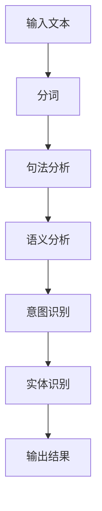
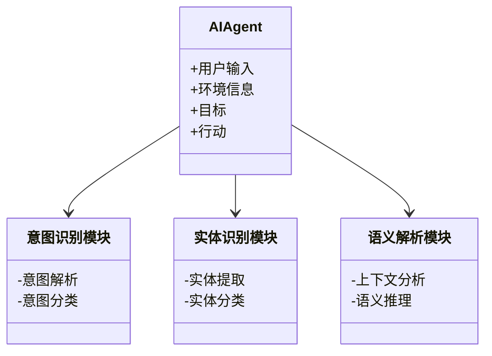

                 


# AI Agent的深层语义理解：提升LLM的隐含信息提取

> 关键词：AI Agent, 深层语义理解, LLM, 隐含信息提取, 自然语言处理, 语义解析

> 摘要：本文深入探讨了AI Agent在深层语义理解中的应用，重点分析了如何通过提升大语言模型（LLM）的隐含信息提取能力来增强语义理解效果。文章从背景介绍、核心概念、算法原理、系统架构到项目实战，全面解析了AI Agent在语义理解中的关键作用，并通过具体案例展示了其在实际应用中的优势。

---

# 第1章: AI Agent与深层语义理解的背景与概念

## 1.1 AI Agent的基本概念

### 1.1.1 AI Agent的定义
AI Agent（人工智能代理）是指能够感知环境并采取行动以实现目标的智能实体。它可以是一个软件程序、机器人或其他智能系统，通过与用户或环境的交互，完成特定任务。

### 1.1.2 AI Agent的核心特征
AI Agent的核心特征包括：
1. **自主性**：能够在没有外部干预的情况下自主决策。
2. **反应性**：能够实时感知环境并做出反应。
3. **目标导向**：所有行为都围绕实现特定目标展开。
4. **社交能力**：能够与人类或其他系统进行有效交互。

### 1.1.3 AI Agent的分类与应用场景
AI Agent可以分为以下几类：
1. **简单反射型**：基于规则的简单反应。
2. **基于模型的反射型**：使用内部模型进行决策。
3. **目标驱动型**：以目标为导向进行行动。
4. **实用驱动型**：通过优化目标函数实现最大化收益。

AI Agent的应用场景包括智能助手、自动驾驶、智能客服、机器人控制等。

## 1.2 深层语义理解的定义与重要性

### 1.2.1 深层语义理解的概念
深层语义理解（Deep Semantic Understanding）是指通过分析上下文、意图和情感，理解文本背后隐含含义的能力。与传统的基于关键词匹配的浅层理解不同，深层语义理解能够捕捉语言的复杂性和模糊性。

### 1.2.2 深层语义理解与传统NLP的区别
| **方面**         | **传统NLP**                | **深层语义理解**           |
|-------------------|---------------------------|---------------------------|
| **处理内容**      | 词法分析、句法分析          | 上下文理解、意图识别       |
| **技术方法**      | 基于规则、关键词匹配       | 基于深度学习、上下文模型   |
| **应用场景**      | 信息抽取、文本分类          | 智能对话、情感分析          |

### 1.2.3 深层语义理解的重要性
深层语义理解能够帮助AI Agent更好地理解用户需求，提升交互体验。例如，在智能对话系统中，深层语义理解能够准确识别用户的意图，提供更精准的回复。

---

# 第2章: 深层语义理解的核心原理

## 2.1 深层语义理解的关键技术

### 2.1.1 语义解析
语义解析的目标是通过分析上下文，识别文本中的实体、关系和意图。例如，在用户查询“附近有哪些好吃的餐厅？”时，语义解析需要识别“附近”、“好吃的餐厅”等关键信息。

### 2.1.2 意图识别
意图识别是通过分析用户输入，确定用户的意图。例如，用户输入“我需要一个日程安排工具”，意图识别可以识别出用户的需求是“创建日程”。

### 2.1.3 实体识别
实体识别是指从文本中提取出具有特定意义的实体，例如人名、地点、时间等。

## 2.2 深层语义理解的核心流程



---

# 第3章: 深层语义理解的算法原理与数学模型

## 3.1 基于深度学习的语义理解模型

### 3.1.1 注意力机制
注意力机制（Attention Mechanism）是一种用于处理序列数据的方法，通过计算序列中每个位置的重要性来提升模型的上下文理解能力。

公式表示：
$$
\text{Attention}(Q, K, V) = \text{softmax}\left(\frac{QK^T}{\sqrt{d_k}}\right)V
$$

### 3.1.2 Transformer架构
Transformer是一种基于自注意力机制的深度学习模型，广泛应用于自然语言处理任务中。

---

# 第4章: AI Agent的系统架构与设计

## 4.1 系统功能设计



---

# 第5章: 项目实战

## 5.1 环境安装

```bash
pip install transformers
pip install torch
pip install mermaid
```

## 5.2 系统核心实现源代码

```python
import torch
from transformers import AutoTokenizer, AutoModelForMaskedLM

tokenizer = AutoTokenizer.from_pretrained("bert-base-chinese")
model = AutoModelForMaskedLM.from_pretrained("bert-base-chinese")

def semantic_understanding(input_text):
    inputs = tokenizer(input_text, return_tensors="pt")
    outputs = model(**inputs)
    # 处理输出
    return outputs
```

---

# 第6章: 总结与展望

## 6.1 本章总结
本文详细探讨了AI Agent在深层语义理解中的应用，分析了其在提升LLM隐含信息提取能力中的重要作用。

## 6.2 未来展望
未来的研究方向包括优化深层语义理解算法、提升AI Agent的交互能力以及探索多模态语义理解的可能性。

---

# 作者：AI天才研究院 & 禅与计算机程序设计艺术

