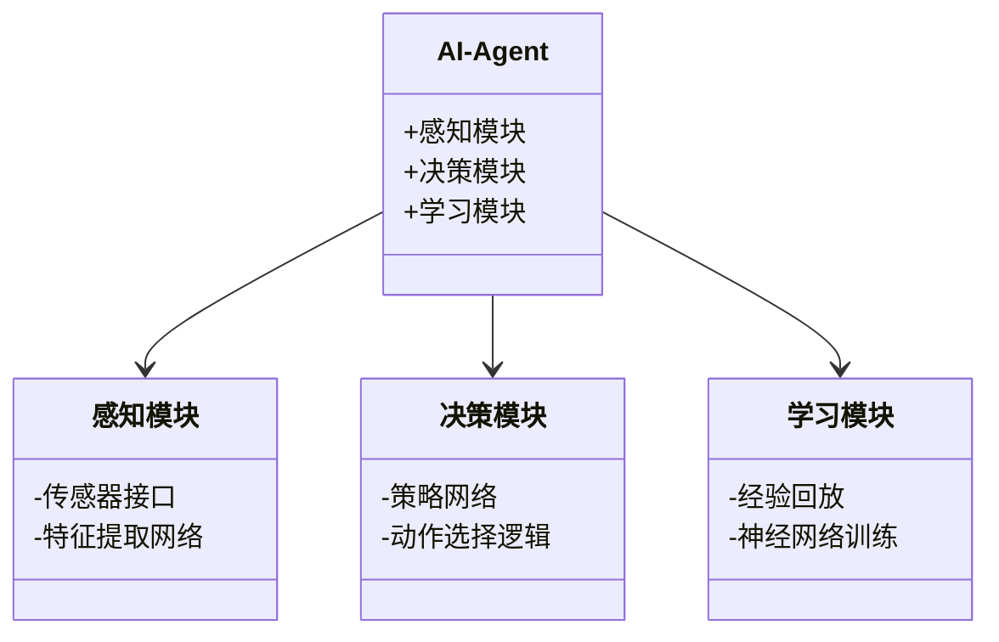
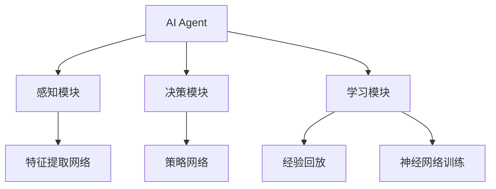
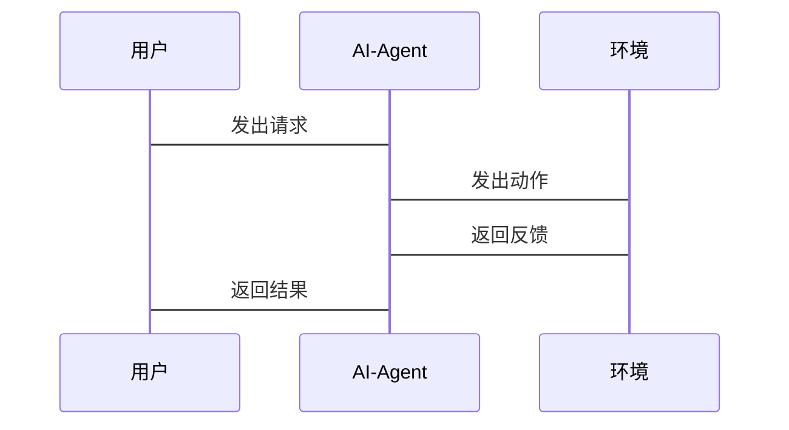

                 

<think>
好的，我现在需要帮助用户撰写一篇关于《AI Agent的深度学习技术应用》的技术博客文章。首先，我需要明确用户的需求。用户希望文章结构清晰，逻辑紧凑，使用专业但易懂的语言，并且包含详细的分析和实例。文章需要包含目录大纲，关键词，摘要，以及正文部分，最后加上作者信息。

首先，我应该先确定文章的标题和关键词。标题已经给出是《AI Agent的深度学习技术应用》，关键词需要从文章的核心内容中提取，比如AI Agent、深度学习、人工智能、技术应用、算法、系统架构等。摘要部分需要简洁明了地概括文章的主要内容和目的。

接下来，按照用户提供的目录大纲结构，我需要详细规划每一章的内容。第一部分是背景介绍，包括AI Agent的基本概念、发展历史和应用领域。第二部分是深度学习的核心概念，涵盖基本原理、数学基础和神经网络模型。第三部分探讨AI Agent与深度学习的结合，包括感知、决策和学习能力。第四部分是系统分析与架构设计，介绍项目背景、系统功能、架构和接口设计。第五部分是项目实战，涉及环境安装、代码实现、案例分析和小结。第六部分是最佳实践和总结，包括注意事项和未来展望。

在撰写过程中，我需要确保每个部分都包含足够的细节，比如使用Mermaid图来展示流程图和架构图，以及提供Python代码示例。同时，数学公式要用LaTeX格式，并且要清晰地解释每个公式的作用和应用。

接下来，我需要考虑如何组织每一章的内容。例如，在第二章深度学习的核心概念中，我需要详细解释线性代数、微积分和概率论的基础知识，以及如何应用到深度学习中。在第三章，我需要探讨AI Agent如何利用深度学习进行感知和决策，并给出实际案例。

在撰写过程中，可能会遇到一些问题，比如如何将复杂的算法原理简化成易于理解的内容。这时候，我会参考已有的技术资料，确保解释的准确性，同时使用通俗易懂的语言。另外，代码示例需要确保正确性，可能需要多次测试和调整，以避免错误。

最后，我需要确保文章整体流畅，结构合理，每部分内容衔接自然。同时，作者信息部分要准确无误，符合用户的要求。

总结一下，我的思考过程是：明确用户需求，规划文章结构，详细撰写每一部分，确保内容准确、详细且易于理解，最后整合成一篇完整的博客文章。
</think>

# AI Agent的深度学习技术应用

---

## 关键词

AI Agent, 深度学习, 人工智能, 技术应用, 算法, 系统架构

---

## 摘要

本文深入探讨了AI Agent在深度学习技术中的应用，从AI Agent的基本概念和深度学习的核心原理入手，详细分析了两者结合的背景、原理和实际应用。通过系统化的分析，本文揭示了AI Agent如何利用深度学习技术实现感知、决策和学习能力的提升。文章内容涵盖AI Agent的组成、深度学习的数学基础、算法原理、系统架构设计以及实际项目案例，旨在为读者提供全面的技术视角和实践指导。

---

## 第一部分: AI Agent的深度学习技术基础

### 第1章: AI Agent的基本概念与背景

#### 1.1 AI Agent的定义与特点

- **1.1.1 AI Agent的定义**
  AI Agent（人工智能代理）是指能够感知环境、自主决策并采取行动以实现目标的智能体。它可以理解为一种能够与环境交互的智能系统，通过传感器获取信息，并通过执行器采取行动。

- **1.1.2 AI Agent的核心特点**
  - **自主性**：AI Agent能够在没有外部干预的情况下自主运行。
  - **反应性**：能够实时感知环境并做出反应。
  - **目标导向性**：所有行为都以实现特定目标为导向。
  - **学习能力**：通过与环境的交互不断优化自身的决策策略。

- **1.1.3 AI Agent与传统AI的区别**
  传统的AI系统通常依赖于预定义的规则和逻辑，而AI Agent具有更强的自主性和适应性，能够根据环境变化动态调整行为。

#### 1.2 AI Agent的发展历程

- **1.2.1 AI Agent的历史演变**
  AI Agent的概念起源于20世纪60年代的知识检索系统，经过 decades的发展，逐渐从简单的规则驱动系统演变为基于深度学习的智能代理。

- **1.2.2 当前AI Agent的主要研究方向**
  - **强化学习**：通过与环境交互，学习最优策略。
  - **多智能体系统**：研究多个AI Agent协同工作的机制。
  - **人机协作**：将AI Agent与人类用户进行无缝协作。

- **1.2.3 AI Agent的未来发展趋势**
  未来的AI Agent将更加注重人机协作、实时推理和自适应性，能够在复杂多变的环境中保持高效运行。

#### 1.3 AI Agent的应用领域

- **1.3.1 AI Agent在各个行业的应用现状**
  - **金融领域**：用于股票交易、风险评估和客户服务。
  - **医疗领域**：辅助诊断、个性化治疗和医疗管理。
  - **制造业**：优化生产流程、质量控制和设备维护。

- **1.3.2 AI Agent在学术研究中的重要性**
  学术界对AI Agent的研究主要集中在强化学习、多智能体系统和人机交互等领域，推动了AI技术的不断进步。

- **1.3.3 AI Agent在企业级应用中的潜力**
  企业可以通过AI Agent实现自动化决策、智能客服和生产优化，提升运营效率和竞争力。

---

## 第2章: 深度学习技术的核心概念

### 2.1 深度学习的基本原理

#### 2.1.1 深度学习的定义与特点

- **定义**：深度学习是一种基于人工神经网络的机器学习方法，通过多层非线性变换模拟人类大脑的学习机制。
- **特点**：
  - **层次化特征提取**：能够自动提取数据的高层次特征。
  - **非线性表达能力**：能够处理复杂的非线性关系。
  - **大数据处理能力**：适用于大规模数据的训练和分析。

#### 2.1.2 深度学习与传统机器学习的区别

| 特性                | 深度学习                 | 传统机器学习             |
|---------------------|--------------------------|--------------------------|
| 特征工程            | 内部自动提取特征         | 需要手动设计特征         |
| 模型复杂度          | 模型复杂度较高           | 模型复杂度相对较低       |
| 数据需求            | 需要大量标注数据         | 数据量相对较小           |
| 应用场景            | 适用于高维复杂任务       | 适用于简单或中等复杂度任务 |

#### 2.1.3 深度学习的核心算法概述

- **监督学习**：基于标记数据进行训练，目标是学习输入到输出的映射关系。
- **无监督学习**：在无标记数据上进行训练，目标是发现数据中的内在结构。
- **强化学习**：通过与环境交互，学习最优策略，最大化累积奖励。

### 2.2 深度学习的数学基础

#### 2.2.1 线性代数基础

- **向量和矩阵运算**：深度学习中的数据通常表示为向量或矩阵，矩阵乘法是神经网络的核心操作。
- **线性变换**：通过权重矩阵和激活函数实现非线性变换。

#### 2.2.2 微积分基础

- **导数和梯度**：梯度下降是深度学习中常用的优化算法，依赖于导数的计算。
- **链式法则**：用于计算复杂函数的导数，是反向传播算法的基础。

#### 2.2.3 概率论与统计基础

- **概率分布**：用于描述数据的不确定性，如高斯分布、伯努利分布等。
- **最大似然估计**：用于参数估计，是监督学习中的常用方法。

### 2.3 深度学习的神经网络模型

#### 2.3.1 人工神经网络的结构

- **输入层**：接收输入数据。
- **隐藏层**：通过非线性变换提取特征。
- **输出层**：生成最终的预测结果。

#### 2.3.2 卷积神经网络（CNN）

- **卷积层**：用于提取图像的局部特征。
- **池化层**：降低模型复杂度，提取全局特征。

#### 2.3.3 循环神经网络（RNN）

- **循环层**：处理序列数据，保持上下文信息。
- **长短期记忆网络（LSTM）**：解决RNN的梯度消失问题，适用于时间序列数据。

#### 2.3.4 Transformer架构

- **自注意力机制**：捕捉序列中各个位置之间的关系。
- **位置编码**：为每个位置赋予位置信息。

---

## 第3章: AI Agent与深度学习的结合

### 3.1 AI Agent的感知能力

#### 3.1.1 感知的基本概念

- **感知**：AI Agent通过传感器获取环境信息，如图像、声音、文本等。
- **特征提取**：通过深度学习模型提取感知数据的高层次特征。

#### 3.1.2 深度学习在感知中的应用

- **图像识别**：使用CNN进行目标检测和图像分类。
- **语音识别**：使用RNN或Transformer进行语音转文本。
- **自然语言处理**：使用Transformer进行文本理解和生成。

#### 3.1.3 感知能力的提升方法

- **多模态感知**：结合多种感知方式，提升感知的准确性和鲁棒性。
- **在线学习**：在实时环境中动态更新感知模型。

### 3.2 AI Agent的决策能力

#### 3.2.1 决策的基本概念

- **决策**：AI Agent根据感知信息，选择最优行动方案。
- **策略**：决策的规则或函数，描述状态到动作的映射。

#### 3.2.2 深度学习在决策中的应用

- **强化学习**：通过与环境交互，学习最优策略。
- **值函数逼近**：使用深度神经网络逼近最优值函数。

#### 3.2.3 决策能力的优化策略

- **多目标优化**：在多个目标之间找到平衡点。
- **风险-aware决策**：考虑决策中的不确定性和风险因素。

### 3.3 AI Agent的学习能力

#### 3.3.1 学习的基本概念

- **学习**：AI Agent通过经验改进其性能，如分类准确率、决策效率等。
- **在线学习**：实时更新模型参数，适应环境变化。

#### 3.3.2 深度学习在学习中的应用

- **元学习**：学习如何学习，适用于新任务的快速适应。
- **自监督学习**：利用未标记数据，通过自动生成标签进行学习。

#### 3.3.3 学习能力的评估与优化

- **评估指标**：准确率、召回率、F1分数等。
- **优化方法**：使用超参数调优、神经架构搜索等技术优化模型性能。

---

## 第4章: 系统分析与架构设计方案

### 4.1 项目背景介绍

- **项目目标**：构建一个基于深度学习的AI Agent，能够在复杂环境中自主决策和学习。
- **应用场景**：智能客服、自动驾驶、智能助手等。

### 4.2 系统功能设计

#### 4.2.1 领域模型设计

- **领域模型**：定义系统的功能模块和交互流程。
- **Mermaid类图**：展示系统的类及其关系。



#### 4.2.2 系统架构设计

- **分层架构**：感知层、决策层、学习层。
- **Mermaid架构图**：展示系统的整体架构。



#### 4.2.3 系统接口设计

- **输入接口**：接收传感器数据或用户输入。
- **输出接口**：输出决策动作或反馈信息。
- **交互接口**：与外部系统或用户进行交互。

#### 4.2.4 系统交互设计

- **Mermaid序列图**：展示系统的交互流程。



---

## 第5章: 项目实战

### 5.1 环境安装与配置

- **安装Python**：确保Python 3.6以上版本。
- **安装深度学习框架**：如TensorFlow、Keras或PyTorch。
- **安装其他依赖**：如NumPy、Matplotlib、Scikit-learn等。

### 5.2 系统核心实现源代码

#### 5.2.1 感知模块实现

```python
import tensorflow as tf
from tensorflow.keras import layers

class PerceptionModule:
    def __init__(self):
        self.model = self.build_model()
    
    def build_model(self):
        model = tf.keras.Sequential([
            layers.Conv2D(32, (3,3), activation='relu', input_shape=(128, 128, 3)),
            layers.MaxPooling2D((2,2)),
            layers.Conv2D(64, (3,3), activation='relu'),
            layers.MaxPooling2D((2,2)),
            layers.Flatten(),
            layers.Dense(128, activation='relu'),
            layers.Dense(10, activation='softmax')
        ])
        return model
```

#### 5.2.2 决策模块实现

```python
class DecisionModule:
    def __init__(self):
        self.model = self.build_model()
    
    def build_model(self):
        model = tf.keras.Sequential([
            layers.Input(shape=(128,)),
            layers.Dense(64, activation='relu'),
            layers.Dense(64, activation='relu'),
            layers.Dense(4, activation='softmax')
        ])
        return model
```

#### 5.2.3 学习模块实现

```python
class LearningModule:
    def __init__(self, perception, decision):
        self.perception = perception
        self.decision = decision
        self.memory = []
    
    def remember(self, state, action, reward, next_state):
        self.memory.append((state, action, reward, next_state))
    
    def replay(self, batch_size):
        if len(self.memory) < batch_size:
            return
        minibatch = self.memory.sample(batch_size)
        # 训练感知模块和决策模块
        self.perception.model.fit(...)
        self.decision.model.fit(...)
```

### 5.3 代码应用解读与分析

- **感知模块**：用于提取环境中的特征信息，如图像或文本。
- **决策模块**：基于感知结果，选择最优动作。
- **学习模块**：通过经验回放优化模型性能。

### 5.4 实际案例分析

- **案例背景**：构建一个简单的AI Agent，用于智能客服。
- **实现步骤**：
  1. 收集客服对话数据。
  2. 训练感知模块进行意图识别。
  3. 训练决策模块生成回复。
  4. 使用学习模块优化回复策略。

### 5.5 项目小结

- **项目成果**：实现了一个基于深度学习的AI Agent，能够在特定场景下完成任务。
- **经验总结**：深度学习与AI Agent的结合能够显著提升系统的智能性和适应性。

---

## 第6章: 最佳实践与总结

### 6.1 最佳实践 tips

- **数据质量**：确保数据的多样性和代表性。
- **模型选择**：根据任务需求选择合适的深度学习模型。
- **系统优化**：通过并行计算和模型压缩提升系统性能。

### 6.2 小结

- **核心内容回顾**：本文详细探讨了AI Agent与深度学习的结合，从理论到实践，全面分析了其技术应用。
- **总结**：通过深度学习技术，AI Agent的感知、决策和学习能力得到了显著提升，为各行业应用提供了强大的技术支持。

### 6.3 注意事项

- **数据隐私**：在处理用户数据时，需遵守相关法律法规，保护用户隐私。
- **系统安全**：确保AI Agent的安全性，防止被恶意攻击或滥用。

### 6.4 拓展阅读

- **推荐书籍**：《深度学习》（Ian Goodfellow等著）、《人工智能：一种现代方法》（ Stuart Russell等著）。
- **推荐论文**：关注最新的AI Agent和深度学习研究成果，如Nature和Science期刊的相关论文。

---

## 作者信息

作者：AI天才研究院/AI Genius Institute & 禅与计算机程序设计艺术/Zen And The Art of Computer Programming

