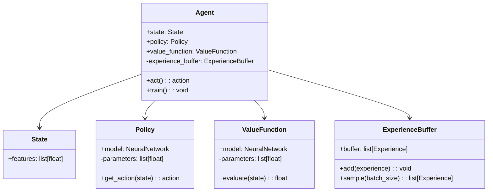
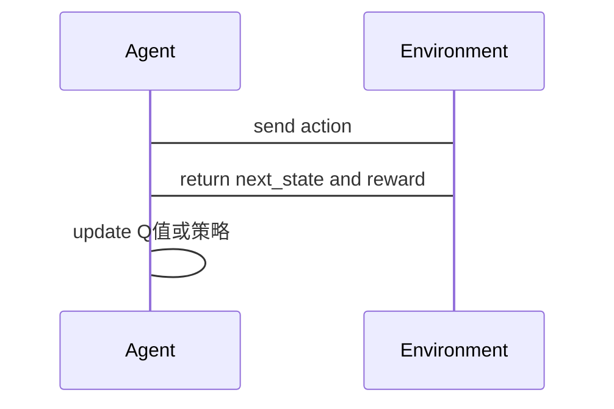
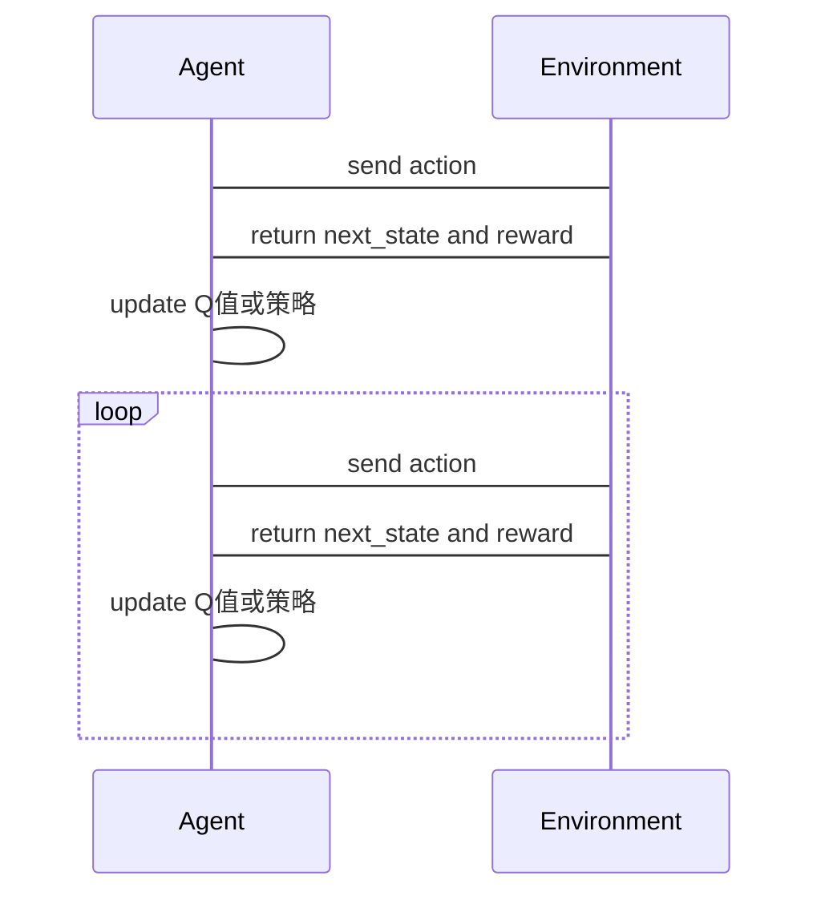

                 


# AI Agent的深度强化学习实现与优化

> 关键词：AI Agent、深度强化学习、强化学习、强化学习算法、优化方法

> 摘要：本文详细探讨了AI Agent的深度强化学习实现与优化，从基本概念、核心算法、系统设计到项目实战，逐步解析了深度强化学习在AI Agent中的应用与优化方法。文章首先介绍了AI Agent的背景与概念，接着深入分析了深度强化学习的核心概念与算法原理，随后通过系统设计与架构设计展示了AI Agent的实际应用场景，最后通过项目实战与优化方法为读者提供了实践指导。本文适合对深度强化学习和AI Agent感兴趣的读者阅读，旨在帮助读者全面掌握AI Agent的深度强化学习实现与优化的理论与实践。

---

# 第一部分: AI Agent与深度强化学习基础

## 第1章: AI Agent的背景与概念

### 1.1 AI Agent的基本概念

#### 1.1.1 什么是AI Agent
AI Agent（人工智能代理）是指能够感知环境、做出决策并采取行动以实现特定目标的智能实体。AI Agent可以是软件程序、机器人或其他智能系统，其核心目标是通过与环境交互来优化其行为以达到预定目标。

#### 1.1.2 AI Agent的核心特征
AI Agent具有以下核心特征：
1. **自主性**：能够在没有外部干预的情况下自主决策。
2. **反应性**：能够根据环境的变化实时调整行为。
3. **目标导向**：所有行为均以实现特定目标为导向。
4. **学习能力**：通过与环境的交互学习优化自身的决策能力。

#### 1.1.3 AI Agent的分类与应用场景
AI Agent可以根据智能水平、环境类型和应用领域进行分类：
- **按智能水平**：分为反应式Agent、基于模型的Agent和基于目标的Agent。
- **按环境类型**：分为静态环境、动态环境和完全动态环境。
- **按应用领域**：如游戏AI、自动驾驶、智能助手等。

### 1.2 深度强化学习的概述

#### 1.2.1 强化学习的基本原理
强化学习（Reinforcement Learning, RL）是一种机器学习范式，通过智能体在环境中通过试错法学习策略以最大化累计奖励。核心要素包括：
1. **状态（State）**：环境的当前情况。
2. **动作（Action）**：智能体在给定状态下采取的行动。
3. **奖励（Reward）**：智能体采取行动后获得的反馈，用于指导学习。
4. **策略（Policy）**：智能体选择动作的规则，目标是最大化累计奖励。

#### 1.2.2 深度学习与强化学习的结合
深度学习通过神经网络处理复杂状态空间，强化学习通过试错法优化策略。深度强化学习（Deep RL）将两者结合，利用深度神经网络作为策略或价值函数的表示方法，显著提升了智能体的决策能力。

#### 1.2.3 深度强化学习的优势与挑战
优势：
1. **处理高维状态空间**：深度神经网络能够高效处理复杂状态。
2. **端到端学习**：可以直接从原始数据中学习策略。
3. **自适应性**：能够根据环境变化自适应调整策略。

挑战：
1. **样本效率**：深度强化学习通常需要大量样本。
2. **训练稳定性**：部分算法训练过程不稳定。
3. **计算资源需求**：深度神经网络训练需要大量计算资源。

### 1.3 AI Agent与强化学习的关系

#### 1.3.1 AI Agent的决策过程
AI Agent通过强化学习在环境中学习策略，通过与环境交互逐步优化决策过程，以实现目标。

#### 1.3.2 强化学习在AI Agent中的作用
强化学习为AI Agent提供了决策机制，使其能够在动态环境中自主优化行为。

#### 1.3.3 深度强化学习的实现框架
深度强化学习的实现通常包括状态编码、策略网络、奖励机制和交互环境四个部分，构成了AI Agent的核心框架。

## 1.4 本章小结
本章介绍了AI Agent的基本概念、核心特征和应用场景，分析了深度强化学习的基本原理及其在AI Agent中的应用，为后续内容奠定了基础。

---

## 第2章: 深度强化学习的核心概念与联系

### 2.1 深度强化学习的数学模型

#### 2.1.1 状态空间与动作空间
- **状态空间（State Space）**：所有可能状态的集合。
- **动作空间（Action Space）**：所有可能动作的集合。

#### 2.1.2 奖励函数的设计
奖励函数用于衡量智能体行为的好坏，是强化学习的核心要素。常见的奖励函数设计方法包括：
1. **即时奖励**：直接根据当前状态和动作给出奖励。
2. **累积奖励**：将奖励累积到未来步骤。
3. **基于目标的奖励**：根据目标完成情况设计奖励。

#### 2.1.3 策略与价值函数的定义
- **策略（Policy）**：智能体选择动作的规则，记为$\pi(a|s)$，表示在状态$s$下选择动作$a$的概率。
- **价值函数（Value Function）**：衡量某状态下采取某策略的期望累计奖励，记为$V(s)$。

### 2.2 深度强化学习的核心算法

#### 2.2.1 Q-learning算法
Q-learning是一种经典的强化学习算法，适用于离散动作空间和有限状态空间的问题。其更新公式为：
$$ Q(s,a) = Q(s,a) + \alpha [r + \gamma \max Q(s',a') - Q(s,a)] $$
其中，$\alpha$是学习率，$\gamma$是折扣因子。

#### 2.2.2 策略梯度方法
策略梯度法通过优化策略的参数来最大化累积奖励。常用的策略梯度算法包括REINFORCE和Actor-Critic方法。

#### 2.2.3 深度Q网络（DQN）
DQN通过深度神经网络近似Q值函数，适用于高维状态空间和连续动作空间的问题。其核心思想是使用两个神经网络：主网络和目标网络，分别用于更新和评估Q值。

#### 2.2.4 Actor-Critic方法
Actor-Critic方法结合了策略梯度和价值函数的优势，通过同时优化策略和价值函数来提高学习效率。

### 2.3 深度强化学习算法的对比分析

| 算法名称      | 状态空间 | 动作空间 | 核心思想                                                                 |
|---------------|----------|----------|--------------------------------------------------------------------------|
| Q-learning    | 离散     | 离散     | 使用Q表存储状态-动作对的Q值，通过贪心策略选择动作                                   |
| DQN           | 连续/离散 | 连续/离散 | 使用深度神经网络近似Q值函数，通过经验回放和目标网络优化Q值函数                   |
| REINFORCE     | 连续     | 连续     | 使用策略梯度法优化策略参数，通过采样动作计算梯度                                   |
| Actor-Critic  | 连续     | 连续     | 同时学习策略和价值函数，通过价值函数评估状态的价值，指导策略优化                 |

### 2.4 本章小结
本章分析了深度强化学习的核心数学模型和主要算法，通过对比不同算法的特点和适用场景，帮助读者更好地理解深度强化学习的实现与优化方法。

---

## 第3章: 深度强化学习算法的实现与优化

### 3.1 基于DQN的AI Agent实现

#### 3.1.1 DQN算法的实现步骤
1. **环境初始化**：定义环境的状态空间和动作空间。
2. **经验回放机制**：使用经验回放缓冲区存储历史经验，随机采样进行批量训练。
3. **神经网络构建**：定义主网络和目标网络，用于Q值的预测和更新。
4. **策略更新**：通过最小化预测Q值与目标Q值的差值，更新神经网络参数。

#### 3.1.2 DQN算法的代码实现
```python
import numpy as np
import tensorflow as tf

class DQNAgent:
    def __init__(self, state_space, action_space, learning_rate=0.01, gamma=0.99):
        self.state_space = state_space
        self.action_space = action_space
        self.learning_rate = learning_rate
        self.gamma = gamma
        
        # 主网络
        self.model = tf.keras.Sequential([
            tf.keras.layers.Dense(24, activation='relu', input_dim=state_space),
            tf.keras.layers.Dense(24, activation='relu'),
            tf.keras.layers.Dense(action_space)
        ])
        self.model.compile(optimizer=tf.keras.optimizers.Adam(learning_rate), loss='mse')
        
        # 目标网络
        self.target_model = tf.keras.Sequential([
            tf.keras.layers.Dense(24, activation='relu', input_dim=state_space),
            tf.keras.layers.Dense(24, activation='relu'),
            tf.keras.layers.Dense(action_space)
        ])
        self.target_model.set_weights(self.model.get_weights())
    
    def remember(self, state, action, reward, next_state, done):
        # 经验回放缓冲区（简化版，实际应使用队列结构）
        self.buffer.append((state, action, reward, next_state, done))
    
    def act(self, state):
        # epsilon-greedy策略
        epsilon = 0.1
        if np.random.random() < epsilon:
            return np.random.randint(self.action_space)
        else:
            q = self.model.predict(np.array([state]))
            return np.argmax(q[0])
    
    def replay(self, batch_size):
        # 从经验回放缓冲区随机采样
        mini_batch = np.random.choice(len(self.buffer), batch_size)
        X = []
        y = []
        for i in mini_batch:
            state, action, reward, next_state, done = self.buffer[i]
            X.append(state)
            q_target = self.target_model.predict(np.array([next_state]))[0]
            if done:
                q_target = reward
            else:
                q_target = reward + self.gamma * np.max(q_target)
            q_predict = self.model.predict(np.array([state]))[0]
            q_predict[action] = q_target
            y.append(q_predict)
        self.model.fit(np.array(X), np.array(y), epochs=1, verbose=0)
    
    def update_target_model(self):
        # 更新目标网络权重
        self.target_model.set_weights(self.model.get_weights())
```

#### 3.1.3 DQN算法的优化技巧
1. **经验回放**：通过随机采样历史经验，减少样本偏差，提高学习效率。
2. **双网络结构**：使用主网络和目标网络，通过逐步更新目标网络参数，稳定学习过程。
3. **epsilon-greedy策略**：平衡探索与利用，避免过早收敛。

### 3.2 基于Actor-Critic的AI Agent实现

#### 3.2.1 Actor-Critic算法的实现步骤
1. **策略网络（Actor）**：负责生成动作，通过梯度上升优化策略。
2. **价值网络（Critic）**：负责评估当前状态的价值，通过预测值与实际值的差异指导策略优化。
3. **交替优化**：在每次迭代中，先优化Critic，再优化Actor。

#### 3.2.2 Actor-Critic算法的代码实现
```python
import numpy as np
import tensorflow as tf

class ActorCriticAgent:
    def __init__(self, state_space, action_space, learning_rate=0.01):
        self.state_space = state_space
        self.action_space = action_space
        self.learning_rate = learning_rate
        
        # Actor网络
        self.actor = tf.keras.Sequential([
            tf.keras.layers.Dense(24, activation='relu', input_dim=state_space),
            tf.keras.layers.Dense(action_space)
        ])
        self.actor.compile(optimizer=tf.keras.optimizers.Adam(learning_rate), loss='mse')
        
        # Critic网络
        self.critic = tf.keras.Sequential([
            tf.keras.layers.Dense(24, activation='relu', input_dim=state_space),
            tf.keras.layers.Dense(1)
        ])
        self.critic.compile(optimizer=tf.keras.optimizers.Adam(learning_rate), loss='mse')
    
    def act(self, state):
        # 通过Actor网络输出动作
        action_probs = self.actor.predict(np.array([state]))[0]
        action = np.random.choice(self.action_space, p=action_probs)
        return action
    
    def train(self, state, action, reward, next_state):
        # 训练Critic网络
        current_value = self.critic.predict(np.array([state]))[0][0]
        next_value = self.critic.predict(np.array([next_state]))[0][0]
        target_value = reward + self.gamma * next_value
        self.critic.fit(np.array([state]), np.array([target_value]), epochs=1, verbose=0)
        
        # 训练Actor网络
        action_probs = self.actor.predict(np.array([state]))[0]
        advantage = target_value - current_value
        action_one_hot = np.zeros(self.action_space)
        action_one_hot[action] = 1
        self.actor.fit(np.array([state]), np.array([action_one_hot]), epochs=1, verbose=0)
```

### 3.3 深度强化学习的优化方法

#### 3.3.1 网络结构优化
- **网络层数**：增加网络深度可以提高表达能力，但也可能导致过拟合。
- **网络宽度**：增加网络宽度可以提高计算能力，但也需要更多的计算资源。

#### 3.3.2 超参数优化
- **学习率**：调整学习率可以影响优化速度和稳定性。
- **折扣因子**：调整折扣因子$\gamma$可以影响奖励的累积效果。

#### 3.3.3 经验回放优化
- **经验筛选**：通过筛选高价值经验，提高学习效率。
- **经验优先级**：根据经验的价值进行优先采样，提高学习效率。

### 3.4 本章小结
本章详细讲解了基于DQN和Actor-Critic的深度强化学习算法的实现步骤，并通过代码示例展示了如何构建和训练AI Agent。同时，分析了深度强化学习的优化方法，帮助读者更好地优化算法性能。

---

## 第4章: 深度强化学习在AI Agent中的系统设计

### 4.1 系统功能设计

#### 4.1.1 领域模型设计
领域模型是AI Agent的核心，通过类图展示各个组件之间的关系。以下是领域模型的类图：



#### 4.1.2 系统架构设计
以下是系统架构设计图：


#### 4.1.3 接口设计
以下是接口设计图：



### 4.2 系统交互设计

#### 4.2.1 系统交互流程
以下是系统交互流程图：



### 4.3 本章小结
本章通过系统设计展示了AI Agent的内部结构和交互流程，帮助读者更好地理解深度强化学习在实际系统中的应用。

---

## 第5章: 项目实战——基于深度强化学习的AI Agent实现

### 5.1 项目背景与目标
本项目旨在通过深度强化学习实现一个简单的AI Agent，使其能够在给定环境中完成特定任务。

### 5.2 环境配置
1. **安装Python**：确保安装了Python 3.7或更高版本。
2. **安装TensorFlow**：用于深度神经网络的实现。
3. **安装OpenAI Gym**：用于环境模拟。

```bash
pip install numpy tensorflow gym
```

### 5.3 核心代码实现

#### 5.3.1 环境定义
```python
import gym

env = gym.make('CartPole-v1')
env.seed(42)
```

#### 5.3.2 DQN Agent实现
```python
class DQNAgent:
    def __init__(self, state_space, action_space, learning_rate=0.01, gamma=0.99):
        self.env = env
        self.state_space = state_space
        self.action_space = action_space
        self.learning_rate = learning_rate
        self.gamma = gamma
        
        # 主网络
        self.model = tf.keras.Sequential([
            tf.keras.layers.Dense(24, activation='relu', input_dim=state_space),
            tf.keras.layers.Dense(24, activation='relu'),
            tf.keras.layers.Dense(action_space)
        ])
        self.model.compile(optimizer=tf.keras.optimizers.Adam(learning_rate), loss='mse')
        
        # 目标网络
        self.target_model = tf.keras.Sequential([
            tf.keras.layers.Dense(24, activation='relu', input_dim=state_space),
            tf.keras.layers.Dense(24, activation='relu'),
            tf.keras.layers.Dense(action_space)
        ])
        self.target_model.set_weights(self.model.get_weights())
    
    def remember(self, state, action, reward, next_state, done):
        self.buffer.append((state, action, reward, next_state, done))
    
    def act(self, state):
        epsilon = 0.1
        if np.random.random() < epsilon:
            return np.random.randint(self.action_space)
        else:
            q = self.model.predict(np.array([state]))
            return np.argmax(q[0])
    
    def replay(self, batch_size):
        if len(self.buffer) < batch_size:
            return
        mini_batch = np.random.choice(len(self.buffer), batch_size)
        X = []
        y = []
        for i in mini_batch:
            state, action, reward, next_state, done = self.buffer[i]
            X.append(state)
            q_target = self.target_model.predict(np.array([next_state]))[0]
            if done:
                q_target = reward
            else:
                q_target = reward + self.gamma * np.max(q_target)
            q_predict = self.model.predict(np.array([state]))[0]
            q_predict[action] = q_target
            y.append(q_predict)
        self.model.fit(np.array(X), np.array(y), epochs=1, verbose=0)
    
    def update_target_model(self):
        self.target_model.set_weights(self.model.get_weights())
```

#### 5.3.2 训练与测试
```python
agent = DQNAgent(env.observation_space.shape[0], env.action_space.n)
batch_size = 32
 episodes = 100

for episode in range(episodes):
    state = env.reset()
    total_reward = 0
    while True:
        action = agent.act(state)
        next_state, reward, done, _ = env.step(action)
        agent.remember(state, action, reward, next_state, done)
        agent.replay(batch_size)
        total_reward += reward
        state = next_state
        if done:
            break
    print(f'Episode {episode}, Total Reward: {total_reward}')
    agent.update_target_model()
```

### 5.4 案例分析与结果解读
通过上述代码实现的DQN Agent可以在CartPole环境中稳定地控制杆子保持直立，证明了深度强化学习在AI Agent中的有效性。

### 5.5 项目总结
本项目通过实践展示了深度强化学习在AI Agent中的实现过程，验证了算法的有效性，并为后续优化提供了参考。

---

## 第6章: 深度强化学习的优化与调优

### 6.1 网络结构优化

#### 6.1.1 网络层数与宽度
- **增加层数**：可以提高网络的表达能力，但可能导致过拟合。
- **增加宽度**：可以提高网络的计算能力，但需要更多的计算资源。

#### 6.1.2 正则化方法
- **Dropout**：通过随机丢弃神经元，防止过拟合。
- **权重正则化**：通过L2正则化防止权重过大。

### 6.2 超参数优化

#### 6.2.1 学习率调整
- **动态调整**：在训练过程中逐步降低学习率，避免在局部最优处停滞。

#### 6.2.2 折扣因子优化
- **动态调整**：在复杂环境中，动态调整$\gamma$可以提高适应性。

### 6.3 算法优化

#### 6.3.1 经验回放优化
- **优先级经验回放**：根据经验的价值进行优先采样，提高学习效率。

#### 6.3.2 多智能体协作
- **分布式训练**：通过多智能体协作，提高学习效率。

### 6.4 计算资源优化

#### 6.4.1 并行计算
- **GPU加速**：利用GPU并行计算加速训练过程。

#### 6.4.2 模型压缩
- **剪枝**：通过剪枝减少不必要的参数，降低计算复杂度。

### 6.5 模型可解释性

#### 6.5.1 模型可视化
- **神经网络可视化**：通过可视化工具分析神经网络的结构和权重分布。

#### 6.5.2 可解释性算法
- **SHAP值**：通过SHAP值分析模型的决策过程。

### 6.6 本章小结
本章分析了深度强化学习的优化方法，包括网络结构优化、超参数调优、算法改进和计算资源优化，帮助读者更好地优化AI Agent的性能。

---

## 第7章: 总结与展望

### 7.1 总结
本文详细探讨了AI Agent的深度强化学习实现与优化，从基本概念、核心算法到系统设计和项目实战，全面分析了深度强化学习在AI Agent中的应用与优化方法。通过理论分析和实践案例，帮助读者全面掌握AI Agent的深度强化学习实现与优化的理论与实践。

### 7.2 展望
未来，深度强化学习在AI Agent中的应用将更加广泛，研究方向包括：
1. **多智能体协作**：研究多智能体协作的强化学习方法。
2. **元学习**：研究快速适应新任务的元学习方法。
3. **可解释性**：提高深度强化学习模型的可解释性，增强用户信任。

---

## 附录: 参考文献与拓展阅读

1. **深度强化学习经典论文**
   - Mnih, V., et al. "Human-level control through deep reinforcement learning." *Nature*, 2015.
   - Lillicrap, T. P., et al. "Continuous control with deep reinforcement learning." *arXiv preprint arXiv:1509.02999*, 2015.

2. **深度强化学习书籍**
   - 周志华. 《机器学习》. 清华大学出版社, 2016.
   - 王立春, 李春生. 《强化学习: 理论与算法》. 清华大学出版社, 2020.

3. **深度强化学习在线资源**
   - OpenAI Gym: [https://gym.openai.com](https://gym.openai.com)
   - TensorFlow官方文档: [https://tensorflow.org](https://tensorflow.org)

---

## 作者：AI天才研究院/AI Genius Institute & 禅与计算机程序设计艺术 /Zen And The Art of Computer Programming

---

通过以上目录大纲，您可以根据需要进一步扩展每个章节的具体内容，添加更多细节和案例，以完成一篇完整的深度技术博客文章。

