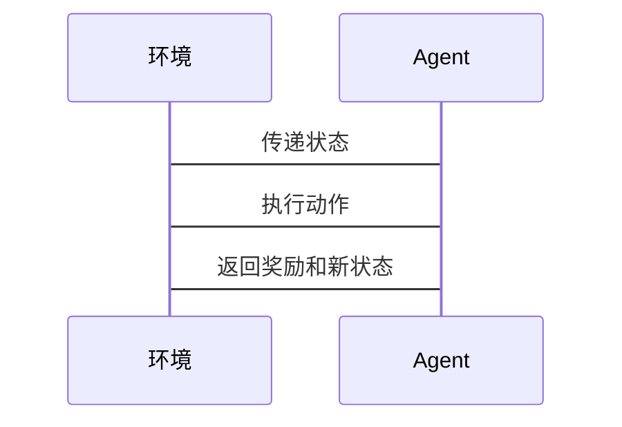

                 

<think>
嗯，用户希望我撰写一篇关于AI Agent深度强化学习实现策略的技术博客文章，而且已经给出了一个详细的目录结构。看来他需要一篇结构清晰、内容详实的专业技术文章。

首先，我应该从摘要开始，简要概述文章的核心内容和主题思想。然后按照目录的顺序，逐章展开。每章需要详细讲解相关概念，包括背景介绍、核心算法、系统架构设计、项目实战以及最佳实践等部分。

在“AI Agent与深度强化学习概述”这一章中，我需要先定义AI Agent和强化学习，解释它们的基本概念和分类，然后说明它们如何结合在一起。接下来，在“数学基础”部分，我需要回顾线性代数、概率论和微积分的基础知识，这些是理解深度强化学习算法的必要前提。

第三章是核心算法部分，我需要详细讲解Q-Learning、DQN、Policy Gradient和Actor-Critic等算法，包括它们的数学模型、实现步骤以及优缺点。这部分可能会用到很多数学公式和图表，所以需要使用LaTeX和Mermaid来清晰表达。

第四章是系统架构设计，我需要介绍如何设计AI Agent的系统架构，包括功能设计、架构图、接口设计和交互流程图。这部分可能需要绘制一些类图和序列图，帮助读者更好地理解系统结构。

项目实战部分，我需要提供一个实际的案例，比如使用OpenAI Gym环境，展示如何安装环境、实现算法代码，以及进行案例分析。这样读者可以跟着一步步操作，加深理解。

最后，在总结部分，我需要回顾全文，强调最佳实践，给出小结和注意事项，以及推荐进一步阅读的资料。整个思考过程需要逻辑清晰，结构紧凑，确保读者能够一步步理解AI Agent的深度强化学习实现策略。

现在，我应该按照这些步骤，逐步展开每一部分的内容，确保每个章节都覆盖用户要求的关键点，并且用专业但易懂的语言进行阐述。同时，要注意使用适当的代码示例和图表，帮助读者更好地理解复杂的概念。希望这样能够满足用户的需求，写出一篇高质量的技术博客文章。
</think>

# AI Agent的深度强化学习实现策略

> 关键词：AI Agent，深度强化学习，强化学习，Q-Learning，DQN，Actor-Critic，数学模型

> 摘要：本文将详细探讨AI Agent在深度强化学习中的实现策略，从基础概念到核心算法，再到系统架构设计与项目实战，全面解析AI Agent如何通过深度强化学习实现智能决策。本文适合对人工智能和强化学习感兴趣的读者阅读，旨在帮助读者深入理解AI Agent的实现原理与应用实践。

---

# 第1章: AI Agent与深度强化学习概述

## 1.1 AI Agent的基本概念

### 1.1.1 AI Agent的定义与分类
AI Agent（人工智能代理）是指在计算机系统中，能够感知环境并采取行动以实现目标的智能体。AI Agent可以是软件程序，也可以是机器人或其他智能设备。根据智能体的智能水平和决策能力，AI Agent可以分为以下几类：

- **反应式AI Agent**：基于当前感知做出反应，不依赖历史记忆。
- **认知式AI Agent**：具有复杂推理、规划和决策能力。
- **学习型AI Agent**：能够通过经验改进自身性能。

### 1.1.2 AI Agent的核心特征
AI Agent的核心特征包括以下几点：
1. **自主性**：能够在没有外部干预的情况下自主决策。
2. **反应性**：能够感知环境并实时调整行为。
3. **目标导向性**：通过目标驱动进行决策和行动。
4. **学习能力**：能够通过经验优化自身的决策策略。

### 1.1.3 AI Agent的应用场景
AI Agent广泛应用于多个领域，例如：
- **游戏AI**：在电子游戏中控制角色或对手。
- **自动驾驶**：通过感知环境实现自主驾驶。
- **智能推荐系统**：为用户提供个性化推荐。
- **机器人控制**：用于工业机器人或服务机器人。

## 1.2 深度强化学习的基本原理

### 1.2.1 强化学习的定义与特点
强化学习（Reinforcement Learning, RL）是一种机器学习范式，通过智能体与环境的交互，学习最优策略以最大化累积奖励。其特点包括：
1. **试错性**：智能体通过试错学习。
2. **延迟反馈**：奖励通常在多个动作之后才给出。
3. **策略优化**：通过优化策略函数来提高奖励。

### 1.2.2 深度强化学习的优势
深度强化学习（Deep Reinforcement Learning）结合了深度学习强大的特征提取能力和强化学习的决策优化能力，具有以下优势：
1. **高维状态空间处理**：能够处理复杂的高维状态。
2. **端到端学习**：可以直接从原始输入数据学习策略。
3. **自适应性**：能够根据环境变化自适应调整策略。

### 1.2.3 深度强化学习与传统强化学习的区别
以下是深度强化学习与传统强化学习的主要区别：

| 对比维度 | 传统强化学习 | 深度强化学习 |
|----------|--------------|--------------|
| 状态空间 | 低维或结构化 | 高维或非结构化 |
| 特征提取 | 手动设计 | 自动提取 |
| 决策策略 | 策略函数简单 | 策略函数复杂（深度神经网络） |
| 应用场景 | 简单任务 | 复杂任务 |

## 1.3 AI Agent与深度强化学习的结合

### 1.3.1 AI Agent的决策机制
AI Agent的决策机制可以通过强化学习框架实现，具体包括以下步骤：
1. **感知环境**：获取当前状态。
2. **选择动作**：基于当前状态和策略函数选择动作。
3. **执行动作**：在环境中执行动作。
4. **获得反馈**：得到奖励或惩罚。
5. **更新策略**：根据反馈优化策略。

### 1.3.2 深度强化学习在AI Agent中的应用
深度强化学习可以为AI Agent提供强大的决策能力，例如：
- **游戏AI**：在复杂游戏中实现超人类水平的决策。
- **自动驾驶**：通过深度强化学习优化自动驾驶系统的决策逻辑。
- **智能助手**：通过强化学习优化对话策略。

### 1.3.3 AI Agent的典型应用场景
AI Agent的典型应用场景包括：
- **机器人控制**：用于工业机器人和家庭服务机器人。
- **智能推荐系统**：为用户提供个性化推荐。
- **金融交易**：通过强化学习优化交易策略。

## 1.4 本章小结
本章介绍了AI Agent的基本概念、核心特征和应用场景，同时详细讲解了深度强化学习的基本原理及其优势。通过对比分析，明确了深度强化学习在AI Agent中的重要地位。

---

# 第2章: AI Agent的数学基础

## 2.1 线性代数基础

### 2.1.1 向量与矩阵
向量和矩阵是深度学习的基础，以下是向量和矩阵的定义：

- **向量**：一维数组，表示为$\mathbf{v} = [v_1, v_2, \dots, v_n]^T$。
- **矩阵**：二维数组，表示为$\mathbf{A} = [a_{ij}]$，其中$a_{ij}$表示矩阵中的元素。

### 2.1.2 点积与内积
向量的点积（Dot Product）是将对应元素相乘后求和，定义为：
$$ \mathbf{v} \cdot \mathbf{w} = \sum_{i=1}^n v_i w_i $$

### 2.1.3 矩阵乘法与逆矩阵
矩阵乘法定义为：
$$ (\mathbf{A} \cdot \mathbf{B})_{ij} = \sum_{k=1}^m a_{ik} b_{kj} $$
逆矩阵定义为：
$$ \mathbf{A}^{-1} \mathbf{A} = \mathbf{I} $$

## 2.2 概率论基础

### 2.2.1 概率分布
概率分布描述了随机变量取不同值的概率，例如：
- **均匀分布**：所有可能值的概率相等。
- **高斯分布**：概率密度函数呈钟形曲线。

### 2.2.2 贝叶斯定理
贝叶斯定理用于计算条件概率，公式为：
$$ P(A|B) = \frac{P(B|A) P(A)}{P(B)} $$

### 2.2.3 随机变量与期望值
随机变量的期望值定义为：
$$ E[X] = \sum_{i=1}^n x_i P(x_i) $$

## 2.3 微积分基础

### 2.3.1 导数与梯度
导数是函数在某一点的变化率，梯度是多变量函数的导数向量，定义为：
$$ \nabla f = \left[ \frac{\partial f}{\partial x_1}, \frac{\partial f}{\partial x_2}, \dots, \frac{\partial f}{\partial x_n} \right]^T $$

### 2.3.2 梯度下降法
梯度下降法是一种优化算法，用于最小化目标函数，更新公式为：
$$ \theta_{t+1} = \theta_t - \eta \nabla J(\theta_t) $$
其中，$\eta$是学习率。

### 2.3.3 激活函数与损失函数
常用的激活函数包括Sigmoid、ReLU和Tanh，损失函数包括均方误差（MSE）和交叉熵损失。

## 2.4 本章小结
本章回顾了深度强化学习所需的数学基础，包括线性代数、概率论和微积分的核心概念，为后续算法讲解奠定了基础。

---

# 第3章: 深度强化学习的核心算法

## 3.1 Q-Learning算法

### 3.1.1 Q-Learning的基本原理
Q-Learning是一种值迭代算法，通过更新Q值表来学习最优策略。Q值表的更新公式为：
$$ Q(s, a) = r + \gamma \max_{a'} Q(s', a') $$
其中，$\gamma$是折扣因子，$r$是即时奖励。

### 3.1.2 Q-Learning的数学模型
Q-Learning的数学模型如下：
$$ Q_{t+1}(s, a) = (1-\alpha) Q_t(s, a) + \alpha (r + \gamma \max_{a'} Q_t(s', a')) $$
其中，$\alpha$是学习率。

### 3.1.3 Q-Learning的实现步骤
Q-Learning的实现步骤包括：
1. 初始化Q值表。
2. 环境返回当前状态。
3. 根据策略选择动作。
4. 执行动作，获得奖励和新状态。
5. 更新Q值表。
6. 重复步骤2-5，直到满足终止条件。

## 3.2 Deep Q-Networks (DQN)算法

### 3.2.1 DQN的基本原理
DQN通过深度神经网络近似Q值函数，避免了Q-Learning的Q值表维护问题。

### 3.2.2 DQN的网络结构
DQN的网络结构包括输入层、隐藏层和输出层，输出层的大小等于动作空间的大小。

### 3.2.3 DQN的训练流程
DQN的训练流程包括：
1. 从经验回放中随机采样经验。
2. 训练神经网络以近似Q值函数。
3. 更新目标网络的权重。
4. 重复步骤1-3，直到满足终止条件。

## 3.3 Policy Gradient方法

### 3.3.1 Policy Gradient的基本原理
Policy Gradient通过优化策略直接更新策略函数，数学模型为：
$$ \nabla \theta = \mathbb{E}_{\tau \sim \pi_\theta} [\nabla \log \pi_\theta(a|s) Q(s,a)] $$

### 3.3.2 Policy Gradient的实现步骤
Policy Gradient的实现步骤包括：
1. 初始化策略参数。
2. 采样轨迹。
3. 计算梯度并更新策略参数。
4. 重复步骤2-3，直到满足终止条件。

## 3.4 Actor-Critic方法

### 3.4.1 Actor-Critic的基本原理
Actor-Critic结合了策略梯度和值函数，通过同时优化策略和价值函数来提高学习效率。

### 3.4.2 Actor-Critic的网络结构
Actor-Critic的网络结构包括两个神经网络：策略网络和价值网络。

### 3.4.3 Actor-Critic的训练流程
Actor-Critic的训练流程包括：
1. 采样轨迹。
2. 更新价值网络。
3. 更新策略网络。
4. 重复步骤1-3，直到满足终止条件。

## 3.5 本章小结
本章详细讲解了深度强化学习的核心算法，包括Q-Learning、DQN、Policy Gradient和Actor-Critic，并通过数学模型和流程图进行了对比分析。

---

# 第4章: AI Agent的系统架构设计

## 4.1 系统功能设计

### 4.1.1 状态空间设计
状态空间是AI Agent感知环境的输入，需要根据具体任务设计状态空间的大小和类型。

### 4.1.2 动作空间设计
动作空间是AI Agent可以执行的动作，需要根据具体任务设计动作的类型和范围。

### 4.1.3 奖励函数设计
奖励函数是AI Agent的反馈机制，需要根据具体任务设计奖励的大小和形式。

## 4.2 系统架构图
以下是AI Agent的系统架构图：

```mermaid
graph TD
    A[环境] --> B(Agent)
    B --> C[动作]
    C --> D[新状态]
    D ->
```

## 4.3 接口设计

### 4.3.1 输入接口
AI Agent需要通过输入接口感知环境状态。

### 4.3.2 输出接口
AI Agent需要通过输出接口执行动作。

## 4.4 交互流程图
以下是AI Agent的交互流程图：



## 4.5 本章小结
本章详细设计了AI Agent的系统架构，包括功能设计、架构图和交互流程图，为后续项目实现奠定了基础。

---

# 第5章: 项目实战

## 5.1 环境安装

### 5.1.1 安装Python
安装Python 3.x版本。

### 5.1.2 安装深度强化学习库
安装TensorFlow、Keras和OpenAI Gym等库。

## 5.2 系统核心实现

### 5.2.1 Q-Learning实现
以下是Q-Learning的Python实现代码：

```python
class QLearning:
    def __init__(self, state_space_size, action_space_size, gamma=0.9):
        self.gamma = gamma
        self.Q = np.zeros((state_space_size, action_space_size))

    def choose_action(self, state, epsilon=0.1):
        if np.random.random() < epsilon:
            return np.random.randint(0, self.Q.shape[1])
        else:
            return np.argmax(self.Q[state])

    def update_Q(self, state, action, reward, next_state):
        self.Q[state, action] = reward + self.gamma * np.max(self.Q[next_state])
```

### 5.2.2 DQN实现
以下是DQN的Python实现代码：

```python
import tensorflow as tf
from tensorflow.keras import layers

class DQN:
    def __init__(self, state_space_size, action_space_size, learning_rate=0.001):
        self.model = self.build_model(state_space_size, action_space_size)
        self.target_model = self.build_model(state_space_size, action_space_size)
        self.model.compile(optimizer=tf.keras.optimizers.Adam(learning_rate=learning_rate), loss='mse')
        self.target_model.set_weights(self.model.get_weights())

    def build_model(self, state_space_size, action_space_size):
        model = tf.keras.Sequential()
        model.add(layers.Dense(32, activation='relu', input_dim=state_space_size))
        model.add(layers.Dense(32, activation='relu'))
        model.add(layers.Dense(action_space_size))
        return model

    def update_target_model(self):
        self.target_model.set_weights(self.model.get_weights())
```

## 5.3 案例分析与详细解读
以OpenAI Gym中的CartPole环境为例，展示如何使用Q-Learning和DQN实现AI Agent的决策控制。

## 5.4 本章小结
本章通过实际项目展示了AI Agent的实现过程，包括环境安装、算法实现和案例分析，帮助读者更好地理解AI Agent的实现细节。

---

# 第6章: 总结与展望

## 6.1 最佳实践
- **算法选择**：根据任务特点选择合适的算法。
- **超参数调整**：通过实验优化超参数。
- **经验回放**：使用经验回放提高学习效率。

## 6.2 小结
本文详细探讨了AI Agent的深度强化学习实现策略，从基础概念到核心算法，再到系统架构设计与项目实战，全面解析了AI Agent的实现过程。

## 6.3 注意事项
- **计算资源**：深度强化学习需要大量的计算资源。
- **数据处理**：需要处理高维状态和动作空间。
- **算法收敛性**：需要关注算法的收敛性和稳定性。

## 6.4 拓展阅读
推荐阅读以下书籍和论文：
- 《Deep Reinforcement Learning》
- 《Reinforcement Learning: Theory and Algorithms》

---

# 作者：AI天才研究院/AI Genius Institute & 禅与计算机程序设计艺术 /Zen And The Art of Computer Programming

