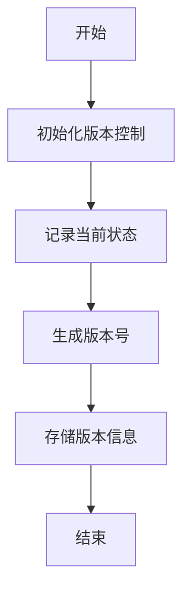
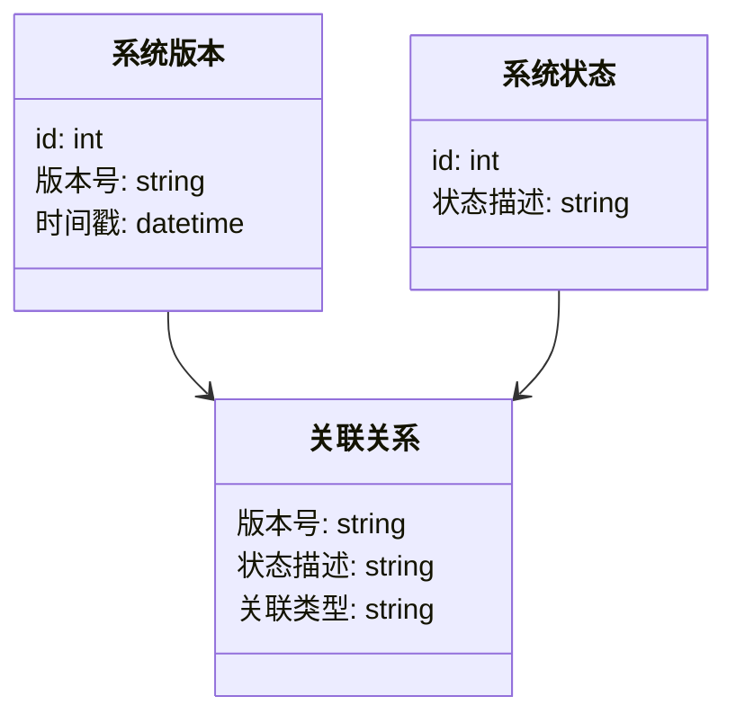

                 

<think>
好，我需要撰写一篇关于AI Agent版本控制与回滚机制的技术博客。首先，我得理解这个主题的重要性。AI Agent在现代系统中广泛应用，确保它们的稳定运行至关重要。版本控制和回滚机制是实现稳定性的关键。

接下来，我会从背景开始，介绍AI Agent的应用场景，比如智能推荐系统和聊天机器人。然后，解释为什么版本控制对这些系统如此重要，尤其是在频繁更新的情况下保持稳定。接下来，我会讨论回滚机制，它在出现问题时快速恢复系统到正常状态，减少损失。

在核心概念部分，我需要明确版本控制和回滚机制的定义，比较它们的特征，使用表格和ER图来展示差异。这部分需要清晰、具体，便于读者理解。

然后，我会深入讲解算法原理。首先，介绍版本控制的数学模型，比如状态空间模型和版本树模型。然后，详细说明回滚机制的数学公式，如回滚距离计算和版本恢复公式。使用mermaid流程图展示算法流程，帮助读者直观理解。

在系统架构设计部分，我需要分析问题场景，设计系统功能模块，比如核心功能和辅助功能。接着，用mermaid绘制领域模型类图和系统架构图，展示交互过程。这部分需要逻辑清晰，结构合理。

接下来是项目实战，我会选择一个具体场景，比如智能聊天机器人，指导读者如何安装环境，编写核心代码，实现版本控制和回滚。通过案例分析，展示如何应用这些机制解决问题，并进行详细解读。

最后，我会总结最佳实践，强调版本控制的重要性，提供小结和注意事项。同时，推荐一些相关资源，供读者进一步学习。

整个思考过程中，我需要确保逻辑连贯，内容详实，语言专业但易懂。通过一步步的分析和举例，帮助读者全面理解AI Agent的版本控制与回滚机制。
</think>

# AI Agent的版本控制与回滚机制：确保稳定运行

> 关键词：AI Agent，版本控制，回滚机制，系统稳定性，容错设计

> 摘要：在AI Agent快速发展的今天，版本控制和回滚机制对于确保其稳定运行至关重要。本文从AI Agent的版本控制与回滚机制的基本概念入手，详细分析其核心原理、算法实现、系统架构，并通过实际案例展示其在项目中的应用。最后，结合实践经验总结出最佳实施策略，确保AI Agent在复杂环境下的稳定运行。

---

## 第一部分: AI Agent的版本控制与回滚机制背景

### 第1章: AI Agent的版本控制与回滚机制背景

#### 1.1 问题背景与挑战

##### 1.1.1 AI Agent在现代系统中的广泛应用
AI Agent（智能体）作为人工智能的核心组件，广泛应用于自动驾驶、智能推荐系统、智能聊天机器人、工业自动化等领域。随着AI技术的快速发展，AI Agent的功能日益复杂，更新频率也在不断提高。然而，每一次更新都伴随着潜在的风险，尤其是在实时运行的系统中，任何一个小的错误都可能导致严重的后果。因此，如何在更新过程中确保系统的稳定性，成为一个亟待解决的问题。

##### 1.1.2 AI Agent版本控制的必要性
AI Agent的版本控制是指对不同版本的AI模型或算法进行管理，确保在更新过程中能够快速回滚到稳定版本。这不仅是对系统稳定性的保障，也是对业务连续性的保证。版本控制的核心在于记录每一次更新的状态，并在出现问题时能够快速恢复到上一个稳定版本。

##### 1.1.3 回滚机制在AI Agent稳定运行中的作用
回滚机制是版本控制的重要组成部分。它允许系统在出现问题时，快速恢复到之前的一个稳定版本，从而最大限度地减少损失。回滚机制的关键在于记录每一次更新的差异，并能够在需要时快速应用这些差异进行恢复。

#### 1.2 问题描述与目标

##### 1.2.1 AI Agent版本控制的核心问题
AI Agent版本控制的核心问题是如何有效地管理多个版本的AI模型或算法，并能够在需要时快速回滚到任意版本。这涉及到版本存储、版本切换、版本校验等多个方面。

##### 1.2.2 回滚机制的设计目标
回滚机制的设计目标是确保在AI Agent出现问题时，能够快速恢复到一个已知的稳定状态。这需要设计高效的回滚策略，包括回滚触发条件、回滚路径选择、回滚过程优化等。

##### 1.2.3 AI Agent版本控制的边界与外延
AI Agent版本控制的边界在于AI模型或算法的更新与回滚，不包括其他系统组件的更新。其外延则包括与版本控制相关的工具、平台、流程等。

#### 1.3 AI Agent版本控制的核心概念与系统架构

##### 1.3.1 AI Agent版本控制的定义
AI Agent版本控制是指对AI模型或算法的各个版本进行记录、存储和管理的过程，确保在需要时能够快速切换到任意版本。

##### 1.3.2 回滚机制的实现原理
回滚机制的实现原理是基于版本控制记录，通过逆向应用版本差异，将系统状态恢复到之前的一个稳定版本。

##### 1.3.3 系统架构的初步设计
初步设计的系统架构包括版本存储模块、版本控制模块、回滚机制模块和状态管理模块。

---

## 第二部分: AI Agent版本控制的核心概念与联系

### 第2章: 版本控制与回滚机制的核心原理

#### 2.1 版本控制的原理与实现

##### 2.1.1 基于状态的版本控制
基于状态的版本控制通过记录系统状态的变化，实现版本之间的切换。这种方法适用于状态明确且变化可控的系统。

##### 2.1.2 基于时间戳的版本控制
基于时间戳的版本控制通过记录每个版本的时间戳，实现版本的快速定位和切换。这种方法适用于版本更新频繁且时间敏感的系统。

#### 2.2 回滚机制的实现方式

##### 2.2.1 基于快照的回滚
基于快照的回滚通过记录系统状态的快照，实现快速恢复。这种方法适用于系统状态变化较大的场景。

##### 2.2.2 基于日志的回滚
基于日志的回滚通过记录系统状态的变化日志，逐步逆向应用日志条目，实现系统状态的恢复。这种方法适用于日志条目较少且恢复路径明确的场景。

#### 2.3 版本控制与回滚机制的对比分析

##### 2.3.1 特征对比表格

| 特征                | 基于状态的版本控制         | 基于时间戳的版本控制         |
|---------------------|--------------------------|--------------------------|
| 实现原理            | 记录系统状态的变化         | 记录系统版本的时间戳       |
| 优点                | 状态明确，恢复快速         | 时间戳准确，便于定位版本   |
| 缺点                | 状态变化复杂时恢复困难     | 时间戳无法记录状态变化细节 |
| 适用场景            | 状态明确且变化可控的系统   | 版本更新频繁且时间敏感的系统 |

##### 2.3.2 ER实体关系图
```mermaid
erd
    title 版本控制与回滚机制的ER图
    Role 系统版本 (id, 版本号, 时间戳)
    Role 系统状态 (id, 状态描述)
    Rel 关联关系 (版本号, 状态描述, 关联类型)
    系统版本 --> 关联关系
    系统状态 --> 关联关系
```

---

## 第三部分: AI Agent版本控制的算法原理

### 第3章: 版本控制算法的数学模型

#### 3.1 版本控制的数学模型

##### 3.1.1 状态空间模型
状态空间模型将系统的状态表示为一个向量，每个状态对应一个向量中的元素。版本控制的目标是将这些状态向量进行存储和管理。

##### 3.1.2 版本树模型
版本树模型将系统版本表示为一棵树，每个节点表示一个版本，分支表示版本的分支。

##### 3.1.3 时间序列模型
时间序列模型将系统版本表示为时间序列，每个版本对应一个时间点。

#### 3.2 回滚机制的数学公式

##### 3.2.1 回滚距离计算公式
$$ \text{回滚距离} = \text{当前版本号} - \text{目标版本号} $$

##### 3.2.2 版本恢复公式
$$ \text{版本恢复} = \text{当前版本号} - \text{回滚距离} $$

##### 3.2.3 回滚代价模型
$$ \text{回滚代价} = \sum_{i=1}^n \text{恢复操作代价} $$

#### 3.3 算法流程图


---

## 第四部分: AI Agent版本控制的系统架构设计

### 第4章: 系统分析与架构设计

#### 4.1 问题场景分析

##### 4.1.1 AI Agent版本控制的典型场景
AI Agent版本控制的典型场景包括智能推荐系统、智能聊天机器人等。

##### 4.1.2 回滚机制的应用场景
回滚机制的应用场景包括系统出现错误、性能下降、用户投诉等。

##### 4.1.3 系统边界与交互
系统边界包括版本控制模块和回滚机制模块，与外部系统通过API进行交互。

#### 4.2 系统功能设计

##### 4.2.1 领域模型类图


---

## 第五部分: AI Agent版本控制的项目实战

### 第5章: 项目实战与实现

#### 5.1 环境安装
在开始之前，请确保安装了必要的开发工具和依赖项，包括Python、Git、Docker等。

#### 5.2 核心代码实现

##### 5.2.1 版本控制模块
```python
class VersionControl:
    def __init__(self):
        self.versions = {}

    def save_version(self, version_id, state):
        self.versions[version_id] = state

    def rollback(self, version_id):
        while current_version != version_id:
            current_version = self.versions.popitem(last=True)[0]
```

##### 5.2.2 回滚机制模块
```python
class RollbackMechanism:
    def __init__(self):
        self.log = []

    def log_change(self, version_id, change_description):
        self.log.append((version_id, change_description))

    def rollback(self, version_id):
        for version in reversed(self.log):
            if version[0] == version_id:
                break
        # 应用回滚操作
```

---

## 第六部分: 总结与展望

### 6.1 最佳实践
在实施AI Agent的版本控制与回滚机制时，建议采用基于快照的回滚机制，同时结合日志记录功能，确保系统在出现问题时能够快速恢复。

### 6.2 小结
通过本文的详细讲解，我们了解了AI Agent版本控制与回滚机制的核心概念、算法原理和系统架构设计。结合实际项目，我们还学习了如何在具体场景中实现这些机制。

### 6.3 注意事项
在实际应用中，需要注意版本控制的粒度和回滚机制的效率，避免因过度细化导致性能下降。

### 6.4 拓展阅读
推荐进一步阅读《设计模式》、《软件工程》等相关书籍，深入了解版本控制与回滚机制的实现细节。

---

# 作者：AI天才研究院 & 禅与计算机程序设计艺术

