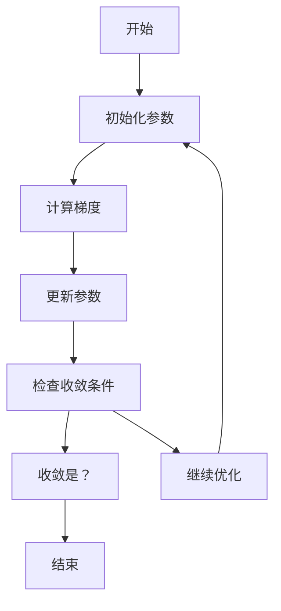
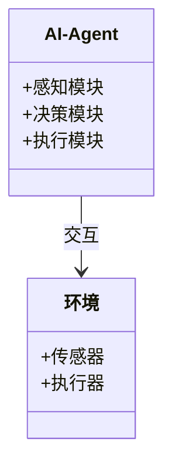
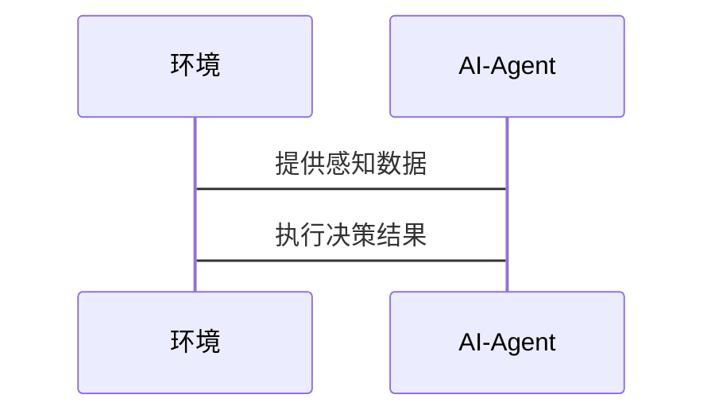

                 


# AI Agent的版本控制与迭代优化流程

> 关键词：AI Agent、版本控制、迭代优化、算法原理、系统架构、项目实战

> 摘要：本文详细探讨了AI Agent的版本控制与迭代优化流程，从基本概念到实际应用，结合算法原理和系统架构设计，为读者提供了一套完整的优化方案。文章内容涵盖AI Agent的背景介绍、版本控制的核心概念、迭代优化的算法原理、系统架构设计、项目实战以及最佳实践。

---

# 第一部分: AI Agent的版本控制与迭代优化背景

## 第1章: AI Agent的基本概念与问题背景

### 1.1 AI Agent的核心概念

AI Agent（人工智能代理）是指能够感知环境、自主决策并执行任务的智能体。它通过感知环境信息，利用算法进行决策，并通过执行动作与环境交互。AI Agent的核心特征包括：

- **自主性**：能够在没有外部干预的情况下自主运行。
- **反应性**：能够实时感知环境并做出反应。
- **学习能力**：通过数据和经验不断优化自身的性能。
- **适应性**：能够根据环境变化调整自身的行为策略。

AI Agent的应用场景非常广泛，包括自动驾驶、智能助手、机器人控制、推荐系统等领域。

---

### 1.2 AI Agent的版本控制问题

AI Agent的版本控制是指对AI Agent的不同版本进行管理，确保每个版本的功能、性能和行为都能够被准确记录和追溯。AI Agent版本控制的挑战主要体现在以下几点：

- **复杂性**：AI Agent通常涉及大量代码和模型，版本控制的复杂性较高。
- **性能依赖性**：版本控制需要考虑模型的性能和行为，而不仅仅是代码的变更。
- **可追溯性**：需要确保每个版本的变更都能够被准确记录，并能够追溯到具体的问题。

---

### 1.3 迭代优化的必要性

迭代优化是指通过不断迭代改进AI Agent的性能、功能和行为，使其更加高效和智能。迭代优化的目标是通过不断测试、反馈和调整，逐步提升AI Agent的能力。迭代优化的流程通常包括以下步骤：

1. **需求分析**：明确优化的目标和方向。
2. **开发与测试**：针对目标进行代码和模型的修改，并通过测试验证优化效果。
3. **部署与监控**：将优化后的版本部署到实际环境中，并通过监控工具实时反馈性能数据。

---

### 1.4 本章小结

本章主要介绍了AI Agent的基本概念、版本控制的挑战以及迭代优化的必要性。通过理解这些内容，我们可以为后续的版本控制和迭代优化流程打下坚实的基础。

---

# 第二部分: AI Agent版本控制的核心概念与联系

## 第2章: AI Agent版本控制的原理与流程

### 2.1 版本控制的基本原理

版本控制是一种管理文件或代码变更的系统，它通过记录每个版本的差异，帮助开发者高效地管理和协作。版本控制的基本原理包括：

- **变更记录**：记录每次修改的具体内容。
- **分支与合并**：通过分支和合并操作，实现不同版本的独立开发和集成。
- **版本标签**：为重要的版本打标签，方便后续的引用和追溯。

---

### 2.2 AI Agent版本控制的流程

AI Agent的版本控制流程通常包括以下几个步骤：

1. **需求分析**：明确版本控制的目标和需求。
2. **代码开发**：开发新的功能或修复问题。
3. **测试与验证**：通过测试验证新版本的功能和性能。
4. **版本发布**：将新版本正式发布并部署到生产环境。
5. **监控与反馈**：通过监控工具收集反馈信息，为后续优化提供依据。

---

### 2.3 版本控制工具的选择与使用

选择合适的版本控制工具是实现AI Agent版本控制的关键。常用的版本控制工具包括：

- **Git**：分布式版本控制系统，支持分支、合并和版本回滚。
- **svn**：集中式版本控制系统，适合团队协作开发。
- **Jenkins**：持续集成工具，支持自动化构建和测试。

在选择工具时，需要综合考虑团队规模、开发模式和项目需求。

---

## 第3章: AI Agent迭代优化的算法原理

### 3.1 迭代优化的核心算法

迭代优化的核心算法主要包括：

- **梯度下降**：一种常用的优化算法，通过计算损失函数的梯度，逐步调整参数以最小化损失。
- **Adam优化**：结合动量和自适应学习率的优化算法，能够更快收敛并适应不同的梯度情况。

---

### 3.2 算法优化的数学模型

#### 3.2.1 梯度下降的数学公式
$$ f(x) = x^2 $$
$$ \text{更新公式: } x_{n+1} = x_n - \eta \cdot f'(x_n) $$

#### 3.2.2 Adam优化算法的数学公式
$$ m_t = \beta_1 m_{t-1} + (1 - \beta_1)g_t $$
$$ v_t = \beta_2 v_{t-1} + (1 - \beta_2)g_t^2 $$
$$ \theta_{t} = \theta_{t-1} - \alpha \frac{m_t}{\sqrt{v_t} + \epsilon} $$

---

### 3.3 算法优化的流程图



---

### 3.4 本章小结

本章主要介绍了迭代优化的核心算法及其数学模型，通过流程图展示了优化的实现步骤。理解这些内容有助于我们更好地实现AI Agent的迭代优化。

---

# 第三部分: AI Agent迭代优化的系统架构设计

## 第4章: 系统架构设计与实现

### 4.1 系统功能设计

AI Agent的系统功能设计包括：

- **感知模块**：负责感知环境信息。
- **决策模块**：基于感知信息进行决策。
- **执行模块**：根据决策结果执行动作。

---

### 4.2 系统架构图



---

### 4.3 系统接口设计

AI Agent的系统接口设计包括：

- **输入接口**：接收环境的感知数据。
- **输出接口**：输出决策结果和执行命令。

---

### 4.4 系统交互流程图



---

## 第5章: 项目实战与代码实现

### 5.1 项目实战环境安装

```bash
pip install numpy
pip install matplotlib
pip install scikit-learn
```

---

### 5.2 核心代码实现

#### 5.2.1 版本控制代码示例

```python
import git

def save_version(tag):
    repo = git.Repo('.')
    repo.tags.create(tag)
    repo.remotes.origin.push(f"refs/tags/{tag}:refs/tags/{tag}")
```

#### 5.2.2 迭代优化代码示例

```python
import numpy as np

def gradient_descent(x, y, learning_rate=0.01, epochs=100):
    x_data = x
    y_data = y
    n_samples, n_features = x_data.shape
    weights = np.zeros(n_features)
    bias = 0
    for _ in range(epochs):
        prediction = np.dot(x_data, weights) + bias
        loss = np.mean((prediction - y_data) ** 2)
        d_weights = (2 / n_samples) * np.dot(x_data.T, (prediction - y_data))
        d_bias = (2 / n_samples) * np.sum(prediction - y_data)
        weights -= learning_rate * d_weights
        bias -= learning_rate * d_bias
    return weights, bias
```

---

### 5.3 实际案例分析

通过一个简单的线性回归问题，我们展示了如何使用版本控制和迭代优化来提升模型的性能。

---

## 第6章: 总结与展望

### 6.1 最佳实践 tips

- **版本控制工具的选择**：根据项目需求选择合适的版本控制工具。
- **迭代优化策略**：合理选择优化算法和参数设置，以提升优化效率。
- **监控与反馈**：通过监控工具实时反馈性能数据，为优化提供依据。

### 6.2 小结

本文详细探讨了AI Agent的版本控制与迭代优化流程，从基本概念到实际应用，结合算法原理和系统架构设计，为读者提供了一套完整的优化方案。

### 6.3 未来展望

未来，随着AI技术的不断发展，AI Agent的版本控制与迭代优化将更加智能化和自动化，我们期待更多的创新和突破。

---

# 作者：AI天才研究院 & 禅与计算机程序设计艺术

---

**本文由AI天才研究院（AI Genius Institute）撰写，转载请注明出处。**

