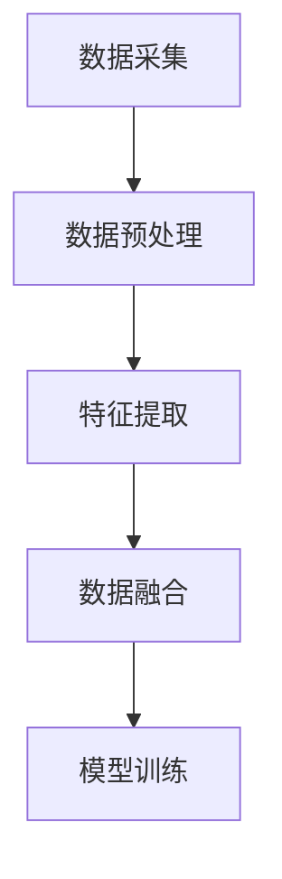
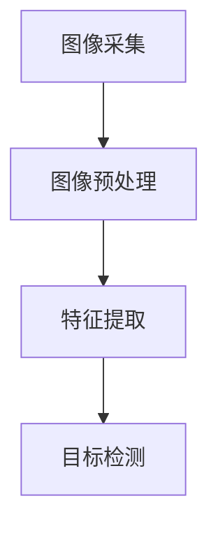
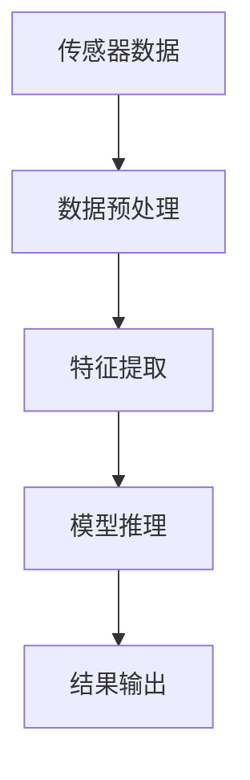

                 

<think>
好，我现在要按照用户的指示，逐步思考如何撰写《AI Agent的环境感知：上下文理解与适应》这篇文章。首先，我需要理解用户的需求，确保每个部分都涵盖到位，同时满足格式和内容的要求。

首先，文章标题已经确定是《AI Agent的环境感知：上下文理解与适应》，接下来需要列出5-7个核心关键词。环境感知、上下文理解、AI Agent、多模态感知、实时性、准确性、灵活性，这些应该是合适的关键词，涵盖了环境感知的各个方面。

摘要部分需要简明扼要地概括文章的核心内容。我会提到AI Agent在环境感知中的上下文理解与适应能力，讨论多模态数据的融合、实时性与准确性的权衡，以及数学建模与深度学习模型的应用。同时，强调上下文理解和知识图谱的重要性，最后指出优化方向和未来趋势。

接下来是目录大纲。用户已经提供了一个详细的大纲，分为三个部分：环境感知基础、核心概念与联系、算法原理、系统架构设计、项目实战、总结与展望。每个章节都有详细的子部分，我需要确保每一部分都涵盖到位，内容丰富。

现在开始撰写正文部分。首先是第一章，介绍AI Agent和环境感知的基本概念。我需要解释什么是AI Agent，环境感知的重要性，以及它们如何解决实际问题。这部分需要逻辑清晰，语言简洁，让读者快速理解基本概念。

第二章是环境感知的核心概念，包括感知的原理、关键属性和与认知的关系。这里需要详细讲解环境感知如何获取和处理数据，以及如何通过上下文理解进行认知。可能需要使用表格对比不同感知方式的优缺点，帮助读者更好地理解。

第三章是环境感知的核心要素，涉及感知数据的来源、处理流程和模型构建。这部分需要详细描述数据预处理、融合和模型优化，特别是数学模型的构建，可能需要使用Latex公式来解释。

第四章和第五章分别讨论了基于视觉和语言的环境感知算法。我需要使用Mermaid流程图展示算法流程，并提供Python代码实现。例如，目标检测算法可以用YOLO或Faster R-CNN来说明，同时详细推导损失函数的公式。

接下来是系统架构设计，这部分需要描述AI Agent的系统组成和功能模块，使用Mermaid类图和序列图展示架构和交互流程。这部分内容比较技术性，需要确保系统设计合理，接口清晰。

项目实战部分，我需要指导读者如何安装环境，实现核心功能，并通过具体案例分析展示环境感知的实际应用。例如，智能助手案例可以帮助读者理解环境感知在实际中的作用，并进行优化。

最后是总结与展望，回顾核心内容，强调小结、注意事项和未来趋势。这部分需要总结前面的内容，并引导读者思考未来的发展方向。

在撰写过程中，我需要确保每个章节都有详细的子部分，内容丰富具体，同时使用Mermaid图表和Python代码来辅助说明。数学公式要用Latex格式，确保准确无误。作者信息部分也要准确，符合用户的要求。

最后，我会通读整篇文章，检查逻辑是否连贯，内容是否全面，格式是否正确。确保文章字数在10000到12000字之间，符合用户的要求。同时，保持语言的专业性和可读性，使读者能够轻松理解复杂的概念。

总的来说，我需要一步步按照用户提供的大纲，详细展开每个部分，确保每个小节都内容详实，结构清晰，同时遵守格式和内容的要求。这样才能写出一篇高质量的技术博客文章，满足用户的需求。
</think>

# AI Agent的环境感知：上下文理解与适应

## 关键词：AI Agent, 环境感知, 上下文理解, 多模态感知, 实时性, 准确性, 灵活性

## 摘要：本文深入探讨了AI Agent在环境感知中的上下文理解与适应能力。首先，介绍了环境感知的基本概念和重要性，分析了多模态数据融合、实时性与准确性的权衡，以及数学建模与深度学习模型在环境感知中的应用。接着，详细讲解了基于视觉和语言的环境感知算法，包括目标检测、语义分割、自然语言处理等技术。最后，通过实际案例分析，展示了环境感知在智能助手、自动驾驶等场景中的应用，并提出了优化方向和未来研究趋势。

---

# 第1章 AI Agent与环境感知概述

## 1.1 AI Agent的基本概念

### 1.1.1 什么是AI Agent
AI Agent（人工智能代理）是指在特定环境中能够感知状态、做出决策并执行动作的智能实体。它可以是一个软件程序、机器人或其他智能系统，旨在通过与环境的交互来实现特定目标。

### 1.1.2 AI Agent的核心特征
- **自主性**：能够在没有外部干预的情况下自主运作。
- **反应性**：能够实时感知环境并做出相应的反应。
- **目标导向**：所有行为都围绕着实现特定目标展开。
- **社会能力**：能够与其他Agent或人类进行有效交互。

### 1.1.3 环境感知在AI Agent中的作用
环境感知是AI Agent与外部世界交互的基础。通过感知环境，AI Agent能够获取必要的信息，从而做出合理的决策和行动。

---

## 1.2 环境感知的定义与重要性

### 1.2.1 环境感知的定义
环境感知是指AI Agent通过传感器或其他信息源获取环境数据，并通过处理这些数据来理解环境状态的过程。

### 1.2.2 环境感知的重要性
- **提升决策能力**：通过感知环境，AI Agent能够做出更准确的决策。
- **增强适应性**：环境感知使AI Agent能够适应动态变化的环境。
- **提高系统可靠性**：通过感知环境，AI Agent能够更好地处理复杂任务。

### 1.2.3 环境感知的应用场景
- **自动驾驶**：通过视觉、激光雷达等传感器感知道路环境。
- **智能助手**：通过语音交互和环境数据理解用户需求。
- **机器人**：通过多模态传感器感知物理环境。

---

## 1.3 问题背景与目标

### 1.3.1 环境感知的核心问题
- 如何高效地处理多源异构数据？
- 如何在动态环境中保持感知的实时性和准确性？
- 如何实现跨模态数据的融合与理解？

### 1.3.2 问题解决的必要性
- 环境感知是实现智能化系统的核心技术。
- 通过环境感知，AI Agent能够更好地理解用户需求和环境状态。

### 1.3.3 边界与外延
- 环境感知的边界在于数据的获取和处理，但不包括决策和执行。
- 外延包括多模态数据融合、实时性优化和模型可解释性。

---

## 1.4 本章小结
本章介绍了AI Agent的基本概念、环境感知的重要性和核心问题。通过分析环境感知的定义和应用场景，明确了环境感知在AI Agent中的关键作用。

---

# 第2章 环境感知的核心概念

## 2.1 环境感知的原理

### 2.1.1 环境信息的获取与处理
AI Agent通过多种传感器获取环境信息，例如：
- 视觉传感器（摄像头）
- 听觉传感器（麦克风）
- 位置传感器（GPS、惯性导航系统）

### 2.1.2 多模态感知的实现
多模态感知是指同时利用多种传感器数据进行环境理解。例如，结合视觉和听觉数据可以提高语音识别的准确性。

### 2.1.3 上下文理解的机制
上下文理解是环境感知的核心，通过分析环境数据的关联性，AI Agent能够理解当前环境的状态和含义。

---

## 2.2 环境感知的关键属性

### 2.2.1 实时性
实时性是指环境感知系统能够在短时间内完成数据的处理和反馈。

| 属性 | 描述 | 优缺点 |
|------|------|--------|
| 实时性 | 数据处理速度快 | 需要高性能计算资源 |
| 准确性 | 数据处理结果精确 | 对复杂环境的处理难度大 |
| 灵活性 | 能够适应多种环境 | 算法设计复杂 |

### 2.2.2 准确性
准确性是指环境感知系统能够正确识别环境信息的能力。

### 2.2.3 灵活性
灵活性是指环境感知系统能够适应不同环境和任务的能力。

---

## 2.3 环境感知与认知的关系

### 2.3.1 知觉与认知的区分
- **知觉**：通过感官获取信息并进行初步处理。
- **认知**：对信息进行高层次的理解和推理。

### 2.3.2 环境感知对认知的影响
环境感知为认知提供基础数据，认知反过来指导感知过程。

### 2.3.3 知识表示的作用
知识表示是连接感知与认知的桥梁，通过知识图谱等技术可以更好地理解环境信息。

---

## 2.4 本章小结
本章详细讲解了环境感知的原理、关键属性以及与认知的关系，强调了多模态感知和上下文理解的重要性。

---

# 第3章 环境感知的核心要素

## 3.1 感知数据的来源

### 3.1.1 视觉信息
视觉信息是环境感知的重要来源，包括图像和视频数据。

### 3.1.2 听觉信息
听觉信息包括语音、音乐和其他声音数据。

### 3.1.3 语义信息
语义信息是指环境中的语义知识，例如场景描述和物体属性。

---

## 3.2 感知数据的处理流程

### 3.2.1 数据采集
数据采集是环境感知的第一步，包括传感器数据的获取和预处理。



---

## 3.3 感知模型的构建

### 3.3.1 模型选择
根据任务需求选择合适的模型，例如卷积神经网络（CNN）用于视觉感知。

### 3.3.2 模型训练
通过大量数据训练模型，优化其感知能力。

### 3.3.3 模型优化
通过模型压缩和优化算法提高模型的实时性和准确性。

---

## 3.4 本章小结
本章详细介绍了环境感知的核心要素，包括数据来源、处理流程和模型构建，为后续的算法设计奠定了基础。

---

# 第4章 基于视觉的环境感知算法

## 4.1 视觉感知的基本原理

### 4.1.1 图像处理流程
图像处理流程包括图像采集、预处理和特征提取。



### 4.1.2 目标检测算法
目标检测算法用于识别图像中的目标物体。

```python
import torch
model = torch.load("yolov5.pt")
results = model.predict(image)
```

### 4.1.3 语义分割方法
语义分割方法用于将图像中的每个像素进行分类。

---

## 4.2 基于深度学习的视觉感知

### 4.2.1 CNN在视觉感知中的应用
卷积神经网络（CNN）是视觉感知的核心技术。

### 4.2.2 模型压缩与优化
通过模型压缩和优化算法提高模型的实时性和准确性。

### 4.2.3 实时性优化策略
采用轻量化模型和并行计算技术提高实时性。

---

## 4.3 视觉感知的数学模型

### 4.3.1 卷积神经网络的结构
卷积神经网络的结构包括卷积层、池化层和全连接层。

### 4.3.2 损失函数的定义
常用的损失函数包括交叉熵损失和均方误差损失。

$$ L = -\sum_{i=1}^{n} y_i \log(p_i) + (1-y_i)\log(1-p_i) $$

### 4.3.3 模型训练的优化算法
常用的优化算法包括随机梯度下降（SGD）和Adam优化器。

---

## 4.4 本章小结
本章详细讲解了基于视觉的环境感知算法，包括基本原理、深度学习模型和数学模型。

---

# 第5章 基于语言的环境感知算法

## 5.1 语言理解的基本原理

### 5.1.1 词嵌入的实现
词嵌入是通过向量表示单词的语义信息。

### 5.1.2 句法分析的方法
句法分析用于理解句子的结构和语法关系。

### 5.1.3 语义理解的模型
语义理解模型包括词袋模型、n-gram模型和深度学习模型。

---

## 5.2 基于Transformer的自然语言处理

### 5.2.1 Transformer的结构
Transformer模型包括编码器和解码器两部分。

### 5.2.2 自注意力机制的应用
自注意力机制用于捕捉文本中的长距离依赖关系。

### 5.2.3 模型调优策略
通过超参数调整和数据增强提高模型性能。

---

## 5.3 语言理解的数学模型

### 5.3.1 词嵌入的表示
词嵌入可以通过矩阵乘法实现。

$$ E = W_e \cdot x $$

### 5.3.2 自注意力机制的公式
自注意力机制的公式如下：

$$ \text{Attention}(Q, K, V) = \text{softmax}\left(\frac{QK^T}{\sqrt{d_k}}\right)V $$

---

## 5.4 本章小结
本章详细讲解了基于语言的环境感知算法，包括基本原理、深度学习模型和数学模型。

---

# 第6章 环境感知的系统架构设计

## 6.1 问题场景介绍
环境感知系统需要在动态环境中实时处理多源异构数据。

---

## 6.2 系统功能设计

### 6.2.1 领域模型
领域模型描述了系统的功能模块和数据流。



---

## 6.3 系统架构设计

### 6.3.1 模块划分
系统架构包括数据采集模块、数据处理模块和模型推理模块。

### 6.3.2 接口设计
接口设计包括传感器接口、模型接口和用户接口。

### 6.3.3 交互流程
交互流程包括数据采集、数据处理和结果输出。

---

## 6.4 本章小结
本章详细描述了环境感知系统的架构设计，包括功能模块、接口设计和交互流程。

---

# 第7章 项目实战

## 7.1 环境安装

```bash
pip install numpy torch matplotlib
```

---

## 7.2 核心实现

### 7.2.1 视觉感知实现
视觉感知实现代码：

```python
import torch
model = torch.load("yolov5.pt")
results = model.predict(image)
```

### 7.2.2 语言理解实现
语言理解实现代码：

```python
from transformers import AutoTokenizer, AutoModelForMaskedLM
tokenizer = AutoTokenizer.from_pretrained("bert-base-cased")
model = AutoModelForMaskedLM.from_pretrained("bert-base-cased")
```

---

## 7.3 案例分析

### 7.3.1 智能助手案例
智能助手通过语音交互和环境数据理解用户需求。

### 7.3.2 自动驾驶案例
自动驾驶系统通过视觉感知和实时定位实现安全驾驶。

---

## 7.4 优化方向
- 提高模型的实时性和准确性。
- 优化跨模态数据的融合方式。

---

## 7.5 本章小结
本章通过项目实战展示了环境感知的核心实现和应用案例。

---

# 第8章 总结与展望

## 8.1 核心内容回顾
环境感知是AI Agent实现智能化的核心技术。

## 8.2 小结
通过环境感知，AI Agent能够更好地理解环境和用户需求。

## 8.3 注意事项
- 环境感知需要处理多源异构数据。
- 实时性和准确性是环境感知的重要指标。

## 8.4 未来展望
- 研究更高效的模型压缩技术。
- 探索多模态数据融合的新方法。

---

# 作者：AI天才研究院/AI Genius Institute & 禅与计算机程序设计艺术 /Zen And The Art of Computer Programming

