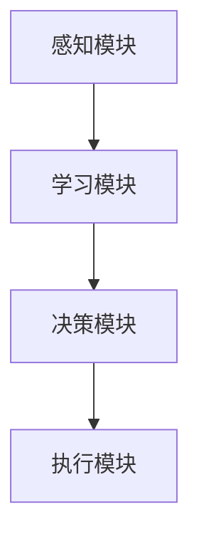
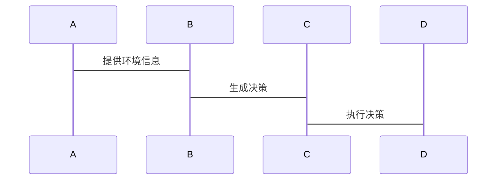

                 


# AI Agent的生物启发式学习算法实现

**关键词**：AI Agent, 生物启发式学习, 机器学习, 算法实现, 系统设计

**摘要**：本文详细探讨了AI Agent在生物启发式学习算法中的实现，结合了数学模型、算法流程图和实际项目案例，深入剖析了AI Agent的学习机制、算法原理和系统架构设计。

---

## 第1章 AI Agent与生物启发式学习算法概述

### 1.1 AI Agent的基本概念

#### 1.1.1 AI Agent的定义与特点
AI Agent（人工智能代理）是一种能够感知环境、自主决策并采取行动的智能实体。它具备以下特点：
- **自主性**：能够在没有外部干预的情况下自主运作。
- **反应性**：能够实时感知环境并做出反应。
- **学习能力**：通过学习算法不断优化自身行为。

#### 1.1.2 生物启发式学习算法的定义
生物启发式学习算法是从自然界中的生物行为中获得灵感，模拟生物的学习机制来解决复杂问题的算法。常见的生物启发式算法包括遗传算法、模拟退火算法、蚁群算法等。

#### 1.1.3 AI Agent与生物启发式学习算法的结合
通过将生物启发式学习算法应用于AI Agent，可以增强其学习能力和适应性，使其能够在动态环境中更好地完成任务。

### 1.2 生物启发式学习算法的背景与应用

#### 1.2.1 生物启发式算法的起源
生物启发式算法的起源可以追溯到20世纪50年代，受达尔文进化论的启发，遗传算法（GA）逐渐发展起来。

#### 1.2.2 生物启发式算法在AI Agent中的应用领域
- 智能优化问题
- 组合优化问题
- 分布式计算
- 多智能体协作

#### 1.2.3 生物启发式算法的优势与挑战
- 优势：全局搜索能力强，能够处理复杂问题。
- 挑战：计算效率较低，参数敏感。

### 1.3 本章小结

---

## 第2章 生物启发式学习算法的原理与数学模型

### 2.1 常见生物启发式算法概述

#### 2.1.1 遗传算法（GA）
遗传算法是一种模拟自然选择和遗传机制的优化算法，包含选择、交叉和变异三个主要操作。

#### 2.1.2 模拟退火算法（SA）
模拟退火算法是一种基于物理退火过程的全局优化算法，通过逐步降低“温度”来减少局部最优的影响。

#### 2.1.3 蚁群算法（ACO）
蚁群算法模拟蚂蚁觅食行为，通过信息素的积累来寻找最优路径。

#### 2.1.4 其他生物启发式算法
还包括粒子群优化（PSO）、蜂群算法（ABC）等。

### 2.2 生物启发式算法的数学模型

#### 2.2.1 遗传算法的数学模型
$$
\text{适应度函数: } f(x) = \sum x_i
$$

#### 2.2.2 模拟退火算法的数学模型
$$
\text{能量函数: } E(x) = \sum (x_i - \mu)^2
$$

#### 2.2.3 蚁群算法的数学模型
$$
\text{信息素更新规则: } \tau_{ij} = \tau_{ij} + \Delta \tau
$$

### 2.3 生物启发式算法的优缺点对比

| 算法名称 | 优点 | 缺点 |
|----------|------|------|
| 遗传算法 | 全局搜索能力强 | 易陷入局部最优 |
| 模拟退火算法 | 能够跳出局部最优 | 计算效率较低 |
| 蚁群算法 | 适合组合优化问题 | 参数敏感 |

### 2.4 本章小结

---

## 第3章 AI Agent的生物启发式学习模型

### 3.1 AI Agent的学习机制

#### 3.1.1 感知机制
AI Agent通过传感器或数据输入接口感知环境信息。

#### 3.1.2 决策机制
AI Agent基于感知信息，通过学习算法做出决策。

#### 3.1.3 学习机制
AI Agent通过生物启发式算法不断优化其决策模型。

### 3.2 生物启发式学习在AI Agent中的应用

---

## 第4章 AI Agent生物启发式学习系统的架构设计

### 4.1 系统架构设计

#### 4.1.1 系统功能模块
- 感知模块
- 学习模块
- 决策模块
- 执行模块

#### 4.1.2 系统架构图


### 4.2 交互流程设计

#### 4.2.1 交互流程图


### 4.3 本章小结

---

## 第5章 项目实战：基于遗传算法的AI Agent实现

### 5.1 项目背景与目标
通过实现一个基于遗传算法的AI Agent，解决动态环境中的优化问题。

### 5.2 环境配置与安装
安装Python和相关库（如NumPy、Matplotlib）。

### 5.3 核心代码实现

#### 5.3.1 遗传算法实现
```python
def fitness(x):
    return sum(x)

def crossover(parent1, parent2):
    child = []
    for i in range(len(parent1)):
        if i % 2 == 0:
            child.append(parent1[i])
        else:
            child.append(parent2[i])
    return child

def mutate(individual):
    import random
    pos = random.randint(0, len(individual)-1)
    individual[pos] += 1
    return individual
```

#### 5.3.2 系统功能展示
展示AI Agent在动态环境中的优化过程。

### 5.4 案例分析与优化
分析遗传算法在AI Agent中的应用效果，并进行优化。

### 5.5 本章小结

---

## 第6章 总结与展望

### 6.1 本章总结
总结本文的主要内容，强调生物启发式学习算法在AI Agent中的重要性。

### 6.2 未来展望
探讨生物启发式学习算法在AI Agent中的未来发展方向，如多模态学习、强化学习等。

### 6.3 最佳实践 Tips
- 合理选择算法参数
- 定期优化算法结构
- 结合具体场景进行调整

### 6.4 本章小结

---

## 参考文献

---

## 作者

**作者：AI天才研究院/AI Genius Institute & 禅与计算机程序设计艺术 /Zen And The Art of Computer Programming**

