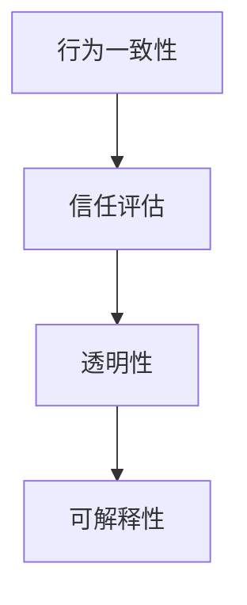
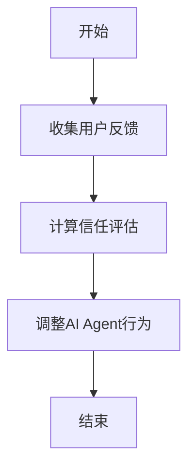
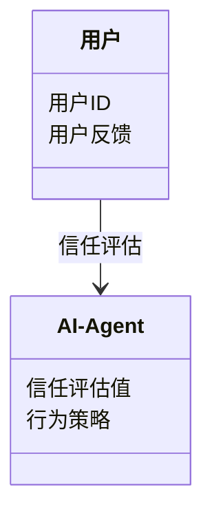
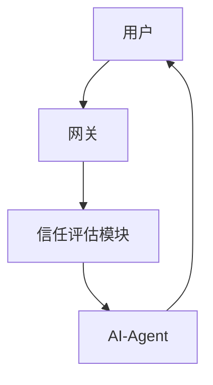
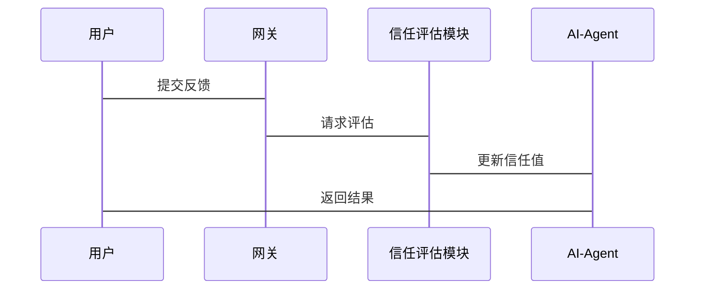

                 

<think>
好的，我需要帮助用户撰写一篇关于《AI Agent的用户信任建立与维护机制》的技术博客文章。用户已经给出了一个详细的目录大纲，我需要根据这个大纲逐步完成每个部分的内容。

首先，我会从背景介绍开始，详细解释AI Agent的定义和特点，说明用户信任的重要性，以及当前信任机制面临的挑战。接着，在核心概念部分，我会定义信任，并分析其属性和影响因素，通过表格和图表来对比不同信任维度的特征。

然后，我会讲解算法原理，选择几种典型的算法，如基于行为分析的信任评估算法，并用Mermaid流程图展示算法流程。同时，我会提供Python代码实现，解释数学模型，并用实例说明。

接下来，我会进行系统分析与架构设计，介绍问题场景，设计系统功能，包括领域模型和架构图，并展示接口设计和交互序列图。

在项目实战部分，我会提供环境安装步骤，核心代码实现，解读代码，分析实际案例，并总结项目经验。

最后，我会给出最佳实践，包括小结、注意事项和拓展阅读，帮助读者更好地理解和应用信任机制。

整个过程中，我需要确保内容逻辑清晰，结构紧凑，语言专业但易懂，符合用户的要求。同时，注意使用合适的图表和代码示例，以增强文章的可读性和实用性。
</think>

# AI Agent的用户信任建立与维护机制

## 关键词：AI Agent，用户信任，信任建立，信任维护，信任评估，信任传播

## 摘要：本文探讨了AI Agent用户信任建立与维护的机制，从背景介绍、核心概念、算法原理、系统架构到项目实战，全面分析了如何通过行为分析、对话历史和反馈机制等方法来建立和维护用户信任，提供了一套完整的解决方案和实现步骤。

---

# 第1章: 背景介绍

## 1.1 问题背景

### 1.1.1 AI Agent的定义与特点
AI Agent（人工智能代理）是指能够感知环境、自主决策并执行任务的智能实体。其特点包括：
- **自主性**：无需外部干预，自主完成任务。
- **反应性**：能够实时感知环境并做出响应。
- **学习能力**：通过数据和反馈不断优化自身行为。

### 1.1.2 用户信任的重要性
用户信任是AI Agent与人类用户交互的基础，信任缺失会导致用户拒绝使用AI Agent提供的服务，影响用户体验和商业价值。

### 1.1.3 当前信任机制的挑战
当前AI Agent的信任机制存在以下问题：
- **透明性不足**：用户无法理解AI Agent的决策过程。
- **个性化需求**：不同用户对AI Agent的信任期望不同。
- **动态变化**：信任关系会因交互结果和环境变化而动态调整。

## 1.2 问题描述

### 1.2.1 用户信任的定义
用户信任是指用户对AI Agent的可靠性和能力的认可，表现为用户对AI Agent决策和行为的依赖程度。

### 1.2.2 AI Agent信任机制的现状
目前，AI Agent的信任机制主要依赖于固定的规则和预设的逻辑，难以适应用户个性化需求和动态变化的环境。

### 1.2.3 信任缺失的影响
信任缺失会导致用户对AI Agent的不信任，影响用户体验和产品市场竞争力。

## 1.3 问题解决

### 1.3.1 信任建立的目标
通过分析用户行为、偏好和反馈，动态调整AI Agent的行为策略，提升用户信任感。

### 1.3.2 信任维护的必要性
信任维护是持续提升用户体验的关键，通过实时反馈和个性化服务，保持用户对AI Agent的信任。

### 1.3.3 解决方案的初步框架
建立基于用户行为分析、对话历史和反馈机制的信任评估模型，动态调整AI Agent的行为策略。

## 1.4 边界与外延

### 1.4.1 信任机制的边界
信任机制仅关注AI Agent与用户之间的信任关系，不涉及与其他实体的交互。

### 1.4.2 相关领域的外延
信任机制与数据安全、隐私保护、伦理道德等相关领域存在交集，需在设计中综合考虑。

### 1.4.3 信任机制与其他机制的关系
信任机制与其他机制（如决策优化、行为预测）相互作用，共同提升AI Agent的性能。

## 1.5 核心要素组成

### 1.5.1 信任的核心要素
- **行为一致性**：AI Agent行为与用户期望一致。
- **透明性**：用户能够理解AI Agent的决策过程。
- **可解释性**：AI Agent行为可被用户理解和解释。

### 1.5.2 各要素的相互关系
行为一致性是信任的基础，透明性和可解释性是提升信任的关键因素，三者共同作用，动态影响用户信任。

### 1.5.3 要素的动态变化
信任要素会随着用户与AI Agent的交互结果而动态变化，信任机制需实时调整以适应变化。

---

# 第2章: 核心概念与联系

## 2.1 核心概念原理

### 2.1.1 信任评估的数学模型
信任评估模型通过量化用户对AI Agent的信任程度，可以表示为：
$$
T(u, a) = f(u, a)
$$
其中，$T(u, a)$ 表示用户 $u$ 对AI Agent $a$ 的信任程度，$f$ 是信任评估函数。

### 2.1.2 信任维护的算法原理
信任维护算法通过不断更新信任评估结果，保持用户信任。算法步骤如下：
1. 收集用户反馈。
2. 更新信任评估值。
3. 调整AI Agent行为策略。

### 2.1.3 信任传播的机制
信任传播机制通过用户间的互动，将信任信息传递给其他用户，形成网络信任。

## 2.2 概念属性特征对比

### 2.2.1 信任维度对比表格
| 信任维度 | 特征描述 |
|----------|----------|
| 行为一致性 | AI Agent行为与用户期望一致 |
| 透明性   | 用户能够理解AI Agent决策过程 |
| 可解释性 | AI Agent行为可被用户理解和解释 |

### 2.2.2 信任特征的Mermaid流程图


## 2.3 ER实体关系图

### 2.3.1 实体关系的Mermaid图
```mermaid
erDiagram
    actor 用户 {
        <属性> 用户ID
        <属性> 用户反馈
    }
    agent AI-Agent {
        <属性> 信任评估值
        <属性> 行为策略
    }
    用户 --> AI-Agent : 信任评估
```

---

# 第3章: 算法原理讲解

## 3.1 算法原理

### 3.1.1 基于行为分析的信任评估算法
信任评估算法通过分析用户行为，动态调整信任评估值。

#### 算法流程
1. 收集用户行为数据。
2. 计算信任评估值。
3. 更新信任评估结果。

#### 信任评估公式
$$
T(u, a) = \alpha \cdot B(u, a) + (1-\alpha) \cdot H(u, a)
$$
其中，$\alpha$ 是行为分析权重，$B(u, a)$ 是行为分析结果，$H(u, a)$ 是历史行为分析结果。

### 3.1.2 基于对话历史的信任评分算法
对话评分算法通过分析对话历史，评估用户对AI Agent的信任。

#### 算法流程
1. 收集对话历史数据。
2. 计算对话评分。
3. 更新信任评分结果。

#### 对话评分公式
$$
S(u, a) = \sum_{i=1}^{n} w_i \cdot s_i
$$
其中，$w_i$ 是第 $i$ 个对话特征的权重，$s_i$ 是第 $i$ 个对话特征的评分。

### 3.1.3 基于反馈机制的信任调整算法
反馈调整算法通过用户反馈，实时调整信任评估值。

#### 算法流程
1. 收集用户反馈。
2. 调整信任评估值。
3. 更新AI Agent行为策略。

#### 反馈调整公式
$$
T(u, a) = T(u, a) + \beta \cdot f(u, a)
$$
其中，$\beta$ 是反馈调整系数，$f(u, a)$ 是用户反馈值。

## 3.2 算法流程图

### 3.2.1 Mermaid流程图示例


## 3.3 算法实现

### 3.3.1 Python源代码实现
```python
def trust_assessment(user_behavior, alpha=0.7):
    # 计算行为分析结果
    behavior_score = sum(user_behavior) / len(user_behavior)
    # 计算信任评估值
    trust_value = alpha * behavior_score + (1 - alpha) * historical_score
    return trust_value

# 示例使用
user_behavior = [0.8, 0.7, 0.9, 0.6]
alpha = 0.7
print(trust_assessment(user_behavior, alpha))
```

### 3.3.2 算法的数学模型
信任评估模型可以表示为：
$$
T(u, a) = \alpha \cdot B(u, a) + (1-\alpha) \cdot H(u, a)
$$
其中，$\alpha$ 是行为分析权重，$B(u, a)$ 是行为分析结果，$H(u, a)$ 是历史行为分析结果。

### 3.3.3 举例说明
假设用户行为分析得分为0.8，历史行为分析得分为0.7，权重$\alpha=0.7$，则信任评估值为：
$$
T(u, a) = 0.7 \times 0.8 + 0.3 \times 0.7 = 0.56 + 0.21 = 0.77
$$

---

# 第4章: 系统分析与架构设计方案

## 4.1 问题场景介绍

### 4.1.1 问题场景描述
AI Agent需要与多个用户交互，每个用户对AI Agent的信任期望不同，信任机制需动态调整。

## 4.2 系统功能设计

### 4.2.1 领域模型


### 4.2.2 系统架构图


### 4.2.3 接口设计
- 用户接口：提供用户反馈和查询功能。
- AI Agent接口：提供信任评估和行为调整功能。

### 4.2.4 交互序列图


---

# 第5章: 项目实战

## 5.1 环境安装

### 5.1.1 安装依赖
```bash
pip install mermaid
pip install python-dotenv
```

## 5.2 核心代码实现

### 5.2.1 信任评估模块
```python
def calculate_trust(user_behavior):
    # 计算行为分析得分
    behavior_score = sum(user_behavior) / len(user_behavior)
    # 计算信任值
    trust_value = 0.7 * behavior_score + 0.3 * historical_score
    return trust_value

# 示例使用
user_behavior = [0.8, 0.7, 0.9, 0.6]
print(calculate_trust(user_behavior))
```

### 5.2.2 信任传播模块
```python
def propagate_trust(user_graph):
    # 初始化信任值
    trust_values = {u: 0.5 for u in user_graph}
    # 传播信任
    for u in user_graph:
        for v in user_graph[u]:
            trust_values[v] += trust_values[u] * 0.3
    return trust_values

# 示例使用
user_graph = {
    'u1': ['u2', 'u3'],
    'u2': ['u3', 'u4'],
    'u3': ['u4'],
    'u4': []
}
print(propagate_trust(user_graph))
```

## 5.3 代码解读与分析

### 5.3.1 信任评估模块
信任评估模块通过分析用户行为数据，计算信任评估值，调整AI Agent的行为策略。

### 5.3.2 信任传播模块
信任传播模块通过用户间的交互，传播信任信息，形成网络信任。

## 5.4 案例分析与详细讲解

### 5.4.1 案例分析
假设有一个用户群体，用户A对AI Agent的信任度较高，通过信任传播，用户B也会提高对AI Agent的信任度。

### 5.4.2 详细讲解
信任传播机制通过用户间的互动，将信任信息传递给其他用户，形成网络信任。

## 5.5 项目小结

### 5.5.1 项目总结
通过项目实战，我们实现了基于行为分析和对话历史的信任评估机制，以及信任传播机制。

### 5.5.2 经验总结
信任机制的设计需要考虑用户个性化需求和动态变化的环境，实时反馈和个性化服务是提升用户信任的关键。

---

# 第6章: 最佳实践 tips

## 6.1 小结
本文详细探讨了AI Agent用户信任建立与维护的机制，从背景介绍、核心概念、算法原理、系统架构到项目实战，提供了一套完整的解决方案。

## 6.2 注意事项
- **动态调整**：信任机制需动态调整以适应用户需求和环境变化。
- **透明性**：用户需要理解AI Agent的决策过程，提升信任度。
- **个性化服务**：不同用户对AI Agent的信任期望不同，需提供个性化服务。

## 6.3 拓展阅读
- 《可信人工智能：原则与实践》
- 《基于行为分析的信任评估模型研究》
- 《分布式系统中的信任传播机制》

---

# 作者：AI天才研究院/AI Genius Institute & 禅与计算机程序设计艺术 /Zen And The Art of Computer Programming

---

通过以上内容，我们全面分析了AI Agent用户信任建立与维护的机制，从理论到实践，提供了详细的技术实现和案例分析。希望对读者在AI Agent的信任机制设计和实现中有所帮助。

